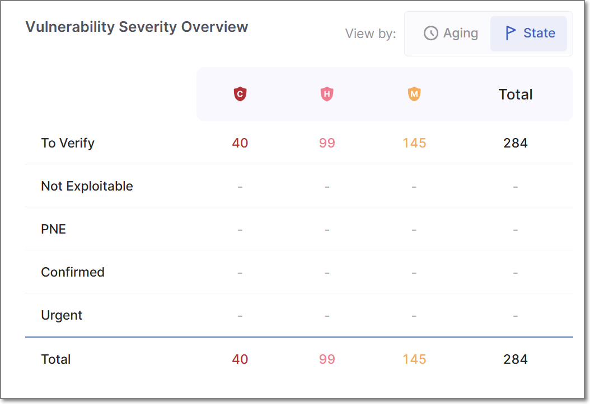
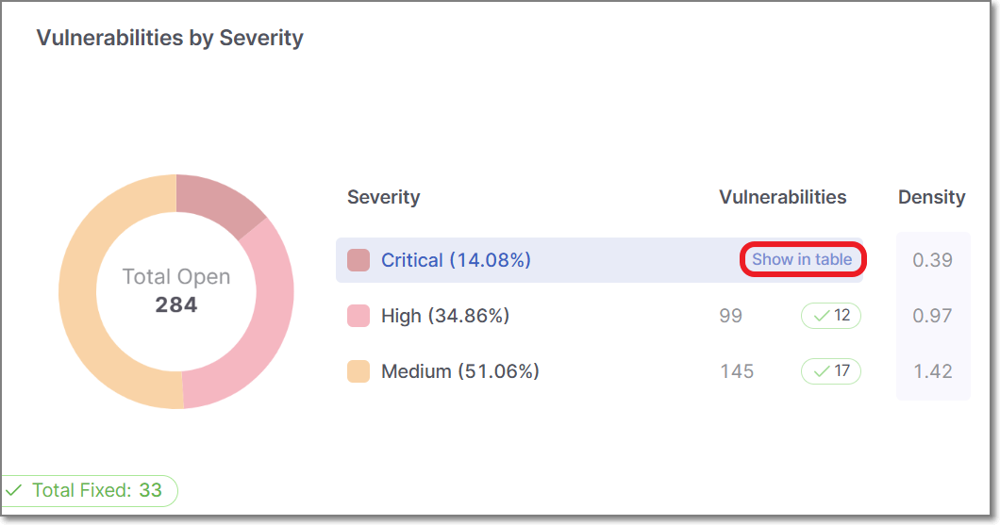
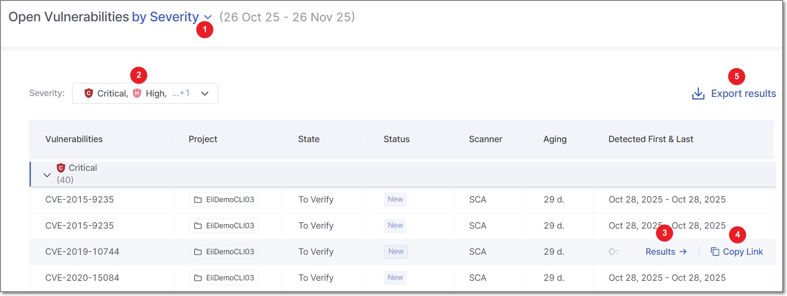

# Vulnerabilities Dashboard

## Overview

In the **Vulnerabilities** dashboard in the Analytics module, users can access informative charts that provide insights into the security vulnerabilities detected within their data.

The Vulnerability KPIs also offer actionable insights. With one click, users can access vulnerability details directly. This feature speeds up remediation, reduces exposure, and bridges the gap between AppSec and development teams.



The vulnerabilities dashboard offers two different view types, **Over Time** and **Totals**. Each of these view types serves a different analytical purpose, and displays a different selection of data widgets. To toggle between the two view types, click on the **View By** icons at the top right of the page.

<figure><figcaption></figcaption></figure>

### Detection of Vulnerabilities

Analytics dashboards display vulnerabilities based on scan data available in the Analytics database. Vulnerabilities are grouped by similarity, and the detection date shown in Analytics represents the **first time a vulnerability with that similarity is synchronized to the Analytics module**, not when it was originally detected by the scanning engine. As a result, vulnerabilities detected earlier may appear with a later detection date in Analytics if their instances are synchronized at a later time than the original engine detection.

### Filtering

The **Vulnerabilities** dashboard offers advanced data filtering options, allowing users to customize their analysis to specific criteria. The available filters can be accessed directly at the top of the table. Some additional filters can be accessed from the drop-down menu at the top-right corner.

For a detailed description of each filter, see [Filtering](README.md#filtering)

Below is a list of available filters for this dashboard:

- **Resources**
- **Branches**
- **Scanners**
- **States**
- **Severity**
- **Time Range**
- **Tags by Entity**
- **Groups**
- **Sast Vulnerabilities**

## Over Time View Type

In the **Over Time** view type, the following vulnerability-related widgets are available:

### Vulnerabilities by Severity

This chart categorizes vulnerabilities based on their severity levels: Info, Low, Medium, High, and Critical. Each severity level represents a specific vulnerability's potential impact and risk. This chart allows users to understand the distribution of vulnerabilities across different severity levels within their applications.

For example, it can highlight the prevalence of low-severity issues, which may not pose an immediate threat but should still be addressed, as well as high-severity vulnerabilities that demand urgent attention. This information is essential for prioritizing and addressing security weaknesses.

### Vulnerabilities by State

This chart classifies vulnerabilities into various states, such as `To Verify`, `Not Exploitable`, `Urgent`, and `Confirmed`. These states represent the current status or progress of addressing vulnerabilities. To Verify vulnerabilities may require further investigation, while Urgent ones demand immediate remediation.


The states mentioned above are pre-configured for all Checkmarx One accounts. In addition, you can create custom states in your account. Once they are created, you can assign those custom states to results. Custom states are currently supported for SAST, SCA, IaC Security and Container Security. This feature is only available for accounts that have the New Access Management (Phase 1) activated. For more info see [Custom States](../managing-triaging-vulnerabilities/README.md#custom-states).


This chart offers a dynamic view of the vulnerability management process, allowing users to track vulnerabilities' lifecycles from their initial discovery to resolution.

Organizations can prioritize remediation efforts and allocate resources effectively by understanding the severity and status of vulnerabilities. This data-driven approach ensures a proactive and adaptive response to security threats and helps safeguard applications from potential risks.

## Totals View Type

In the **Totals** view type, the available widgets are as follows:

### Mean Time to Resolution by Severity

This KPI provides valuable insights into the time taken to resolve vulnerabilities by severity level, helping to evaluate the efficiency of the remediation process. Tracking MTTR by severity aids in monitoring performance and ensuring SLA compliance. MTTR measures the average number of days it takes to remediate vulnerabilities, from their first detection to resolution. Each vulnerability is identified by a similarityID (for SAST and IaC) or CVE (for SCA) and is considered fixed when it no longer appears in scans after being previously detected. The first appearance marks the start of the resolution period, and the fixed date is the first scan after its last occurrence. Only fixed vulnerabilities count toward MTTR, while false positives, missing scan data, or reappearing issues (treated as new instances) can impact accuracy. Repeat fixes of the same vulnerability are excluded from fix counts.

For each fixed vulnerability:

**MTTR (days) = Fix Date - First Detection Date**

The MTTR KPI is the average of all individual MTTR values:

**MTTR KPI = (Sum of MTTR for all fixed vulnerabilities) / (Number of fixed vulnerabilities)**

### Vulnerabilities by Severity

This pie chart displays the total results organized by severity levels, their percentage of the total results, and their density for each severity level.

When hovering over a specific severity segment on the pie chart, the information for that severity level is highlighted, making it easier to understand the distribution of vulnerabilities based on their severity levels.

### Vulnerabilities by State

This chart displays the results grouped by the State, including custom result states (for accounts where custom states are available). By hovering over each state, you can view the details for the total number of findings, their percentages, and their density.

You can filter the chart to display **All States**, **Predefined**, or **Custom** states. The pie chart displays up to five states at a time. If additional states exist, they are grouped under Other. Click Other to view the distribution of the remaining states.

Deleted custom states continue to be displayed in Analytics.

### Vulnerabilities by Status

This pie chart displays the results grouped by status, representing the total findings and their percentage for each status.

Please note that the data used in the calculation is based on the latest scans and open results. Therefore, resolved results are unavailable as part of this KPI and are no longer included in the current findings.

When hovering over a specific status segment on the pie chart, the information for that status is highlighted.

### Vulnerabilities Severity Overview

This chart is divided into two separate views, **Aging** and **State**.

<figure><figcaption></figcaption></figure>

#### Vulnerabilities by Severity and Aging

This chart presents vulnerabilities categorized by both their severity level and their age since first detection in the project, grouped into time ranges (0–30 days, 30–60 days, 60–90 days, 90–180 days, and over 180 days). It provides insight into how long vulnerabilities persist within your applications and whether remediation efforts are keeping pace with expectations.


The dashboard Time Range filter does not filter vulnerabilities according to their age. It determines which projects are included based on the date of each project's most recent scan. Therefore, a project included by the selected time range can contain vulnerabilities that were first detected before that period.


The chart helps identify potential backlog issues and SLA violations by showing how quickly vulnerabilities of varying severity are resolved. For example, a concentration of critical vulnerabilities aged over 90 days may signal a need for more urgent action, while a decrease in older medium- or low-severity issues could indicate improved remediation processes.

By tracking both aging and severity, this metric supports risk-based prioritization and helps ensure security efforts are focused where they’re most needed. Clicking any segment in the chart reveals a drill-down list of relevant vulnerabilities, which can be shared directly with development teams to accelerate resolution.

#### Vulnerabilities by Severity and State

This table displays the total number of results grouped by their result state, including custom result states (for accounts where custom states are available). Each state is further organized by severity.

The table provides a comprehensive overview of the distribution of vulnerabilities based on their result states and severity levels, enabling effective analysis and monitoring of security-related outcomes.

### Most Aging Vulnerabilities

This card presents the 10 oldest vulnerabilities of all projects, regardless of language. You can view each vulnerability's age, measured in days.

### Most Common Vulnerabilities

This card presents the 10 riskiest vulnerabilities found in scans, ordered by severity, from high to informational, regardless of the language.

## In-Depth Vulnerability Analysis

In most widgets displayed in the Totals view type, hovering over a segment displays a **Show in table** link. In some cases, you can also click on a segment directly to open the corresponding table view.

<figure><figcaption></figcaption></figure>

### The Open Vulnerabilities Side Panel

For all widgets, with the exception of the Mean Time to Resolution by Severity widget, this action opens the **Open Vulnerabilities** side panel. displaying a detailed table of the dashboard. The columns differ depending on the dashboard you inspect.

For example, the **Vulnerabilities by Severity** dashboard table includes:

- **Vulnerabilities**: The severity level of the vulnerability - displayed as either **Critical**, **High**, **Medium**, **Low**, or **Information**.
- **Project**: The project where the vulnerability is found.
- **State**: The vulnerability state displayed as either: To Verify, Not Exploitable, Proposed Not Exploitable, Confirmed, or Urgent. For more information about States, see [here](../managing-triaging-vulnerabilities/README.md#changing-states).
- **Status**: Whether the vulnerability is **New** or **Recurrent**.
- **Scanner**: The scanner used for detecting vulnerabilities - (e.g., SAST, SCA, etc.)
- **Aging**: Time elapsed since vulnerability was detected.
- **Detected First and Last**: The first and last dates the vulnerability was detected within this project. These dates are calculated at the project level. If the same vulnerability also exists in other projects, each project tracks its own independent **Detected First and Last** dates.

Once the **Open Vulnerabilities** side panel is open, you can switch the chart’s data by using the KPI selector (**1**) at the top of the pane, without needing to return to the dashboard. Depending on which KPI is selected, different filters appear at the top left of the panel. For example, if the KPI selector is set to By Severity, the Severity filters will appear (**2**). If the KPI selector is set to By Status, the filters field will change to Statuses, etc. You can further filter the data displayed by toggling these filters.

To export the Open Vulnerabilities data as a CSV file, click on **Export Results** (**5**). The downloaded report will include only the vulnerabilities filtered by your current settings.

#### Direct Access to In-Depth Analysis

When hovering over a vulnerability, two options are displayed: **Results** (**3**) and **Copy link** (**4**).

Clicking **Results** opens the vulnerability in a new browser tab, allowing immediate remediation.

**Copy link** copies a link to the vulnerability to the clipboard, making it easy to share with a developer for prompt action.


The **Open Vulnerabilities** KPIs provide a snapshot of unresolved security issues across your projects and engines. These KPIs track the number of distinct vulnerabilities found in the latest successful scan for each project and scanner, focusing solely on scans from production branches to reflect live, customer-facing code and excluding development or test environments.

To calculate the Open Vulnerabilities KPI for each project and engine, the system proceeds as follows:

1. It filters the scans to include only those that come from a production branch and have a successful status.
2. From this filtered list, it identifies the most recent scan based on the creation date.
3. It counts all distinct vulnerabilities found in that scan. These are treated as the current open vulnerabilities for that project and engine.


### The Fixed Vulnerabilities Side Panel

For the **Mean Time to Resolution by Severity** widget, clicking on the **Show in table** link displays the **Fixed Vulnerabilities** side panel,

The displayed table tells you how quickly vulnerabilities are addressed, helping you monitor efficiency and meet SLA commitments.


Export Results is not supported for this table.

