# API Security Scanner

The **API Security Scanner** screen provides an overview of the last completed API security scan using API Security widgets.

<figure>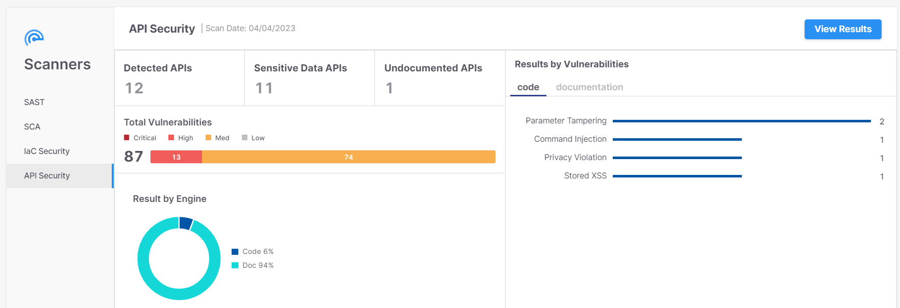<figcaption></figcaption></figure>

## API Security Widgets

### Detected APIs

The number of detected APIs in the code. This scan detected **10** APIs in the code.

<figure>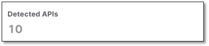<figcaption></figcaption></figure>

### Sensitive Data APIs

The number of APIs with at least one sensitive data attribute. This scan detected sensitive data attributes in **9** out of the **10** detected APIs. Sensitive Data categories and parameters are listed in the table below.

<figure>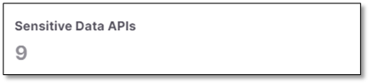<figcaption></figcaption></figure>

| Category | Parameters |
|---|---|
| **Name** | firstname, surname, familyname, fullname, name |
| **Personal Data** | birthday, dob, dateofbirth, phone, mobile, email, socialsecurity, ssn, driverslicense |
| **Address** | address, zipcode |
| **Bank** | credit, cardnumber, account |
| **Secrets** | credentials, secret, auth, apikey, pass, pwd, password |

### Undocumented APIs

Lists the number of undocumented API endpoints found in the code but not in the Swagger file after scanning both the code and the documentation.

In the illustrated example, API Security detected **Undocumented APIs** once.

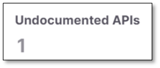

### Results by Vulnerabilities

A list of sensitive data attributes with an indicator on how often each of these sensitive data attributes was detected.

In the illustrated example, API Security detected **Parameter Tampering** twice and three more once each.

<figure>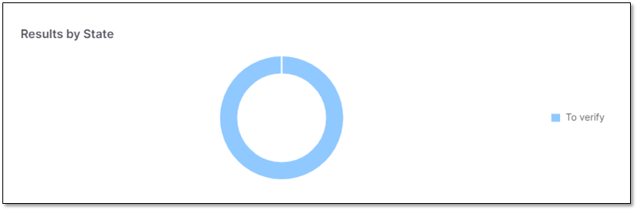<figcaption></figcaption></figure>

### Results by Risk

The number of sensitive data attributes according to their risk.

In the illustrated example, API Security detected **5** vulnerabilities of which **2** were of high risk and **3** of medium risk.

<figure>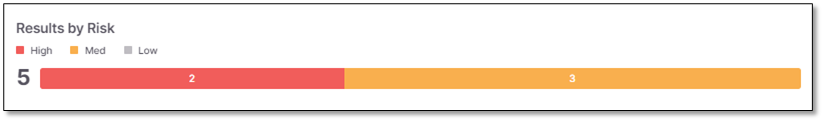<figcaption></figcaption></figure>

## Viewing Results

To view results, click **View Results**. The Risks table appears. It lists the risks and provides additional information detailed in the parameters below and described in [Viewing API Results](../viewing-scan-results-in-the-results-viewers/api-security-results-viewer.md).

<figure>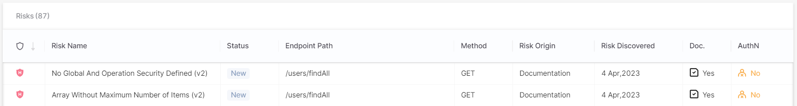<figcaption></figcaption></figure>

| Parameter | Description |
|---|---|
| **Severity** | Indicates the risk severity as follows: • **Critical** • **High** • **Medium** • **Low** • **Info** |
| **Risk Name** | The name of the risk. |
| **Status** | Indicates the status of the risk as follows: 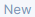- A newly detected vulnerability. 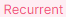- The vulnerability has been detected at least once before. |
| **Endpoint Path** | The end path of the resource URL. |
| **Method** | The operation that the endpoint performs on resources. |
| **Data Origin** | Indicates where the risk was detected, for example inside the **code**. |
| **Risk Discovered** | The date when the risk was detected. |
| **Doc** | Undocumented APIs present a risk because attackers may use them as an undetectable surveillance and reconnaissance channel. This column shows whether the endpoint is documented or not: • "**-**" appears when no documentation file was not scanned • **Yes**: The endpoint appears in the scanned document, and it is documented • **No**: The endpoint appears in the scanned document, but it is not documented |
| **AuthN** | Unauthenticated APIs present a risk because they may allow easy access to confidential information. This column shows whether the endpoint is authenticated or not. • "**-**" appears when no documentation file was not scanned • **Yes**: The endpoint appears in the scanned document, and it is authenticated • **No**: The endpoint appears in the scanned document, but it is not authenticated |

You can view the parameters of a *code* risk by clicking its row.

- Under **Parameters**, click 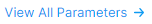. All sensitive data parameters in the code appear.

  <figure>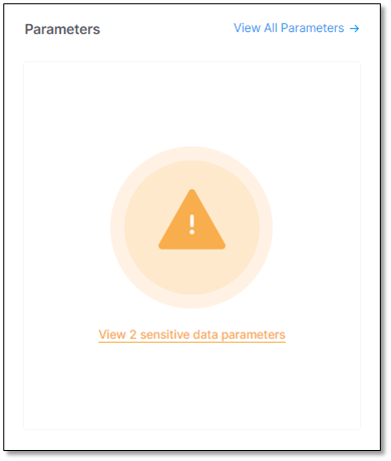<figcaption></figcaption></figure>
- | Interface | Description |
  |---|---|
  | 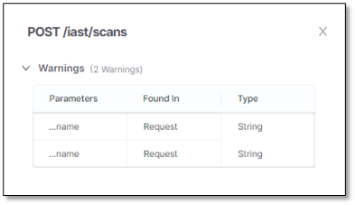 | List of all sensitive parameters in the API with warnings. This section is identical to the list of sensitive data parameters. |
  | 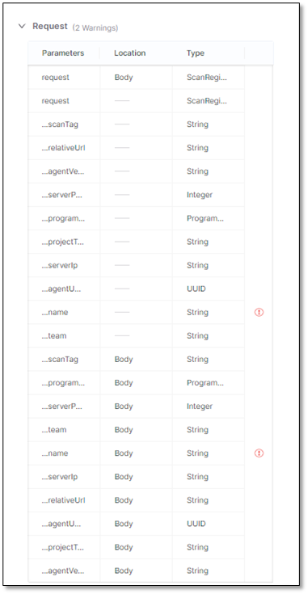 | List of all parameters in the request to the API. The sensitive parameters are labeled . |
  | 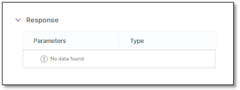 | List of all parameters in the response by the API. The sensitive parameters are labeled . |

To view the details of a *documentation* risk, click its row and the vulnerability in the Swagger file will appear with an embedded description box.

<figure>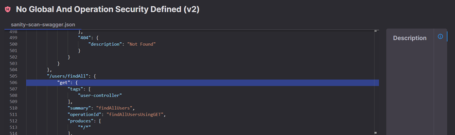<figcaption></figcaption></figure>
