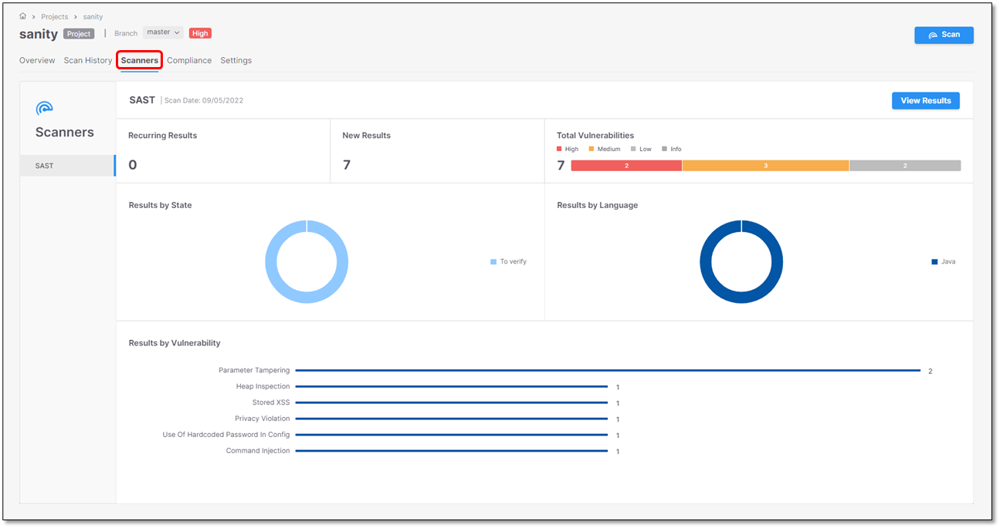
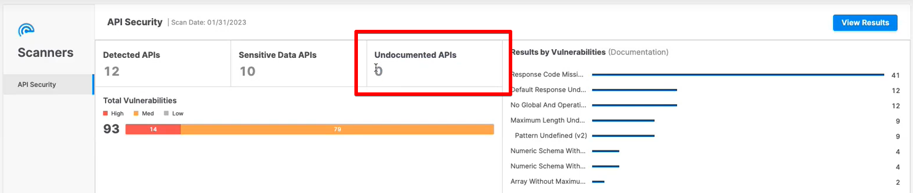
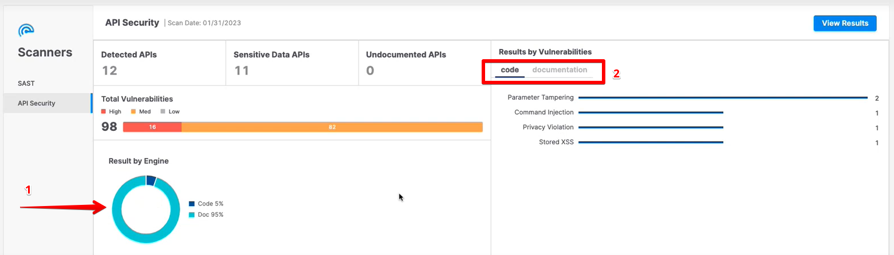

# Viewing the Scanners Tab (API Security)

The **Scanners** tab provides a multi-scanner overview of the **API Security**, **SAST**, **SCA** , and **KICS** scanners used for the last completed scan within a project. The results for each scanner type are presented on a separate screen using dedicated widgets to analyze the results. The example illustrated here uses **SAST** and **API Security** as scanners.

The first screen image illustrates the **SAST** scan results and the second one illustrates the **API Security** scan results.

If an API Security scan is run both on the code and the API documentation, the scan results will look similar to the following:

If an API Security scan is run both on the code and the API documentation, the results by the engine are shown in a pie chart (**1**). The vulnerabilities discovered in the code and documentation are shown in separate tabs (**2**).

The table below lists and explains the respective widgets for the **API Security** results.

| Widget | Description |
|---|---|
| **Detected APIs** | The number of detected APIs in the code. This scan detected **8** APIs in the code. |
| **Sensitive Data APIs** | The number of APIs with at least one sensitive data attribute. This scan detected sensitive data attributes in **7** out of the 8 detected APIs. Additional information on sensitive data is available in the table below. |
| **Undocumented APIs** | If an API Security scan is run both on the code and the API documentation and undocumented API endpoints are detected in the scanned Swagger file, their number will appear in this widget. |
| **Results by Risk** | The total number of scan results is split by risk severity. |
| **Results by Vulnerabilities** | A list of detected vulnerabilities with the respective number of instances for each one. |
| \<**View Results**> | Click to switch to the **Risks** table. |

The Sensitive Data categories and parameters are listed below.

| Category | Parameters |
|---|---|
| **Name** | firstname, surname, familyname, fullname, name |
| **Personal Data** | birthday, dob, dateofbirth, phone, mobile, email, socialsecurity, ssn, driverslicense |
| **Address** | address, zipcode |
| **Bank** | credit, cardnumber, account |
| **Secrets** | credentials, secret, auth, apikey, pass, pwd, password |

The **Risks** table lists the risks and provides additional information as outlined in the table below. For additional information on viewing scan results, refer to [API Security Results](../viewing-scan-results-in-the-results-viewers/api-security-results-viewer.md).

| Parameter | Description |
|---|---|
| **Severity** | Indicates the risk severity as follows: **Critical** **High** **Medium** **Low** |
| **Risk Name** | The name of the risk. |
| **Status** | Indicates the status of the risk as follows: - A newly detected vulnerability. - The vulnerability has been detected at least once before. |
| **Endpoint Path** | The end path of the resource URL. |
| **Method** | The operation that the endpoint performs on resources. |
| **Data Origin** | Indicates where the risk was detected, for example inside the **API source code**, **testing (DAST)**, or the **Swagger/OpenAPI file (documentation)**. |
| **Risk Discovered** | The date when the risk was detected. |
| **Doc** | Undocumented APIs are risky because attackers may use them as an undetectable surveillance and reconnaissance channel. This column shows whether the endpoint is documented or not: • "**-**" appears when no documentation file was scanned • **Yes**: The endpoint appears in the scanned code, and it is documented • **No**: The endpoint appears in the scanned code, but it is not documented |
| **AuthN** | Unauthenticated APIs are risky because they may allow easy access to confidential information. This column indicates whether the endpoint is authenticated. • "**-**" appears when no authentication file was scanned • **Yes**: The endpoint appears in the scanned code, and it is authenticated • **No**: The endpoint appears in the scanned code, but it is not authenticated |
