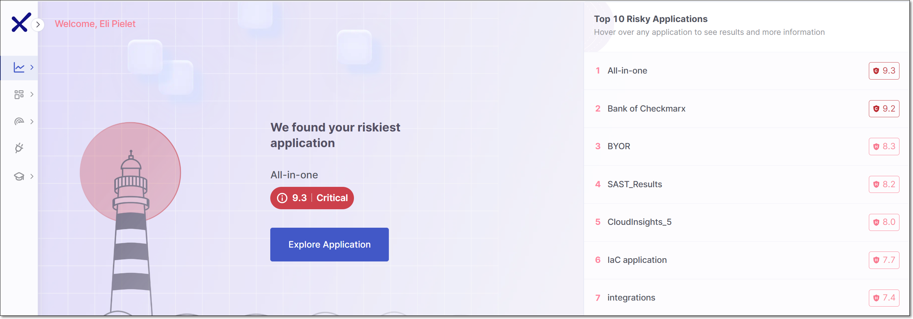
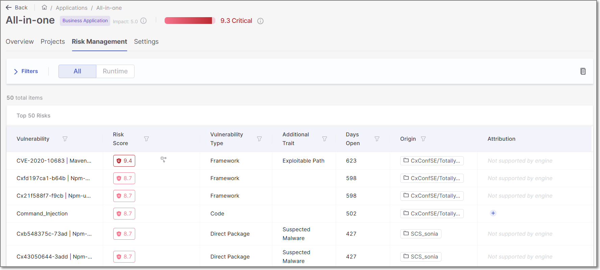
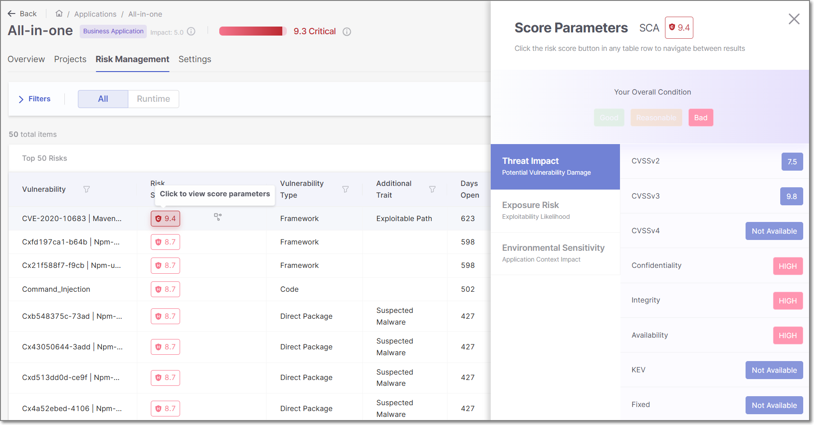

# Application Risk Management

## Overview

Checkmarx One offers a comprehensive Application Risk Management feature that enables you to understand and prioritize the risks associated with your applications. This centralized tool consolidates results from multiple sources in order to present a holisitic view of your appsec security posture and to help you to prioritize remediation tasks.

This tool shows vulnerabilities identified by the SAST, IaC Security and SCA scanners (including Malicious Packages Detection for licensed accounts), as well as results identified by our Correlation Engine (i.e., correlations between multiple scanners such as Exploitable Path identified by SAST and SCA or correlation between SAST and IaC Security). You can also import results from external platforms using the Bring Your Own Results (BYOR) feature. This tool also incorporates data from Cloud Insights (for licensed accounts) and adjusts the risk scores to reflect increased risk based on runtime usage and internet facing exposure. This enables team managers and appsec teams to proactively identify critical vulnerabilities early in the SDLC and prioritize them effectively.

The Application Risk Management tool assigns a **Risk Score** to each of the 50 most severe vulnerabilities identified in each application as well as an **Overall Risk Score** for the entire application.

## Viewing Application Risk Management

An overview of the Application Risk Management data for your entire account is shown on the **ASPM** > **Application Risk Management** page.

<figure><figcaption></figcaption></figure>

In addition, detailed Application Risk Management data for each application is shown in the **Risk Management** tab of the Application page for that application. This page can be accessed by hovering over a specific application's row in the **Workspace** > **Applications** page, and clicking **Overview**.

<figure><figcaption></figcaption></figure>

You can click on the Risk Score for a row in the table in order to open a side panel that shows a breakdown of the risk factors that contribute to the Risk Score calculation.

<figure><figcaption></figcaption></figure>

## Risk Score Calculation

### Risk Score for Individual Vulnerabilities

The Risk Score is determined by taking the Base Risk Score for each vulnerability and then factoring in additional risk factors, and (when necessary) applying the normalization formula.

#### Base Risk Score

The method used for determining the Base Risk Score differs according to the type of vulnerability.

##### SCA Vulnerabilities

For vulnerabilities identified by the SCA scanner (i.e. Vulnerability Type: Direct Packages or Transitive Packages), the Base Risk Score is the NVD CVSS (Common Vulnerability Scoring System) v3.0 score for that vulnerability.

##### SAST Vulnerabilities

For vulnerabilities identified by the SAST scanner (i.e. Vulnerability Type, Infrastructure), our AppSec team uses their expertise to designate the risk score for each result. The team uses a proprietary algorithm that takes the following parameters into account:

- Confidentiality
- Integrity
- Availability
- Affected Scope
- Required Privileges
- Difficulty of Attack

##### IaC Security and Bring Your Own Results (BYOR)

For IaC Security and BYOR vulnerabilities the Base Risk Score is based on the Severity level. For BYOR vulnerabilities, the Severity is specified in the imported SARIF file. For IaC Security it is designated by our AppSec team.

The severity is mapped to Base Risk Score as follows:

- Critical --> 10.0
- High --> 7.0
- Medium --> 5.0
- Low --> 3.0
- None --> 1.0

##### Correlation Engine

This engine correlates results from multiple engines and assigns a risk score to the correlated results that reflects both the intrinsic severity of the risk as well as the increased risk based on the correlation. There are currently two types of correlated results.

- SAST + SCA – The SAST engine is used to identify an **Exploitable Path** from your code to the vulnerable function in an open source package.
- SAST + IaC Security – Correlated results from the SAST and IaC Security scanners.

#### Additional Risk Factors

When we identify additional risk factors based on the usage of the vulnerable code in the context of your application, we adjust the risk score accordingly. The following table shows how the risk score is adjusted for various sitauation.

| Correlation | Identified By | Risk Score adjustment |
|---|---|---|
| Runtime usage | Cloud Insights | Base Risk Score + 0.5 |
| Public (i.e., Internet Facing) | Cloud Insights | Base Risk Score + 1 |

##### Normalization

For accounts with Cloud Insights, in order to ensure that all risk scores fall within the range of 0.1 to 10.0 (even after adding points for additional risk factors), we apply a normalization formula.

Normalization Formula

`((Base Risk Score + Public + Runtime)/ Max. Possible Score) x 10 = Normalized Risk Score`

- Base Risk Score: Original risk score before adding points for additional risk factors
- Public: Additional 1 point for public (internet facing) risk
- Runtime: Additional 0.5 points for runtime usage
- Max. Possible Score: The maximum possible score for your account. (Currently, for accounts with Cloud Insights this value is 11.5.)
- Normalized Risk Score: The actual Risk Score shown for the vulnerability in Application Risk Management

Example: SQL Injection has a Base Risk Score of 9. From Cloud Insights, we add: +1 because it is Public and 0.5 because it has Runtime usage. This results in a total risk score of 10.5. We normalize the score using the formula:

(( 9 + 1 + 0.5)/ 11.5) x 10 = 9.13

### Overall Risk Score

This score represents the overall risk level of a particular application, providing a quick indication of the application's security posture. The Overall Risk Score is calculated as follows:

- 50% of the score is based on the application's **Criticality** level, as specified by the user during application creation (can be adjusted by editing the application [Settings](../../managing-applications/configuring-applications.md#general-settings)). This scale, ranging from 0 to 5, is converted to a scale of 0 to 10 by multiplying by 2.

  
  Criticality level for applications marked as **Internal** is always set to one and cannot be changed by the user.
  
- The other 50% is determined based on the average **Risk Score** of the top 50 most severe risks in the application.

## Risk Management Limitations

The following limitations are currently applied to the Application Risk Management functionality:

- Results from SCS, Container Security, API Security and DAST scanners are not currently factored into Application Risk Management results.
- SCA Legal risks are not factored into Application Risk Management results.
- If a user triages a result (i.e., changes the severity or state), regardless of whether it is SAST or SCA, they must initiate a new scan in order to update the data.

## Risk Management Permissions

The tables below show the permissions required for viewing data and taking various actions in the Application Risk Management system.

**View**

| Permission | View homepage | View results table | View result details |
|---|---|---|---|
| view-applications |  |  |  |
| view-risk-management |  |  |  |
| view-projects |  |  |  |
| view-scans |  |  |  |
| view-results |  |  |  |


The API for viewing the home page action requires only the first two permissions: view-applications and view-risk-management.


**Update results**

| | Update result severity | Update result state | Update result state to not exploitable | Update result state to proposed not exploitable |
|---|---|---|---|---|
| view-applications |  |  |  |  |
| view-risk-management |  |  |  |  |
| view-projects |  |  |  |  |
| view-scans |  |  |  |  |
| view-results |  |  |  |  |
| update-results |  |  |  |  |
| update-result-severity |  | | | |
| update-result-states | |  |  |  |
| update-result-state-not-exploitable | | |  | |
| update-result-state-propose-not-exploitable | | | |  |

### Description of Actions

The following is an explanation of the actions referred to in the above tables.

- View homepage: Access the Application Risk Management homepage, applicable to both the user interface (UI) and the API endpoint GET /summary.
- View results table: Access the Application Risk Management results displayed in a table format, accessible from the homepage via links for remediation and viewing results. This action encompasses opening the results tab within the application and using the API endpoint GET /:applicationId/results.
- View result detail: View detailed information about a specific result within the results table by clicking on the corresponding row.
- Update result: Various actions related to updating results, each self-explanatory:

  - Update result severity
  - Update result state
  - Update result state to "not exploitable"
  - Update result state to "proposed not exploitable"

These actions are performed within the result view, accessible by clicking on any result in the table.

## Application Risk Management APIs

Application Risk Management functionality can also be accessed via REST API. See documentation [here](https://checkmarx.stoplight.io/docs/checkmarx-one-api-reference-guide/branches/main/65723ghrdr8mx-application-risk-management-rest-api).

## In this section

- [Using Application Risk Management](using-application-risk-management.md)
