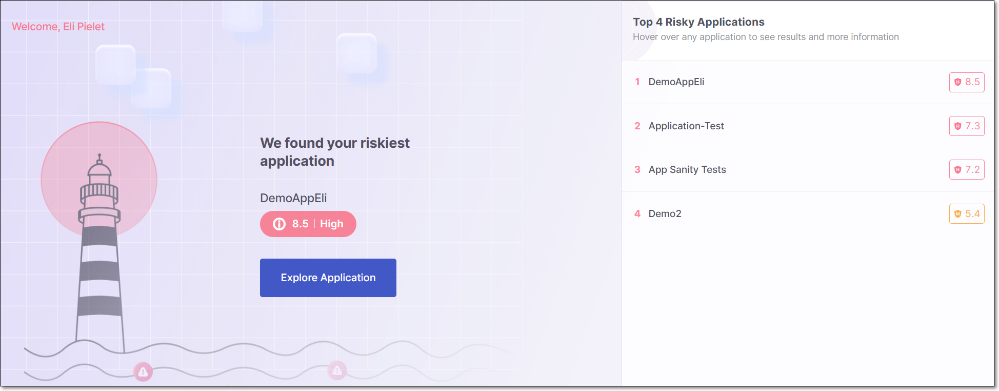
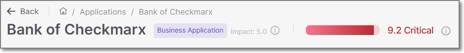
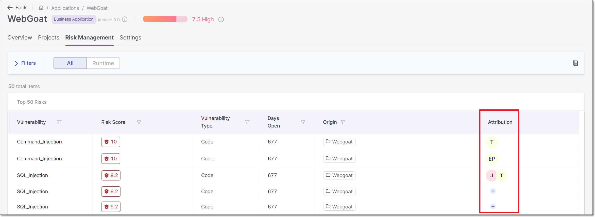
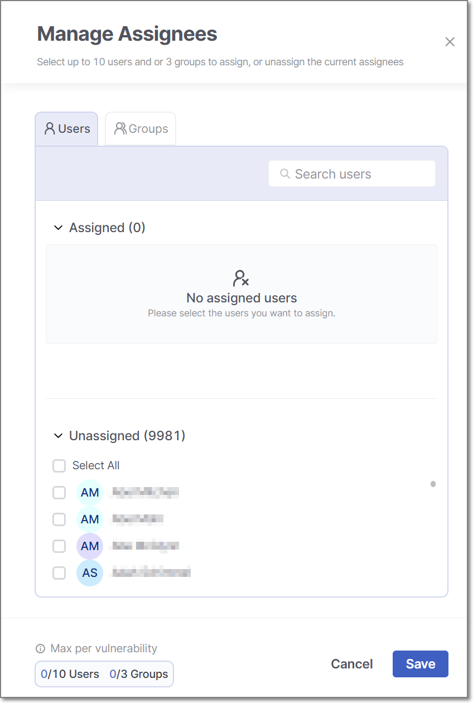
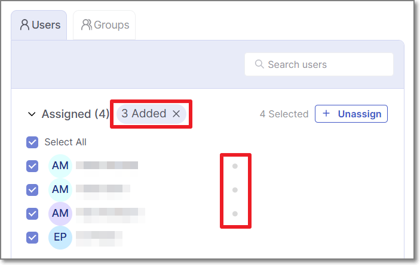

# Using Application Risk Management

## Viewing the Application Risk Management (HOME) Page

The **Application Risk Management** page is the landing page upon login for users with any of the following roles or a combination of these roles: `ast-viewer`, `ast-scanner`, `admin`. This screen enables you to easily identify your riskiest applications and prioritize remediation activity accordingly.


Users who do not have any of these roles will see the **Workspace** > **Projects** page as their landing page.


The main section of the screen shows the riskiest application in your account and the Overall Risk Score for that application. To understand how the Overall Risk Score is calculated, see [here](README.md#overall-risk-score).

There is a button, **Explore Application**, that takes you to the Risk Management tab for that application.

The right side of the screen displays up to 10 of the riskiest applications in your account. For each application, the Overall Risk Score is shown. Hover over a specific application in the list to show the **View Results** button for that application. Clicking on **View Results** takes you to the **Risk Management** tab on the Applications page for that application.

## Risk Management Tab for an Application

The **Risk Management** tab on the **Application** page shows up to 50 of the most severe risks in the application.

This screen can be accessed in one of two ways:

- From tha main Application Risk Management home screen, click on **Explore Application** or hover over an application in the right hand panel and click on **View Results**.
- Navigate to the **Workspace** > **Applications** page, hover over an application row and click **Overview** . This will open that specific application's page displaying the overview tab. Click on the **Risk Management** tab on the top of the screen.

By default, the risks are sorted by Risk Score and shown in descending order, enabling you to quickly identify the most critical risks. You can change the sorting method and apply filters for each column. There is also a quick-filter to show only results for runtime vulnerabilities.

There is a button in the filter bar for accessing the relevant documentation in our documentation portal.

### Application Header

At the top of the page, the Application Header is displayed.

<figure><figcaption></figcaption></figure>

- **Application Name**
- **Application Type Indicator** - shows whether the application is a business application or an internal application.

  - **Business** - appications that are externally facing or directly support key business functions. Security issues in these apps can lead to customer impact, revenue loss, or reputational damage, making their security a top priority in ASPM.
  - **Internal** - applications used solely within the organization, with no direct customer exposure or business-critical operations. Security issues may pose operational risks but do not have immediate business impact.
- **Impact Rating** - the Impact rating (1–5), which reflects the Criticality Level defined in the application settings, and is incorporated into the overall risk score calculation.
- **Application Risk Score** - the overall risk score of the application. The score is made of the impact rating plus the average of the top 50 highest-risk results.

### Application Table

<figure><figcaption></figcaption></figure>

- **Vulnerability Name**: The name of the vulnerability. For SAST and IaC Security, this is the type of vulnerability. For SCA, this is a combination of the risk ID and the package in which it was identified. For BYOR, this is **rule** attribute from the SARIF file (if not provided, then the **ruleID** is used).
- **Risk Score**: The severity of the risk on a scale from 0.1 (low) to 10 (critical). For more info about how the risk score is calculated see [here](README.md#risk-score-for-individual-vulnerabilities).

  In addition, for accounts with Cloud Insights integration, the icon indicates a risk that is Internet Facing.
- **Vulnerability Type**: This column categorizes vulnerabilities based on their general types. Results identified by the SAST scanner are categorized as "Code". SCA results are either "Direct Package" or "Transitive Package". IaC Security results are referred to as "Configuration", and BYOR are referred to as "Imported Results".
- **Additional Trait** - Shows if there are specific additional risk factors. Possible values are currently: "Exploitable Path" and "Suspected Malware".
- **Days Open**: The number of days since the vulnerability was initially detected.
- **Origin**: This column shows the name of the project where the vulnerability was identified.
- **Attribution**: This column shows the users and groups responsible for remediating each vulnerability. For more information, see [Risk Attribution](#risk-attribution).

### Risk Score Parameters

Click on the Risk Score for a row in the table in order to open a side panel that shows a breakdown of the risk factors that contribute to the Risk Score calculation.

The data shown in this panel differs depending on the scanner that identified the risk. The data is divided into three tabs: **Threat Impact**, **Exposure Risk** and **Environmental Sensitivity**. Click on a tab to show the data for that section. The following is a summary of the data shown in each section:

- **Threat Impact** - Focuses on how much damage a vulnerability could cause if exploited.
- **Exposure Risk** - Assesses how likely the vulnerability is to be exploited, considering factors like access levels, attack complexity, and known exploits.
- **Environmental Sensitivity** - Measures the impact of the vulnerability in the specific application context, including whether the system is public, live, or has specific configuration details like dependency tracking.

### Risk Attribution

The new **Attribution** feature enables ASPM risks to be assigned to specific users and/or groups, in order to ensure that the responsible party is aware of the need for remediation. The assignment is done via the Application **Risk Management** screen. When attribution is assigned, each assignee receives an email notification about the attribution with a link to view the assigned vulnerabilities in the platform. Attribution is also shown in a new column that was added to the **Risk Management** screen.

<figure><figcaption></figcaption></figure>

The  icon is shown in the Attribution column for risks that have not yet been attributed. For risks that have already been attributed, the  icon is displayed when hovering over the attribution column of that row. Click on the  icon to create or change an Attribution.

**Assigning Users and Groups**

1. On the **Applications Risk Management** page, locate the vulnerability you want to assign and click the  icon in the **Attribution** column for that row.

   The **Manage Assignees** side panel is displayed.

   <figure><figcaption></figcaption></figure>

   The panel includes two sections, **Assigned** and **Unassigned**. Both sections are collapsable to enable easier viewing.
2. From the **Unassigned** section, add users to the **Assigned** list:

   - **To add an individual user**, hover over a user and click the **Assign** button that appears next to their name.
   - **To bulk-add a selection of users**, select the checkboxes for the users you want to assign, then click the **Assign** button that appears at the top right of the list.

   
   The lists are searchable to enable you to find a specific user or group for attribution. A user that is not enabled or that does not have an active email will not appear on the list of unnasigned users available for attribution.
   

   Users are now tentatively added to the **Assigned** list. New assignees will appear at the top of the list with a gray dot next to their name indicating that they have not yet been saved to the list. A corresponding gray text block appears at the top of the list with the number of pending assignees.

   <figure><figcaption></figcaption></figure>

   
   Before saving, you can cancel the attribution of all new assignees by clicking on the **X** in the gray text block at the top of the list.
   
3. To assign groups. click on the **Groups** tab at the top left of the panel. You can add individual groups or bulk-add a selection of groups using the same procedure as was described for adding users in step 2.
4. Click **Save**.

   The selected users and groups are now assigned and are displayed in the **Attribution** column of the vulnerability. Each assignee receives an email notification about the attribution with a link to view the assigned vulnerabilities in the platform.


The maximum number of users that can be assigned to a specific risk is ten. The maximum number of groups that can be assigned to a specific risk is three. When the maximum is reached, the **Assign** buttons will be grayed out and hovering over them displays a tooltip explaining that the maximum has been reached.


#### Identifying the Author (from git blame)

When the "Author" information is available (extracted via "git blame"), the Attribution column also shows the **Author** of the relevant code and the associated email. This information can be helpful for determining the appropriate attribution.

When present, the **author** icon appears first in the Attribution column, before the icons of the assignees. Hovering over it displays the author’s email.


Author information is available only for SAST and IaC scan results.


The following API exposes this information through the `author` field: [GET api/risk-management/{id}/results](https://checkmarx.stoplight.io/docs/checkmarx-one-api-reference-guide/pruu34r6ttofb-retrieve-results-for-an-application)

## Viewing Vulnerability Details

You can drill down to view detailed information about each of the Application Risk Management results. Click on a row to open to show the details for that result.

- For SAST, this opens a new tab showing detailed info about the specific vulnerability. The **Top 50 Risks tab** is still shown, and you can switch back and forth between tabs.
- For BYOR, this opens a new tab showing the vulnerability details that were imported via the SARIF file. The **Top 50 Risks tab** is still shown, and you can switch back and forth between tabs.
- For SCA, this redirects you to the corresponding page in the SCA scan results viewer.
- For correlated results:

  - For SAST + IaC, the SAST result is shown in a new tab.
  - For Exploitable Path, the SCA result is shown in the SCA results viewer.

## Triaging Results

You can triage results so that the Application Risk Management will accurately reflect your team's assessment of the risks to your application. When you change the severity of a risk the Risk Score is adjusted accordingly, and when you change the state to Not Exploitable the Risk Score is set to zero. However, these changes will only take effect after the next scan of the project.

Triage is done in the results viewer when you open up the details page for a specific risk. For BYOR results, you can change the state but not the severity.

The triage feature is based on Checkmarx ability to identify the identical result (based on proprietary algorithms) when it recurs in subsequent scans. For more information about triaging results in Checkmarx One, see [Managing (Triaging) Vulnerabilities](../../managing-triaging-vulnerabilities/README.md).

### Identifying Unique Results for BYOR

When you triage a vulnerability (i.e., change the state), the new state will be applied to that unique result each time that it is identified in a subsequent file upload. For results that are imported using the BYOR feature, we identify unique results for multiple imported files based on the following criterion.

- **Guid Field in SARIF file**: If the results section of the SARIF file contains a `Guid` field, we will use this as the `resultID` to identify the result uniquely.
- **Hash Calculation:** In the absence of the `Guid` field, we calculate a hash by combining the following 5 fields to create a unique identifier:

  - **toolName:** The name of the tool that generated the result.
  - **ruleID:** The identifier for the rule that triggered the result.
  - **snippetText:** The code snippet associated with the result.
  - **locationURI:** The URI of the file or resource where the result was found.
  - **lineStart:** The starting line number where the issue was detected.
