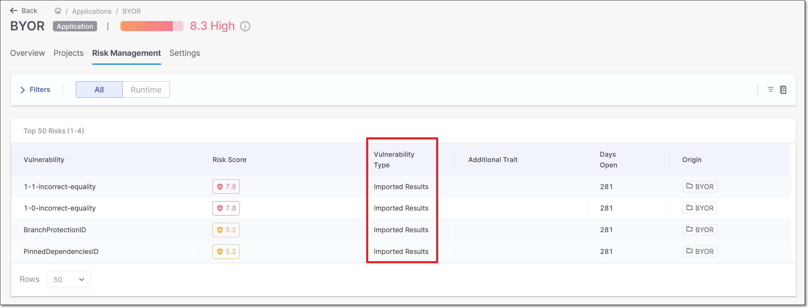
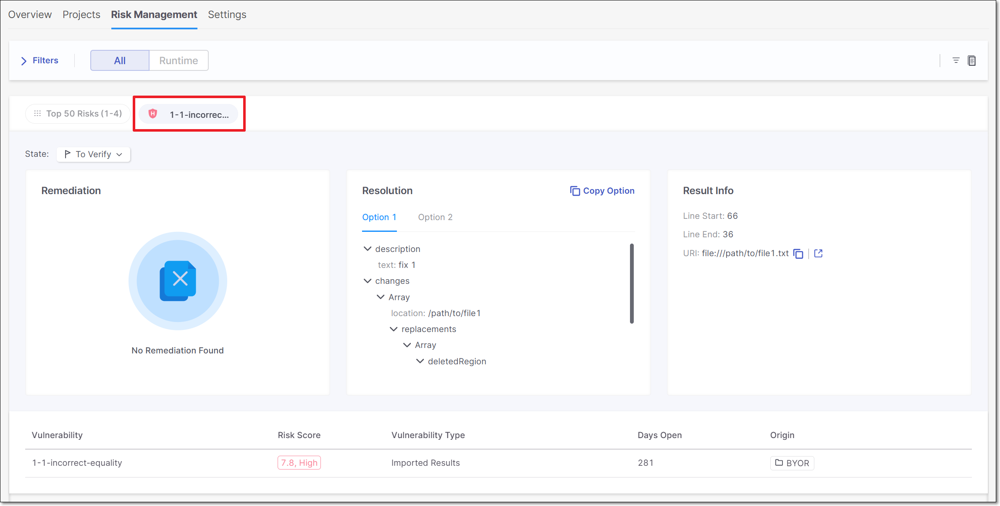
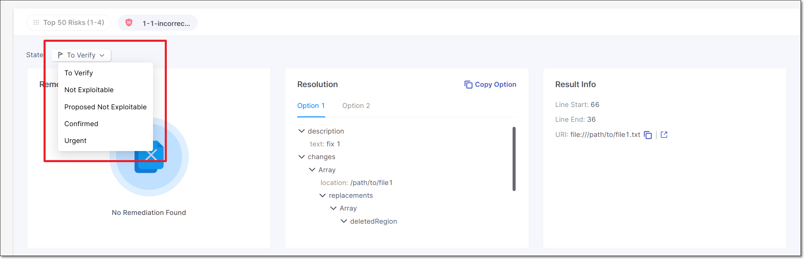

# Bring Your Own Results (BYOR)

## Overview

**B**ring **Y**our **O**wn **R**esults (BYOR) is a powerful capability that enables organizations to enhance their application security posture by incorporating external vulnerability findings into their existing security ecosystem. This feature allows organizations to import vulnerability results from third-party security tools and services, regardless of their origin, if they adhere to a specific standard format: **SARIF**.

SARIF (**S**tatic **A**nalysis **R**esults **I**nterchange **F**ormat) is a standard file format developed by OASIS Open to allow software security tools to provide static analysis results in a standardized, consistent and easy-to-consume format. SARIF allows developers to receive more accurate and useful information about software security vulnerabilities in their projects. It allows static analysis tools to generate results in a common format that can be imported and consumed by other vulnerability management tools and systems.

By incorporating these external results into Checkmarx One, organizations can gain a comprehensive view of their application security landscape, identifying and prioritizing vulnerabilities more effectively. These imported results are integrated into the [Application Risk Management](application-risk-management/using-application-risk-management.md) feature, providing organizations with a unified view of their application risk profile and enabling them to make informed decisions to secure their end-to-end application lifecycle.

Users can import external vulnerability findings into their application security workflow via CI/CD & [CLI](#sarif-import-using-cli) or [API](#sarif-import-using-api).

Using the SARIF format, organizations can easily import and consolidate vulnerability results from various sources. Our platform validates SARIF files against standards to ensure data integrity and consistency. To optimize performance and resource utilization, we set thresholds for the number of results and rules per import run. These limits prevent overload and ensure efficient data processing. For additional information, refer to [SARIF file Limitations](#sarif-file-limitations).

## Permissions

To use the BYOR feature, a user must have either the `ast-admin` role or the following combination of roles and permissions:

- **ast-admin** - Can do everything in Checkmarx One,
- **manage-project** (Role) **+ manage application** (Role) **+ view-risk-management** (Permission) **+ import-findings-external-platforms** (Permission).

## SARIF file Specifications

- Only a **SARIF** file or a **ZIP file containing multiple SARIF files** are supported for import.
- The supported SARIF version is 2.1.0
- To import a SARIF file or a ZIP file containing multiple SARIF files, there are mandatory fields that the user must ensure are present. Otherwise, the import will fail:

  - **Tool** - A name field inside the tool field.
  - SARIF provides a property called **level** within the **result** object to indicate the severity level. Common values include **error**, **warning**, and **note**.
  - The **ruleid** property within the **result** object can be used to specify the identifier or name of the vulnerability.
- Checkmarx One also consumes several other optional fields to provide more information about each result.

  - There isn't a specific property for the timestamp of when a vulnerability first appeared in the SARIF file. However, you can include a timestamp in the **run** object to represent when the analysis was performed.
  - SARIF doesn't have a dedicated field for assigning a result to a user. However, you can use a **custom** property or an extension to include this information.
  - The related source code location of a result can be indicated using the **location** property.
  - If the SARIF file contains a **URL** link or **text** for remediation, the information will be presented in the result's **Remediation** information.
  - Fix URI for each result - The fixes array contains an object describing the remediation. The **artifactChanges** field specifies the changes to be made in the source code file to address the issue.
  - If the information exist in the SARIF file, **startLine**, **endLine**, **URI**, and **text** will be presented in Checkmarx One **Result** information.

## SARIF file Limitations

- The maximum size for a SARIF file or ZIP file containing multiple SARIF files is **10 MB**. Files over this limit are rejected.
- SARIF data imported is also a subject to limits. If any of these limits are exceeded, the file is rejected.

  - **Runs** per file - 20
  - **Results** per run - 25000. Only the top 5000 results are persisted, ordered by by risk score.
  - **Rules** per run - 25000
  - **Location** per result - 100

## Feature Flow

Bring your own results flow is as follows:

1. Create a SARIF file or a ZIP file containing multiple SARIF files for the import.
2. Use the UI, CLI, or API to import SARIF output into Checkmarx One, either as an individual file or as a ZIP archive with multiple SARIF files.
3. The uploaded file is validated before processing. If all required fields are present and valid, the data is parsed and imported into Checkmarx One.
4. The results appear on the **ASPM > Application Risk Management** page among the top fifty results.
5. If you import additional SARIF files into the same Checkmarx One project, note that history is not retained. The platform always displays the most recently imported SARIF results per tool, replacing any previous data.

## Import Procedure

Importing a SARIF file or a ZIP file containing multiple SARIF files can be done using the [CLI](#sarif-import-using-cli) or [API](#sarif-import-using-api).

### SARIF Import using CLI

To import a SARIF file using Checkmarx One CLI tool, proceed as follows:

1. Download Checkmarx One [CLI Tool](https://github.com/Checkmarx/ast-cli/releases).
2. Open **Command Prompt** or **Terminal** on your local laptop/PC.
3. Navigate to the SARIF file path.

   ```
   cd <file path>
   ```
4. Run the **cx configure** command.

   ```
   <file path> ./cx configure
   ```
5. Configure your authentication parameters:

   ```
   AST Base URI [https://eu.ast.checkmarx.net/]:
   AST Base Auth URI (IAM) [https://eu.iam.checkmarx.net/]:
   AST Tenant []:
   Do you want to use API Key authentication? (Y/N): Y
   AST API Key []
   ```
6. Run the **cx utils import** command using `--project-name` and `--import-file-path` flags.

   ```
   <file path> ./cx utils import --project-name "<project name>" --import-file-path <file path>
   ```

### SARIF Import using API

You can import a SARIF file using the [POST /api/imports](https://checkmarx.stoplight.io/docs/checkmarx-one-api-reference-guide/branches/main/6i1xxkyzldqwr-import-results) REST API. For the end to end workflow for importing results via API, refer to our [API documentation](https://checkmarx.stoplight.io/docs/checkmarx-one-api-reference-guide/branches/main/ygqb8oy5omh19-bring-your-own-results-byor#workflow).

## Viewing and Triaging BYOR Results

After the import is completed, you can assess the results inside the Application Risk Management feature.

Go to the **Workspace** > **Applications** page for the application to which the results were imported, and open the **Risk Management** tab. This tab shows up to 50 of the most severe risks in the application. Filter the **Vulnerability Type** column for **Imported Results** to show the vulnerabilities imported via BYOR.

<figure><figcaption></figcaption></figure>

Clicking on a row will open that result in a new tab, displaying detailed information about the vulnerability that was retrieved from the imported SARIF file.

<figure><figcaption></figcaption></figure>

This page shows sections for **Remediation**, **Resolution** and **Result Info**. If some of the optional fields were not included in the SARIF file then data may be missing for some of these sections. There is also a summary section at the bottom of the page.

### Triaging BYOR Results

The state of the result is shown in the top left top corner. By default, all new results are designated as To Verify. Based on your assessment of the risk posed to your application, you can change the state. Possible states are: To Verify (default), Not Exploitable, Proposed Not Exploitable, Confirmed, and Urgent.

To change the state, click on the state and select the desired state from the drop-down list.

<figure><figcaption></figcaption></figure>

#### Identifying Unique Results for BYOR

When you triage a vulnerability (i.e., change the state), the new state will be applied to that unique result each time that it is identified in a subsequent file upload. For results that are imported using the BYOR feature, we identify unique results for multiple imported files based on the following criterion.

- **Guid Field in SARIF file**: If the results section of the SARIF file contains a `Guid` field, we will use this as the `resultID` to identify the result uniquely.
- **Hash Calculation:** In the absence of the `Guid` field, we calculate a hash by combining the following 5 fields to create a unique identifier:

  - **toolName:** The name of the tool that generated the result.
  - **ruleID:** The identifier for the rule that triggered the result.
  - **snippetText:** The code snippet associated with the result.
  - **locationURI:** The URI of the file or resource where the result was found.
  - **lineStart:** The starting line number where the issue was detected.
