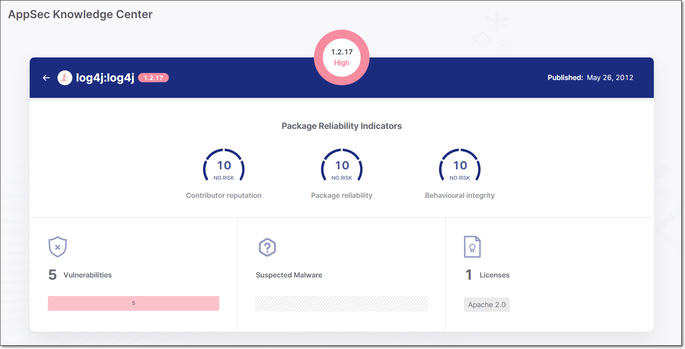
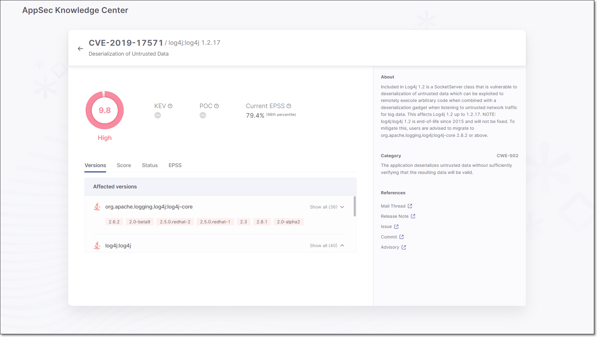

# AppSec Knowledge Center

The AppSec Knowledge Center enables you to search our extensive database for information about specific vulnerabilities and the package versions that are affected by those vulnerabilities. The database includes CVEs as well as "untracked" vulnerabilities that have been cataloged by the Checkmarx Vulnerability Research Team. Checkmarx vulnerabilities are indicated by the “Cx” prefix.

There are separate screens for searching the database by **Package** or by **Vulnerability**.

When you search by package, the results show a list of versions of the package, and indicate which versions have known vulnerabilities. When you select a version that has vulnerabilities, a list of all known vulnerabilities affecting the specified version is shown.

When you search by vulnerability (or click on a vulnerability shown in the package tab), the results show detailed information about the nature of the threat and its severity. It also shows all packages that are affected by the vulnerability and which versions are affected.

## New Version of AppSec Knowledge Center

We have released a new version of the AppSec Knowledge Center. The new version maintains the same core functionality as the previous version. However, the look and feel has been completely redone and many improvements have been introduced. The following are some of the main improvements:

- The Package page now shows **Suspected Malware** risks, and **Licenses** associated with the package (in addition to vulnerabilities).
- Package selection is now done by entering the package name and then clicking on the marker for a specific version.

  

  The markers representing the package versions are now color coded as follows:

  - Red with dot - malicious package
  - Red - high severity
  - Yellow - medium severity
  - Gray - low severity or no risk
- When you select a package version for viewing, a summary page is shown which gives data for [Package Reliability Indicators](searching-by-package.md#package-reliability-indicators), as well as aggregated risks.

  <figure><figcaption></figcaption></figure>

  You can then drill down to view a list of vulnerabilities, suspected malware risks and licenses. For vulnerabilities, you can drill down further to show the vulnerability details screen.
- The vulnerability details screen has been redesigned.

  <figure><figcaption></figcaption></figure>

  The info is now divided into the following elements:

  - **Overview** - gives general info about the vulnerability including the CVSS score.
  - **Info Pane** - shows the description of the vulnerability and CWE and gives references for further research.
  - **Detail Tabs** - The bottom section gives additional details about the vulnerability and the packages affected by the vulnerability. The info is divided into the following tabs:

    - **Versions** - The versions of the packages in which the vulnerability was identified.
    - **Score** - shows the severity level of the vulnerability based on its CVSS score in the NVD as well as the precise CVSS score.
    - **Status** - indicates the status of this vulnerability for this project.
    - **EPSS** - The EPSS (Exploit Prediction Scoring System) score is a data-driven estimate of the likelihood (0% to 100%) that this vulnerability will be exploited in the wild in the next 30 days. It is a dynamic score that changes over time based on identified exploitation activity and various other factors.

## Sample Workflow

The AppSec Knowledge Center is a flexible tool that can be used according to your specific needs. The following is a workflow for a typical use case:

If you decide that you would like to use a particular open source package in your project and want to check **in advance** to make sure that you won’t be introducing security risks into the project, use the following procedure.

1. Go to the **AppSecKnowledge Center**> **Package** screen.
2. Select your project’s language and enter the name of the package that you would like to use.
3. Start typing the name of the desired package and then select it from the list of auto-complete options.
4. Select the version that you would like to use from the list of available versions.

   - If the package version doesn’t have vulnerabilities, then **you’re good to go**.
   - If the package version has vulnerabilities, then you can either select a different version which is shown as not having vulnerabilities or you can analyze the vulnerabilities affecting this version to determine whether they pose a risk to your project.
5. If you would like to analyze the vulnerabilities affecting the specified package version, click on each of the vulnerabilities related to the package to show the details in the **AppSec Knowledge Center**> **Vulnerabilities** tab. For each vulnerability, assess the CVSS ratings and read the description in order to determine whether the vulnerability poses a significant risk to your project. For example, If the severity level is low or if you determine that there won’t be an exploitable path from your project (e.g., it affects functions which you won’t be using), then you may choose to use the package despite the presence of vulnerabilities.

## In this section

- [Searching by Package](searching-by-package.md)
- [Searching by Vulnerability](searching-by-vulnerability.md)
