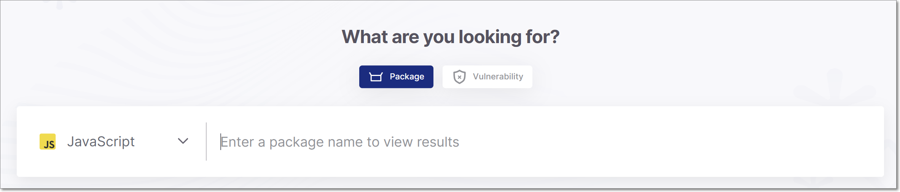
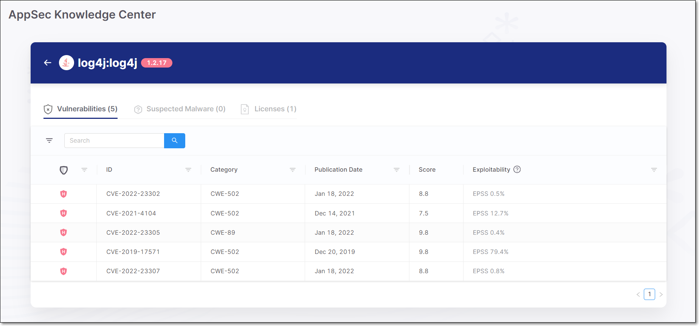
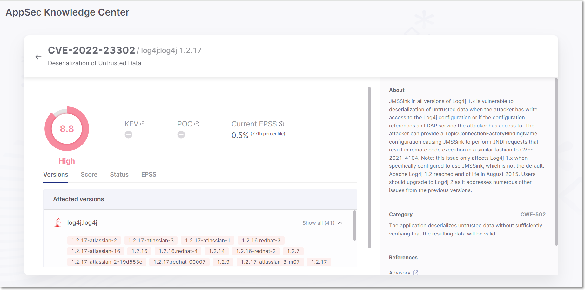

# Searching by Package

You can search for a package in order to find out whether the package has known vulnerabilities, which vulnerabilities it has, and which versions are the most secure.

**To search for a package:**

1. In the main navigation, click on the icon, and then click on the **Package** tile.
2. For the **Language**, select from the drop-down list the language of the package.

   <figure><figcaption></figcaption></figure>
3. In the **Package** search box, begin typing in the name of the package, a drop-down list of auto-complete options is shown. Click on the desired package.

   Once you enter the package name, the **Available Versions** section shows a series of color coded markers indicating the risk level for that version.

   

   The markers representing the package versions are now color coded as follows:

   - Red with dot - malicious package
   - Red - high severity
   - Yellow - medium severity
   - Gray - low severity or no risk
4. Click on a marker in the section representing the version that you would like to assess.

   A summary card opens showing the Package Reliability Indicators (see below) as well as aggregated data for the risks associated with this package version.

   <figure><figcaption></figcaption></figure>
5. Click on a category (Vulnerabilities, Suspected Malware, or Licenses) to view a list of items associated with this package.

   <figure><figcaption></figcaption></figure>
6. In the **Vulnerabilities** tab, you can drill down further by clicking on a vulnerability. This opens AppSec Knowledge Center vulnerability page for the specified vulnerability.

   <figure><figcaption></figcaption></figure>

## Package Reliability Indicators

Checkmarx SCA identifies packages with a wide range of risks. Checkmarx assigns scores to each package representing its reliability for three different categories of reliability.

- **Contributor reputation** - indicates whether there is reason to suspect the credibility of the owner or contributors of the package, e.g., a newly created user is registered as the package owner.
- **Package reliability** - indicates whether there are irregularities in the naming or maintenance patterns of the package, e.g., Typeosquatting, or Chainjacking.
- **Behavioral integrity** - indicates whether the behaviours of the package are unsafe. The package may be malicious by design or it may inadvertently introduce risks into your project. This category includes packages that exfiltrate info about OSs, user credentials etc.

The scores are given on a scale of 0-10, with 10 indicating the highest level of reliability.
