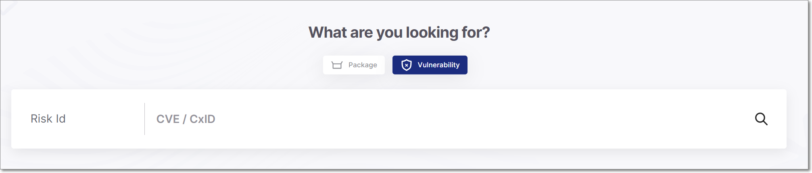
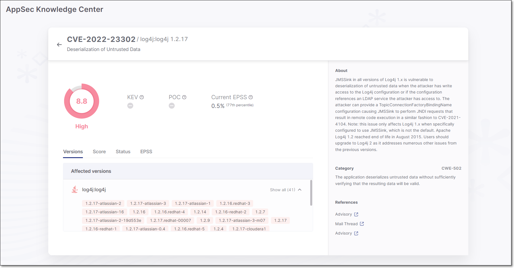
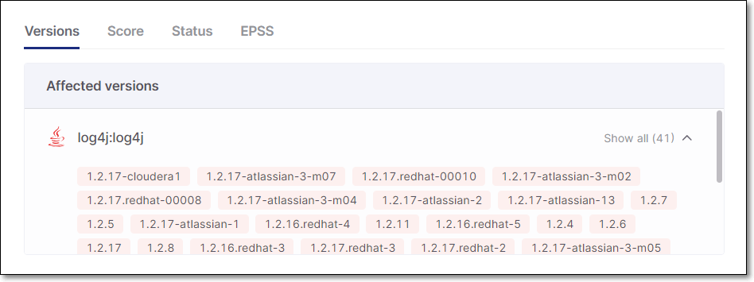

# Searching by Vulnerability

You can search for a vulnerability by entering the CVE or Cx ID in the search box. If the vulnerability is cataloged in our database then results are shown, giving detailed information about the nature of the threat and its severity. Also, a list of packages (and relevant versions) that are affected by the vulnerability is shown.

**To search for a vulnerability:**

1. In the main navigation, click on the icon, and then click on the **Vulnerability** tile.
2. In the search box, enter the CVE or Cx vulnerability name. (For CVEs the format is e.g., “CVE-2021-23369”, For Cx vulnerabilities the format is e.g., “Cxeb68d52e-5509”).

   
3. Click on the icon or hit **ENTER**.

   The AppSec Knowledge Center vulnerability page shows data for the specified vulnerability.

## Viewing Vulnerability Info

The vulnerability page shows detailed info about the specified vulnerability.

<figure><figcaption></figcaption></figure>

This screen includes the following sections:

- **Overview** - The overview section gives general info about the vulnerability.
- **Info Pane** - The right-side Info pane gives detailed info about the vulnerability.
- **Detail Tabs** - The bottom section gives additional details about the vulnerability and the packages affected by the vulnerability. The info is divided into tabs.

### Overview

Shows the Risk score as well as any exploitability indicators that apply to this vulnerability (KEV, POC or Current EPSS).

- KEV - A vulnerability that is cataloged by CISA as a Known Exploited Vulnerability (KEV), indicating that it poses a severe and imminent threat.
- POC - A Proof of Concept (POC) for exploiting this vulnerability is available in the wild, making it easy for threat actors to implement an exploitation of this vulnerability.
- Current EPSS - An EPSS (Exploit Prediction Scoring System) score is a data-driven estimate of the likelihood (0% to 100%) that this vulnerability will be exploited in the wild in the next 30 days. It is a dynamic score that changes over time based on identified exploitation activity and various other factors.


If an exploitability indicator is present (KEV or POC), then an extra tab is shown, giving detailed info about the exploitability.


### Info Pane

The right-side info pane includes the following sections:

- **About** - A brief description of the vulnerability.
- **Notes** (shown only when notes have been added) - This section shows notes that were added to a vulnerability by the Checkmarx AppSect team. These notes may explain discrepancies between our data and data shown in NVD, such as when we have confirmed the disputation of a vulnerability. They may also suggest specific mitigation actions such as changing configurations, or offer other helpful insights from our AppSec team.
- **Category** - Shows the CWE ID and a brief description of the CWE.
- **References** - Gives links to relevant resources to learn more about the vulnerability and the fixes that are available. Links are given for topics such as: Advisory, Commit, Release Notes, Issue etc.
- **Credit** - Attributes credit to the party that identified the vulnerability.

### Vulnerability Details Tabs

<figure><figcaption></figcaption></figure>

The following table describes the info shown in the Vulnerability Details sections.

- **Versions tab** - Shows a list of all packages and package versions that are affected by this vulnerability. Click on a vulnerable version to show all risks associated with that package version in the AppSec Knowledge Center package page, see [Searching by Package](searching-by-package.md).
- **Score tab** - Shows the CVSS Version, Score, and Severity, as well as the components that make up the CVSS score including: Attack Vector, Confidentiality Impact, Attack Complexity, Integrity Impact, Authentication, and Availability Impact. For a full explanation of the metrics that make up the CVSS score, see section 2 of this [article](https://www.first.org/cvss/specification-document).

  The top of the pane shows the version of CVSS that provides this score. If a vulnerability has a CVSS v4.0 score, that score is used; if it only has an score in NVD (v3.1 or lower), that score is used.
- **Status tab** - Shows when the vulnerability was published as well as any status changes that occurred subsequently.
- **EPSS tab** - Shows the EPSS (Exploit Prediction Scoring System) score. This score is provided by [First](https://first.org) for vulnerabilities. The score is an estimate of the likelihood for a vulnerability to be exploited. The score is presented as a percentage indicating the likelihood of this vulnerability to be exploited within the next 30 days. A percentile is also displayed, indicating the ranking of this risk relative to other vulnerabilities.
