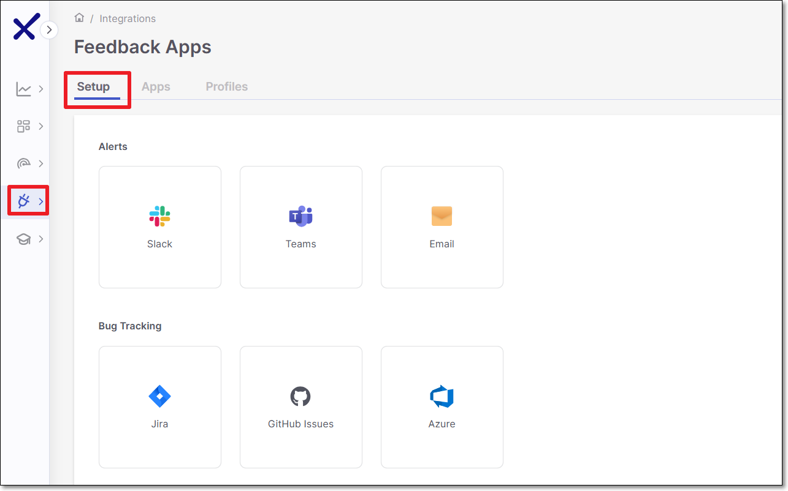
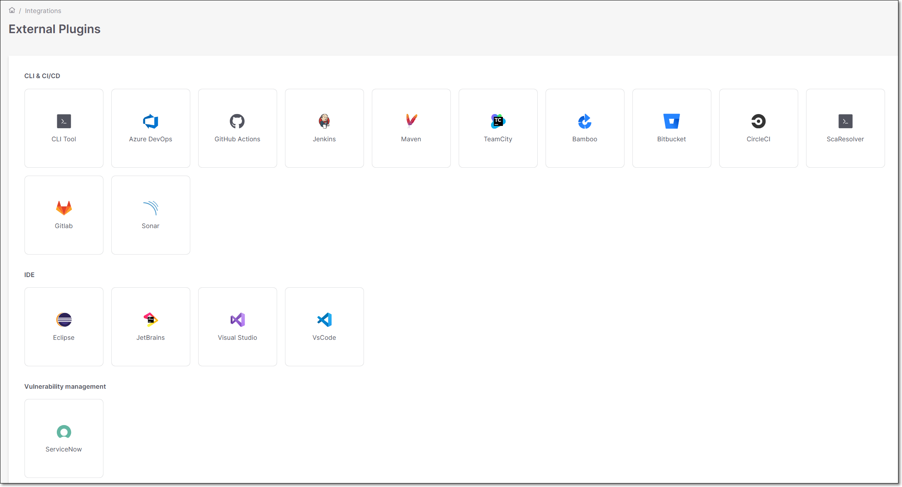
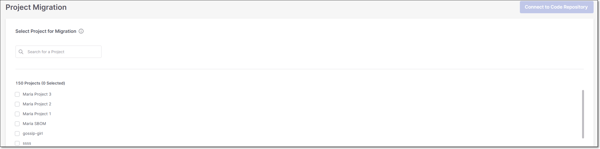

# Checkmarx One Integrations

## Overview

Checkmarx One is a robust platform that supports full integration into your SDLC. We support the following types of integrations:

- **Code Repository Integrations** - We support integration with most of the popular SCM platforms. You can set up SCM integrations using the web application by “Importing” a project from your SCM. You can activate automated scanning of your source code whenever the project is updated. Checkmarx One listens for commit events and uses a webhook to trigger Checkmarx scans when a push, or a pull request occurs. See Checkmarx One SCM Integrations

  
  It is also possible to migrate an existing manual project and convert it to a Code Repository Integration project, see [Project Migration](#project-migration).
  
- **Feedback App Integrations** - Send scan results and new SCA vulnerability detection notifications directly to the relevant parties through your bug tracking and team collaboration tools. See Feedback Apps
- **Cloud Connection Integrations** - Connect to your private registries in order to enable Checkmarx One to access images in your registries. This enables Checkmarx One to scan the images for risks and gather related to Cloud Insights.
- **CI/CD Integrations** - We provide specialized plugins to enable seamless integration of Checkmarx One with many popular CI/CD platforms. This enables you to trigger customized scans as part of your CI/CD pipeline. In addition, we support integration with other CI/CD platforms using our CLI Tool. See Checkmarx One CI/CD Integrations
- **IDE Integrations** - We provide specialized plugins that enable you to import Checkmarx One results into your favorite IDE tools. This makes it easy to identify the vulnerable code in your project and triage the scan results. See Checkmarx One IDE Plugins

## Integrations Screens

Hovering over the **Integrations** icon in the main navigation displays the selection options **Feedback Apps**, **Cloud Connections**, **External Plugins** and **Project Migration**. Clicking on a selection opens a screen that enables you to set up and manage your Checkmarx One integrations. The following sections explain the content of each of the integrations screens.

### Feedback Apps

The **Setup** tab enables users to integrate Checkmarx One with external **Bug Tracking** tools (Jira, GitHub Issues and Azure) as well as sending **Alerts** to team collaboration tools (Slack and Microsoft Teams) or to email recipients.. This enables automated exporting of scan results to the relevant parties through a convenient channel.

You can create a new Feedback App integration on this page. The available integrations are shown in two sections **Alerts** and **Bug Tracking**. For a full explanation of how to configure Feedback Apps, see Feedback Apps.

<figure><figcaption></figcaption></figure>

There are separate tabs that show a list of all of the Feedback **Apps** and Feedback App **Profiles** that have been configured in your account. In each tab, you can edit or delete an existing entity or create a new entity.

### Cloud Connections

The **Cloud Connections** screen shows a tile for each of our supported integrations. The tiles are grouped by category: **Runtime & Cloud**, and **Private Registries**. These integrations enable Checkmarx One to access assets and data on your external platforms. Once these connections are set up, they can be used by each of the relevant consumers in Checkmarx One (i.e., scanners and services).

When you hover over a tile, a list of available links is shown. Click on the relevant link to access our **Documentation** or to set up the **Configuration** of the integration. Clicking on **Configuration** opens a wizard that guides you through the setup process. For information about setting up the integrations, see [Cloud Connection Integrations](../integrations/cloud-connection-integrations/README.md).

#### Cloud Connections

The following table shows which Checkmarx One services make use of each of the integrations.

| Integration | Type | Container Security | Cloud Insights | SCA |
|---|---|---|---|---|
| Sysdig | Runtime & Cloud |  | 1\] |  |
| GitHub | Private Registries |  | COMING SOON |  |
| JFrog Artifactory | Private Registries |  |  |  |
| Private Dockerhub | Private Registries |  | COMING SOON |  |
| ECR | Private Registries |  | COMING SOON |  |
| Quay | Private Registries |  | COMING SOON |  |
| ACR | Private Registries |  | COMING SOON |  |

1\] There is a separate method for integrating Sysdig with Cloud Insights, as described in [Setting up Cloud Insights Integration with Sysdig](cloud-insights/setting-up-cloud-insights-integration-with-sysdig.md).

### External Plugins

The **External Plugins** screen shows a tile for each of our available plugins and supported integrations. The tiles are grouped by category: **CLI & CI/CD**, **IDE** and **Vulnerability management**.

When you hover over a tile, a list of available links is shown. Depending on the integration this can include links to **Documentation** and **Source Code** repos, as well as to **Download** the plugin from marketplace.

For comprehensive info about these plugins, see the relevant documentation sections:

- [Checkmarx One CLI Tool](../cli-tool/README.md)
- [CI/CD Integrations](../integrations/cicd-integrations/README.md)
- Checkmarx One IDE Plugins
- [Checkmarx One Vulnerability Integration with ServiceNow](../integrations/checkmarx-one-vulnerability-integration-with-servicenow/README.md)

### Project Migration

This screen enables you to migrate (convert) existing Checkmarx One **Manual** projects to **Code Repository Integration** projects. The procedures for executing the migration are explained in [Project Migration](managing-projects/project-migration.md).

