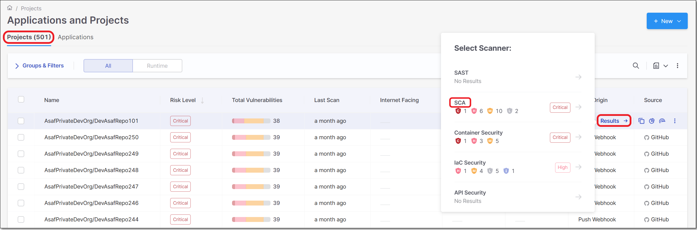
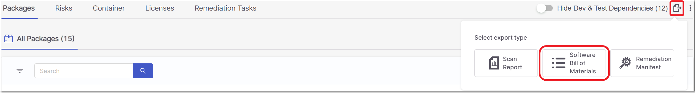
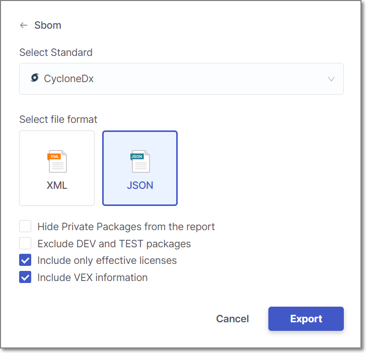

# Generating SBOM Report for a Project

You can generate an SBOM based on the scan results of the SCA scanner for a specific project.

**To generate an SBOM report:**

1. On the Projects page, hover over the **Results** button for the desired project and select **SCA**.

   
2. On the **Scan Results** page, Click on the **Export** button  in the header bar.

   The export type menu opens.

   
3. Click on **Software Bill of Materials**.

   The SBOM configuration dialog opens.

   <figure><figcaption></figcaption></figure>
4. Select the desired SBOM standard. Options are: SPDX or CycloneDx.
5. Select the **Hide Private Packages** checkbox if you want to exclude private packages from the report.
6. Select the **Exclude Dev and Test packages** checkbox to exclude Dev and Test packages from the report.

   
   To learn more about Dev and Test dependencies, see [here](https://docs.checkmarx.com/en/34965-322318-sca-scanner.html#UUID-2865b187-60e6-84f0-67c8-c5313ef205fc_UUID-ce0b5676-9ab8-dee1-1004-5c32410eaa0a).
   
7. Select the **Include only effective licenses** checkbox if you want to exclude licenses that haven't been designated as effective from the report. By default, the checkbox is selected.
8. In the CycloneDX format, you can include **VEX** triage information in the report by selecting the appropriate checkbox.

   
   To learn more about VEX, see [here](https://docs.checkmarx.com/en/34965-249223-triaging-sca-results.html#UUID-945497b2-9333-f98f-72d8-21a8a9c31f6a_section-idm33541121394342).
   
9. Select the output format. Options are: for CycloneDx, XML or JSON; for SPDX only JSON is supported.
10. Click **Export**.

    The SBOM report is downloaded and can be viewed on standard XML/JSON viewers.
