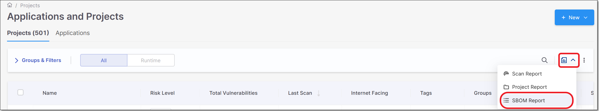
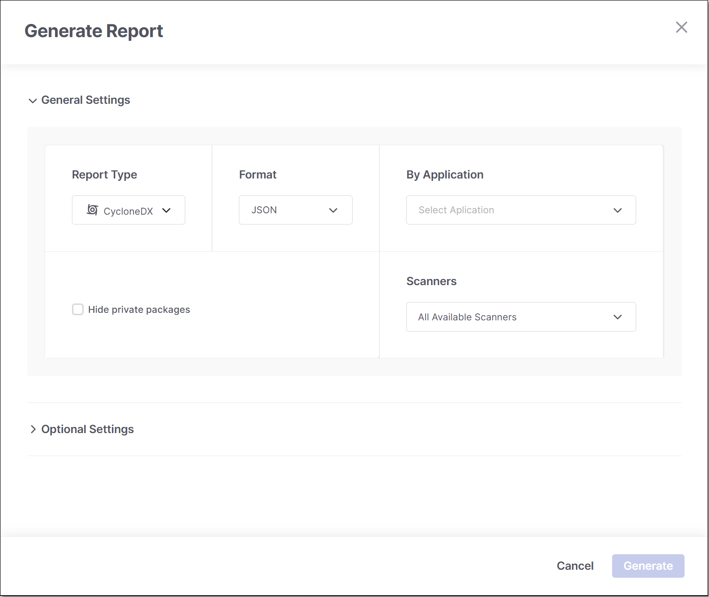

# Generating SBOM Report for an Application

You can generate an SBOM report for a Checkmarx One application. This will include data identified by the SCA and/or Container Security scanners in all projects associated with that application. Data is taken from the last successful scan of the project.

**To generate an SBOM report:**

1. On the **Workspace** > **Projects** page, click in the Filters and Groups bar and select **SBOM Report** from the dropdown menu.

   
2. The **Generate Report** sliding pane is displayed.

   <figure><figcaption></figcaption></figure>
3. Select the desired Report Type. Options are: SPDX or CycloneDx.
4. Select the output format. Options are: for CycloneDx, XML or JSON; for SPDX only JSON is supported.
5. Under **By Application**, select the desired application.
6. Under **Scanners** select the scanners for which you would like to include results in the SBOM report . Options are: SCA and Container Secutiry.
7. Select the **Hide Private Packages** checkbox if you want to exclude private packages from the report.
8. In the CycloneDX format, you can include **VEX** triage information in the report by selecting the appropriate checkbox.
9. If you would like to send the report to email recipients, expand the **Optional Settings** section and enter the required email details under **Send Report by Email**. (optional)
10. Click **Generate**.

    The SBOM report is downloaded and can be viewed on standard XML/JSON viewers.
