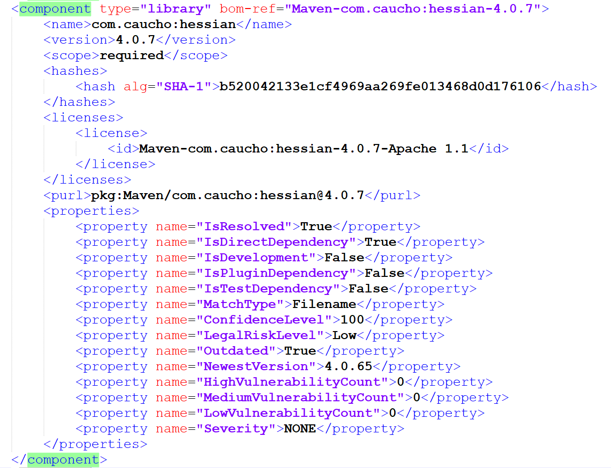
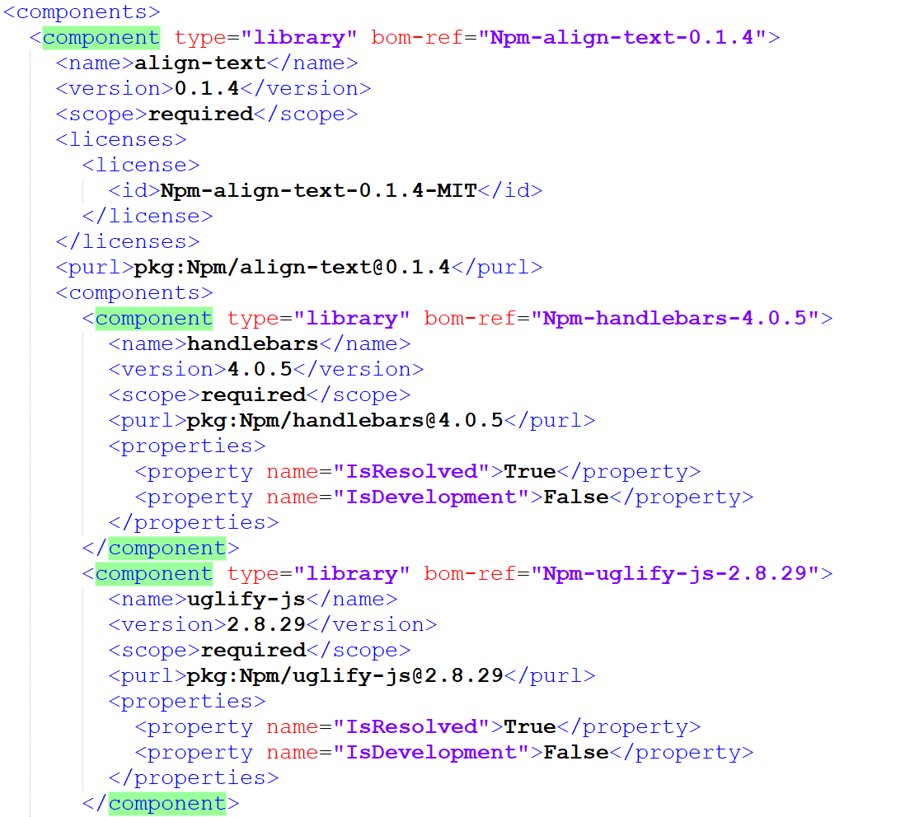

# Viewing CycloneDx SBOM Reports

Checkmarx CycloneDx SCA SBOM Reports can be generated in XML or JSON format and can be viewed in standard XML and JSON viewers.

The report follows the [CycloneDX v1.7](https://cyclonedx.org/docs/1.7/#SchemaProperties) format, which includes standard SBOM fields such as: Id (Purl), Component name, Version, License and Hashes, all those will be included in every SBOM as a required fields list.

In addition, Checkmarx SCA adds a “properties” section with extended information for each library. This section contains key information about the risks associated with the library.

**Sample XML:**

<figure><figcaption></figcaption></figure>

## SBOM Component Dependencies

Each component contains its dependent components, and each dependency section contains a set of required fields and a properties section.

**Sample Components Section (XML):**

<figure><figcaption></figcaption></figure>
