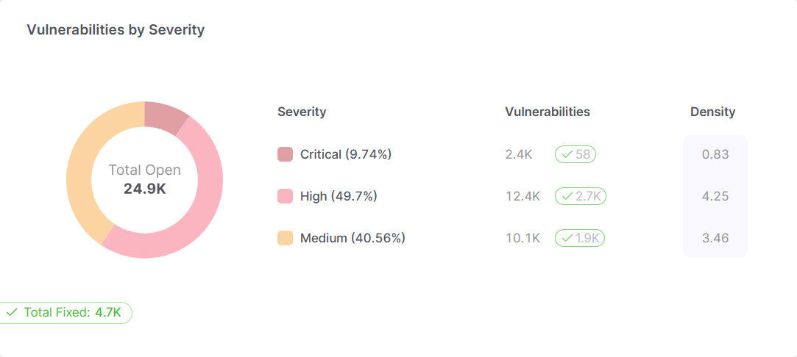
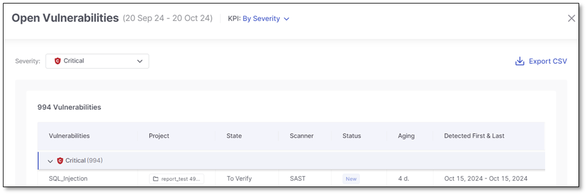

# Global CSV Result Reports

The Global CSV Result Report brings together all security findings across the tenant into one easy-to-read CSV file. This helps security and development teams quickly review security data on a larger scale.

By gathering all vulnerability details from various projects and applications, the report makes it easier to spot trends, gain insights, and focus on the most urgent issues that need attention.

## Generating CSV Result Reports

To generate a CSV Result Report proceed as follows:

1. Navigate to **Analytics & Dashboard > Vulnerabilities**.
2. Filter the data to match your focus areas.
3. Hover over a segment in any chart to display a **Show on table** link.

   
4. Click **Show on table**. This opens a pane with a list of all detected vulnerabilities in that segment, sorted by date in ascending order, with the oldest vulnerability at the top.

   
5. Review the vulnerabilities listed in the table (for additional details, refer to [Vulnerabilities Dashboard](../analytics/vulnerabilities-dashboard.md#in-depth-vulnerability-analysis)).
6. Click **Export CSV** to download the filtered data.

### Organizing and Analyzing Report Data

The report includes important fields like Vulnerability Name, Severity, Status, and Aging, which you can easily filter, sort, or group to focus on areas that need attention. This flexibility helps you make quicker, data-driven decisions.

Here’s how each field helps refine your analysis:

- **Vulnerability Name:** Identifies the vulnerability (e.g., Cross-Site Scripting, SQL Injection), letting you group and filter by type.
- **Severity:** Rates vulnerabilities (Critical, High, Medium, Low), so you can prioritize high-risk issues.
- **Status:** Tracks whether a vulnerability is Open, Fixed, or In Progress, helping you monitor remediation efforts.
- **Aging:** Shows how long a vulnerability has existed, highlighting issues that have been unresolved for too long.
- **Project Name & ID:** Identifies where the vulnerability was found, helping you analyze risks across different projects.
- **Scan ID:** Links to specific scan results, making it easy to track and compare scans.
- **Language:** Filters vulnerabilities by the project's programming language (e.g., Java, JavaScript).
- **Scanner:** Groups vulnerabilities by scanning tool (e.g., SAST, SCA) to evaluate their effectiveness.
- **Detected First/Last:** Timestamps show when the vulnerability was first and last detected, useful for prioritizing new or long-standing issues.
- **Results Link:** Direct link to detailed findings for immediate action.

To focus on the most relevant vulnerabilities and insights for your specific needs, use the following techniques:

- **Filter:** Filter by severity to focus on the most critical vulnerabilities or by project to see which applications need more attention.
- **Sort:** Identify the oldest unresolved issues by sorting by Aging or address the most severe ones by sorting by Severity.
- **Group:** Organize vulnerabilities by project to see risks across different teams or applications, helping you allocate resources effectively.
