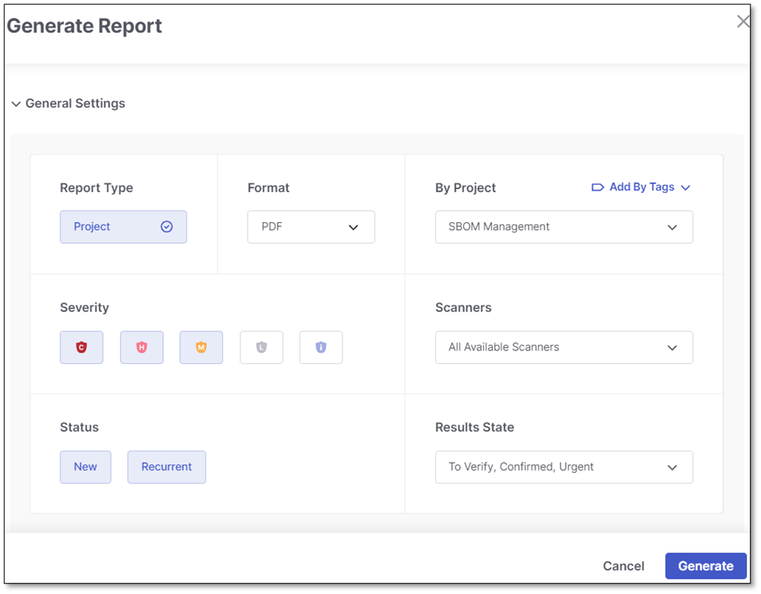

# Project Reports

A project report is generated for the latest scan and provides information on a specific project based on the user's selections during report generation. This report presents general information summarized by totals and does not drill down into detailed results.


The **API Security** scanner is currently not supported for project reports.


## Focus on Production Branches

Project reports filter data to show only production branches to exclude non-production noise. The definition of production branches uses the following logic:

1. **Primary Branch Configuration**: The branch designated as the primary branch on the project overview page is prioritized.
2. **Protected Branches**: Branches flagged as protected during the integration setup are included.
3. **Naming Convention**: Branches with the following names are included by default: `main`, `master`, `dev`, `develop`, `development`, or `merge`.

   
   Not case sensitive, but must be an exact match (no wildcards).
   

## Generating a Project Report

To generate a project report proceed as follows:

1. Open the **Generate Report** sliding pane by doing one of the following:

   - On the **Workspace** > **Projects** page, select one or more projects from the Projects table. Once selected, click the **Generate Report** button that appears above the table.
   - On the **Workspace** > **Projects** page, hover over the relevant project, click on the three-dot icon, and select **Generate Project Report** from the menu.
   - On the **Workspace** > **Projects** page, click in the Filters and Groups bar and select **Project Report** from the dropdown menu.
   - In the project overview, click **Generate Report**.
   - On the **ASPM** > **Analytics & Dashboard** page, click on the **Reports** button.

   The **Generate Report** sliding pane is displayed.

   
2. In the **Report Type** field, make sure that **Project** is selelcted.
3. In the **Format** drop-down list, choose the desired report format: PDF or JSON.
4. If you are generating a report for a single project, its name will appear in the **By Project** field. To choose a different project or add more projects to the report, expand the **By Project** field and select the required projects from the list or use the Search field.
5. To generate reports for all projects labeled by a tag, click **Add By Tags** and select the required tags from the list or use the Search field.
6. Under **Severity**, select the severity levels of issues to include in the report. The default is High and Medium.
7. Under **Scanners**, specify the scanners whose findings you want to incorporate into the report.
8. Under **Status**, specify whether to include in the report newly discovered vulnerabilities (New), previously identified vulnerabilities that have reappeared (Recurrent), or both types.
9. Under **Results State**, select the state of of the results to include in the report. By default, the following states are selected: To Verify, Confirm, and Urgent.
10. Additionally, you can fine-tune your report settings by clicking on **Optional Settings** at the bottom of the wizard interface.

    <figure><figcaption></figcaption></figure>
11. To assign a meaningful name to the report, enter it in the **Report Name** field. If left empty, each report will receive a generic title "Report Name."
12. To send the report via email, input the recipients' email addresses into the **Send Report to Emails** field. If sending to multiple recipients, separate their email addresses with commas.

    
    Maximum, 10 recipients allowed.
    

    
    This requires the permission `send-report-email`. Users without this permission won't see this field in the UI.
    
13. To focus on specific areas of interest in the scan results, select which sections of the scan results to include in the report from the **By Sections** drop-down list. For details on report sections, see [Viewing Project Reports](https://docs.checkmarx.com/en/34965-146341-viewing-project-reports.html).
14. Click **Generate**.

To learn how to generate project reports via API, refer to [this page](https://checkmarx.stoplight.io/docs/checkmarx-one-api-reference-guide/branches/main/51flzmrawidq4-create-a-customized-report). Ensure you select **Project Report** from the dropdown list in the Body section.

## In this section

- [Viewing Project Reports](viewing-project-reports.md)
