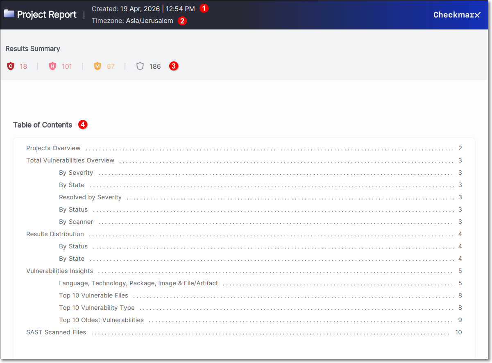
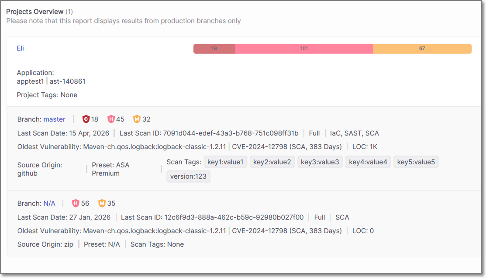

# Viewing Project Reports

This article explains the content of Project Reports generated in PDF format.

<figure><figcaption></figcaption></figure>

The top section of the Project Report includes the date and time the report was generated **(1)**.

Below this, the report’s time zone is displayed. When reports are generated through the UI, the browser’s time zone is applied automatically. When generated via API, a time zone can be specified in the request body; otherwise, UTC is used by default **(2)**.

The **Results Summary** section presents the total number of risks, broken down by severity: Critical, High, Medium, Low, and Informational **(3)**.

The **Table of Contents** summarizes what sections have been included in the report with a hyperlink to the information **(4)**.

## Project Overview

The **Projects Overview** section displays information about the project that the report was generated from.

The name of the project is shown, along with the associated application and any project tags that have been applied. A summary bar presents the total number of vulnerabilities, broken down by severity.

For each branch included in the report, detailed scan information is provided. This includes the branch name, the number of vulnerabilities by severity, and the date and ID of the last scan. The scan type is also displayed.

The oldest vulnerability identified in the branch is shown, including the package name, CVE, scanner type, and how long the vulnerability has been open. The number of lines of code (LOC) is also included where applicable.

Additional details include the source origin of the project, such as a repository or uploaded archive, the preset used for the scan, and any scan tags that were applied.

If multiple branches or scan scopes are included in the report, each is displayed as a separate entry under the same project.

## Total Vulnerabilities Overview

The **Total Vulnerabilities Overview** section provides a visual summary of the vulnerabilities identified in the project. The information is presented using pie charts that display the distribution of vulnerabilities across different categories.

- **By Severity** – By Severity – The total number of vulnerabilities is broken down by severity: Critical, High, Medium and Low. The chart displays both the distribution and the density of vulnerabilities for each severity level.
- **By State** – Shows the distribution of vulnerabilities by state, for example To Verify, Confirmed, or Urgent.
- **Resolved by Severity** – Displays the number of vulnerabilities that have been resolved, grouped by severity level.
- **By Status** – Indicates the classification of vulnerabilities, such as New or Recurrent.
- **By Scanner** – Shows which scanner identified the vulnerabilities, indicating which scanner produced the most results.

Each chart presents both the total number of vulnerabilities and their relative distribution, providing a clear overview of how findings are spread across the project.

## Results Distribution

The **Results Distribution** section provides a tabular breakdown of the vulnerabilities identified in the project.

- **Results Distribution By Status** – Displays the number of vulnerabilities grouped by status: New and Recurrent, with totals calculated across all severity levels.
- **Results Distribution By State** – Displays the number of vulnerabilities grouped by state (for example To Verify, Confirmed etc.), with totals calculated across all severity levels.

Each table presents the exact number of vulnerabilities per category, along with overall totals, providing a precise numerical view to complement the visual summaries shown in the previous section.

## Vulnerabilities Insights

The **Vulnerabilities Insights** section highlights where vulnerabilities are concentrated across the project and provides detailed views to support analysis and prioritization.

### Language, Technology, Package, Image & File/Artifact

Displays the components and technologies in which vulnerabilities were identified, along with the number of findings associated with each item.

The data is grouped to show how vulnerabilities are distributed across the application stack, helping identify which languages, technologies, or dependencies contribute most to the overall risk.

This section enables you to quickly pinpoint areas that require attention, such as specific packages or technologies with a higher concentration of vulnerabilities.

### Top 10 Vulnerable Files

The **Top 10 Vulnerable Files** section displays the files with the highest number of vulnerabilities identified in the project.

Each file is listed along with the total number of vulnerabilities, including a breakdown by severity. This helps identify which parts of the codebase are most affected and may require focused remediation.

### Top 10 Vulnerability Type

The **Top 10 Vulnerability Type** section lists the most common vulnerability types identified in the project.

Each vulnerability type is presented with the number of occurrences, allowing you to understand which types of issues are most prevalent.

### Top 10 Oldest Vulnerabilities

The **Top 10 Oldest Vulnerabilities** section displays the longest-standing unresolved vulnerabilities.

Each entry includes the affected package, CVE identifier, severity, and the number of days the vulnerability has been open. This helps prioritize remediation of aging vulnerabilities that may pose ongoing risk.

## SAST Scanned Files

The **SAST Scanned Files** section displays the files that were scanned using SAST, along with the number of vulnerabilities identified in each file.

Each entry includes the file name and the total number of vulnerabilities detected, providing a direct mapping between code files and their associated findings.

This section helps identify which specific files contain vulnerabilities and may require remediation.
