# Scan Reports

The scan report offers detailed information on scans performed in Checkmarx One. It provides an overview of a project's security, highlighting specific vulnerabilities.


The **API Security** scanner is currently not supported for scan reports.


## Generating Scan Reports

You can generate a scan report in Checkmarx One using either default or customized settings.

The default report is quick and straightforward, using predefined parameters like PDF format, scan type, severity levels, status, project-based organization, scanners, and results state. This method is ideal when you need a standard overview without any additional configuration.

In contrast, the customized report offers extensive flexibility, allowing you to select formats, choose specific scans, and tailor the content by severity levels, scanner findings, vulnerability status, and result states. Additional personalization options include naming the report, setting up email distribution, and selecting specific sections to include. This method is useful when you require detailed and specific reporting to meet unique needs.

In addition, you can generate customized reports via (REST) API. See our documentation for [Improved Reports Service API](https://checkmarx.stoplight.io/docs/checkmarx-one-api-reference-guide/branches/main/ci2py4oc7hlt3-improved-reports-service-rest-api).


The legacy report is now available only via the legacy [Reports Service API](https://checkmarx.stoplight.io/docs/checkmarx-one-api-reference-guide/branches/main/6e28f72109c9c-reports-service-rest-api).


### Generating a default report

A default report is a report with the following predefined settings:

- Format: PDF
- Type: Scan
- Severity Levels
- Status
- By Project
- Scanners
- Results State

To generate a default report:

1. From the project overview, open the **Scan History** tab.
2. Click on the three-dot icon for the required scan.
3. Select **Generate Default Report** from the drop-down menu.

You can generate default reports for multiple scans by selecting them in the **Scan History** tab and choosing **Generate Default Report** from the drop-down menu. However, generating customized reports for more than one scan is not possible.

### Generating a customized report

To generate a customized report, proceed as follows:

1. Do one of the following:

   - From the project overview, open the **Scan History** tab, click on the more options icon for the relevant scan and select **Customize Report** from the drop-down menu.
   - On the **ASPM** > **Analytics & Dashboard** page click on **Reports** in the top right corner.

   The report generation wizard is displayed.

   <figure>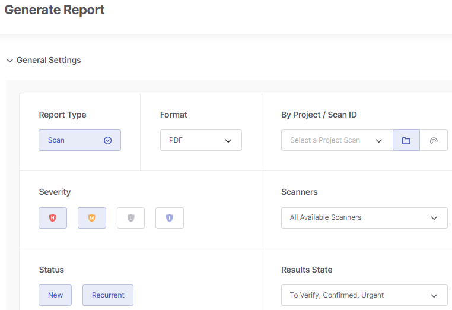<figcaption></figcaption></figure>
2. Under **Report Type**, make sure that **Scan** is selected (default).
3. In the **Format** drop-down list, choose the desired report format: PDF, JSON, or CSV.

   
   The CSV option is currently available for SAST, IaC Security, SCA and Container Security reports, but not for SCS reports. If SCS is selected under **Scanners**, the CSV option will be grayed out.
   
4. Choose the scan for which the report will be generated using one of two methods: by project or by scan ID.

   1. When selecting **By Project**, click 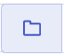 and pick a project from the list or type its name into the search field. Then, select a branch under **Select a Branch** or keep the default option **Last Scan Selected**.
   2. If you prefer using a scan ID, click on 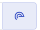 and input the ID.
5. Under **Severity**, select the severity levels of issues to include in the report. The default is High and Medium.
6. Under **Scanners**, specify the scanners whose findings you want to incorporate into the report.
7. Under **Status**, specify whether to include in the report newly discovered vulnerabilities (New), previously identified vulnerabilities that have reappeared (Recurrent), or both types.
8. Under **Results State**, select the state of of the results to include in the report. By default, the following states are selected: To Verify, Confirm, and Urgent.
9. Additionally, you can fine-tune your report settings by clicking on **Optional Settings** at the bottom of the wizard interface.

   <figure>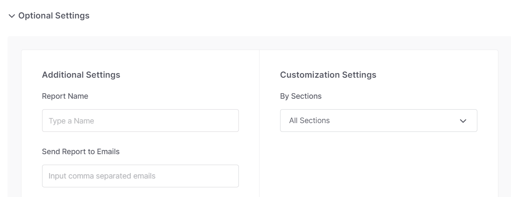<figcaption></figcaption></figure>
10. To assign a meaningful name to the report, enter it in the **Report Name** field. If left empty, each report will receive a generic title "Report Name."
11. To send the report via email, input the recipients' email addresses into the **Send Report to Emails** field. If sending to multiple recipients, separate their email addresses with commas.

    
    The maximum of 10 recipients are allowed.
    

    
    This requires the permission `send-report-email`. Users without this permission won't see this field in the UI.
    
12. To focus on specific areas of interest in the scan results, select which sections of the scan results to include in the report from the **By Sections** drop-down list. For details on report sections, see below.
13. Click **Generate**.

## Understanding the Report Content - Generic KPIs

### Filtered By

Shows the filters applied when generating the report.

<figure>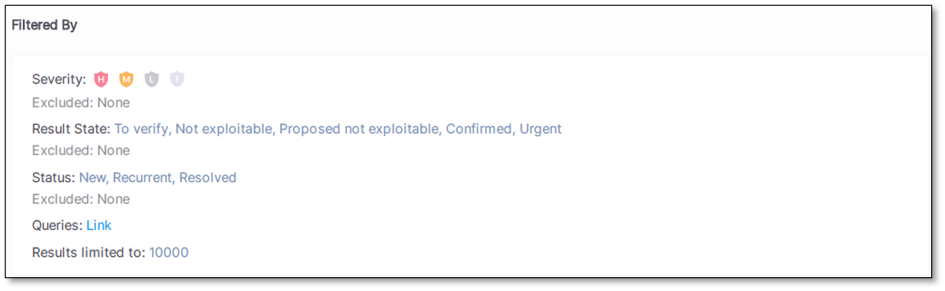<figcaption></figcaption></figure>

**Included**: Data included in the report. All data available in the report is filtered according to the specified filters.

**Excluded**: Data filtered out from the report.

Currently, it is not possible to exclude data from the report, all data is included by default.

### Scan Information

Scan Information shows details related to the SAST, IaC, and SCA scans, such as **Scan Duration** and **Lines of Code Scanned**, etc.

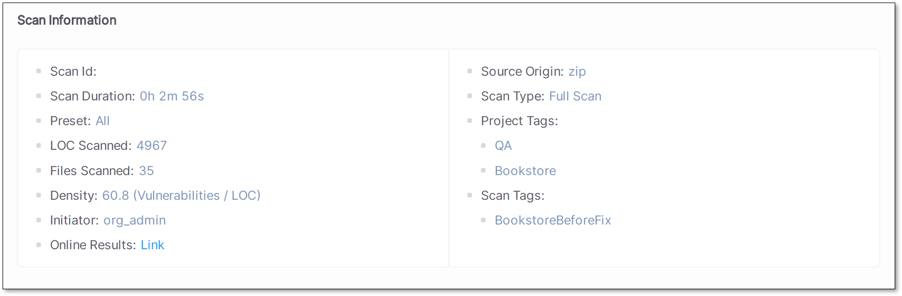

### Scan Results Overview

#### Total Results by Scanner/Engine

This section provides a breakdown of the total scan results categorized by scanner: SAST, SCA, or IaC.

#### By Density / Grade

This KPI is applicable to SAST and IaC only.

Shows the percentage of the scanned code with vulnerabilities: the ratio between the total number of vulnerabilities and the total number of lines of code \*1000.

The percentage inside the pie chart refers to the lines of code with vulnerabilities and the percentage outside refers to the lines of code without vulnerabilities.

<figure>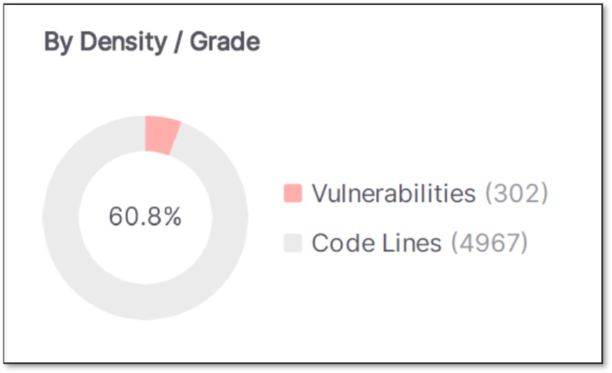<figcaption></figcaption></figure>

#### By Status

This KPI is applicable to SAST, IaC, and SCA.

The pie chart shows the number of vulnerabilities grouped by status (New vs Recurrent). Each status displays the percentage and the total number of results found.

<figure>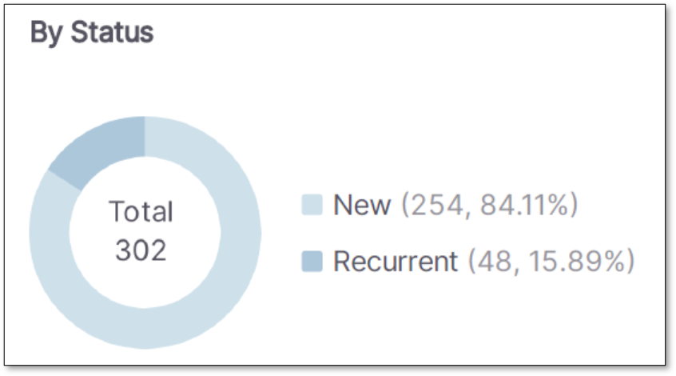<figcaption></figcaption></figure>

#### By Severity

This KPI is applicable to SAST, IaC, and SCA.

The pie chart shows the scan results grouped by severity. Each severity displays the total number of findings, their percentage, and their density.

<figure>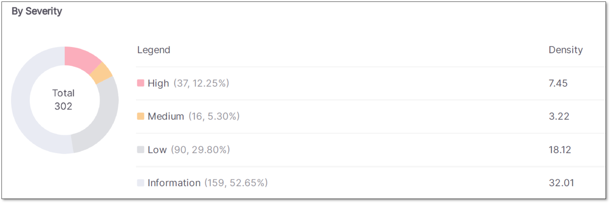<figcaption></figcaption></figure>

#### By State

This KPI is applicable to SAST, IaC, and SCA.

This pie chart shows the scan results grouped by State. Each state displays the total number of findings, their percentage, and their density.

<figure>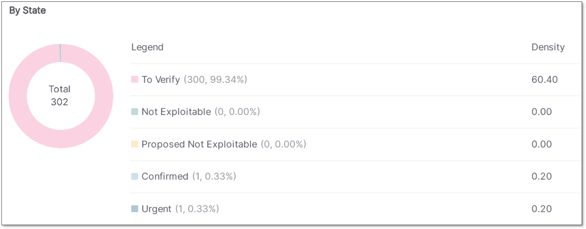<figcaption></figcaption></figure>

#### Results Distribution By Status

This table breaks down scan results by Status (e.g. New and Recurrent) and Severity.

Showing these values together provides a clearer picture of the results by showing the severity distribution for each status - for example, how many New results are Critical.

#### Results Distribution By State

This table breaks down scan results by State (e.g. To Verify) and Severity.

Showing these values together provides a clearer picture of the results by showing the severity distribution for each state - for example, how many Exploitable results are Critical.

<figure>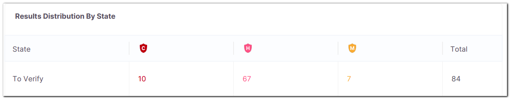<figcaption></figcaption></figure>

#### By Language

The stacked chart shows the number of vulnerabilities and densities detected for each scanned language and their severities.

<figure>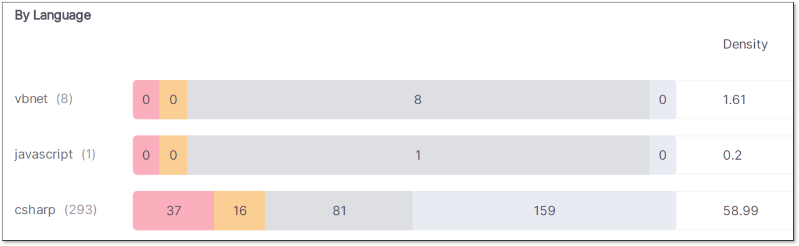<figcaption></figcaption></figure>

#### By Technology

This KPI is applicable to the IaC scanner only. It shows the issues and vulnerabilities split by technology and helps users understand where problems occur across different parts of their infrastructure.

#### By Package

This KPI is applicable to the SCA scanner only. It shows the issues and vulnerabilities split by package.

#### By Vulnerability

This KPI is applicable to SAST only.

The table shows the total results by vulnerability type and their breakdown by severity and the total number of files where a vulnerability was detected.

The first column lists the name and the severity of the vulnerability type found. When the severity of a result is changed from its default it will be reflected in the report.

<figure>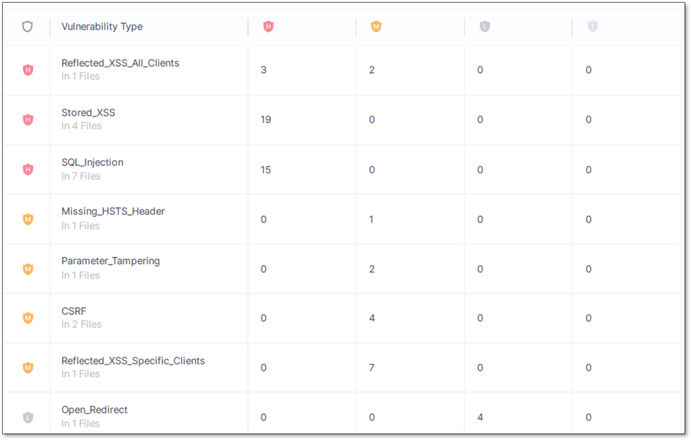<figcaption></figcaption></figure>

#### Top 10 Vulnerabilities

This KPI is applicable to SAST only.

This card displays the 10 vulnerabilities with the highest totals of scanned findings.

It also shows the total findings for these 10 vulnerabilities and the total number of files with vulnerabilities. The total number of files affected is based on all distinct files with vulnerabilities and not the distinct files of the ‘10 vulnerabilities’ list.

Example: **SQL_Injection**: There are 15 High results, 0 Medium, 0 Low, and 0 Info.

<figure>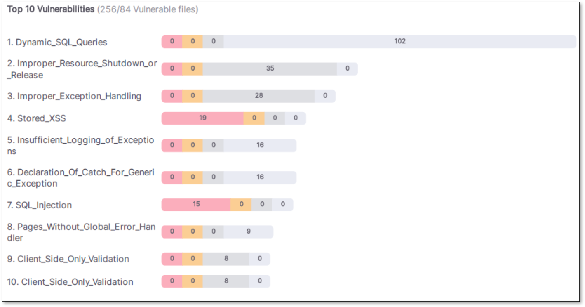<figcaption></figcaption></figure>

#### Top 10 Vulnerable Files

This KPI is applicable to SAST only.

This card displays the 10 files with the highest totals of scanned findings.

Example:**\\bookstore\\Login.cs**: There are 4 High results, 0 Medium, 0 Low, and 11 Info.

<figure>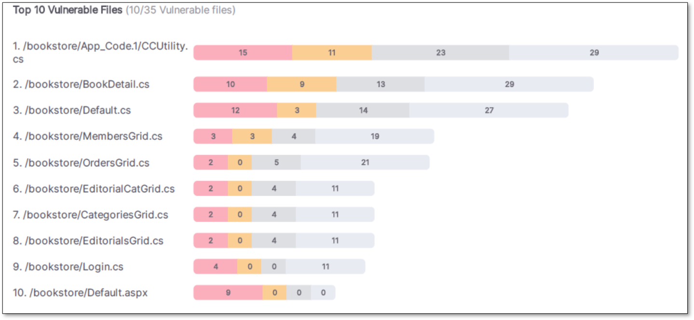<figcaption></figcaption></figure>

#### 5 Oldest Vulnerabilities

This KPI is applicable to SAST only.

The aging is calculated and not restricted to the project you are analyzing. The first date is calculated based on the result, regardless of the project.

<figure>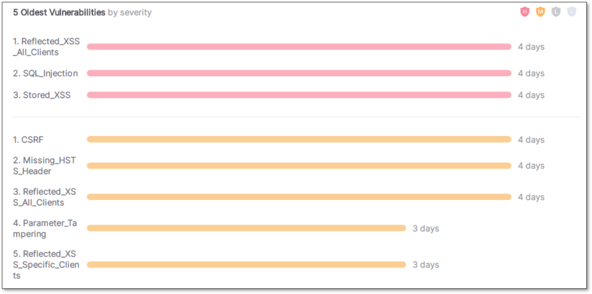<figcaption></figcaption></figure>

### Scan Results

Each Vulnerability Type scan displays the total results with a description and its related categories.

The results are displayed together for each vulnerability type. This includes: Severity, Status, First and Last Detection dates, Source, and Destination. You can click on the hyperlink to be redirected to the result details in the Application.

<figure>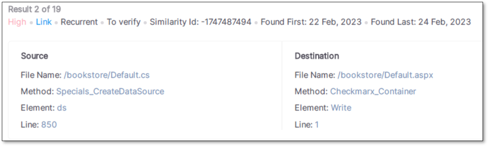<figcaption></figcaption></figure>

### SAST Categories

In each category available in the SAST engine, the total results are organized by severity.

Only categories with results are available in the report. Categories without results are excluded by default.

<figure>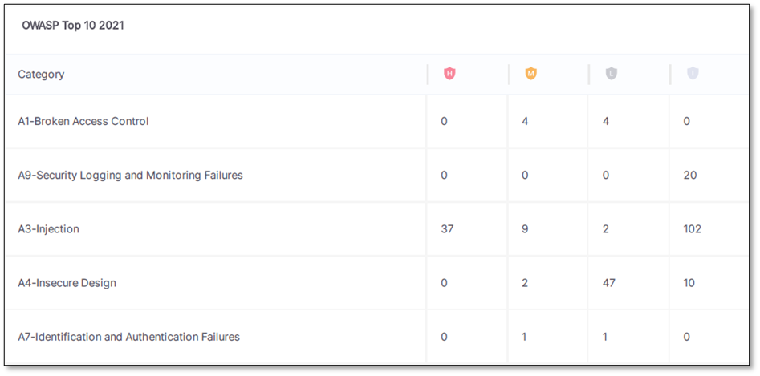<figcaption></figcaption></figure>

### SAST Vulnerability Details

Details the risk, what may have caused it, and general recommendations for remediation.
