# Cloud Insights


Cloud Insights is included in the **Essential**, **Professional** and **Enterprise** license bundles.


## Overview

The nature of cloud-native applications requires solutions that can quickly adapt, effectively mitigate risks, and secure critical assets.

Checkmarx One Cloud Insights offers actionable insights to solve these challenges by correlating data across the entire software development lifecycle (SDLC) and runtime environments. By integrating with runtime environments, developers can focus on the riskiest issues which matter the most to their business.

By correlating context from runtime environments with pre-deployment data, Checkmarx One reduces noise and alert fatigue by prioritizing Internet-facing vulnerabilities and filtering out non-runtime vulnerabilities.

When a vulnerability is found in runtime, Checkmarx One elevates the risk score per the runtime context so that such a vulnerability can be prioritized first.

To further enhance these capabilities, Checkmarx One provides integration with AWS, Wiz, and other leading CNAPP vendors.

When integrating with Wiz, Checkmarx One establishes a secure connection with Wiz’s API endpoints to request relevant data, such as information about clusters, pods, containers, and network exposures.

With the AWS integration, customers provide their IAM role, which can read clusters and other metadata to retrieve a list of images under each connected cluster.

After obtaining the information from Wiz or AWS or other supported CNAPP providers, Cloud Insights matches container image names with the Checkmarx One Project name and corresponding source code repository. Checkmarx One then correlates runtime data with the risk calculation based on detected vulnerabilities and misconfigurations identified earlier in the SDLC.

By combining Checkmarx One scanners with runtime information provided by Cloud Insights, organizations can achieve visibility and control over their cloud-native applications. This integrated approach enables security and development teams to identify vulnerabilities within Checkmarx One projects and prioritize them based on their exposure in runtime, ensuring that critical issues are addressed promptly and effectively.

### Correlation Methodology

Cloud Insights uses a matching algorithm based on Open Container Initiative (OCI) "Labels," which are key-value pairs used to describe metadata about container images. If the customer uses best practices of SW development and builds the container image according to OCI Specifications, setting the "org.opencontainers.image.source" label, then we will extract the source code repo URL from there and match it to the source code repo URL of your Checkmarx One project. This ensures 100% accuracy of mapping results.

For images that don't follow OCI specifications, we use a token-based methodology to break down container image names into their key components and extract meaningful elements for matching purposes. We then compare these components with your Checkmarx One project names and identify correlations. When a possible correlation is identified, we assign a confidence level based on how well the tokens match, allowing us to show only reliable correlations.

Cloud Insights also leverages AI to enhance container image detection and correlation. The platform can identify third-party images, automatically extract commit hashes and source URLs, and correlate images to their originating projects.

#### Key Features

- Uses OCI labels to correlate images.
- Uses token-based approach as a backup for matching, improving traceability of container images to projects.
- Leverages AI to enhance detection and correlation.
- Calculates confidence levels to assess match accuracy.
- Identifies private packages used in the images. If a private package correlates to a Checkmarx One project, then the risks identified in that project are also shown.

### Excluded Images

After receiving the list of images from your cloud provider, Checkmarx automatically excludes images that we consider to be 3rd party images that don't impact on the matching inventory of your application assets. Those images aren't shown in Checkmarx Cloud Insights.

List of excluded images

"activemq": "https://github.com/apache/activemq"

"adc": ""

"addon-resizer": "gke.gcr.io/addon-resizer"

"addon-token-adapter": ""

"adminer": ""

"adoptopenjdk": ""

"aerospike": ""

"agent": ""

"alpine": ""

"alpine-curl": ""

"amazon-k8s-cni": "https://github.com/aws/amazon-vpc-cni-k8s"

"amazon-vpc-cni-k8s": "https://github.com/aws/amazon-vpc-cni-k8s"

"amazoncorretto": ""

"amazonlinux": ""

"ansible": "https://github.com/ansible/ansible"

"arangodb": ""

"argocd": "https://github.com/argoproj/argo-cd"

"artifactory": "https://github.com/jfrog/artifactory-oss"

"autoscaler": "gke.gcr.io/cluster-autoscaler"

"aws-cli": "https://github.com/aws/aws-cli"

"aws-ebs-csi-driver": "https://github.com/kubernetes-sigs/aws-ebs-csi-driver"

"aws-load-balancer-controller": ""

"aws-network-policy-agent": "https://github.com/aws/aws-network-policy-agent"

"azure-cli": "https://github.com/Azure/azure-cli"

"azure-disk-csi-driver": "https://github.com/kubernetes-sigs/azuredisk-csi-driver"

"azure-file-csi-driver": "https://github.com/kubernetes-sigs/azurefile-csi-driver"

"bash": ""

"bonita": ""

"bower": "https://github.com/bower/bower"

"buildpack-deps": ""

"bundler": "https://github.com/rubygems/bundler"

"busybox": ""

"caddy": ""

"calico": "https://github.com/projectcalico/calico"

"cargo": "https://github.com/rust-lang/cargo"

"cassandra": "https://github.com/apache/cassandra"

"centos": ""

"ceph": "https://github.com/ceph/ceph"

"chef": "https://github.com/chef/chef"

"chronograf": "https://github.com/influxdata/chronograf"

"cilium": "https://github.com/cilium/cilium"

"cluster-proportional-autoscaler": "gke.gcr.io/cluster-proportional-autoscaler"

"cocoapods": "https://github.com/CocoaPods/CocoaPods"

"composer": "https://github.com/composer/composer"

"conda": "https://github.com/conda/conda"

"config-reloader": "gke.gcr.io/prometheus-engine/config-reloader"

"consul": "https://github.com/hashicorp/consul"

"coredns": "https://github.com/coredns/coredns"

"couchbase": "https://github.com/couchbase/couchbase-server"

"couchdb": "https://github.com/apache/couchdb"

"cpan": "https://github.com/andk/pause"

"csi-attacher": "https://github.com/kubernetes-csi/external-attacher"

"csi-driver-iscsi": "https://github.com/kubernetes-csi/csi-driver-iscsi"

"csi-driver-nfs": "https://github.com/kubernetes-csi/csi-driver-nfs"

"csi-driver-smb": "https://github.com/kubernetes-csi/csi-driver-smb"

"csi-node-driver-registrar": "https://github.com/kubernetes-csi/node-driver-registrar"

"csi-provisioner": "https://github.com/kubernetes-csi/external-provisioner"

"csi-resizer": "https://github.com/kubernetes-csi/external-resizer"

"csi-snapshotter": "https://github.com/kubernetes-csi/external-snapshotter " "debian": ""

"dnf": "https://github.com/rpm-software-management/dnf"

"docker": "https://github.com/docker/docker-ce"

"drone": "https://github.com/drone/drone"

"drupal": ""

"dub": "https://github.com/dlang/dub"

"ebpf": ""

"eclipse-mosquitto": ""

"eclipse-temurin": ""

"elasticsearch": ""

"envoy": "https://github.com/envoyproxy/envoy"

"etcd": "https://github.com/etcd-io/etcd"

"event-exporter": ""

"fabric": "https://github.com/fabric/fabric"

"fedora": ""

"flannel": "https://github.com/coreos/flannel"

"flink": ""

"fluent-bit": ""

"fluent-bit-gke-exporter": ""

"fluentd": "https://github.com/fluent/fluentd"

"gatekeeper": "mcr.microsoft.com/oss/open-policy-agent/gatekeeper"

"gatekeeper-controller-container": "mcr.microsoft.com/oss/open-policy-agent/gatekeeper"

"gazebo": ""

"gce-pd-csi-driver": "https://github.com/kubernetes-sigs/gcp-compute-persistent-disk-csi-driver"

"gcp-compute-persistent-disk-csi-driver": "https://github.com/kubernetes-sigs/gcp-compute-persistent-disk-csi-driver"

"ghost": ""

"gitea": "https://github.com/go-gitea/gitea"

"gitlab": "https://github.com/gitlabhq/gitlabhq"

"gke-metadata-server": ""

"gke-metrics-agent": ""

"gke-metrics-collector": ""

"glusterfs": "https://github.com/gluster/glusterfs"

"go modules": "https://golang.org/ref/mod"

"golang": ""

"gomodules": "https://golang.org/ref/mod"

"google-cloud-sdk": "https://github.com/GoogleCloudPlatform/gcloud"

"gradle": "https://github.com/gradle/gradle"

"grafana": "https://github.com/grafana/grafana"

"grafite": "https://github.com/graphite-project/graphite-web"

"groovy": ""

"hadoop": "https://github.com/apache/hadoop"

"haproxy": "https://github.com/haproxy/haproxy"

"haxe": ""

"hello-world": ""

"helm": "https://github.com/helm/helm"

"hex": "https://github.com/hexpm/hex"

"homebrew": "https://github.com/Homebrew/brew"

"httpd": ""

"hylang": ""

"image-analyzer": ""

"images": ""

"influxdb": "https://github.com/influxdata/influxdb"

"ingress-gce-404-server-with-metrics": ""

"ip-masq-agent-v2": ""

"irssi": ""

"istio": "https://github.com/istio/istio"

"ivy": "https://ant.apache.org/ivy/"

"jaeger": ""

"java": ""

"jenkins": "https://github.com/jenkinsci/jenkins"

"joomla": ""

"jruby": ""

"k8s-dns-dnsmasq-nanny": "gke.gcr.io/k8s-dns-dnsmasq-nanny"

"k8s-dns-kube-dns": "gke.gcr.io/k8s-dns-kube-dns"

"k8s-dns-sidecar": "gke.gcr.io/k8s-dns-sidecar"

"k8s_agent": ""

"kapacitor": "https://github.com/influxdata/kapacitor"

"kibana": "https://github.com/elastic/kibana"

"kind": "https://github.com/kubernetes-sigs/kind"

"knative": "https://github.com/knative/serving"

"kong": ""

"konnectivity-agent-metrics-collector": "gke.gcr.io/konnectivity-agent-metrics-collector"

"kspm-controller": ""

"kube-apiserver": "https://github.com/kubernetes/kubernetes"

"kube-controller-manager": "https://github.com/kubernetes/kubernetes"

"kube-proxy": "https://github.com/kubernetes/kubernetes"

"kube-proxy-amd64": "gke.gcr.io/kube-proxy-amd64"

"kube-rbac-proxy": "https://github.com/brancz/kube-rbac-proxy"

"kube-router": "https://github.com/cloudnativelabs/kube-router"

"kube-scheduler": "https://github.com/kubernetes/kubernetes"

"kube-state-metrics": ""

"kubectl": "https://github.com/kubernetes/kubectl"

"kubelet": "https://github.com/kubernetes/kubernetes"

"kubernetes": "https://github.com/kubernetes/kubernetes"

"leiningen": "https://github.com/technomancy/leiningen"

"linkerd": "https://github.com/linkerd/linkerd2"

"livenessprobe": ""

"logstash": "https://github.com/elastic/logstash"

"luauRocks": "https://github.com/luarocks/luarocks"

"mariadb": ""

"matomo": ""

"maven": "https://github.com/apache/maven"

"memcached": "https://github.com/memcached/memcached"

"metallb": "https://github.com/metallb/metallb"

"metrics-server": "https://github.com/kubernetes-sigs/metrics-server"

"minikube": "https://github.com/kubernetes/minikube"

"minio": ""

"mongo": ""

"mongo-express": ""

"monica": ""

"mono": ""

"mosquitto": "https://github.com/eclipse/mosquitto"

"multus-cni": "https://github.com/k8snetworkplumbingwg/multus-cni"

"mysql": ""

"nats": "https://github.com/nats-io/nats-server"

"nats-streaming": ""

"neo4j": ""

"netd": ""

"neurodebian": ""

"nextcloud": ""

"nginx": ""

"node": ""

"notary": ""

"npackd": "https://github.com/tim-lebedkov/npackd"

"npm": "https://github.com/npm/cli"

"nuget": "https://github.com/NuGet/NuGet.Client"

"open-liberty": ""

"openjdk": ""

"openshift": "https://github.com/openshift/origin"

"operator": ""

"oraclelinux": ""

"otel-collector": "" "packer": "https://github.com/hashicorp/packer"

"paket": "https://github.com/fsprojects/Paket"

"percona": ""

"perl": ""

"php": ""

"phpmyadmin": ""

"pip2": "https://github.com/pypa/pip"

"pip3": "https://github.com/pypa/pip"

"pip": "https://github.com/pypa/pip"

"piwik": ""

"plone": ""

"poetry": "https://github.com/python-poetry/poetry"

"portworx": "https://github.com/libopenstorage/openstorage"

"postgres": ""

"prometheus": "https://github.com/prometheus/prometheus"

"prometheus-to-sd": "gke.gcr.io/prometheus-to-sd"

"proxy-agent": "gke.gcr.io/proxy-agent"

"pub": "https://github.com/dart-lang/pub"

"pulsar": "https://github.com/apache/pulsar"

"puppet": "https://github.com/puppetlabs/puppet"

"pypy": ""

"python": ""

"rabbitmq": ""

"rancher": "https://github.com/rancher/rancher"

"readinessprobe": ""

"redis": ""

"redmine": ""

"registry": ""

"rethinkdb": ""

"rocket.chat": ""

"rocketmq": "https://github.com/apache/rocketmq"

"romana": "https://github.com/romana/romana"

"rook-ceph": "https://github.com/rook/rook"

"ruby": ""

"rubygems": "https://github.com/rubygems/rubygems"

"rundeck": "https://github.com/rundeck/rundeck"

"rust": ""

"saltstack": "https://github.com/saltstack/salt"

"sapmachine": ""

"sbt": "https://github.com/sbt/sbt"

"selenium": "https://github.com/SeleniumHQ/selenium"

"sentry": ""

"skaffold": "https://github.com/GoogleContainerTools/skaffold"

"solr": "https://github.com/apache/lucene-solr"

"sonarqube": ""

"sonatype-nexus": "https://github.com/sonatype/nexus-public"

"spark": "https://github.com/apache/spark"

"spinnaker": "https://github.com/spinnaker/spinnaker"

"squid": "https://github.com/squid-cache/squid"

"stack": "https://github.com/commercialhaskell/stack"

"startupprobe": ""

"storm": "https://github.com/apache/storm"

"swarm": ""

"swift package manager": "https://github.com/apple/swift-package-manager"

"swift": "https://github.com/apple/swift-package-manager"

"swiftpm": "https://github.com/apple/swift-package-manager"

"teamspeak": ""

"telegraf": ""

"terraform": "https://github.com/hashicorp/terraform"

"tomcat": ""

"traefik": "https://github.com/traefik/traefik"

"ubuntu": ""

"vagrant": "https://github.com/hashicorp/vagrant"

"varnish": "https://github.com/varnishcache/varnish-cache"

"vault": "https://github.com/hashicorp/vault"

"vcpkg": "https://github.com/microsoft/vcpkg"

"verdaccio": "https://github.com/verdaccio/verdaccio"

"vsphere-csi-driver": "https://github.com/kubernetes-sigs/vsphere-csi-driver"

"weave-net": "https://github.com/weaveworks/weave"

"winget": "https://github.com/microsoft/winget-cli"

"wordpress": ""

"xwiki": ""

"yarn": "https://github.com/yarnpkg/yarn"

"yum": "https://github.com/rpm-software-management/yum"

"zipkin": ""

"znc": ""

"zookeeper": "https://github.com/apache/zookeeper"

"zypper": "https://github.com/openSUSE/zypper"

## Setting up the Cloud Insights Integration

For Wiz and AWS users, the setup process is performed by the user in the Checkmarx One web application. For other CNAPP vendors the setup is done in your CNAPP account using the procedure established by your vendor. The setup process for each type of integration is described in the following articles.

- [Setting up Cloud Insights Integration with Wiz](setting-up-cloud-insights-integration-with-wiz.md)
- [Setting up Cloud Insights Integration with CrowdStrike](setting-up-cloud-insights-integration-with-crowdstrike.md)
- [Setting up Cloud Insights Integration with AWS](setting-up-cloud-insights-integration-with-aws.md)
- [Setting up Cloud Insights Integration with Sysdig](setting-up-cloud-insights-integration-with-sysdig.md)
- [Setting up Cloud Insights Integration with Uptycs](setting-up-cloud-insights-integration-with-uptycs.md)

## Viewing Cloud Insights Results

### Overview

Once you have set up a Cloud Insights integration account and the runtime data has been synced with your Checkmarx One account, the Cloud Insights data correlating runtime info with Checkmarx scan results, can be viewed via the Checkmarx One web application.

In addition, if your account has an enrichment integration, it is possible to view SAST vulnerabilities that were identified by Checkmarx in the correlated repos in your CNAPP platform. For Wiz users with a Code Security license, this integration takes effect automatically when you create a Wiz Cloud Insights account. For other CNAPP vendors, this requires a custom integration, described [here](enrichment-workflow-for-other-cnapp-vendors.md#step-2---obtain-results).

### Viewing Cloud Insights Results in Checkmarx One

In Checkmarx One, the **ASPM** > **Cloud Insights** screen shows detailed information about the containers in your account and the corresponding Checkmarx One Projects. In addition, information about runtime usage is factored in to assigning the risk score of vulnerabilities shown on the [Using Application Risk Management](../application-security-posture-management/application-risk-management/using-application-risk-management.md) screen.

<figure>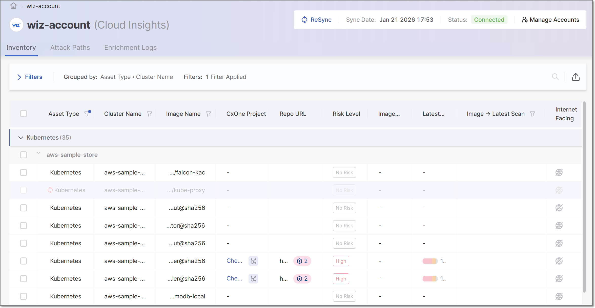<figcaption></figcaption></figure>

The Cloud Insights screen contains a **Header Bar** and three tabs:

- **Inventory**
- **Attack Paths**
- **Enrichment Logs**

#### Header Bar

<figure>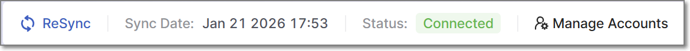<figcaption></figcaption></figure>

The header bar shows the name of the account for which data is being shown, as well as details about the status of that account. The following items are shown:

- **Sync Date** - indicates the last time that runtime data was imported from the CNAPP provider.
- **Status** - indicates the status of the integration. Once the data has been successfully imported (at least once) the status is shown as **Connected**. If the runtime data import has not yet completed successfully, the status is **Pending**.

  
  It may take a few hours for the import to complete. If after 24 hr the status is still **Pending**, you should ensure that all prerequisites are in place (see prerequisites for [Wiz](setting-up-cloud-insights-integration-with-wiz.md#prerequisites), [AWS](setting-up-cloud-insights-integration-with-aws.md#prerequisites) and [Other CNAPP Vendors](enrichment-workflow-for-other-cnapp-vendors.md#prerequisites)). For Wiz and AWS integrations, you can also click on the ReSync button to initiate a new enrichment process. If the issue is not resolved, please contact Checkmarx Support for assistance.
  
- **ReSync** button - Click on this button to manually initiate a new sync of the Cloud Insights data for this account. For Wiz and AWS accounts this initiates a new enrichment process, importing new data about the clusters in your system. For other integrations, this only reruns the project association process (e.g., taking into consideration new projects created in Checkmarx) without importing new data from the cloud provider.
- **Manage Accounts** - enables you to create a new account, or to select a different Cloud Insights account to display (as described below).

##### Switching Accounts

**To switch accounts:**

1. Click on **Manage Accounts**.

   A side panel opens, showing a list of Cloud Insight accounts that have been set up in your system.
2. Click on the account that you would like to show and then click on the **Select Account** button.

   <figure>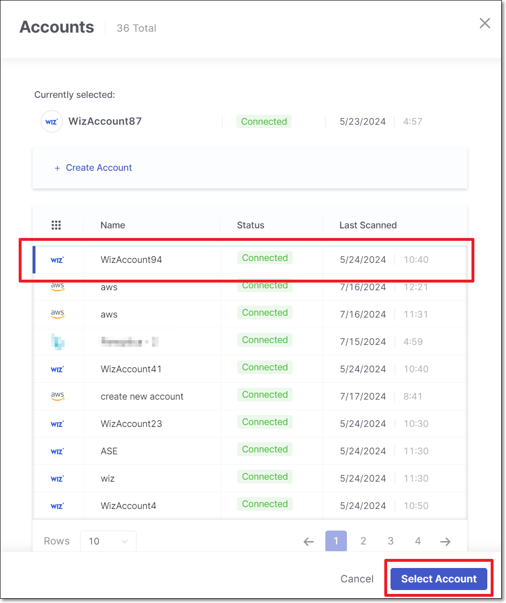<figcaption></figcaption></figure>

#### Inventory Tab

The Inventory tab shows a list of container images identified in the runtime environment, grouped by cluster name. The table shows the Checkmarx One Project that corresponds to each image (based on our matching algorithms) and the vulnerabilities identified in that Project. You can click on a project name to open the **overview** page for that project.

Cloud Insights also highlights changes in vulnerability counts between the image currently in production and the latest project scan. The **Image → Latest Scan** column in the Cloud Insights Inventory clearly shows the delta, helping teams identify risk increases before code is deployed.

There is a column indicating whether or not each image is Internet Facing (i.e., exposed to the public). You can easily identify the most urgent remediation activities by filtering to show only Internet Facing Projects.

Results can be grouped by Asset Type (Kubernetes, ECS or Other) and/or by cluster name.

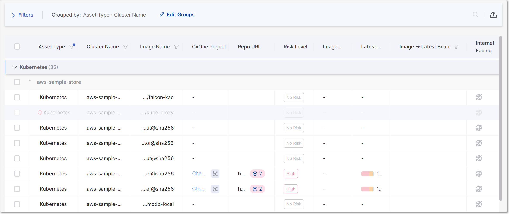

The following table describes the data shown on this page.

| **Item** | **Description** | **Possible Values** |
|---|---|---|
| **Selection Box** | Select multiple checkboxes to apply bulk actions to the selected items. Supported bulk action: Set internet facing. | |
| **Asset Type** | The type of container orchestration plaform. | Kubernetes, ECS or Other (for platforms that are not yet supported by Cloud Insights) |
| **Cluster Name** | The name of the cluster where the image is hosted. | e.g., demo-store |
| **Image Name** | The name of the image, as it appears in the container platform. | |
| **CxOne Project** | The name of the project in Checkmarx One that corresponds to this image. Also displays icons that provide information about the project. |  - hover over this icon to view the matching type that was used to pair the Checkmarx One project with the image.  - indicates that the project has a correlated scan. |
| **Repo URL** | The URL of the image. | e.g., https://github.com/CheckmarxIntegrations/WebGoat |
| **Risk Level** | The overall Risk Level of the Checkmarx One project. | Critical, High, Medium, Low, No Risk |
| **Image Scan Vulnerabilities** | Vulnerabilities detected in the container image currently deployed to production. | 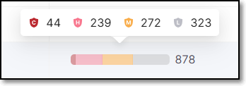 |
| **Latest Scan Vulnerabilities** | • Total vulnerabilities found across all scanners in the latest project scan. • Stacked bars (Critical, High, Medium, Low, Info) with the number of vulnerabilities per severity. Hover over the bar to show a breakdown of vulnerabilities by severity level. |  |
| **Image → Latest Scan** | Compares vulnerabilities in the production image with those identified in the latest project scan, helping to identify code that introduces new vulnerabilities before it reaches production. Highlights differences in vulnerability counts by severity. Can be filtered by increase or decrease per severity level. | |
| **Internet Facing** | Indicates whether or not the image is internet facing. | •  - Internet facing •  - Not internet facing |

##### Ignore Images

You can mark container images in the Cloud Insights inventory as **Ignored** to reduce noise from images that don’t require remediation. From the inventory table, select one or more images and choose Ignore to hide them from the main view. Ignored images remain accessible through the **Asset Status** filter, where you can review them and restore them to the inventory at any time. This helps keep your inventory focused and actionable while preserving full control and visibility.

###### Ignoring Images

The image inventory table is filtered by default to exclude ignored images.

<figure>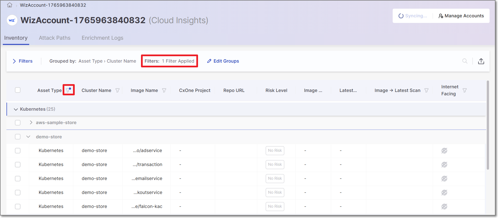<figcaption></figcaption></figure>

There are two methods of marking an image as ignored:

**Option A**

Click on the **actions menu** in the desired image row, click **Ignore/Unignore**, and select **Ignore**.

<figure>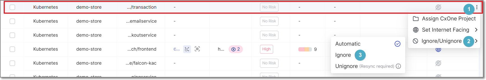<figcaption></figcaption></figure>

**Option B**

1. Select the checkbox of one or more images that you would like to ignore.
2. Click on the **Ignore Images** button and select **Ignore** from the dropdown list.

   <figure>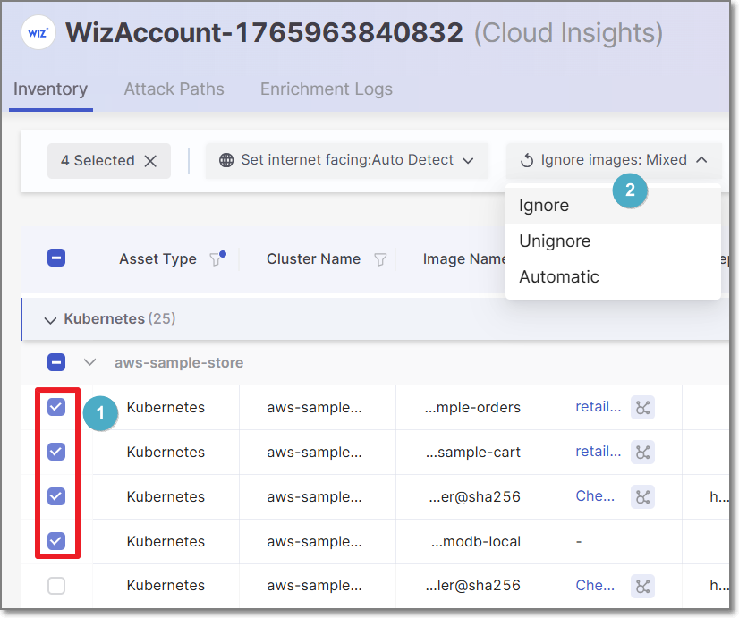<figcaption></figcaption></figure>

###### Viewing Ignored Images

To view ignored images, toggle the **Asset Status** filter to show ignored images.

1. Click on the filter icon next to the Asset Type column header.
2. Mark the checkbox next to **Ignored**.
3. Click **Apply**.

   <figure>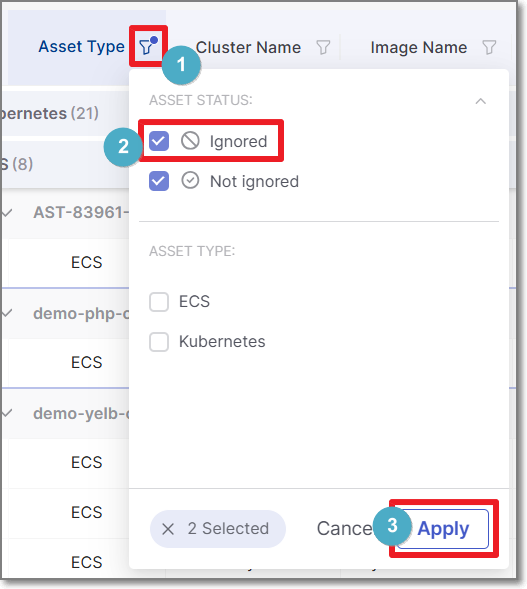<figcaption></figcaption></figure>

   The image inventory table will now display both ignored and unignored images. Ignored images appear as faded out.

###### Restoring Ignored Images

Once you have set the filter to show Ignored images, you can restore them in one of two ways:

**Option A**

<figure>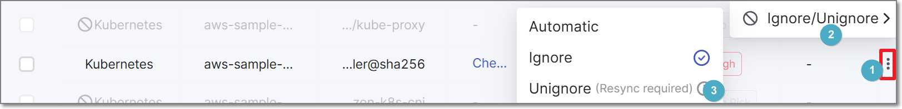<figcaption></figcaption></figure>

Click on the **actions menu** in the desired image row, click **Ignore/Unignore**, and select **Unignore**.


A **re-sync** is required to complete the process.


**Option B**

1. Select the checkbox of one or more images that you would like to restore.
2. Click on the **Ignore Images** button and select **Unignore** from the dropdown list.

   <figure>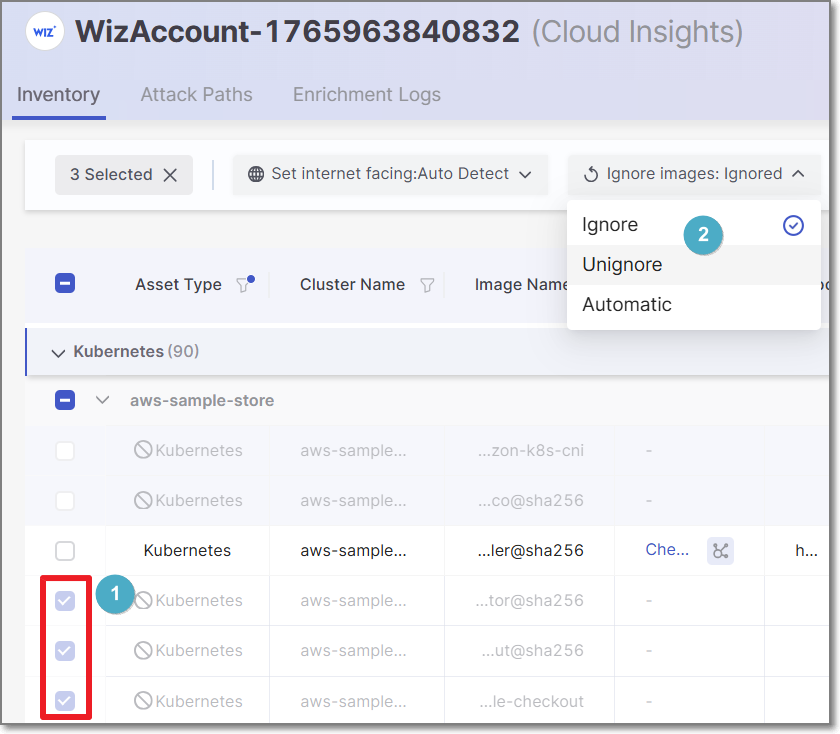<figcaption></figcaption></figure>

   
   A **re-sync** is required to complete the process.
   

##### Private Packages

If a Checkmarx One project that is correlated to a Cloud Insight image includes private packages, then an icon indicating the number of private packages is shown in the Repo URL column. You can click on the icon to view additional info about the private packages.

<figure>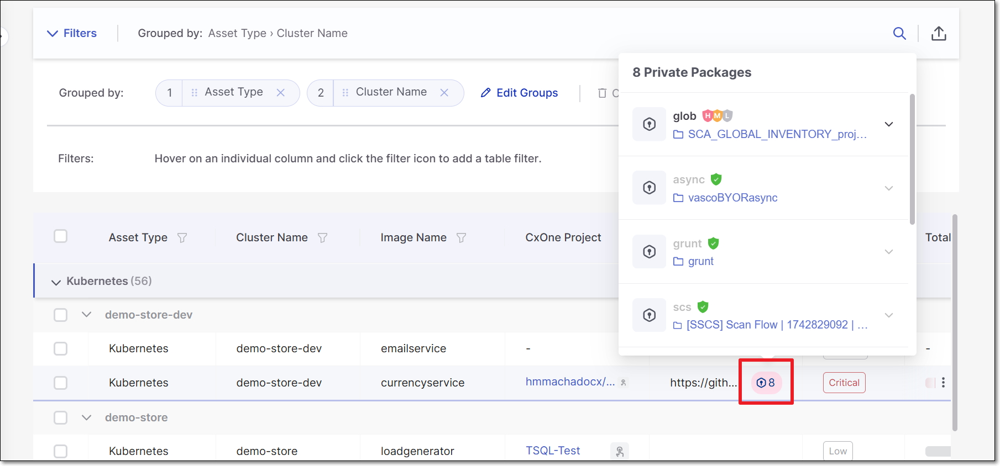<figcaption></figcaption></figure>

If Cloud Insights identifies a correlation (based on the name) to a project that was scanned in Checkmarx One, then information about the risks identified in the scan is shown. There is also a link to open the results viewer for each of the Checkmarx One scanners.

<figure>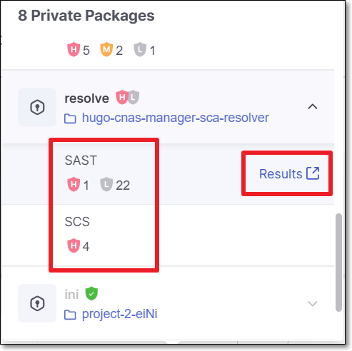<figcaption></figcaption></figure>

Private packages and the associated risks are also shown in the **Attack Path** visualization tab.

###### Manually Correlating Private Packages

It is possible to manually specify which Checkmarx One project correlates to a Private Package used in your project. This can be done for private packages for which no correlated project was identified as well as to override the automatic correlation designated by Checkmarx.

If no automatic correlation was identified, you can click on the **Assign Manually** button to select the corresponding project.

<figure>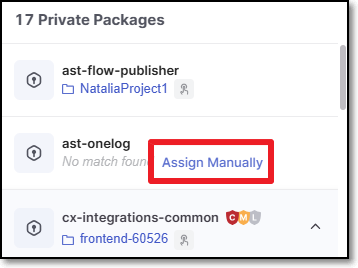<figcaption></figcaption></figure>

If a correlation has already been made, either manually or automatically, and you want to override the correlation, hover over the package and click on the **Edit** button to select the corresponding project that you would like to assign.

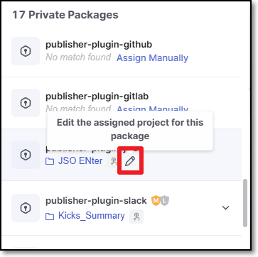

##### Manually Assigning Projects

You can manually assign a Checkmarx One Project to an image that was identified by Cloud Insights. This can be done in cases where the system didn't automatically identify a corresponding Project. You can also replace the automatically correlated Project with a different Project that you determine to correspond more precisely.

**To Manually Assign a Project:**

1. Hover on the row of the relevant image and click on the icon.
2. Then, select **Assign to a project**.

   A side panel opens showing the list of Checkmarx One Projects in your account.
3. Select the desired Project.
4. Click on the **Assign Project** button.

   When a Project has been assigned manually, a special icon is shown in the row of that image in the Inventory table.

   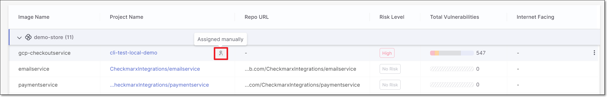

##### Manually Setting the "Internet Facing" Parameter

If you determine that the automatic designation of an image as Internet Facing or Not Internet Facing is inaccurate, you can manually override this determination.

This can also be done as a bulk action by selecting the checkbox next to each of the relevant images and then choosing the desired option in the top bar.

**To manually adjust the "Internet Facing" parameter:**

1. Hover on the row of the relevant image and click on the icon.
2. Then, select **Set Internet Facing**.

   A drop-down menu opens showing the options: Facing, Not Facing or Auto Detect.

   - **Facing** - manually set as Internet Facing.
   - **Not Facing** - manually set as Not Internet Facing.
   - **Auto Detect** - allow the system to determine whether or not it is internet facing, using proprietary algorithms.
3. Select the desired option.

   When a manual determination has been set, a special icon is shown in the row of that image in the Inventory table.

   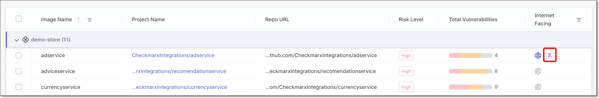

#### Attack Paths Tab

The **Attack Paths** tab shows a list of public-facing images and a visualization of the path by which they are accessible from the internet. This screen has a left-side panel that shows the list of public-facing clusters and a main visualization pane that shows nodes representing the clusters. The red number in each node indicates the number public-facing images in that cluster.

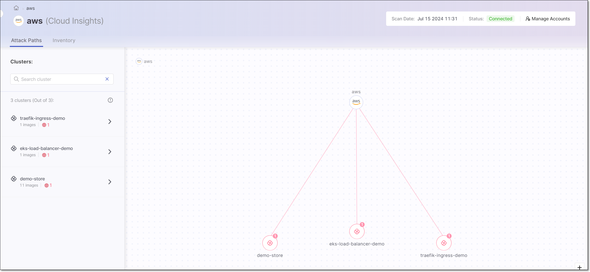

You can drill down to see additional details about a specific cluster and its internet facing images. This can be done by clicking either on the cluster list in the left-side panel or on the node of that cluster in the visualization. You can also search for a cluster by name.

In the drill-down display, the left-side panel shows a list of internet facing images and details about the vulnerabilities identified in the latest scan of the corresponding Checkmarx One Projects, broken down by scanner type. The main pane shows the full path from the internet, through the cluster and pod, to the source code repo of a specific container image, and the related vulnerabilities. Select an image in the left-side pane to show the visualization for that image.

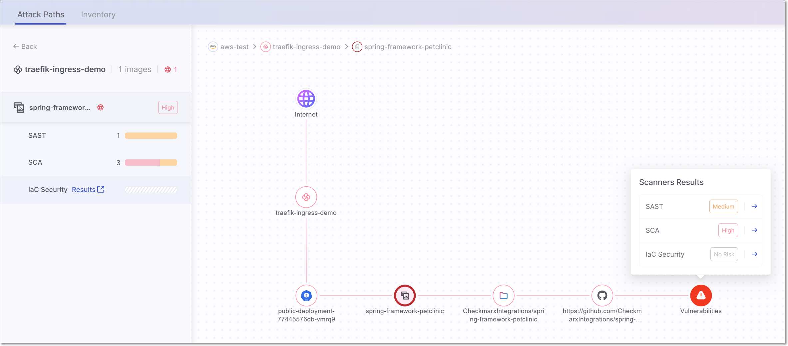

You can drill down further to see the actual Checkmarx One scan results for the corresponding Project, either by clicking on **Open SAST results** in the visualization or by hovering over the result in the left-side panel and clicking on **Results**.

If an image contains private packages, then a node is shown representing the private packages. Click on the node to see each of the private packages. Click on a package to see the risks associated with that package.

<figure>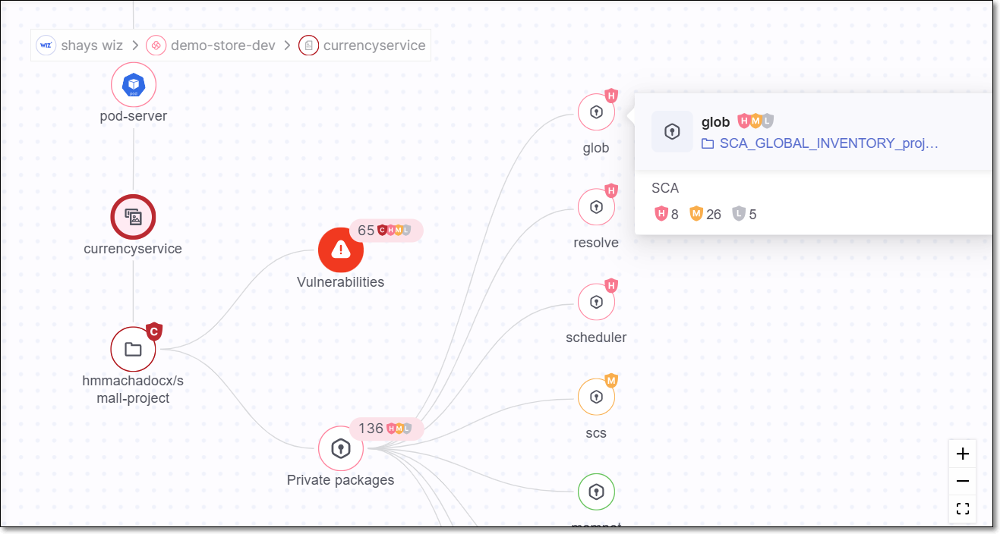<figcaption></figcaption></figure>

#### Enrichment Logs Tab

The Enrichment Logs tab show detailed information about all Cloud Insights enrichment events.

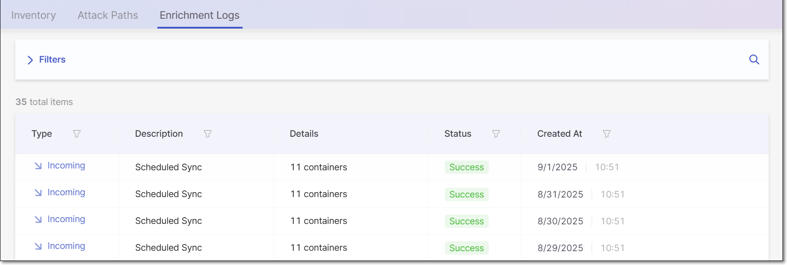

You can apply filters to the data and sort by the column headers.

The following table describes the data shown on this page.

| Item | Descriptions | Possible Values |
|---|---|---|
| Type | The type of enrichment event. | • Incoming - data was imported from your CNAPP account • Outgoing - data was sent from Checkmarx to your CNAPP account (currently supported for Wiz) |
| Description | The method by which the scan was triggered. | • Scheduled Sync - sync triggered based a pre-configured schedule. • Sync - a manually triggered sync. |
| Details | The number of items that were synced. | e.g., 11 containers |
| Status | The status of the action. | • Success • Failed |
| Created At | The date and time that the event finished. | e.g., 8/28/2925 10:51 |

## Viewing Checkmarx SAST Results in Wiz

If you have a Cloud Insights Wiz integration and a [Code Security](https://www.wiz.io/solutions/wiz-for-code-security) license for Wiz, then SAST vulnerabilities identified in Checkmarx One scans are automatically sent to your Wiz to enrich the data shown in the **Vulnerability Findings**. The data is assigned to the relevant repo based on the correlation made by Cloud Insights between your repos and Checkmarx Projects.

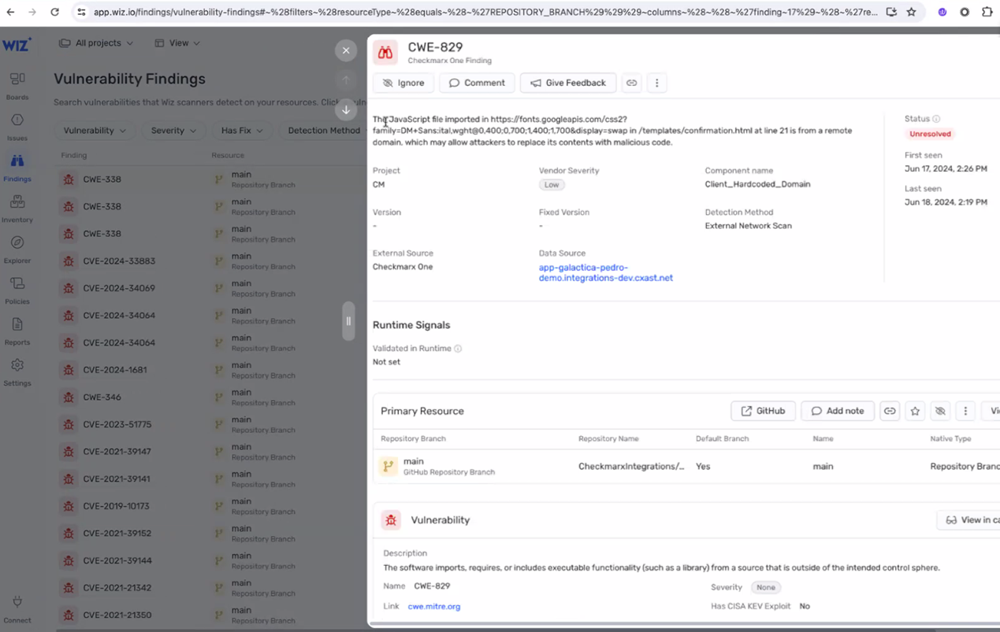

## In this section

- [Setting up Cloud Insights Integration with Wiz](setting-up-cloud-insights-integration-with-wiz.md)
- [Setting up Cloud Insights Integration with CrowdStrike](setting-up-cloud-insights-integration-with-crowdstrike.md)
- [Setting up Cloud Insights Integration with AWS](setting-up-cloud-insights-integration-with-aws.md)
- [Setting up Cloud Insights Integration with Sysdig](setting-up-cloud-insights-integration-with-sysdig.md)
- [Setting up Cloud Insights Integration with Uptycs](setting-up-cloud-insights-integration-with-uptycs.md)
- [Enrichment Workflow for Other CNAPP Vendors](enrichment-workflow-for-other-cnapp-vendors.md)
- [Cloud Insights FAQ](cloud-insights-faq.md)
