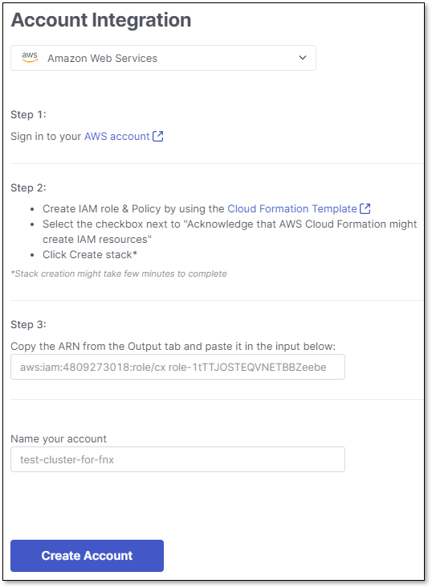
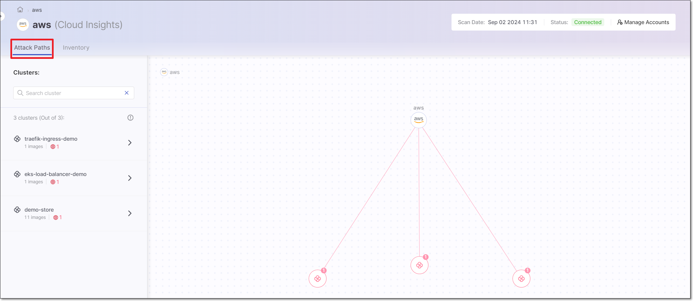
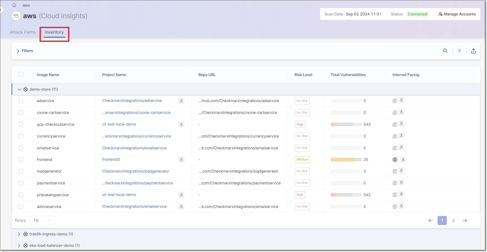

# Setting up Cloud Insights Integration with AWS

## Overview

Integrating with an AWS account allows organizations without a CNAPP solution to leverage Checkmarx's advanced security capabilities by combining it with runtime context from AWS EKS.

To integrate with an AWS account, customers provide their IAM role, which can read clusters and other metadata from AWS EKS. Using the K8S API, Cloud Insights receives a list of images under each connected cluster. Once the list is received, Cloud Insights leverages the [AWS Network Analyzer](https://docs.aws.amazon.com/vpc/latest/network-access-analyzer/what-is-network-access-analyzer.html) to add a public exposure flag to all relevant mapped container images. This is done by analyzing Pod ports, LoadBalancer and NodePort services and Ingress Controller to determine which container images are publicly exposed.

This enables Checkmarx One to identify which resources are publicly exposed and adjust the risk level accordingly for better prioritization.

### Prerequisites

- A Checkmarx One account with **Essential**, **Professional** or **Enterprise** license.
- An AWS account using EKS clusters
- [AWS Network Analyzer](https://docs.aws.amazon.com/vpc/latest/network-access-analyzer/what-is-network-access-analyzer.html) must be enabled for your AWS account


AWS [terms of use](https://aws.amazon.com/vpc/pricing/) apply


### Integration Procedure

The Cloud Insights integration flow differs between the initial integration and subsequent ones.

- In the initial integration, users use the **Integrate Cloud Account** button on the Welcome screen. In subsequent integrations, users use the **Manage Accounts > Create Account** option.
- In the initial integration users are prompted with the cluster findings summary at the end of the discovery stage. In subsequent integrations the summary is not presented.

**To integrate with AWS, proceed as follows:**

1. Go to ASPM > **Cloud Insights**.
2. To create the first account, click on the **Integrate Cloud Account** button on the Cloud Insights welcome screen. To add additional accounts click on **Manage Accounts** at the top right and then click **Create Account** in the side panel.
3. In the Account Integration dropdown, select **Amazon Web Services**.
4. Follow the steps shown in the dialog, as follows:

   <figure><figcaption></figcaption></figure>

   1. Follow the link in **Step 1** to log in to your account.
   2. Follow the link in **Step 2** to create an IAM role & Policy, using the procedure described in Step 2.
   3. Copy the role ARN from the output tab and paste it into the box in **Step 3**.
5. In the **Name your account** field, specify a name for this Cloud Insights account in Checkmarx.
6. Click on **Create Account**.

   Cloud Insights will start discovering the cluster findings.
7. Once the discovery finishes, the internet-facing clusters are displayed in the **Attack Paths** screen and **Inventory** table.

   <figure><figcaption></figcaption></figure>

   <figure><figcaption></figcaption></figure>
