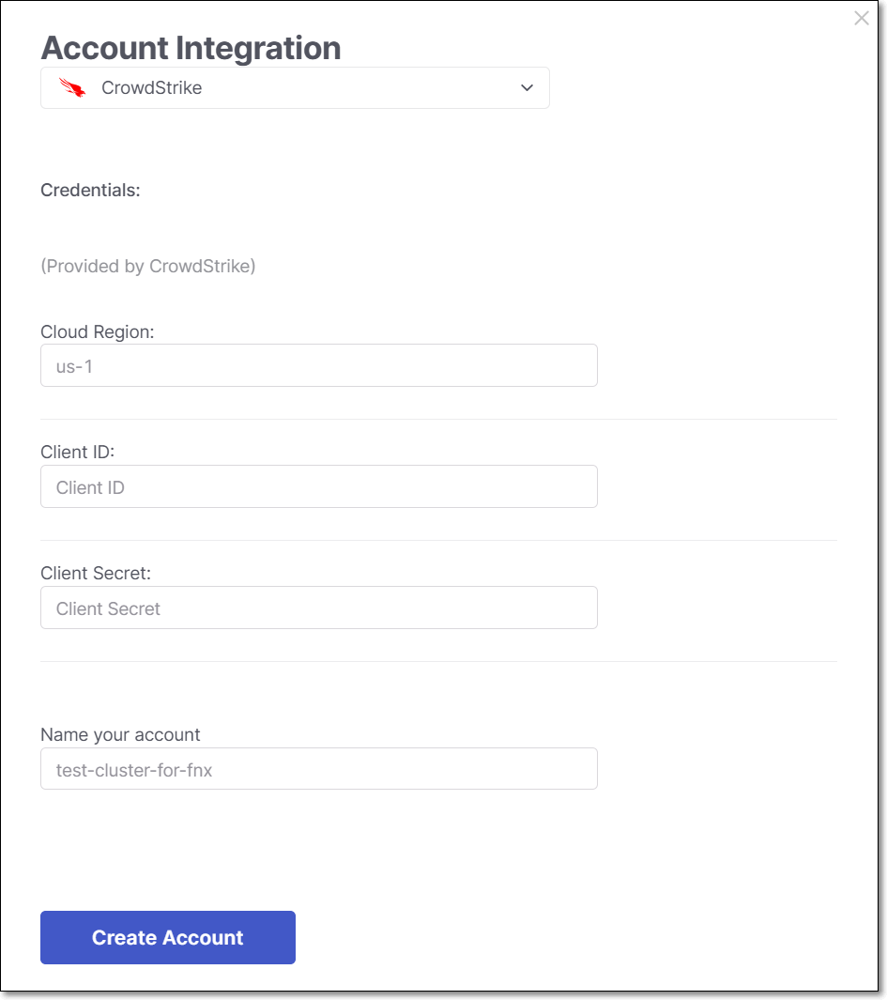
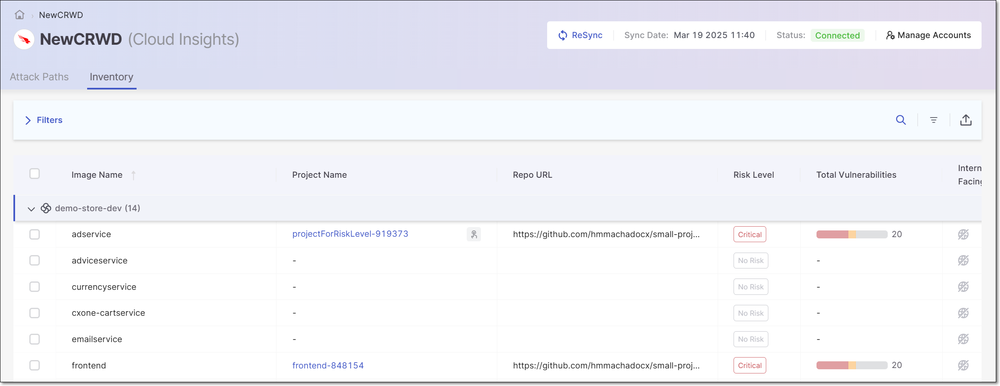

# Setting up Cloud Insights Integration with CrowdStrike

## Overview

Checkmarx One integrates with CrowdStrike by establishing a secure connection with CrowdStrikes API endpoints. Cloud Insights sends API requests to CrowdStrike’s endpoints for inventory and runtime-related data, such as clusters, pods and containers. CrowdStrike’s API processes these queries, executing them against its data sources, and returns the results to Checkmarx One.


Currently, this integration only provides data about whether or not an image is deployed ("Runtime"), but not about public exposure ("Internet Facing"). This information can be added manually in the “Inventory” table.


### Prerequisites

- A Checkmarx One account with **Essential**, **Professional** or **Enterprise** license.
- CrowdStrike account with the relevant license (contact CrowdStrike for more information).
- Kubernetes clusters must be registered on CrowdStrike, as explained [here](https://falcon.us-2.crowdstrike.com/documentation/page/a0afb5fa/register-a-kubernetes-cluster-1#s58dbed7).
- A CrowdStrike **Client ID** and **Client Secret** for this integration.
- You will need to provide the **Cloud region** of your CrowdStrike environment (for example, “US-1”. For more details see [here](https://falcon.us-2.crowdstrike.com/documentation/page/a2a7fc0e/crowdstrike-oauth2-based-apis#k9578c40)).
- If you use whitelisting on your CrowdStrike instance, then you need to add the Checkmarx One outbound IPs to your whitelist.

  - For multi-tenant accounts, see [Whitelisting IPs for Checkmarx One's outgoing traffic](../../integrations/managing-checkmarx-one-traffic-and-aws-s3-access.md).
  - For single-tenant accounts, please contact your CSM or account manager to get the list of IPs for your specific instance.

## Integration Procedure

The Cloud Insights integration flow differs between the initial integration and subsequent ones.

- In the initial integration, users use the **Integrate Cloud Account** button on the Welcome screen. In subsequent integrations, users use the **Manage Accounts > Create Account** option.
- In the initial integration the cluster findings summary is shown at the end of the discovery stage. In subsequent integrations the summary is not shown.

**To integrate with CrowdStrike:**

1. Go to ASPM > **Cloud Insights**.
2. To create the first account, click on the **Integrate Cloud Account** button on the Cloud Insights welcome screen. To add additional accounts click on **Manage Accounts** at the top right and then click **Create Account** in the side panel.
3. In the **Account Integration** dropdown, select **CrowdStrike**.

   The CrowdStrike integration form opens.

   <figure><figcaption></figcaption></figure>
4. Configure the following fields using the data gathered in the [Prerequisites](#prerequisites) above:

   - CrowdStrike **Cloud Region**
   - CrowdStrike **Client ID**
   - CrowdStrike **Client Secret**
5. In the **Name your account** field, enter a name for this integration.
6. Click on **Create Account**.

   Cloud Insights will start discovering the cluster findings. Once the discovery finishes, the Cloud Insights **Inventory** tab opens, showing the data identified by the integration.

   

### Next Steps

- To learn about viewing results from this integration, see [Viewing Cloud Insights Results](README.md#viewing-cloud-insights-results-in-checkmarx-one).
- This integration does not automatically detect internet-facing images. You can add this information manually using the procedure described in Manually Setting the Internet-Facing Parameter.
- Check the automatic mapping of images to your Checkmarx One projects. You can change the mapping, or map additional projects, using the procedure described in Manually Assigning Projects.
