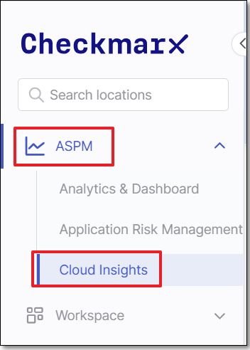
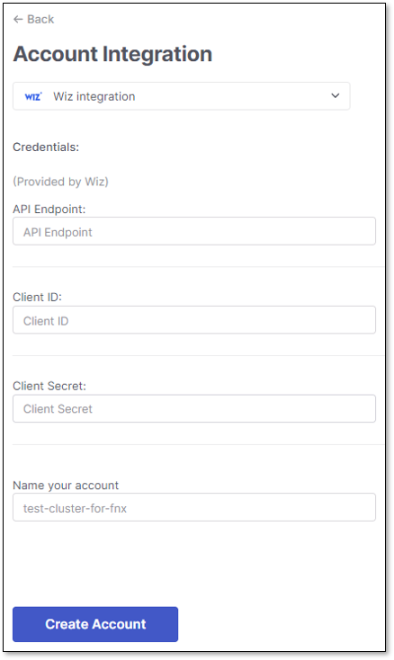
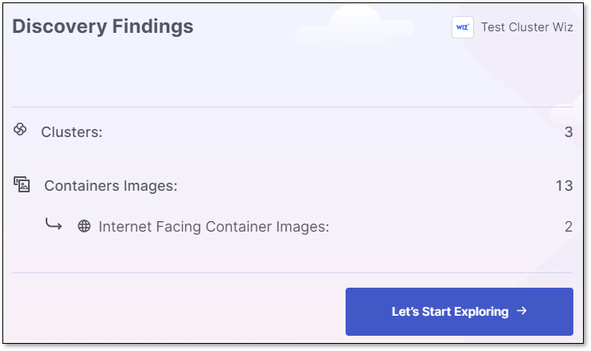
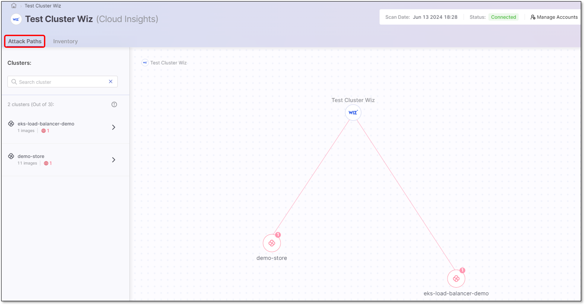
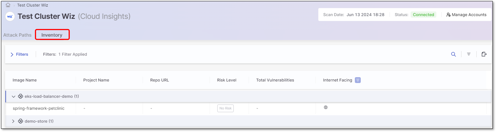

# Setting up Cloud Insights Integration with Wiz

## Overview

Checkmarx One integrates with Wiz by establishing a secure connection with Wiz’s API endpoints. Cloud Insights sends API requests to Wiz’s GraphQL endpoints for inventory and runtime-related data, such as clusters, pods, containers, and network exposures. Wiz’s API processes these queries, executing them against its data sources, and returns the results to Checkmarx One.

In addition, if your account has an enrichment integration, it is possible to view SAST vulnerabilities that were identified by Checkmarx in the correlated repos in your CNAPP platform. For Wiz users with a [Code Security](https://www.wiz.io/solutions/wiz-for-code-security) license, this integration takes effect automatically when you create a Wiz Cloud Insights account.

### Prerequisites

- A Checkmarx One account with **Essential**, **Professional** or **Enterprise** license.
- Wiz account with the relevant license (contact Wiz for more information)
- “Wiz Kubernetes connector” must be installed (follow instructions provided [here](https://docs.wiz.io/wiz-docs/docs/k8s-dep-overview))
- A Wiz **Client ID** and **Client Secret** for this integration
- You will need to provide the **API endpoint URL** for your Wiz environment (format: `https://api<AWS region of your tenant>.app.wiz.io/graphql`)
- If you use whitelisting on your Wiz instance, then you need to add the Checkmarx One outbound IPs to your whitelist.

  - For multi-tenant accounts, the relevant IPs are listed [here](https://docs.checkmarx.com/en/34965-68616-managing-checkmarx-one-traffic-and-aws-s3-access.html#UUID-04890a5f-9d47-e0ed-6b84-8fb8595bb2df_section-idm234479751386149)
  - Fo single-tenant accounts, please contact your CSM or account manager to get the list of IPs for your specific instance.
- In order to view data from Checkmarx One scans in Wiz, you need the following:

  - Wiz account with the relevant license (contact Wiz for more information)
  - Your SCM needs to be connected to Checkmarx One. This is done by creating a cloud repository integration Project, as described [here](../managing-projects/creating-projects.md#code-repository-integration-projects).

### Integration Procedure

The Cloud Insights integration flow differs between the initial integration and subsequent ones.

- In the initial integration, users use the **Integrate Cloud Account** button on the Welcome screen. In subsequent integrations, users use the **Manage Accounts > Create Account** option.
- In the initial integration the cluster findings summary is shown at the end of the discovery stage. In subsequent integrations the summary is not shown.

**To integrate with Wiz:**

1. Go to **ASPM** > **Cloud Insights**.

   <figure><figcaption></figcaption></figure>
2. To create the first account, click on the **Integrate Cloud Account** button on the Cloud Insights welcome screen. To add additional accounts click on **Manage Accounts** at the top right and then click **Create Account** in the side panel.
3. In the Account Integration dropdown, select **Wiz**.
4. Configure the following:

   - Wiz **API Endpoint**
   - Wiz **Client ID**
   - Wiz **Client Secret**
   - Name the account

     <figure><figcaption></figcaption></figure>
5. Click on **Create Account**.

   Cloud Insights will start discovering the cluster findings.
6. Once the discovery finishes, the findings are displayed.

   Click on **Let's Start Exploring**

   <figure><figcaption></figcaption></figure>
7. The internet-facing clusters are displayed in the **Attack Paths** screen and **Inventory** table.

   <figure><figcaption></figcaption></figure>

   <figure><figcaption></figcaption></figure>

## Viewing Checkmarx SAST Results in Wiz

If you have a Cloud Insights Wiz integration with the relevant Wiz license, then SAST vulnerabilities identified in Checkmarx One scans are automatically sent to Wiz to enrich the data shown in the **Vulnerability Findings**. The data is assigned to the relevant repo based on the correlation made by Cloud Insights between your repos and Checkmarx Projects.


Due to a [limitation](https://win.wiz.io/docs/limitations#external-enrichment-limitations) of how Wiz handles external enrichment data, you need to run a new SAST scan on your Checkmarx project once a week in order to maintain the data displayed in Wiz.


