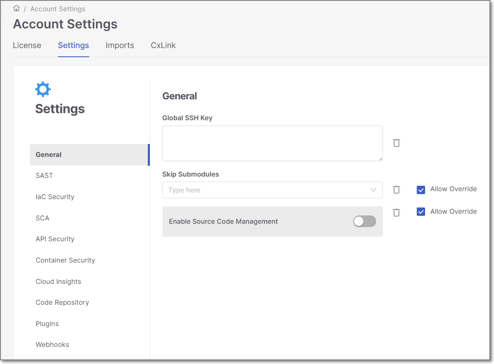

# Global Account Settings

**Global Account Settings** allow you to configure parameters at the tenant level. These parameters will apply to *all* applications, projects, and scans in those projects (unless Override is allowed and a different configuration is set on the application, project or scan level).

To open the tenant settings, in the main menu select **Settings > Global Settings**.

The **Account Settings** page is displayed.

<figure><figcaption></figcaption></figure>

## In this section

- [General Settings](general-settings.md)
- [AI Assist Settings](ai-assist-settings.md)
- [Settings for Specific Scanners](settings-for-specific-scanners.md)
- [SAST Scanner Parameters](sast-scanner-parameters.md)
- [IaC Security Scanner Parameters](iac-security-scanner-parameters.md)
- [SCA Scanner Parameters](sca-scanner-parameters.md)
- [API Security Scanner Parameters](api-security-scanner-parameters.md)
- [Container Security Scanner Parameters](container-security-scanner-parameters.md)
- [Secret Detection Settings](secret-detection-settings.md)
- [DAST Configurations](dast-configurations.md)
- [Cloud Insights Settings](cloud-insights-settings.md)
- [AI Capabilities](ai-capabilities.md)
- [Code Repository Settings](code-repository-settings.md)
- [Plugins Settings](plugins-settings.md)
- [Adding Custom States via the UI](adding-custom-states-via-the-ui.md)
- [Domain Management](domain-management.md)
