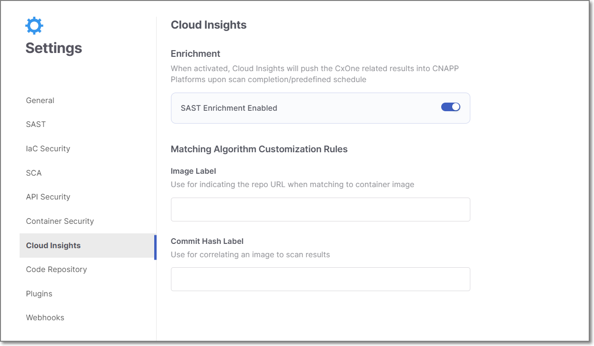
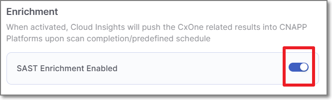
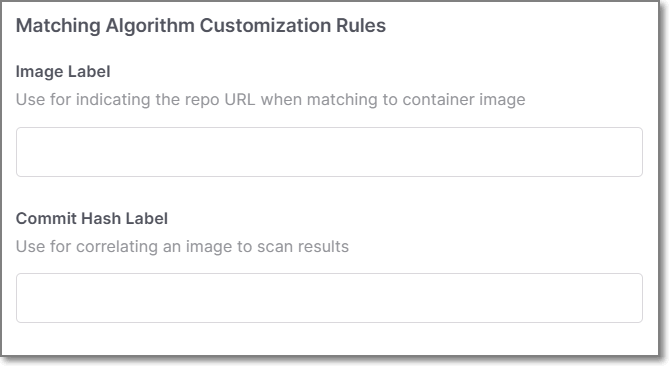

# Cloud Insights Settings

The Cloud Insights Settings screen enables you to adjust the settings of your Cloud Insights Enrichment integrations. The screen has two sections, **Enrichment** and **Matching Algorithm Customization Rules**.

<figure><figcaption></figcaption></figure>


Changes to this screen — including the Image Label and Commit Hash Label fields — take effect only after clicking **Save**.


## Enrichment

In this section, you can enable Cloud Insights to automatically push Checkmarx One related results into CNAPP Platforms.

**To enable/disable Cloud Insights Enrichment**

Adjust the toggle for SAST enrichment as desired.

<figure><figcaption></figcaption></figure>

## Matching Algorithm Customization Rules

This section contains two fields: **Image Label** and **Commit Hash Label.** Use these fields to customize the label keys that Cloud Insights applies when matching your source code with your CxOne projects. You can enter multiple label keys as a comma-separated list.

<figure><figcaption></figcaption></figure>

**Image Label**

In the **Image Label** field, configure the label key that identifies the repository URL in your container image.

- **Default Behavior:** Cloud Insights uses the Open Container Initiative (OCI) label key: `org.opencontainers.image.source`

**Commit Hash Label**

In the **Commit Hash Label** field, configure the label key that identifies the commit hash in your container image.

- **Default Behavior:** Cloud Insights uses the OCI label key: `org.opencontainers.image.revision`


**Custom vs. Default Matching**

When you configure custom label keys, Cloud Insights uses them first. If no match is found, it automatically falls back to the default label keys.

You do not need to enter the standard label keys manually.

