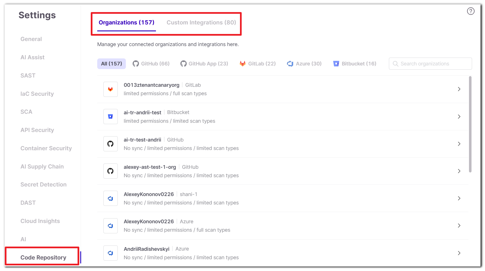
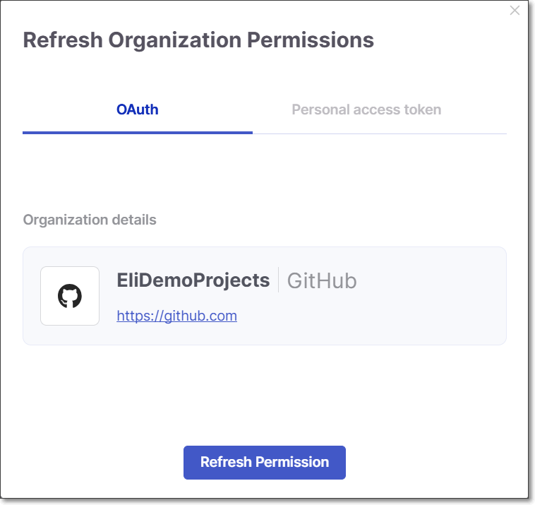
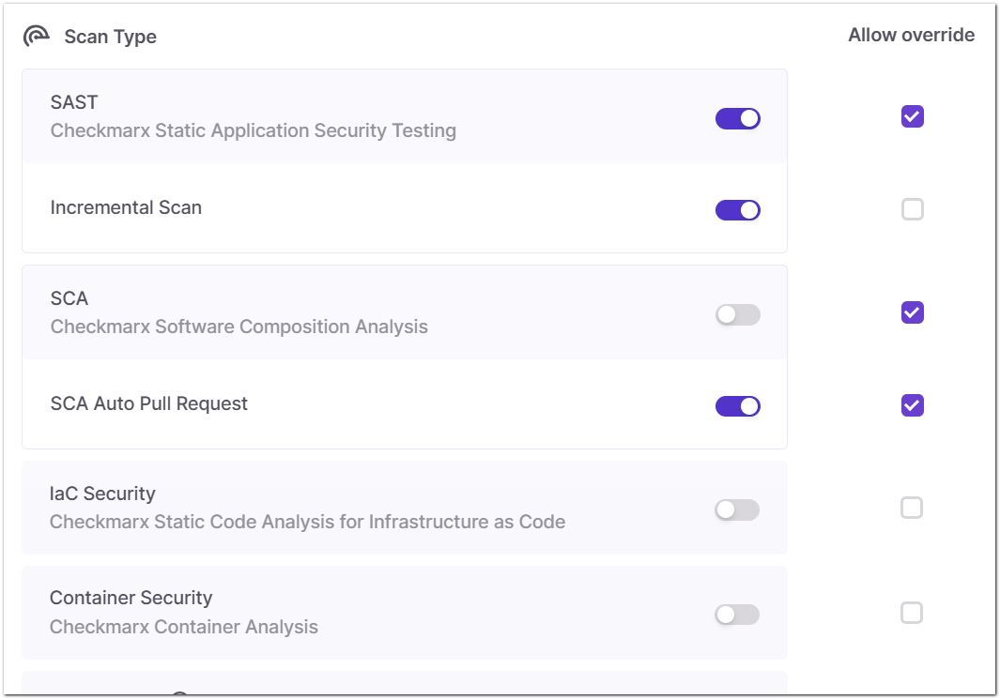
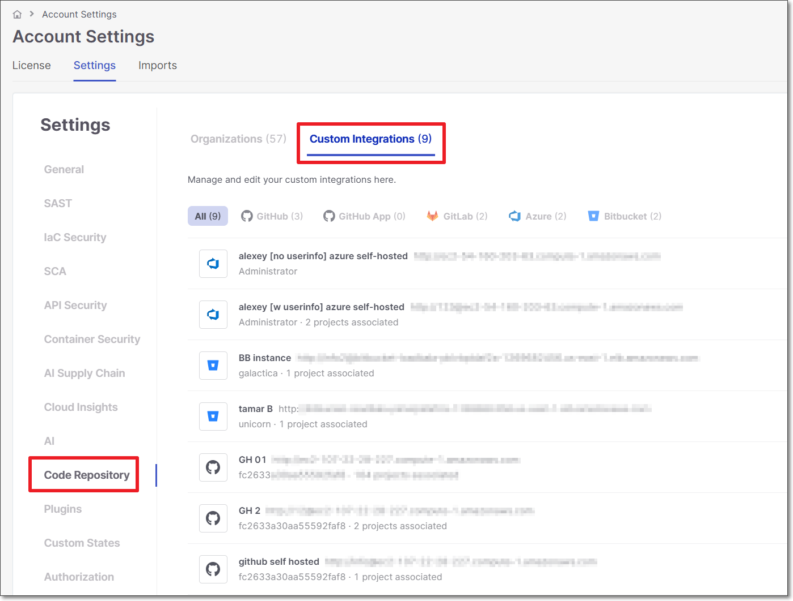
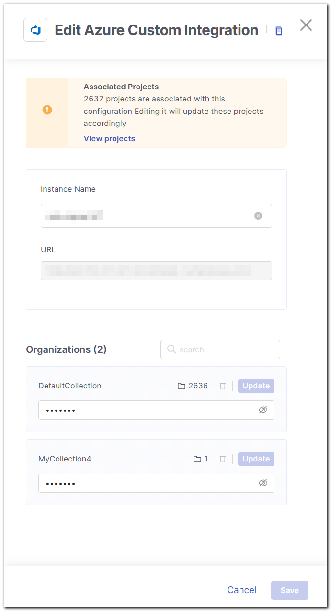

# Code Repository Settings

The Code Repository Settings screen lets you manage how Checkmarx One integrates with your connected code repositories — controlling which organizations and repos are synced, what permissions are granted, and which scan types run automatically when code changes.

This screen has two tabs, **Organizations** (default) and **Custom Integrations**.

- **Organizations** (default) - configure integration settings for SCM (Source Control Management) organizations connected to Checkmarx One, at the organization level.
- **Custom Integrations** - manage custom code repository integration instances.

Each tab label displays a live count of connected items (e.g., Organizations (157), Custom Integrations (80)), so you can see integration volume at a glance.

## Organizations

<figure><figcaption></figcaption></figure>

The **Organizations** tab lists all SCM organizations connected to Checkmarx One, regardless of whether the integration was set up via managed or custom flow. You can filter this list by SCM type: GitHub, GitHub App, GitLab, Azure, and Bitbucket.

Each organization in the list shows a summary of its current sync status, permissions, and scan type settings, so you can see its configuration at a glance without opening the settings panel.

You can update the list of connected organizations by clicking **Refresh Organization Data.** This action also cleans up the list: any imported organization that has no active Checkmarx One project *and* doesn't have Monitor New Repositories enabled will be removed from the integration.

To configure an organization's settings, click it to open its **Organization Settings Panel**.


Only users with `update-tenant-params` permission can edit and delete repo configurations.


### Organization Settings Panel

<figure><figcaption></figcaption></figure>

When you click on an organization, its settings panel opens, divided into three sections: **Auto Sync**, **Permissions**, and **Scan Type**. After making changes in any section, click **Save** to apply them.

Each setting in the Permissions and Scan Type sections can also be locked or left open for override at the project level — see [Allow or Block Override](#allow-or-block-override) below.

#### Auto Sync


Available for GitHub, GitHub Apps, and Azure DevOps.


**Auto Sync** provides the **Monitor New Repositories** functionality for an organization. It contains a single toggle: **Automatically sync new projects created for this organization**.

When enabled, Checkmarx monitors your SCM for new repositories. Any new repo is automatically onboarded as a Code Repository Integration project within that organization in Checkmarx One, inheriting its settings from the organization-level configuration.

#### Permissions

Toggle the permissions you want to adjust, then click **Save**.

- **Add Git commit ID to scan tags** - Automatically creates scan tags based on the commit id that triggered the current scan.
- **Pull Request Decoration** - Automatically sends the scan results summary to the SCM. (Default: On)
- **AI Triage & Remediation** - Enables AI Triage and AI Remediation for the projects associated with this organization. During pull request scans, eligible new vulnerabilities are automatically analyzed, and developers can request AI-generated fixes directly from the pull request. When enabled, an *Applies to severities* dropdown becomes available, letting you scope AI Triage & Remediation to only the vulnerability severities you select (e.g., Critical and High).

##### Updating Organization Permissions

You can submit new credentials to be used for the integration with this organization. This updates the credentials used for the entire organization, including repositories that have already been imported. The set of permissions associated with the new credentials will be applied to the organization.

You can update the credentials by signing in via OAuth login or by providing a Personal Access Token (PAT). For Bitbucket or Azure DevOps organizations configured using Custom Setup, only PAT is available.


The following are some common usecases:

- A user account was deactivated
- A PAT expired
- Activate features such as PR Decoration that require admin permissions
- Grant access to additional repos that aren't available to the current credentials


**To update the credentials:**

1. Click **Refresh Organization Permissions**.

   The **Refresh Organization Permissions** dialog opens:

   <figure><figcaption></figcaption></figure>
2. For OAuth:

   1. Verify that **OAuth** is selected (default).
   2. Click **Refresh Permission**.
   3. Follow the prompts to authenticate with the account that you want to use for this integration.

      
      The signed-in user must have admin privileges on the source control organization — this is required regardless of the reason for the update.
      
3. For Personal access token:

   1. Select Personal access token.
   2. In the text box at the bottom, submit the PAT that you want to use for this integration.

      
      The PAT must have admin privileges on the source control organization — this is required regardless of the reason for the update.
      
   3. Click **Refresh Permission**.

#### Scan Type

Toggle the scanners that will run for this organization's automatic scans, then click **Save**. Options are **SAST, SCA, IaC Security, Container Security, API Security, OSSF Scorecard, Secret Detection**.

<figure><figcaption></figcaption></figure>

In addition, in this section you can configure the following:

- SAST **Incremental Scan** - Configure SAST scans to run as Incremental scans. (Default: Off) For additional info, see [Incremental Scans](../../scanning-projects/README.md#incremental-scans).
- **SCA Auto Pull Request** - Automatically send PRs to your SCM with recommended changes in the manifest file, in order to replace the vulnerable package versions. (Default: Off)

### Allow or Block Override

When a new organization is created, the settings configured at that time are applied to the organization entity in Checkmarx. By default, every setting allows override at the project level.

In the Permissions and Scan Type sections, each setting has an **Allow Override** checkbox. Deselecting it prevents that setting from being overridden at the project level.

The following table describes how editing organizations settings affects child projects:

| | Existing Projects | New Projects (Auto Sync) | New Projects (New Project flow / Migration) |
|---|---|---|---|
| **Allow Override enabled** | Keep their original configuration | Inherit the edited organization settings | Organization settings shown by default, but adjustable by the user |
| **Allow Override disabled** | Inherit the edited organization settings | Inherit the edited organization settings | Inherit organization settings; controls are greyed out and can't be adjusted |


If Allow Override is disabled for a setting and later re-enabled, existing projects revert to their original setting (the one they had before the edit).



Preventing overrides only applies to automatically triggered scans (e.g., pull request scans). If you manually trigger a scan of a project — via UI, CLI, or API — you have complete autonomy to override these settings for that particular scan.


## Custom Integrations

This tab lists the custom code repository integrations in your Checkmarx One account. You can edit the configuration of custom code repository instances or delete existing ones.

These settings apply only to the code repository integration itself. Scan settings for organizations associated with the integration are configured separately, in the Organizations tab under the relevant organization's settings.


Only users with `update-tenant-params` permission can edit and delete repo configurations.


### Editing a Custom Configuration

1. Hover over the actions menu at the end of the row for the configurationyou want to edit and select **Edit**.

   A side panel opens showing the current configuration.

   <figure><figcaption></figcaption></figure>
2. Adjust the values as needed.
3. Click **Save**.

   The new configuration is applied.

   
   If there are existing Checkmarx One Projects associated with this configuration, a warning note explains that changing the configuration will affect those Projects. Click on the **View projects** link to view the list of associated Projects.
   

### Deleting a Custom Configuration

1. Hover over the actions menu at the end of the row of the desired configuration and select **Delete**.
2. In the confirmation dialog, click **Delete Configuration**.
