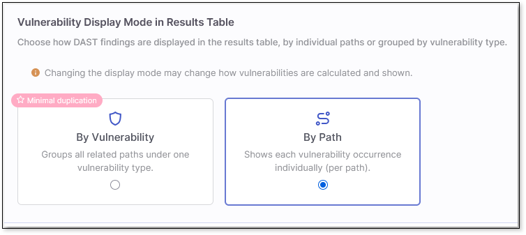
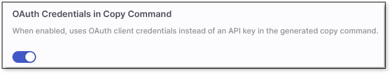

# DAST Configurations

The following table shows the account-level configuration options available for the DAST scanner, found under **Account Settings** > **Settings** > **DAST**.

## Vulnerability Display Mode in Results Table

This setting controls how DAST findings are displayed in the results table: grouped by vulnerability type or by individual paths . See Alerts and Paths for more information.

## OAuth Credentials in Copy Command

This setting is available only to admins and is off by default. When enabled, it changes the generated copy commands - scan trigger commands, CI/CD setup commands, and CxLink tunnel commands - so that they use OAuth **Client ID** and **Client Secret** placeholders instead of embedding the literal API key.

When enabled, a copied command shows CLIENT_ID and CLIENT_SECRET placeholders, and you supply your own OAuth client credentials before running it. With the setting off, copied commands continue to include the raw API key as before.


This feature applies consistently across every place a command can be copied, including: the CxLink table's tunnel copy action, the environment table's scan command and **Copy scan command** menu item, the environment menu's **Create CI/CD Command** action, and the **Copy CMD** button shown on environments that haven't finished setup.

