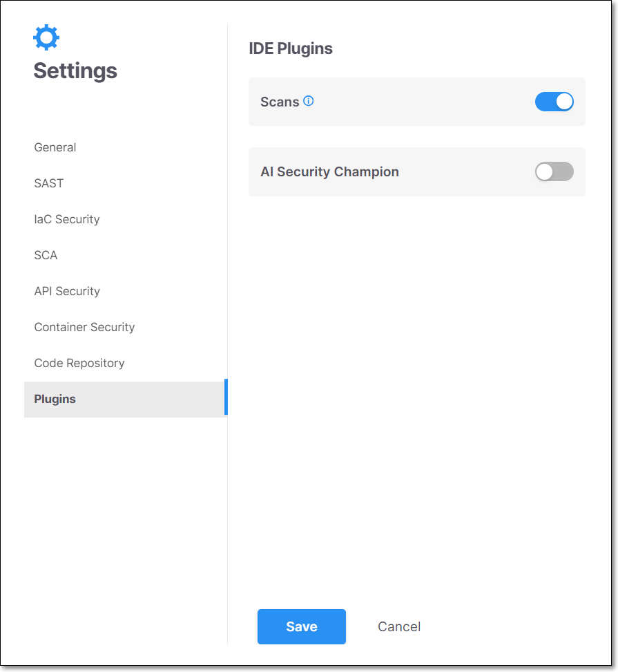
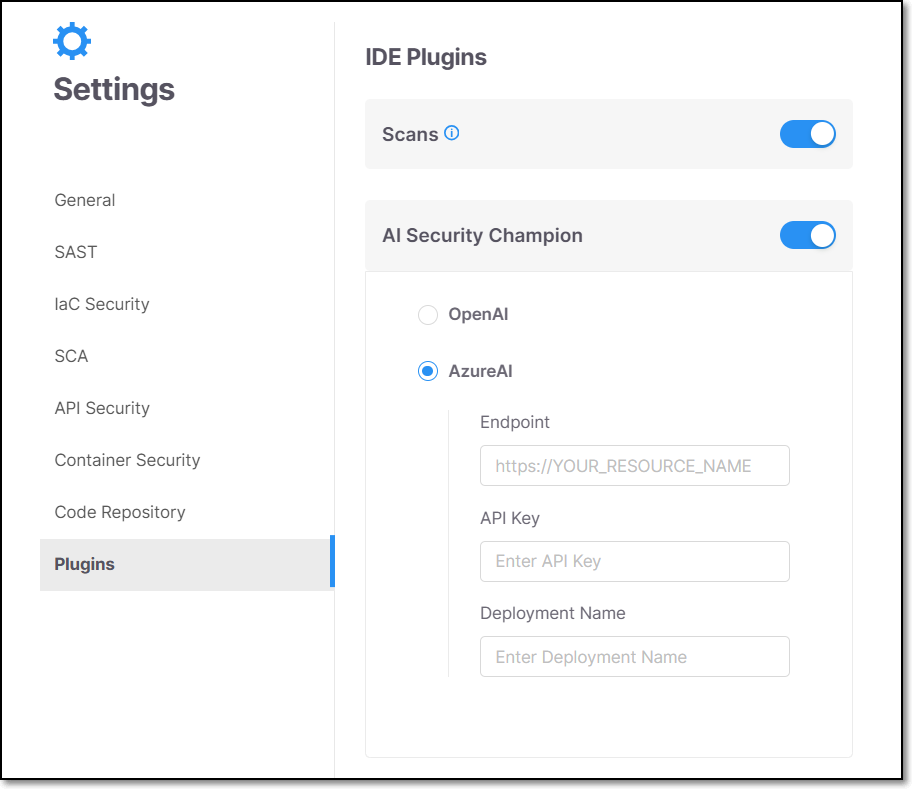

# Plugins Settings

The following IDE plugin features need to be activated on a tenant wide level in order for individual developers to be able to use them in their IDEs. Activation can be done by a Checkmarx One admin user via the **Account Settings** > **Settings** > **Plugins** tab. These configurations can also be set via API, as shown in the table below.

The table below presents all the optional parameters, and their optional values.


API configs can be configured on the account level only using the [Configuration](https://checkmarx.stoplight.io/docs/checkmarx-one-api-reference-guide/branches/main/cs61sszap44td-scan-configuration-service) API.


| **Parameter** | **Values** | **Notes** | API |
|---|---|---|---|
| **Direct Scan from IDE** | Toggle On/Off | When activated, this feature allows developers to perform scans on their projects straight from their IDEs, using the Checkmarx plugin. | `scan.config.plugins.ideScans` ` {` ` "key": "scan.config.plugins.ideScans",` ` "value": "false",` ` "allowOverride": true` ` }` |
| **Checkmarx One Dev Assist** | Toggle On/Off | When this feature is enabled, Model Context Protocol (MCP) dynamically integrates with external AI providers available in your IDE, such as GitHub Copilot or Cursor, to generate real-time fix suggestions. If no external provider is available, Checkmarx AI will be used as fallback. | |
| **AI Security Champion** | Toggle On/Off | When activated, this feature utilizes the chosen provider (such as OpenAI or AzureAI) to enhance secure development processes. When AI Security Champion is turned on, you can also choose which provider to use. Options are: • **OpenAI** • **AzureAI** | `scan.config.plugins.aiGuidedRemediation` ` {` ` "key": "scan.config.plugins.aiGuidedRemediation",` ` "value": "true",` ` "allowOverride": true` ` }` |

## Configuring Plugin Settings

**To change the Plugin settings:**

1. Log in to Checkmarx One as an admin user.
2. Click on the **Settings** **> Global Settings**
3. Click on **Plugins**.
4. Enable/disable IDE features as needed.

   The setting is applied to all IDEs using this tenant account.
5. Click **Save** at the bottom of the page.

   <figure><figcaption></figcaption></figure>

## IDE Scans

When this feature is activated Checkmarx IDE plugins enable users to run a new Checkmarx One scan on the project that is open in their workspace.

In order to run IDE scans, you must first create a Checkmarx project and run the initial scan using some other method, e.g., web portal, API, CLI etc. and load the scan results in the Visual Studio console. Then, you are able to run subsequent scans on that project from the IDE.


Before enabling this feature, you should consider the ramifications; since there is a limitation to the number of concurrent scans that you can run based on your license, enabling IDE scans may cause scans triggered by CI/CD pipelines and SCM integrations to be added to the scan queue, causing major delays for those scans.


## Checkmarx One Dev Assist

When this feature is enabled, Model Context Protocol (MCP) dynamically integrates with external AI providers available in your IDE, such as GitHub Copilot or Cursor, to generate real-time fix suggestions. If no external provider is available, Checkmarx AI will be used as fallback.


This capability is used as part of **Checkmarx Developer Assist** in the Checkmarx IDE plugins. For more information about how MCP enables AI-assisted remediation workflows, see Checkmarx Developer Assist.


## AI Security Champion

When this feature is activated, developers can access AI Guided Remediation in their IDE editor (currently supported for VS Code, Windsurf and Cursor).

AI Guided Remediation harnesses the power of AI to help you to understand the vulnerabilities in your code, and resolve them quickly and easily. When you initiate an AI chat, we automatically provide the context to GPT so that you can start a conversation about the precise vulnerability instance that you are assessing.


When sending your IaC files and SAST results to your AI provider, we protect your sensitive data by anonymizing all passwords and secrets before the content is sent. The query used for identifying sensitive data can be seen [here](https://github.com/Checkmarx/kics/blob/master/assets/queries/common/passwords_and_secrets/regex_rules.json).


### Limitations

- Currently, supported for VS Code, Windsurf and Cursor.
- Supported only for results from SAST and IaC Security scanners.

### Configuration Options

When the toggle for AI Security Champion is turned on, you can configure the AI provider settings. Select the radio button to specify which provider to use, options are: OpenAI or Azure AI.

<figure><figcaption></figcaption></figure>

- If you select **OpenAI**, each developer will need to submit their own API Key in the settings of their IDE.
- If you select **Azure AI**, then you need to enter details in the displayed fields in order to enable all users in this tenant to access the relevant AI instance.

  
  If your Azure AI instance is accessed via a proxy or gateway (e.g., Kong), you must ensure that the API Request URL, Request Payload, Response Payload and Authentication are compliant with the [required specifications](https://learn.microsoft.com/en-us/azure/ai-foundry/openai/reference).
  

  For Azure AI, fill in the following details:

  - **Endpoint** - The URL of your instance of Azure AI, e.g., https://\<YOUR_RESOURCE_NAME>

    
    You can submit the Fully Qualified Domain Name (FQDN), formatted as https://\<YOUR_RESOURCE_NAME>.openai.azure.com. However, it is sufficient to submit https://\<YOUR_RESOURCE_NAME>, because we automaticlly append the required suffixes.
    
  - **API Key** - The API Key for your Azure AI account.
  - **Deployment Name** - The name that your organization designated for your deployed model of Azure AI.
