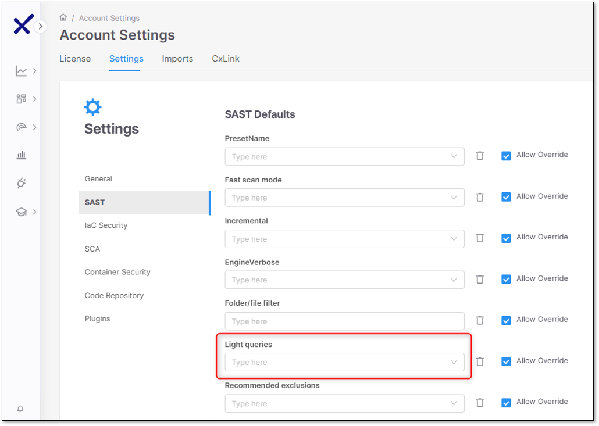
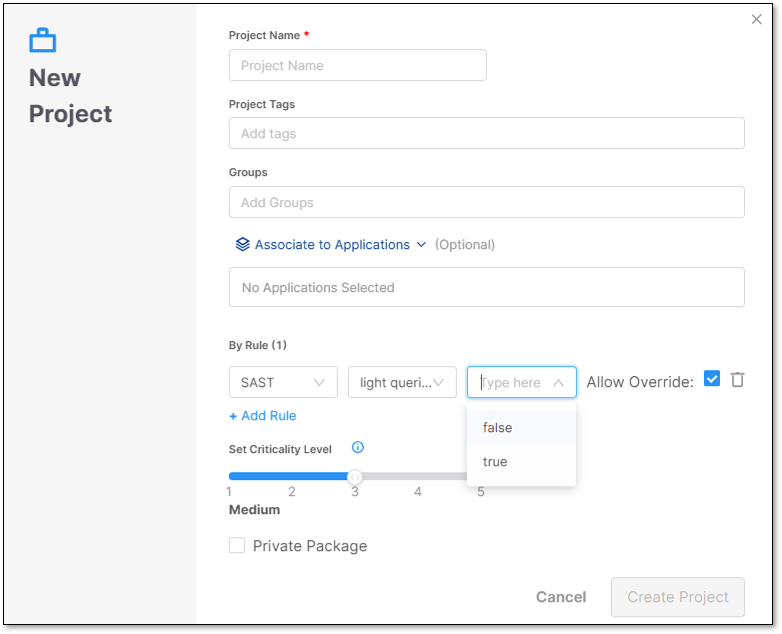

# SAST Scanner Parameters

The table below presents all the optional parameters for the SAST scanner and their optional values.


There is an additional configuration option for filtering, which compliance results to show. This can currently only be configured via REST API. See [API documentation](https://checkmarx.stoplight.io/docs/checkmarx-one-api-reference-guide/branches/main/cs61sszap44td-scan-configuration-service#compliance-filtering).



CLI flags are submitted on the scan level with the [scan create](../../../cli-tool/checkmarx-one-cli-commands/scan/scan-create.md) command. API configs can be configured on the account or project level using the [Configuration](https://checkmarx.stoplight.io/docs/checkmarx-one-api-reference-guide/branches/main/cs61sszap44td-scan-configuration-service) API or on the scan level as part of the request body of the [POST /scans](https://checkmarx.stoplight.io/docs/checkmarx-one-api-reference-guide/branches/main/cs61sszap44td-scan-configuration-service) API. When using the POST /scans API the `scan.config.sast` prefix is left out.


| **Parameter** | **Values** | **Notes** | CLI | API | Config as Code |
|---|---|---|---|---|---|
| **PresetName** | All the available SAST Presets that exist in the system | • For the full Presets list (including descriptions) go to the following link: Predefined Presets • The default preset that is used is **ASA Premium** | `--sast-preset-name boolean` | `scan.config.sast.presetName` ` {` ` "key": "scan.config.sast.presetName",` ` "value": "ASA Premium",` ` "allowOverride": true` ` }` | `presetName` |
| **Fast scan mode** | true / false | By default, the Fast Scan mode is set to **true**. For more information, refer to [Fast Scan Mode](#fast-scan-configuration). | `--sast-fast-scan boolean` | `scan.config.sast.fastScanMode` ` {` ` "key": "scan.config.sast.fastScanMode",` ` "value": "true",` ` "allowOverride": true` ` }` | `fastScanMode` |
| **Findings Analysis** | true/false | An optional capability that automatically classifies scan results and filters out results identified as unlikely to be relevant. When enabled, the results viewer shows only findings classified as relevant, helping analysts focus on actionable risks. For more information, refer to SAST Findings Analysis. | | `{` ` "key": "scan.config.sast.findingsAnalysis",` ` "value": "true",` ` "allowOverride": true` `}` | `findingsAnalysis` |
| **LLM-based scanning** | true/false | Configure to activate LLM-based scanning on SAST scans. | | `{"key": "scan.config.sast.extendedAnalysis","value": "true","allowOverride": true}` | `extendedAnalysis` |
| **Light queries** | true/false | Determines whether the scan should be performed using light queries or standard queries. Light Queries are simplified versions of standard queries focusing on the most urgent vulnerabilities, helping you spot threats faster. For more information, refer to [Light Queries](#light-queries). • When set to `true`, SAST will scan using light queries, quickly focusing on the most immediate and exploitable weaknesses. • When set to `false`, SAST will not scan using light queries; it will scan using standard queries. | `--sast-light-queries` | `scan.config.sast.lightQueries` ` {` ` "key": "scan.config.sast.lightQueries",` ` "value": "true",` ` "allowOverride": true` ` }` | `lightQueries` |
| **incremental** | true / false | Determines whether the scan should be performed incrementally or as a full scan. • When set to `true`, SAST will only scan the code changes made since the last scan, significantly reducing the scan time and resource usage. • When set to `false`, SAST will perform a full scan. Full scans are more comprehensive but take longer to complete and use more resources. | `--sast-incremental boolean` | `scan.config.sast.incremental` ` {` ` "key": "scan.config.sast.incremental",` ` "value": "true",` ` "allowOverride": true` ` }` | `incremental` |
| **Recommended exclusions** | true / false | Determines whether the system should automatically exclude certain files and folders from the scan. Enabled by default. By default, recommended exclusions is set to **true**. • When set to `true`, SAST applies predefined exclusions, allowing developers to scan faster and focus on the most relevant code areas. • SAST will include all files and directories in the scan when set to `false`. | --sast-recommended-exclusions | `scan.config.sast.recommendedExclusions` ` {` ` "key": "scan.config.sast.recomendedExclusions",` ` "value": "true",` ` "allowOverride": true` ` }` | `recommendedExclusions` |
| **LanguageMode** | primary / multi | For more information, see: Specifying a Code Language for Scanning Supported Code Languages and Frameworks: • Click Engine Pack Versions and Delivery Model. • Select the latest EP (Engine Pack) Supported Code Languages and Frameworks.  By default, the languageMode is **Multi**.  | | `scan.config.sast.languageMode` ` {` ` "key": "scan.config.sast.languageMode",` ` "value": "primary",` ` "allowOverride": true` ` }` | `languageMode` |
| **Folder/file filter** | Allow users to select specific folders or files to include or exclude from the code scanning process. | • Including a file type - \*.java • Excluding a file type - !\*.java • Use “,” sign to chain file types for example: \**.*java*,*\*.js • The parameter also supports including/excluding folders. • regex is not supported. | `--sast-filter <string>` | `scan.config.sast.filter` ` {` ` "key": "scan.config.sast.filter",` ` "value": "*.java",` ` "allowOverride": true` ` }` | `filter` |
| **EngineVerbose** | true / false | • true = Enables PRINT_DEBUG mode. • false = Enables PRINT_LOG mode. | | `scan.config.sast.engineVerbose` ` {` ` "key": "scan.config.sast.engineVerbose",` ` "value": "true",` ` "allowOverride": true` ` }` | `engineVerbose` |
| **Results scope level** | Project / Application | When you triage SAST results (change state, severity, comments), by default the adjustment applies only to identical results within that **Project**. You can adjust this setting to apply changes to all identical results in the entire **Application**. | | | |
| **Threshold for Incremental Scans (%)** | 0.5 - 10 (intervals of .5) | When running an incremental scan, if the changes from the previous scan exceed the threshold, a full scan is run. By default the threshold is 7%. Use this configuration to set a custom threshold. For more information, see [Adjusting the Incremental Scan Threshold](../../scanning-projects/README.md#adjusting-the-incremental-scan-threshold). | | `scan.config.sast.incrementalChangeThreshold` ` {` ` "key": "scan.config.sast.incrementalChangeThreshold",` ` "value": "1",` ` "allowOverride": true` ` }` | `incrementalChangeThreshold` |
| **Incremental in branch (API)** | true / false | When working with branches within Checkmarx GitHub Integration, if you open a pull request to merge into the master branch, you could run a faster incremental scan instead of a longer full scan. This capability is activated by configuring this setting to **true**. By default, it is **false**, so that only scans of the main branch are run as incremental. For more information, see [Incremental Scans of Branches](../../scanning-projects/README.md#incremental-scans-of-branches). | | `scan.config.sast.incrementalInBranch` ` {` ` "key": "scan.config.sast.incrementalInBranch",` ` "value": "true",` ` "allowOverride": true` ` }` | `incrementalInBranch` |
| **Mandatory Comment When Changing State** | true / false | When **true**, you are not able to save a state change until you add a comment explaining the rationale behind the change. | | | |
| **Grouping Similar Results** | Similarity ID / Attack Vector ID | Specify which identifier is used to define specific instance of a SAST result. Attack Vector ID is a more precise, flow-based grouping than Similarity ID. This determines which related results triage changes will be applied to. For more info, see [Account Settings for Grouping Similar Results](../../managing-triaging-vulnerabilities/triaging-sast-results/account-settings-for-grouping-similar-results.md)  When you change this setting, previously run AI Triage is no longer applicable. Therefore, if you subsequently run AI Triage on the same result, AI Triage will run again and consume additional credits.  | | | |

## ASA Premium Preset

ASA Premium Preset is a part of the SAST collection of presets.

This Preset is available only for Checkmarx One. Its usage is described in the table below.

| **Preset** | **Usage** | **Includes vulnerability queries for....** |
|---|---|---|
| ASA Premium | The ASA Premium preset contains a subset of vulnerabilities that Checkmarx AppSec Accelerator team considers to be the starting point of the Checkmarx AppSec program. The preset might change in future versions. The AppSec Accelerator team will remove old/deprecated queries or include new and improved queries in a continuously manner. | Apex, ASP, CPP, CSharp, Go, Groovy, Java, JavaScript, Kotlin (non-mobile only), Perl, PHP, PLSQL, Python, Ruby, Scala, VB6, VbNet, Cobol, RPG and VbScript coding languages. |
| ASA Mobile Premium | The ASA Mobile Premium preset is a dedicated preset designed for mobile apps. The ASA Premium Mobile preset contains a subset of vulnerabilities that Checkmarx AppSec Accelerator team considers to be the starting point of the Checkmarx AppSec program. The preset might change in future versions. The AppSec Accelerator team will remove old/deprecated queries or include new and improved queries in a continuously manner. | Apex, ASP, CPP, CSharp, Go, Groovy, Java, JavaScript, Kotlin (non-mobile only), Perl, PHP, PLSQL, Python, Ruby, Scala, VB6, VbNet, Cobol, RPG and VbScript coding languages. |

## Fast Scan Configuration

Fast Scan configuration aims to find the perfect balance between thorough security tests and the need for quick and actionable results. There’s no need to choose between speed and security.

Fast Scan mode decreases the scanning time of projects up to 90%, making it faster to identify relevant vulnerabilities and enable continuous deployment while ensuring that security standards are followed. This will help developers tackle the most relevant vulnerabilities.

While the Fast Scan configuration identifies the most significant and relevant vulnerabilities, the In-Depth scan mode offers deeper coverage. For the most critical projects with a zero-vulnerability policy, it is advised also to use our In-Depth scan mode.

Fast Scan mode is activated by default. It can be deactivated manually on the **Tenant** (Account), **Project** or **Scan** level.


To expedite the results retrieval, the scanning process has been optimized to reduce the number of stages and flows involved in the scan. With this enhancement, the queries related to ASPM are not executed and results won’t be generated when utilizing this mode.

You may also notice impact on the API Security scanner results.


### Fast Scan limitations

- Fast Scan is not advised for CPP, JS and Kotlin.
- Faster scans are achieved at the expense of comprehensive results.
- Differences in scan results are expected due to the methodology used by Fast Scan. It explores fewer flows compared to the "in-depth" mode, which may result in some vulnerabilities being missed or unique findings that differ from the standard scan.
- When fast scan mode is enabled, the language mode always runs as **Primary**, and any SAST rule that sets **languageMode** to multi is ignored until fast scan mode is turned off.

## Light Queries

Light Queries are simplified versions of existing queries that focus on the most exploitable vulnerabilities. They help you prioritize threats while filtering out uncommon edge cases for clearer analysis. Light Queries are not intended to replace the more robust standard queries but offer an alternative form of analyzing code by focusing on the most immediate threats and readily exploitable weaknesses as quickly as possible. These queries offer a more straightforward way to analyze code, giving you key findings without the complexity. The Light Queries have a more restrictive subset of results regarding inputs and sinks and a broader one regarding sanitizers.


Consider the following when Light Queries are enabled:

- The Similarity ID, source, and sync remain unchanged whether or not Light Queries are enabled.
- When Light Queries are enabled, the scan results are a subset of those from a standard query (i.e., when Light Queries are disabled).
- When scanning with Light Queries enabled, the scan will likely get fewer results.


### Supported Languages and Detected Vulnerabilities

Light Queries support the following languages:

- Java
- JavaScript

  - Client_DOM_XSS
  - Client_DOM_Stored_XSS
  - Client_DOM_Code_Injection
  - Client_DOM_Stored_Code_Injection
  - Client_DOM_Code_Injection_from_AJAX
  - Client_DOM_XSS_from_Ajax
- C#

The following vulnerabilities are detected in all the above languages when Light Queries are enabled:

- SQL Injection
- Reflected XSS

### Enabling Light Queries

Enable Light Queries under the Account Settings page by setting its value to true. By default, Light Queries are set to false (disabled), and the **Allow Override** option is enabled.

<figure><figcaption></figcaption></figure>

When creating a new project, on the project settings page, you must enable Light Queries as a rule. To add Light Queries as a rule, perform the following:

1. Click **+ Add Rule**. The scanner, mode, and value dropdown options appear.
2. Select **SAST**, **light queries**, and **true** for the scanner, mode, and value dropdowns.
3. Select **Create Project** when finished.

<figure><figcaption></figcaption></figure>

To delete a rule, click  at the end of the rule's row.
