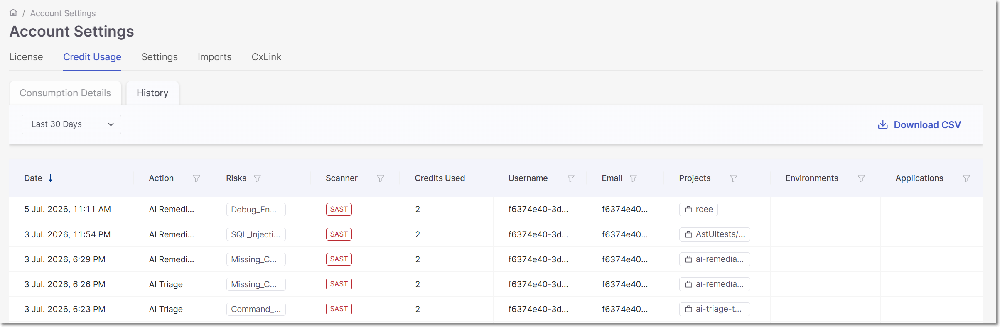

# Monitoring Checkmarx Credit Usage

The **Credit Usage** page provides detailed information about your organization's Checkmarx Credit consumption. Use this page to analyze how credits are consumed across AI-powered capabilities, identify the primary consumers of credits, and review the history of credit-consuming actions.

The Credit Usage page is available under **Settings > Credit Usage**.

<figure><figcaption></figcaption></figure>

The page provides both aggregated and detailed views of credit consumption, allowing you to analyze overall usage trends or investigate individual credit-consuming actions. The page contains two tabs:

- **Consumption Details** – Displays aggregated Checkmarx Credit consumption grouped by different dimensions, such as user, project, or AI action.
- **History** – Displays a chronological audit log of AI actions that consumed Checkmarx Credits.

## Consumption Details (default)

The Consumption Details tab provides an aggregated view of Checkmarx Credit consumption. Use the **View By** selector above the table to group credit consumption by one of the following dimensions:

- **Action**
- **User**
- **Project**
- **Environment**
- **Application**

For each item, the table displays:

- **Credits Used** – The number of Checkmarx Credits consumed.
- **% Credits Used** – The percentage of total Checkmarx Credit consumption.
- **Actions** – The number of AI actions performed.

This view helps you identify the users, projects, environments, applications, or AI capabilities that consume the most Checkmarx Credits.

## History Tab

The **History** tab provides a chronological audit log of AI actions that consumed Checkmarx Credits. Use this tab to review when credits were consumed, who initiated each action, and the associated project and application.

For each action, the table displays the following information:

| Column | Description |
|---|---|
| Date | The date and time the AI action was performed. |
| Action | The type of AI action that consumed credits, such as AI Triage or AI Remediation. |
| Risks | The vulnerability or risk associated with the action. |
| Scanner | The scanner that identified the vulnerability (for example, SAST). |
| Credits Used | The number of Checkmarx Credits consumed by the action. |
| Username | The display name of the user who initiated the action. |
| Email | The email address of the user who initiated the action. |
| Projects | The Checkmarx One project associated with the action. |
| Environments | The environment associated with the action, if applicable. |
| Applications | The application associated with the action, if applicable. |

The table supports sorting, filtering, and pagination to help you quickly locate and analyze specific credit-consuming actions.
