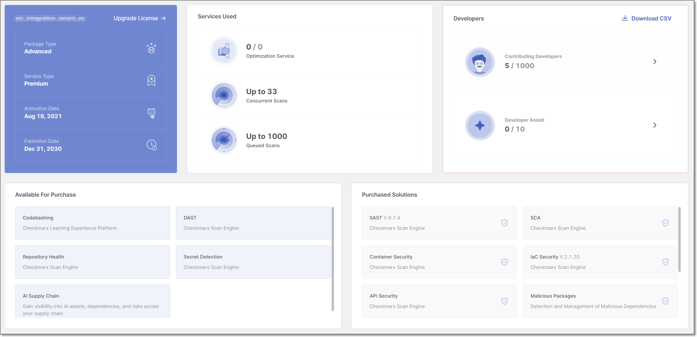
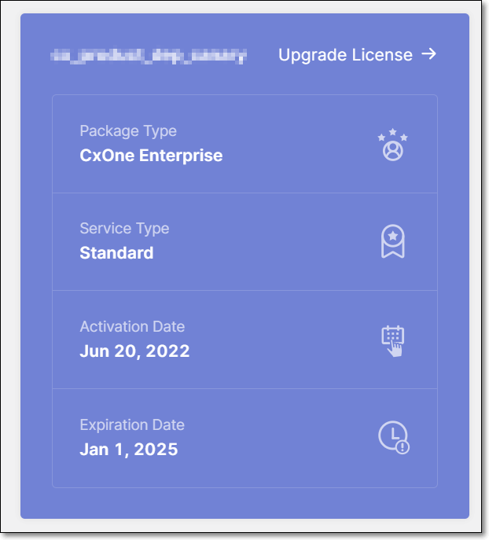
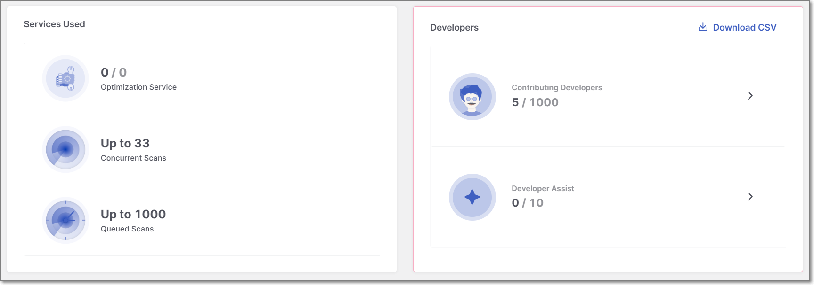
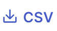
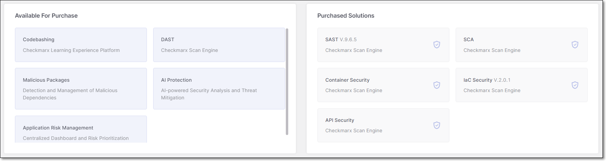
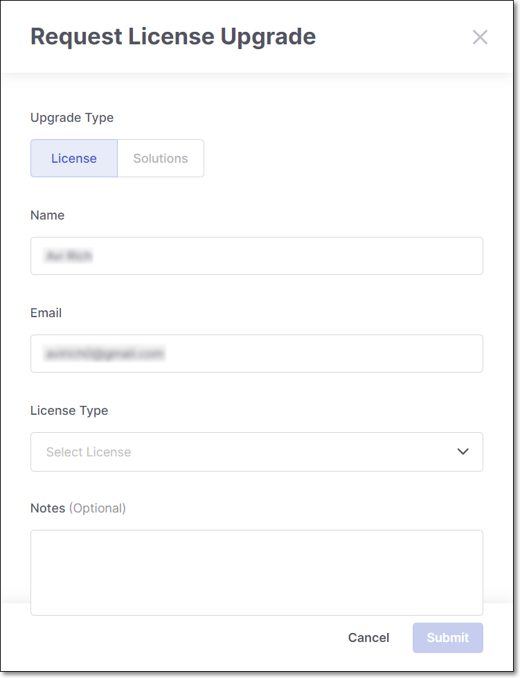
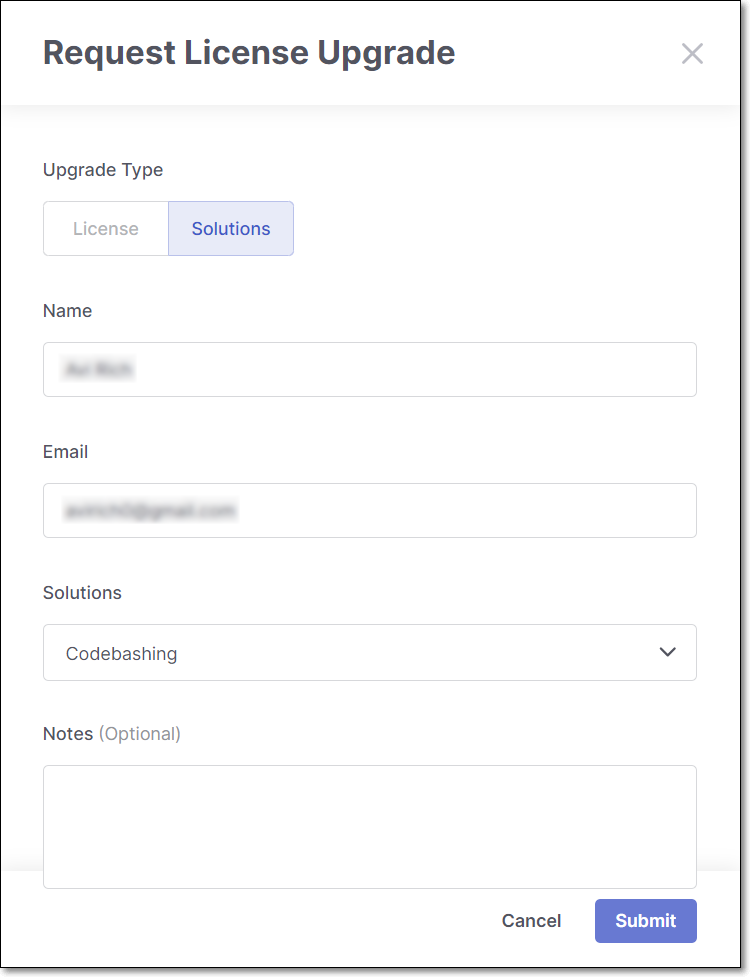

# Viewing License Info and Upgrading a License


Only tenant Admin role can access the License view.


The **License** screen is available under **Settings** > **License**. It provides information about your organization's license, entitled services, Checkmarx Credit usage, and available solutions. From this screen, you can also submit requests to upgrade your license or purchase additional solutions, including Checkmarx Credits.

The **License** screen is divided into three sections:

- **License & Services**: Displays your current license information, service entitlements, and developer usage.
- **Credit Usage**: Displays your organization's Checkmarx Credit balance, consumption, and usage trends.
- **Solutions Overview**: Displays licensed solutions and solutions that are available for purchase.

## License & Services

The **License & Services** section provides information about your current license plan, service entitlements, and developer usage. It is divided into three cards:

### Account General Information

<figure><figcaption></figcaption></figure>

The **Account General Information** card includes the following information:

- **Tenant Name**
- **Upgrade License** button
- **Package Type**
- **Service Type**
- **Activation Date**
- **Expiration Date**

### Services Used

<figure><figcaption></figcaption></figure>

The **Services Used** card displays service usage and entitlement information. The items in this card are not clickable.

The card includes the following information:

- **Optimization Service** - Presents the number of optimization services you can receive from the Checkmarx AppSec experts.
- **Concurrent Scans** - Presents the number of scans that can be run simultaneously. When the limit is exceeded, the scans are added to the queue.
- **Queued Scans** - Presents the number of scans that can be placed in the queue.

### Developers

The **Developers** card includes the following information:

- **Contributing Developers** - Presents the number of developers who have made commits to a private git repository scanned by Checkmarx One in the last 90 days.

  Checkmarx One prevents double counting for those developers using multiple integrations or contributing to multiple repositories. Each developer is identified by their unique email address in their local git settings. This guarantees accurate tracking and assists customers with fluctuating developer headcount.

  
  - **Developer** - A developer who has made one or more commits to a Repository monitored by Checkmarx in the last ninety (90) days.
  - **Repository** - a set of version-controlled project files up to 1 million lines of code in the aggregate which is used to build a particular named software module or application.
  
- **Developer Assist** - Presents Dev Assist seat usage, with a breakdown by IDE.
- **Contributing Developers Report** - Clicking the  icon exports a contributing developers report in CSV format. The report includes contributing developers' usage details, such as developers' email addresses, a timestamp of the last comment, and the corresponding Checkmarx One Project. Developer Assist seat usage is also included in the report.

## Credit Usage

AI-powered capabilities, such as AI Triage and AI Remediation, consume Checkmarx Credits. The **Credit Usage** section provides administrators with visibility into available credits and how they are being consumed across the organization.


Credit consumption data is only visible to admin users.


The **Credit Usage** section contains the following widgets:

- **Credits Available**: Displays the number of remaining Checkmarx Credits available under your organization's license.
- **Estimated Actions Remaining**: Displays the estimated number of additional AI actions that can be performed with the remaining available credits. Estimates are provided for each supported AI capability based on its credit cost.
- **Burn Rate**: Displays the average number of Checkmarx Credits consumed per month.
- **Estimated Credit Depletion**: Displays the projected date on which your organization will exhaust its available credits based on the current burn rate.
- **Total Actions**: Displays the total number of AI actions that have consumed Checkmarx Credits.
- **Credit Usage by Action**: Displays a breakdown of credit-consuming actions by capability, including the number and percentage of actions attributed to each one. Data is based on credit usage over the last 90 days.
- **Credit Usage**: Displays credit consumption over time, allowing you to monitor usage trends and identify periods of increased activity. Data is based on credit usage over the last 30 days.
- **Top Consumers**: Displays the users, groups, or applications that have consumed the most Checkmarx Credits during the selected time period. Use the selector to switch between the available views. Data is based on credit usage over the last 90 days.


To purchase additional Checkmarx Credits, submit a solutions upgrade request. For more information, see [Solutions Upgrade](#solutions-upgrade).


## Solutions Overview

<figure><figcaption></figcaption></figure>

The **Solutions Overview** section displays both licensed solutions and solutions that are available for purchase. It is divided into two cards: **Available for Purchase** and **Purchased Solutions**

### Purchased Solutions

The **Purchased Solutions** card shows all solutions included in your current package and any add-ons you have purchased, regardless of whether each solution is currently toggled On or Off.

### Available for Purchase

The **Available For Purchase** card shows solutions that are not included in your current package, plus any optional add-ons that are not currently enabled for your account.

### Practical example:

If a customer has **CxOne Start With SAST NG** and has purchased the **API Security** and **IaC Security** add-ons.

- **Purchased Solutions** displays: SAST, API Security and IaC Security.
- **Available for Purchase** displays any other solutions not included in that package and not purchased as add-ons (for example, SCA, DAST, etc.)

## License Upgrade

If you are interested in upgrading your Checkmarx solutions, you can submit a license upgrade request directly from the **Account General Information** card.

To request a solution upgrade:

1. In the **Account General Information** card, click on **Upgrade License** next to the tenant name.

   The **Request License Upgrade** panel opens with the **Upgrade Type** set to **License**.

   <figure><figcaption></figcaption></figure>
2. Review or complete the following fields:

   - **Name** - Automatically populated with the logged-in user's name.
   - **Email** - Automatically populated with the logged-in user's email address.
   - **License Type** - Select *one or more* options from the drop-down list (Contributing Developers, Optimization Service, Concurrent Scans, Result Review, On-boarding).
   - **Notes** - Enter any additional information or requirements.
3. Click **Submit**.

A Checkmarx representative will contact you to discuss your request.

## Solutions Upgrade

If you are interested in purchasing additional Checkmarx solutions, you can submit a solution upgrade request directly from the **Available for Purchase** card.

To request a solution upgrade:

1. In the **Available for Purchase** card, click the solution you want to purchase.

   The **Request License Upgrade** panel opens with the **Upgrade Type** set to **Solutions**.

   <figure><figcaption></figcaption></figure>
2. Review or complete the following fields:

   - **Name** - Automatically populated with the logged-in user's name.
   - **Email** - Automatically populated with the logged-in user's email address.
   - **Solutions** - Automatically populated with the selected solution. You can add additional solutions from the list. Only solutions that are currently available for purchase are displayed.
   - **Notes** - Enter any additional information or requirements.
3. Click **Submit**.

A Checkmarx representative will contact you to discuss your request.
