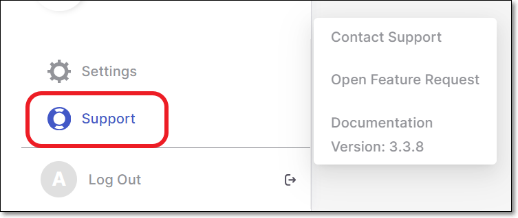
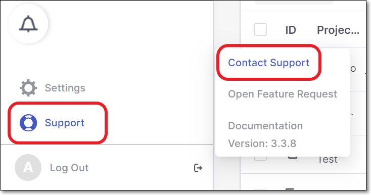
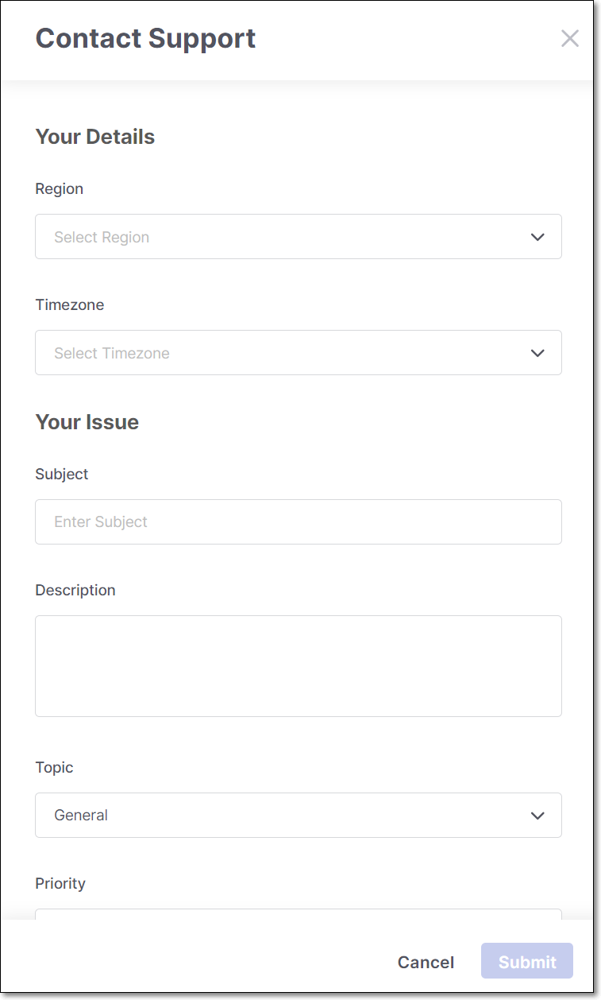
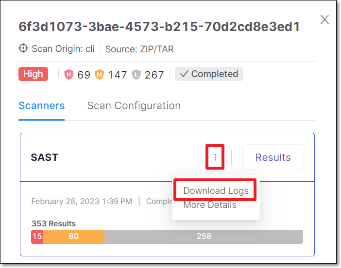
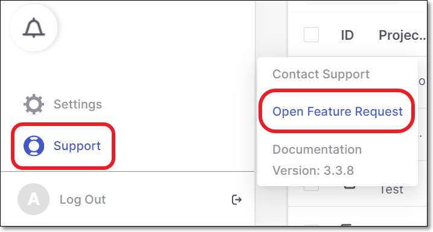
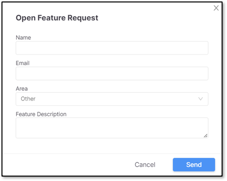

# Contacting Support

Checkmarx One **Support** can be accessed from the navigation panel.

<figure><figcaption></figcaption></figure>


A request for the Checkmarx AppSec (Application Security) assistance about a discovered security vulnerability can be submitted for additional information or guidance.

For additional information see [Requesting AppSec HD (Help Desk) Assistance](viewing-scan-results-in-the-results-viewers/sast-results-viewer/requesting-appsec-hd-help-desk-assistance.md).


The Support menu options are:

- [Contact Support](#contact-support)
- [Open Feature Request](#open-feature-request)
- [Documentation](#documentation)

## Contact Support

**Contact Support** enables you to submit a support ticket to our specialists, who can promptly assist with any queries or issues.


Opening a support ticket is not available for "Trial" accounts. If "Trial" users have an issue that requires assistance, they should contact their CSM directly



We automatically extract key info about the user and error event and include it in the support ticket. This helps to streamline the submission process.


To submit a support ticket:

1. In the main navigation menu, click **Support** > **Contact Support**.

   <figure><figcaption></figcaption></figure>

   The **Contact Support** form is displayed.

   <figure><figcaption></figcaption></figure>
2. In the **Your Details** section, select your **Region** and **Timezone** from the dropdown lists.
3. In the **Your Issue** section, in the **Subject** field, specify the subject.

   As you type, relevant documentation suggestions are displayed. Each suggestion includes the article title, a brief summary, and a direct link to the documentation, enabling you to quickly find answers and potentially avoid opening a support case.
4. In the **Description** field, enter a free text explanation of the issue.
5. In the **Topic** field, select from the dropdown list the general topic of the support issue. Options are:

   - **General** - for any general questions about the platform.
   - **Scans** - for issues when scanning your projects, viewing scan results, or using scanners.
   - **Documentation** - for any questions regarding the documentation provided.
   - **Plugins** - for any questions about the supported plugins.
6. Depending on the topic selected, additional fields are shown:

   - For **Plugins** - specify the **Plugin Type**.
   - For **Scans** - specify the **Scanner** (i.e., scan engine) and **Scan ID**.

     
     Copy the ID by going to the project **Overview** page > **Scan History** tab, and click on the **Copy** button for the relevant scan ID.
     
7. In the **Priority** field, select from the dropdown list the priority level.

   Possible values are:

   - **Normal** where the system is usable with some minor failures or there is a question regarding the product.
   - **High** where the system is partially inoperative but still usable.
   - **Urgent** where the system is not accessible or unresponsive.
8. Select **Upload File** to add any relevant screenshots or files that will assist the support team in understanding the issue. Optional.

   - If you are submitting a scan related support ticket, you can download the logs file and submit it here. Download the logs by going to the project **Overview** page > **Scan History** tab and clicking on the relevant scan. In the sidebar click on the more options menu and select **Download Logs**.

     <figure><figcaption></figcaption></figure>
9. Click **Submit** to submit the request.

## Open Feature Request

Open Feature Request provides the opportunity for a customer to request the implementation of a specific feature into the product.


Alternatively, you can submit feature requests, promote existing requests and track status of requests via the **Checkmarx Idea Portal**. For more information about using the Idea Portal, see Checkmarx Idea Portal.


To open a feature request, perform the following:

1. Click **Support** .
2. Click **Open Feature Request**.

   <figure><figcaption></figcaption></figure>

   The **Open Feature Request** form is displayed.

   <figure><figcaption></figcaption></figure>
3. Enter your **Name**.
4. Enter your **Email**.
5. Select the **Area** for your request from the options provided:

   `Application` if you have a request that directly affects the Checkmarx One application.

   `Integration` if there is an additional integration that you require.

   `Plugins` if there is a plugin that you require, that is not already included in Checkmarx One.

   `Access Control` if you have additional access control requirements. For example, if password authentication alone is not considered sufficient security, a form of multi-factor authentication could be requested.

   `Other` is for any other requirement not listed above.
6. Provide a **Feature Description** that will assist the support team in obtaining a better understanding of the request.
7. Click **Send**.

## Documentation

Documentation contains up-to-date technical documentation covering all aspects of Checkmarx One.

Included in this section are links to the newest versions of the:

- **Release Notes** which contain the newest features and improvements to the platform.
- **General Product Information** which is relevant across all elements of the platform, such as, web application, API and integrations.
- **Checkmarx One User Guide** with in-depth information, task-oriented instructions and visuals on how to best use Checkmarx One.
- **Checkmarx One Platform Code Repository Integrations** providing instructions on integrating Checkmarx One into some of the most popular IDEs (Integrated Development Environment) and CI/CD (Continuous Integration/Continuous Deployment) platforms and full integration with most of the code repositories.
- **Checkmarx One CLI Tool** with comprehensive information on the Command Line Interface standalone tool.
- **Checkmarx One IDE Plugins** where links to specialized plugins to integrate Checkmarx One to IDEs and CI/CD platforms are provided. The main features, prerequisites and instruction on how to integrate each of the options is covered.
- **Checkmarx One CI/CD Integrations** has the different options for CI/CD integrations, along with the main features, prerequisites and instructions for each option.
- **Checkmarx One API Documentation** providing information on the functionality of Checkmarx One’s REST APIs. A list of Checkmarx One’s external APIs and links are provided by category.
- **Migrating from SAST to Checkmarx One** which includes in-depth information, such as limitations and differences between the systems and instructions on the processes, when migrating from SAST to Checkmarx One.
