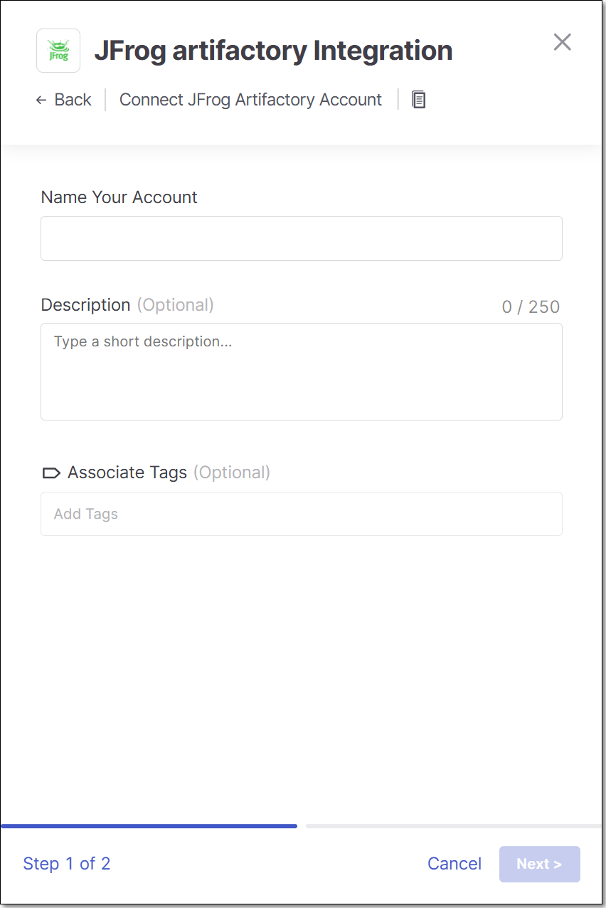
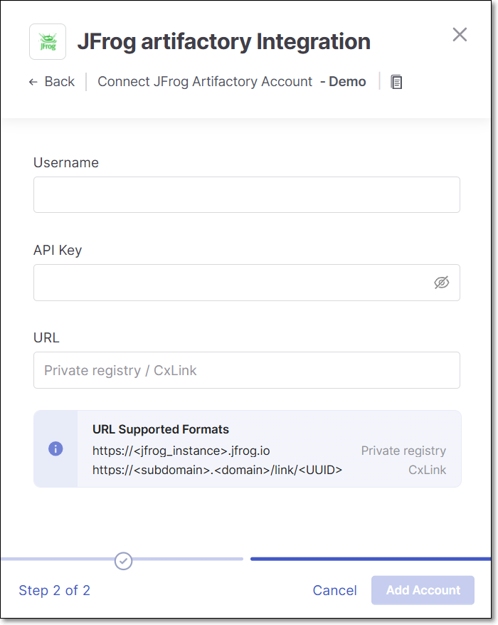

# JFrog Artifactory Integration

Checkmarx One provides an integration with JFrog Artifactory, enabling you to automatically pull images from your private JFrog Artifactory and scan them using the Checkmarx One Container Security scanner.

This integration also enables Checkmarx One Cloud Insights to extract metadata from your artifactory, which is used to improve the accuracy of our ability to match between Checkmarx One projects and runtime data.

We provide a convenient wizard on the Checkmarx One **Integrations** page that enables you to submit your JFrog credentials and create the integration.

## Prerequisites

- A Personal API key for the repository where the images are located, with read access to the container registry.

  
  In JFrog go to **Admin** > **Identity & Access** > **Users** then select your user and go to the **Authentication** tab and generate the API key.
  

## Setting up an Integration

**To set up a JFrog Artifactory Private Registry Integration:**

1. In the main navigation, select **Integrations** > **Cloud Connections**.
2. In the **Setup** tab, under **Private Registries for Containers**, hover over the **JFrog Artifactory** tile and click on **Configuration**.
3. In the side panel that opens, click **Start**.

   The **JFrog Artifactory Integration** wizard opens.

   <figure><figcaption></figcaption></figure>
4. **Name Your Account** and optionally fill in the **Description** and **Associate Tags** fields, then click **Next**.
5. Under **Username** enter the Username for your JFrog account.

   <figure><figcaption></figcaption></figure>
6. In the **API Key** field, enter the API key for your JFrog Artifactory (as described above in Prerequisites).
7. In the **URL** field, enter the URL for your JFrog account using the format `https://<jfrog_instance>.jfrog.io`.

   Alternatively, if you have configured a CxLink to access this repo, enter the CxLink (using the following format: https://\<subdomain>.\<domain>/link/\<UUID>). Learn more about CxLink [here](../../cxlink.md).
8. Click **Add Account**.


As of CLI version 2.3.28, CLI scans run in the cloud by default and will use this integration to access your private registry.

If you are running CLI version 2.3.27 or earlier, CLI scans run locally and this integration will not apply. Upgrade your CLI to 2.3.28 or later to enable private registry access for CLI scans.


## Monitoring Integration Status

You can monitor the status of your JFrog integrations to see whether or not the integration is connected. Possible statuses are:

- **Pending** - The integration was just set up and hasn't connected yet.
- **Connected** - The integration is running and you are able to scan images in your JFrog Artifactory.
- **Disconnected** - Checkmarx One is unable to access your JFrog Artifactory. Common causes include an invalid or expired API key, insufficient read permissions on the container registry, or an incorrect URL. Verify your credentials in the Prerequisites section and re-enter them in the integration wizard.

**To monitor the integration status:**

1. In the main navigation, select **Integrations** > **Cloud Connections**.
2. In the **Cloud Connections** tab, check the **Status** column for each of your integrations.
