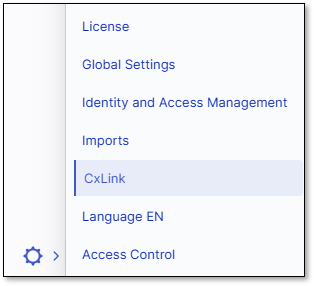
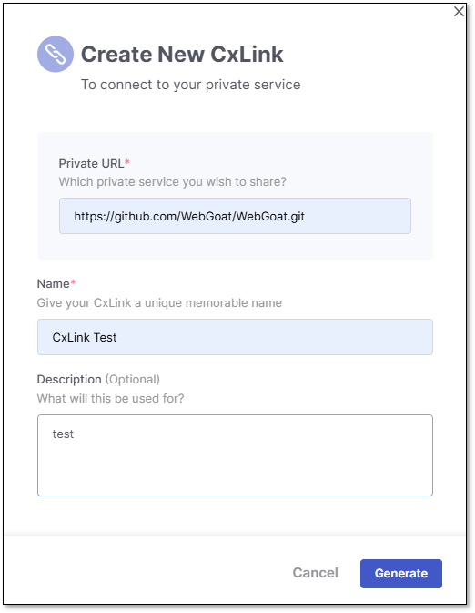
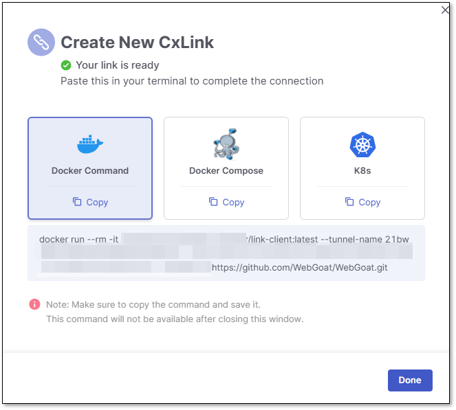
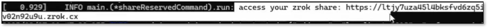
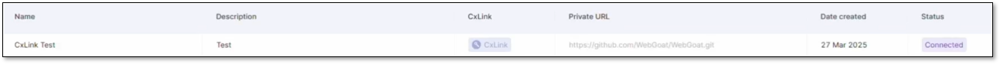
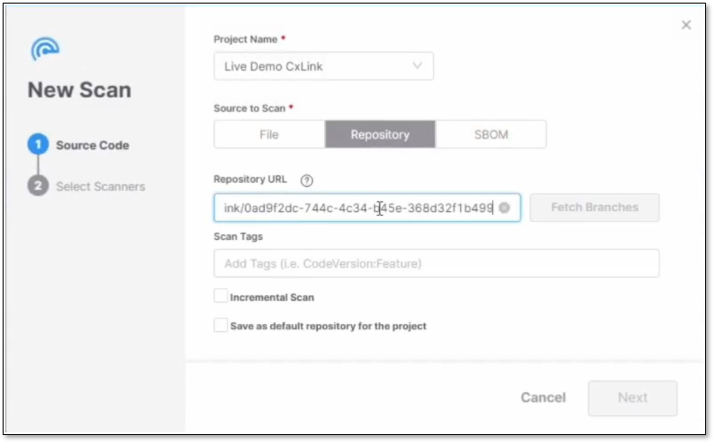
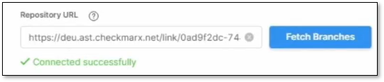
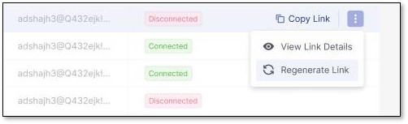
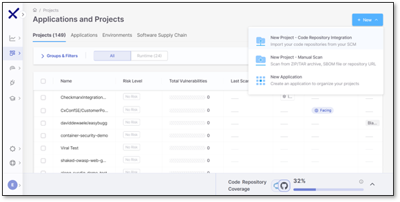
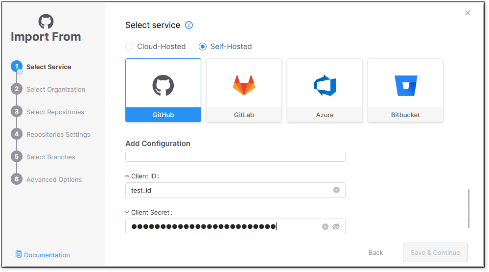

# CxLink


This feature is available for all Multi-Tenant users. To make it available on Single-Tenant, please contact your CSM.


CxLink, using [Zrok](https://docs.zrok.io/docs/concepts/) tunneling technology, acts as a proxy to simplify and secure integrations between your protected services (e.g., code repositories, private artifactories, bug tracking systems) and CheckmarxOne. With CxLink, you can eliminate the need to manually configure networks or open firewalls.


CxLink does not require any zrok.io resources. CxLink infrastructure is fully managed within Checkmarx One cluster, ensuring your data remains under Checkmarx control at all times.


CxLink supports two tunneling options:

- **http**: for code repositories, artifactories, bug tracking systems, or other on-premises services
- **socks5**: specifically for DAST scans

## Prerequisites

### System Requirements

Run the CxLink client on a host capable of running Docker (see *Install Docker* below). Size the host to your expected scan volume:

| Resource | Proof of Concept (POC) / low throughput | Production / high throughput (~2,000 scans per hour) |
|---|---|---|
| CPU | 1 vCPU | 4 vCPU |
| Memory | 4 GB RAM | 16 GB RAM |
| Disk (install + logs) | 200 MB | 1 GB |

The host also needs:

- **Outbound connectivity** to the Checkmarx One tunneling service. This is the secure tunnel the client establishes (no inbound firewall changes required).
- **Network access** to the protected services it proxies (code repositories, artifactories, bug tracking systems, or DAST targets).


These are starting points. Resource needs may rise with actual scan volume and complexity; enabling verbose logging (-v) will also increase disk usage over time.


Install Docker: [https://docs.docker.com/get-started/get-docker/](https://docs.docker.com/get-started/get-docker/)

Docker hub URL: [https://hub.docker.com/r/checkmarx/link-client](https://hub.docker.com/r/checkmarx/link-client)


Upgrade and ensure you are using the newest version of the Docker image by confirming the tags here: [https://hub.docker.com/r/checkmarx/link-client/tags](https://hub.docker.com/r/checkmarx/link-client/tags).


## Setup

To set up a CxLink:

1. Create a new CxLink on the CxLink tab of the Account Settings screen. Upon creation, you will be able to generate a command line to run the CxLink client in Docker (Docker Compose and Kubernetes are not yet supported).
2. Install the CxLink Client as a Docker container using the provided Docker command.
3. Once the client is installed, it must be updated with the token obtained during registration. This allows it to establish a secure tunnel to Checkmarx One. Ensure the connection appears on the Account Settings page.

Once the secure tunnel is set up, you can import repositories by entering the hostname, which is resolved through the tunnel using the client ID and secret. This is explained in more detail in the sections that follow.

## Permissions

In case the CxLink option is not visible in the **Settings** dropdown (see screenshot below), ensure you have the necessary Access Management permissions:

1. Navigate to **Identity and Access Management → Users**.
2. Click **Edit** in the dropdown menu at the end of your user row.
3. In **Roles Mapping**, ensure **view-links**, **create-links**, **edit-links**, and **delete-links** are selected (these permissions are included in the **ast-admin** and **ast-risk-manager** roles).

## Accessing CxLink

Perform the following to access and manage your CxLinks:

1. Click  then **CxLink**. The CxLink tab under **Account Settings** opens.

   <figure><figcaption></figcaption></figure>
2. The CxLink tab displays a table with the following columns:

   - Name
   - Description
   - Private URL (on-prem service URL)
   - Date Created
   - Connection Status


**Applicable to Single-Tenant customers only:**

As an alternative to using CxLink, you may consider a Site-to-Site VPN solution.

Please review the following AWS documentation describing this approach:

[https://docs.aws.amazon.com/vpn/latest/s2svpn/VPC_VPN.html](https://docs.aws.amazon.com/vpn/latest/s2svpn/VPC_VPN.html)

Note that AWS pricing applies to this solution and is independent of Checkmarx pricing.


## Creating and Connecting a New CxLink

Perform the following to create a new CxLink:

1. Click the **+New** button to create a new link. Fill out the form and click **Generate**.

   <figure><figcaption></figcaption></figure>
2. On the following window, select **Docker Command**. Copy and save the command below before clicking **Done** and closing the window!

   <figure><figcaption></figcaption></figure>

   
   Once a link is created, you can only delete it or edit the name and description in the **CxLink Details** panel. Perform the following to edit the link:

   1. Click  at the end of a link row.
   2. Select **View Link Details**.
   3. Click  by the description box.
   4. Click **Save** when done.

   To delete the link, click  next to the link name. The CxLink and Private URL remain unchanged.

   You can also use the following options when creating your CxLink by editing the Docker command line that was generated when the link was created:

   -
     ```
     [ -n | --tunnel-name string]
     ```

     Unique name for the tunnel (required)
   -
     ```
     [ -s | --tunnel-server-url string]
     ```

     The CxOne tunneling service URL (required)
   -
     ```
     [ -z | --link-token string]
     ```

     Authentication token for the tunnel (required)
   -
     ```
     [ -r | --private-url string]
     ```

     The private resource URL to be shared (required)
   -
     ```
     [ -i | --insecure]
     ```

     Allow insecure TLS certificate validation for private url (optional)
   -
     ```
     [ -b | --allow-trailing-slash]
     ```

     Allow trailing slash at the end of private URL (optional)
   -
     ```
     [ -v | --verbose]
     ```

     Enable extra logging (optional)
   -
     ```
     [ -t | --timeout int]
     ```

     Timeout for connection in seconds (default 30 seconds, optional)
   -
     ```
     [ -c | --cleanup]
     ```

     Clean up existing tunnel connections to prevent share conflicts when restarting tunnel (optional)
   
3. After creating the link, you must connect it by performing the following:

   1. Open your command prompt terminal.
   2. Paste and run the provided Docker command at the end.
   3. Verify your connection is successful by seeing this in your code

      <figure><figcaption></figcaption></figure>

      and a **Connected** status by the CxLink.

      <figure><figcaption></figcaption></figure>
4. Now connected, run a scan and copy and paste the CxLink (**CxLink** from the table) into the **Repository URL** field.

   
   You can use the same copied link alias in one or several projects.
   

   <figure><figcaption></figcaption></figure>
5. Click **Fetch Branches** to ensure it is connected successfully.

   <figure><figcaption></figcaption></figure>
6. Click **Next** to select your scanners and **Scan** when done.

   
   Do **not** close your tunnel while running; your connection will drop and fail.
   

## Regenerating a Link

Click **Regenerate Link** to issue a new token and continue use of the same Link alias even if the connection is unexpectedly terminated. The regenerated link replaces the previous one and provides an updated Docker command with a fresh token. To reuse it for other projects, copy and paste it into your Docker console- no manual updates needed.



*Example Docker Command*: docker run --rm -it checkmarx/link-client:1 --tunnel-name \<**tunnel_name**> --tunnel-server-url \<**tunnel_url**> --link-token \<**token**> --private-url \<**private_url**>

## Configuring SCM

Perform the following to configure your SCM:

1. Copy the alias CxLink generated when creating the new link.
2. Select the **New Project—Code Repository Integration** option to import your code from the SCM when creating a new project.

   <figure><figcaption></figcaption></figure>
3. Choose your SCM and specify Self-Hosted.

   
   CxLink is unavailable for cloud-hosted SCM configurations.
   
4. Enter a new instance name, paste the CxLink in the URL field, and enter your unique ID and secret.
5. Once all mandatory fields are filled out, the **Save & Continue** button will become available. Click it to proceed with the import.

   <figure><figcaption></figcaption></figure>

<details>

<summary>FAQ</summary>

**My SCM uses a self signed certificate. How can I configure it?**

The CxLink container looks for CA certificates in /etc/ssl/certs/ca-certificates.crt.

The CxLink container looks for CA certificates in /etc/ssl/certs/ca-certificates.crt.

**You can confirm that the configuration is correct by creating a shell in the pod and checking the contents of /etc/ssl/certs/ca-certificates.crt, and also running a curl to the desired endpoint.**

It’s not necessary to include the certificate’s private key

Example: Use a docker volume to place your .crt file as the container ca-certificates.crt file.

`docker run --rm -it -v $(pwd)/my-ca.crt:/etc/ssl/certs/ca-certificates.crt checkmarx/link-client:1 --tunnel-name 41916…. --tunnel-server-url https://zrok-us.ast.checkmarx.net --link-token nRcv... --private-url https://my-scm`

Example: How to generate my-ca.crt file.

In this example, the certificate is fetched from the test server localhost:4443 and merges with the machine’s ca certificates to produce the -ca.crt:

`cp -v /etc/ssl/certs/ca-certificates.crt my-ca.crt && openssl s_client -connect localhost:4443 2>/dev/null </dev/null | sed -ne '/-BEGIN CERTIFICATE-/,/-END CERTIFICATE-/p' >> my-ca.crt`

**Do you have a list of external endpoints and ports to whitelist?**

Your Link client will need to reach the following endpoints, depending on the cluster’s region.

| Service | Port | Example |
|---|---|---|
| zrok\<-region>;.ast.checkmarx.net | HTTPS | zrok-eu.ast.checkmarx.net\* |
| ziti\<-region>ast.checkmarx.net | HTTPS | ziti-eu.ast.checkmarx.net\* |
| router\<-region>.ast.checkmarx.net | HTTPS | router1-eu.ast.checkmarx.net\* |
| router2\<-region>.ast.checkmarx.net | HTTPS | router2-eu.ast.checkmarx.net\* |
| DNS resolution<br><br>By default, Docker uses Google DNS server for domain name resolution. Override this option to set it according to your needs. Check the Docker [documentation](https://docs.docker.com/engine/network/) for more information.<br> | 53 | 8.8.8.8 |

</details>
