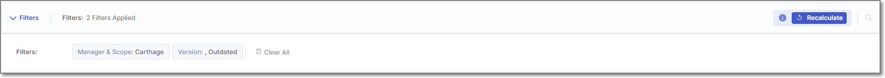
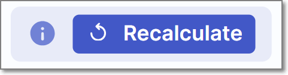
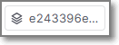
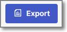
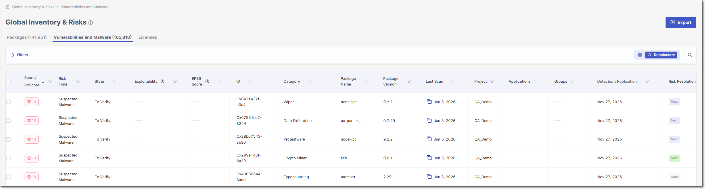
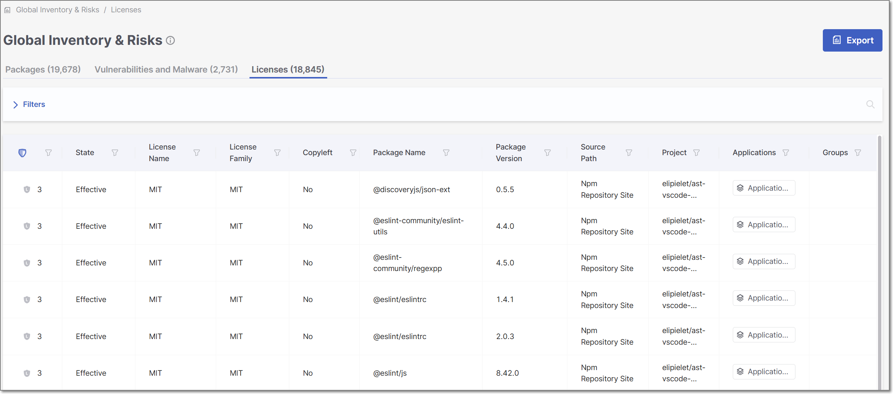

# Global Inventory

## SCA Inventory and Risks

### SCA Global Inventory Overview

The **SCA Global Inventory and Risks** page displays a comprehensive list of all packages identified in your account, along with their associated risks and license information. This includes details such as vulnerabilities, outdated versions, and policy violations. By aggregating information across all Projects, the Global Inventory helps you prioritize remediation by showing which risks and vulnerable packages impact multiple Projects, making it easier to coordinate efforts across development teams.

With the addition of **bulk triage actions** in the Global Inventory, managing these risks at scale has become even more efficient. You can now select multiple items and triage them all at once across the **Packages**, **Vulnerabilities and Malware**, and **Licenses** tabs. For example, if you determine that a particular package is not a concern, you can search for all its instances in the Packages tab and mark them all as *Muted* with a single action. This capability streamlines large-scale triage workflows and saves time by enabling consistent decisions to be applied across the entire tenant.


For projects with a "primary" branch, Global Inventory shows data based on the last scan of the primary branch. If there is no primary branch, then data is based on the last scan of any branch of the project. Therefore, you should be aware that if different branches of a project rely on different open source packages, Global Inventory will not show comprehensive data for all branches.


<figure><figcaption></figcaption></figure>

The **Global Inventory & Risks** page is accessed in Checkmarx One by clicking on the **Resources > SCA Inventory and Risks** in the main navigation.

The screen includes three tabs:

- **Packages** (default) – shows info about all of the packages used in all the Projects in your organization.
- **Vulnerabilities and Malware** – shows info about all of the vulnerabilities, operational and legal risks across all the Projects in your organization.
- **Licenses** - shows info about all of the licenses that are associated with the open source packages used by your projects.

There is an Export option that enables you to export a csv file for the info that is shown on each of the **Global Inventory & Risks** tabs. The csv reflects the data currently shown in the table, as per the applied filters.

### Header Bar

The header bar shows information about the filters applied to the items displayed on the page. It also includes two action buttons: **Recalculate** and **Manage States**.

The following table describes the items in the Header Bar

| **Item** | **Description** | **Possible Values** |
|---|---|---|
| **Filters** | A list of the filters applied to the items displayed. Click on the arrow next to the word Filters to display the selected filters. | Version: Outdated |
| **Recalculate**  | The **Recalculate** button appears only after you change the state of one or more items. Click to reevaluate the risks associated with the dependencies in your projects. See [Recalculating SCA Scan Results](scanning-projects/recalculating-sca-scan-results/README.md)  When you click **Recalculate**, a popup displays all projects associated with the packages, vulnerabilities, or licenses whose state you edited. By default, all projects are selected. To recalculate only specific projects, clear the checkboxes for the projects you want to exclude.  | - |
| **Manage States** (Not shown in picture) | When you select items in the display, the **Manage States** button appears in the header bar. Click on the button to open the **Edit Results** side panel, where you can manage the states of all selected items at once. | |

### Global Inventory and Risks Page - Packages Tab

The **Global Inventory & Risks** Packages tab shows detailed info about the packages identified by the scans of all of your Projects. This info includes policy violations, vulnerabilities, outdated versions, etc. The total number of packages is shown in parentheses in the tab title.


If a package is used by multiple Projects, a separate record (row) is shown for each instance.


You can search for *Package Name*, , *License*, and *Project* using the search box. You can also set filters and sort by several key column headers.

You can export the data on this page as a CSV file. There is an option to export all data or only data shown based on the current filters.

Click on a specific row to open the **Package Details** page for that package in the Risk Report for the Project. For more information, see [Package Details Page](viewing-scan-results-in-the-results-viewers/sca-results-viewer.md#package-details-page).


You can only open the **Package Details** page for packages that were identified in Projects which are assigned to your Team.


<figure><figcaption></figcaption></figure>


You may need to scroll horizontally to view all columns.


The following table describes the info shown in the **Packages** tab of the **Global Inventory & Risks** page.

| **Item** | **Description** | **Possible Values** |
|---|---|---|
| **Package Name** | The name of a package used in one or more of the Projects in the organization. Next to the package name, an icon is shown indicating how the package is used by the Project.  If the package name is used in more than one Project, it will appear on the list multiple times, one time for each Project that uses it.  | e.g., javax.annotation:javax.annotation-api  - *Direct* – the package is called directly by your source code  - *Transitive* – the package is accessed indirectly, through other dependencies |
| **Manager and Scope** | Shows labels that Checkmarx applied to the package. There is a label indicating the package manager used for package resolution. In addition, the label “Test” is applied to all packages that have the word “test” in their file path. Additional labels are applied to special types of dependencies. | • **Package Manager** - shows the package manager that was used for resolution, e.g., Maven, Pip, Nuget, Npm etc. • **Dev** - is applied to dev dependencies. • **Test** - is applied to all packages that have the word "test" in their file path. • **NPM Verified** - is applied to packages for which the signatures were verified using `npm audit signatures`. • **Plugin** - is applied to packages that relate to a plugin. |
| **Version** | The version of the package. Hover over the display to show the date of your version, and (if available) the version number and date of the latest version as well as the number of new versions since your most recent update. If the version is outdated, an icon is shown next to the version number. If no icon is shown, the package is up to date. | e.g., 2.0.0 The package is outdated. |
| **Usage** (for Projects with Exploitable Path activated) | Indicates whether or not this package is used (called) by your project’s source code. | • **Used** – Package is directly used by the source code. • **Potentially** – The package is a transitive dependency of a direct package that your source code uses. • **Unused** – No usage was detected. • **Package to be analysed soon** – The package is newly seen and has been added to the analysis queue. Usage information will be available in an upcoming scan. • **Package source code not available** – Package source code was unavailable or could not be analyzed. • **Failed to analyze source code** - An error occurred while analyzing the package or your source code. • **Unsupported language** – Usage analysis is not supported for the package language.  The **No SAST** and **Unknown** statuses are legacy statuses and may still be displayed for scans performed before the introduction of the native reachability engine.  |
| **Effective Licenses** | Shows all effective licenses that you have that are associated with this package. For multiple effective licenses, hover over the display to show all licenses. | e.g., GPL 2.0, Apache 2.1 |
| **Last Scan** | Last scan date of the **primary branch** of the Project containing the package.  If the Project has no primary branch, the date will reflect the last scan of the Project.  Click on the  icon to copy the scan ID. | e.g., May 17, 2024 |
| **Project** | The name of the Checkmarx One Project where the package was identified.  If a package is used by multiple Projects, a separate record (row) is shown for each instance.  | e.g., Demo01 |
| **Applications** | The application/s to which the Project containing this package belongs. |  |
| **Groups** | The group/s to which the Project containing this package belongs. | |
| **Tags** | Shows both the scan tags and project tags associated with the most recent scan in which the package was identified. | e.g., Branch:v0.1.2 |
| **Risks** | A color coded bar graph indicating the number of vulnerabilities of each severity level. Malicious Packages and Suspected Malware are indicated by the malicious icon . For **Muted** and **Snoozed** packages, the color coded bar is replaced with the muted or snoozed icon.  You can apply a filter to show only packages that contain risks of a specific severity level.  You can also apply filters to show only packages of a specific **state** (e.g. Monitored, Muted or Snoozed).  | e.g.,  |
| **Suggested Fix** | Provides an at-a-glance indication of upgrade opportunities for each dependency. The column indicates whether a safer package version is available and whether the suggested upgrade fully or partially remediates the associated vulnerabilities. Hover over the Suggested Fix indicator for version-level remediation guidance, including the recommended version number and remediation details for the suggested upgrade. Click See details to open the remediation side panel. For more information, see Package Details Side Panel. | • **None** – No vulnerabilities exist, or no better version is available. • **Next** – A safer version is available. • **Latest** – Only the most recent version resolves the issue. The indicators are color-coded to reflect the effectiveness of the suggested upgrade: • **Green** – The suggested version fully resolves all vulnerabilities. • **Purple** – The suggested version improves security but does not fully remediate all vulnerabilities. |
| **Context Menu (top right of table)** | | |
| **Export CSV**  | Click on this option to download all of the information in this table (other than *Violates Policies* and *Relation*) as a CSV file.  You can customize the report content by specifying which sections to include and applying the sorting and filters of the current display.  | |

#### Package Details Side Panel

Clicking **See details** opens a side panel with deeper remediation insights. This includes the recommended most secure versions, showing both the next version that resolves the issue and the latest available version. A **Version Timeline** toggle provides visibility into intermediate versions between the current, next, and latest releases. You can also navigate directly to the **AppSec Knowledge Center** to explore the full package history and all associated vulnerabilities.

<figure><figcaption></figcaption></figure>

Hovering over a recommended version in the side panel reveals a **Copy Version** option, allowing you to quickly copy the version number and paste it directly into your project configuration for faster remediation.

### Global Inventory and Risks Page - Vulnerabilities and Malware Tab

The **Vulnerabilities and Malware** tab shows detailed info about all of the risks identified by the scans of all of your Projects. This info includes risk type, ID, publication date, etc. The total number of risks is shown in parentheses in the tab title.


If a risk applies to multiple Projects, a separate record (row) is shown for each instance.


You can search for *ID*, *Package*, and *Project* using the search box. You can also set filters and sort by column headers (except for *Project*).

You can export the data on this page as a CSV file. There is an option to export all data or only data shown based on the current filters.

Click on a specific row to open the **Vulnerability Details** page for that vulnerability in the **Scan Results** page for the Project. For more information, see [Risk Details Page](viewing-scan-results-in-the-results-viewers/sca-results-viewer.md#risk-details-page).


You can only open the **Vulnerability Details** page for packages that were identified in Projects which are assigned to your Team.


<figure><figcaption></figcaption></figure>

The following table describes the info shown in the **Vulnerabilities and Malware** tab of the **Global Inventory and Risks** page.

| **Item** | **Description** | **Possible Values** |
|---|---|---|
| **Score** | The severity level of the vulnerability, based on its CVSS score in the NVD. | • Critical - 9.0-10.0 • High - 7.0 to 8.9 • Medium - 4.0 to 6.9 • Low - 0.1 - 3.9 • Info - 0.0 |
| **CxScore** | A composite risk metric that combines vulnerability severity with real-world exploitability to prioritize remediation. For more information, see [CxScore](../general-product-information/checkmarx-one-calculation-of-severity-level/README.md). | • Critical - 9.0-10.0 • High - 7.0 to 8.9 • Medium - 4.0 to 6.9 • Low - 0.1 - 3.9 • Info - 0.0 |
| **Risk Type** | The type of risk. Risks associated with Malicious Packages are listed in the table as "Suspected Malware". You can set a filter to show only the specified risk types. | *Vulnerability*, *Suspected Malware* |
| **State** | Indicates the state of the vulnerability. | • **To Verify** - This is the initial state of all vulnerabilities and suspected malware risks, indicating that it is a new finding that hasn’t yet been assessed by your AppSec team. • **Not Exploitable** - Indicates that your team has determined that this risk doesn’t pose a threat to your application (and isn’t expected to cause a risk at any time in the future). • **Proposed Not Exploitable** - Indicates that your team has suggested tentatively that this risk doesn’t pose a threat to your application. • **Confirmed** - Indicates that your team has confirmed that this risk **does** pose a threat and requires mitigation. • **Urgent** - Indicates that your team has determined that this risk poses an imminent threat and requires urgent mitigation. • **Muted Package** - Indicates that your team has determined to permanently silence notifications for this risk. • **Snoozed Package** - Indicates that your team has determined to temporarily silence notifications for this risk. |
| **Reachability** | Shows the vulnerability's Exploitable Path status. | • **Exp. Path Found** - A code path was found from your source code to the vulnerable method in the package. The vulnerability is reachable and can potentially be triggered. • **Not Detected** - Exploitable Path was evaluated for this finding, but no code path to the vulnerable method was found in your project • **Pending Analysis** - The package is newly seen and has been added to the analysis queue. This finding will be evaluated for Exploitable Path in an upcoming scan. • **Not Supported** - Exploitable Path can't be evaluated for this finding. This covers a few underlying cases: the package's source code isn't available, the package is only used as a transitive dependency, or the language or package manager isn't yet supported for Exploitable Path. • **Calculation Failed** - An error occurred while analyzing the source code for this finding. |
| **Exploitability** | Shows which exploitability indicators apply to this vulnerability. | • **Exploitable Path** - indicates that a path was detected from your source code to the vulnerable method in the package, enabling attackers to exploit the vulnerability.  Results are only returned if Exploitable Path was activated for this project and the project uses a language that is supported for Exploitable Path.  • **Known** - This vulnerability is cataloged by CISA as a [Known Exploited Vulnerability](https://www.cisa.gov/known-exploited-vulnerabilities-catalog) (KEV), indicating that it poses a severe and imminent threat. • **PoC** - A Proof of Concept (POC) for exploiting this vulnerability is available in the wild, making it easy for threat actors to implement an exploitation of this vulnerability. We draw this info from Offensive Security's [Eploit Database](https://www.exploit-db.com/). |
| **EPSS Score** | **EPSS** - The EPSS (Exploit Prediction Scoring System) is a score provided by [First](https://first.org) for vulnerabilities. The score is an estimate of the likelihood for a vulnerability to be exploited. The score is presented as a percentage indicating the likelihood of this vulnerability to be exploited within the next 30 days. Hovering over the score will display a percentile indicating the ranking of this risk relative to other vulnerabilities. | e.g., 1.6%, 87th percentile |
| **ID** | The ID of the CVE listing. The ID consists of the CVE prefix followed by the year that the CVE was discovered and the serial counter for that year's CVE listings.  Vulnerabilities discovered by the Checkmarx Vulnerability Research Team which are net yet catalogued as CVEs, are indicated by the “Cx” prefix.  | e.g., CVE-2019-12384 |
| **Category** | The category of the vulnerability. For CWEs, the CWE is given as well as a brief description of the vulnerability. | e.g., CWE-89\|SQL Injection, Malicious, Chainjacking etc. |
| **Package Name** | The name of the package in which the vulnerability was identified. | e.g., com.fasterxml.jackson.core:jackson-databind |
| **Package Version** | The version of the package in which the vulnerability was identified. | e.g., 2.9.8 |
| **Last Scan** | The date of the latest scan in which this vulnerability has been detected. | e.g., Jun 9, 2024 |
| **Project** | The name of the Project in the organization that has the risk.  If a risk applies to multiple Projects, a separate record (row) is shown for each instance.  | e.g., Demo01 |
| **Applications** | The application/s to which the Project containing this vulnerability belongs. |  |
| **Groups** | The group/s to which the Project containing this vulnerability belongs. | |
| **Detection/Publication** | Click on the desired header to alternate between the detection and publication dates. • **Detection** - the date that the risk was first detected in this project. For vulnerabilities that were first identified in this scan, the NEW label is shown next to the date. • **Publication** - the date that this vulnerability was first officially published on a supported public Security Advisory. | e.g., Jun 24, 2019 |
| **Risk Resolution** | Provides an at-a-glance indication of remediation opportunities for a specific vulnerability. The column indicates whether a package version is available that fully or partially remediates the vulnerability. Hover over the Risk Resolution indicator for version-level remediation guidance, including the recommended version number and remediation details for the suggested upgrade. Click See details to open the remediation side panel. For more information, see [Package Details Side Panel](viewing-scan-results-in-the-results-viewers/sca-results-viewer.md).  In the context of the Risks tab, remediation recommendations are vulnerability-specific. Different vulnerabilities within the same package may suggest different upgrade versions.  | • **None** – No remediation version is available. • **Next** – A remediated version is available. • **Latest** – Only the latest version remediates the vulnerability. The indicators are color-coded to reflect the effectiveness of the suggested upgrade: • **Green** – The suggested version fully resolves the vulnerability. • **Purple** –The suggested version reduces the risk but does not fully remediate it. |
| **Context Menu (top right of table)** | | |
| **Export CSV** | Click on this option to download all of the information in this table (in addition to *Risk Level*) as a CSV file.  You can customize the report content by specifying which sections to include and applying the sorting and filters of the current display.  | - |

#### Package Details Side Panel

Clicking **See details** opens a side panel with deeper remediation insights. This includes the recommended secure versions, showing both the next version that remediates the vulnerability and the latest available version.A **Version Timeline** toggle provides visibility into intermediate versions between the current, next, and latest releases. You can also navigate directly to the **AppSec Knowledge Center** to explore the full package history and all associated vulnerabilities.

<figure><figcaption></figcaption></figure>

Hovering over a recommended version reveals a **Copy Version** option, allowing you to quickly copy the version number and paste it directly into your project configuration for faster remediation.

### Global Inventory and RIsks Page - Licenses Tab

The **Licenses** tab shows info about all of the licenses that are associated with the open source packages used by your project.

You can search for *License Name*, *Package Name*, and *Package Version* using the search box. You can also set filters and sort by column headers (except for *Project*).

You can export the data on this page as a CSV file. There is an option to export all data or only data shown based on the current filters.

Click on a specific row to open the **Licenses** page for that license in the **Scan Results** page for the Project. For more information, see [License Details Page](viewing-scan-results-in-the-results-viewers/sca-results-viewer.md).

<figure><figcaption></figcaption></figure>

The following table describes the info shown in the **Licenses** tab of the **Global Inventory & Risks** page.

| **Item** | **Description** | **Possible Values** |
|---|---|---|
| **Risk Level** | Shows the severity level and score indicating the overall risk level associated with this license.  If this isn't the effective license for this package, then a high license score doesn't necessarily pose a legal risk.  | • High - 6-10 • Medium - 4-5 • Low - 1-3 • Info - 0 |
| **State** | Indicates whether or not this license is the "effective" license for your organization's use of this package. Also, if the package to which the license applies has been muted or snoozed, this is indicated in the State column. | • To Verify • Effective • Not Effective • Muted Package • Snoozed Package |
| **License Name** | The name of the license. | e.g., GPL 3.0, MIT etc. |
| **License Family** | The family of the license. | e.g. Apache |
| **Copyleft** | The category of the license. | • No Copyleft • Full - Copyleft applies • Partial - Copyleft applies on modifications only • Empty |
| **Package Name** | The name of the package in which the vulnerability was identified. | e.g., com.fasterxml.jackson.core:jackson-databind |
| **Package Version** | The version of the package in which the vulnerability was identified. | e.g., 2.9.8 |
| **Source Path** | The source from which the license was identified. | e.g., Manifest File, Npm Repository Site, Official Website, Statically Observed etc.  The category "Statically Observed" indicates that the license was identified in the source code (e.g., README files) using regex and other identification methods.  |
| **Project** | The name of the Project in the organization that has the risk.  If a risk applies to multiple Projects, a separate record (row) is shown for each instance.  | e.g., Demo01 |
| **Applications** | The application/s to which the Project containing this license belongs. |  |
| **Groups** | The group/s to which the Project containing this vulnerability belongs. | |
| **Context Menu (top right of table)** | | |
| **Export CSV** | Click on this option to download all of the information in this table (in addition to *Risk Score*) as a CSV file.  You can customize the report content by specifying which sections to include and applying the sorting and filters of the current display.  | - |

## API Inventory

To access the API Inventory from the main menu, select **Resources > API Inventory**.

The **Global API Inventory** is divided into two tabs: **Inventory**, which lists all APIs detected across all projects on the platform, and **Risks**, which lists all API risks detected across all projects on the platform. In both tabs, you can filter the table by column and export the displayed results as a CSV file.


In the exported CSV file, the **Total Risk** column is broken down into four separate columns: **Critical**, **High**, **Medium**, and **Low**.


### Inventory Tab

By default, the **Inventory** tab opens the **All APIs** subtab, which displays the **Global API Inventor**y table. Hovering over an API and clicking **view** at the end of the row opens its details in a new subtab next to All APIs. Multiple API detail subtabs can remain open simultaneously, allowing you to switch between the inventory table and previously opened APIs.

The following table describes the information displayed for each API:

| Parameter | Description |
|---|---|
| **Application** | The application that contains the project to which this API belongs. If the project does not belong to any application, this field is marked **----**. |
| **Project** | The project in which the API was discovered. |
| **Endpoint Path** | The path portion of the API endpoint URL that identifies the resource (for example, `/users/{id}`). |
| **Method** | The HTTP method used by the endpoint, such as `GET`, `POST`, `PUT`, or `DELETE`, which indicates the type of operation requested. |
| **Total Risk** | The number of risks found in the API. |
| **Data Origins** | Indicates where the API was detected. Currently, three data origins are available: **Code**, **Documentation**, and **Testing**. |
| **Sensitive Data** | The number of sensitive data attributes for all scans in the listed project. |
| **API Discovered** | The date when the API was discovered. |
| **Last Updated** | The date when the API was updated last. |
| **Doc** | Undocumented APIs present a risk because attackers may use them as an undetectable surveillance and reconnaissance channel. This column shows whether the endpoint is documented or not: • "**-**" appears when no documentation file was scanned. • **Yes**: The endpoint appears in the application and appears in the scanned API documentation. • **No**: The endpoint appears in the application, but does not appear in the scanned API documentation |
| **AuthN** | Unauthenticated APIs present a risk because they may allow easy access to confidential information. This column shows whether the endpoint is authenticated or not. • "**-**" appears when no authentication data was detected. • **Yes**: The endpoint appears in the application and it is authenticated. • **No**: The endpoint appears in the application, but it is not authenticated. |

#### API Detail Subtabs

Selecting an API in the **All APIs** subtab opens a new subtab displaying details for the selected API.

<figure><figcaption></figcaption></figure>

The API detail subtab contains the following widgets:

| Widget | Description |
|---|---|
| **Risk** | Displays the number and severity of risks detected in the selected API. This pane may include any or all of the following sections: • **Total**: The total number of risks found for the current endpoint by the API Security scanner (on the left) and by the SAST scanner (on the right). • **Source Code**: The number of source code risks found by the API Security scanner (on the left) and the SAST scanner (on the right). • **API Documentation**: The number of API documentation risks found by the API Security scanner (on the left) and by the SAST scanner (on the right). If the scan did not include SAST queries, this section will show only the number of API documentation risks. Select a severity bar to open the **Risks** tab. The **All Risks** subtab is automatically filtered to display the risks for the selected API.  |
| **Parameters** | Shows the number of occurrences of sensitive data in the code and documentation. To see a list of the sensitive data in the code, click inside the widget. Sensitive data is a set of data that Checkmarx defines as sensitive. It is not related to the detected vulnerabilities. It simply provides you with an overview of what is potentially vulnerable to threats. Sensitive parameters are divided into five categories like **Name**, **Personal Data**, etc. Each category has a set of parameters defined. • **Name**: firstname, surname, familyname, fullname, name • **Personal Data**: birthday, dob, dateofbirth, phone, mobile, email, socialsecurity, ssn, driverslicense • **Address**: address, zipcode • **Bank**: credit, cardnumber, account • **Secrets**: dcredentials, secret, auth, apikey, pass, pwd, password If the API was detected both in the API source code and the API documentation, this widget shows which warnings appear only in the code, only in the documentation, or in both. Code data origin is indicated by the  icon, and documentation data origin is indicated by the  icon.  |
| **Data Origins** | Displays the details of the API data origins. It can be either the API source code, the Swagger file (documentation), both, or DAST tests. |
| **Latest Changes** | Lists the changes on this API since it was discovered. It can be one or several of the following: **Structure**: Added or removed Response and Request parameters, for example: • **Structure \| {Parameter} was removed** • **Structure \| {Parameter} was added** **Risk**: Detected one or more new risks. Risks are characterized by their risk level ( Critical, High, Medium, or Low) and grouped in categories, for example: • **Risk \| {Number} new {Level} found** **Sensitive Data**: Flagged parameters as sensitive, for example: • **Sensitive Data \| {Parameter} was found in {Request or Response}** If the API has not changed since its discovery, the corresponding message will appear. |

### Risks Tab

The **Risks** tab displays the **Global Risks Table**. By default, the **All Risks** subtab displays all API risks detected across all projects on the platform. Selecting a risk opens its details in a new subtab next to All Risks. Multiple risk detail subtabs can remain open simultaneously, allowing you to switch between the risks table and previously opened risks.

<figure><figcaption></figcaption></figure>

The following table describes the information displayed for each risk:

| Parameter | Description |
|---|---|
| **Severity** | Indicates the risk severity. Possible severity levels are:Critical, High, Medium, or Low. |
| **Applications** | The application to which this project belongs. If the project does not belong to any application, this field is marked **----**. |
| **Project** | The project for which the risk was detected. |
| **Risk Name** | The name of the risk. |
| **Status** | Indicates the status of the risk as follows: - A newly detected vulnerability. - The vulnerability has been detected at least once before. |
| **Endpoint Path** | The end path of the resource URL. |
| **Method** | The operation that the endpoint performs on resources. |
| **Risk Origin** | Indicates where the risk was detected. Currently, three risk origins are available: **Code**, **Documentation**, and **Testing**. To filter the risks by their origin, click on the column header to display a drop-down list, check the required option, and click OK: |
| **Risk Discovered** | The date when the risk was detected. |
| **Doc** | Undocumented APIs present a risk because attackers may use them as an undetectable surveillance and reconnaissance channel. This column shows whether the endpoint is documented or not: • "**-**" appears when no documentation file was scanned. • **Yes**: The endpoint appears in the application and appears in the scanned API documentation. • **No**: The endpoint appears in the application, but does not appear in the scanned API documentation |
| **AuthN** | Unauthenticated APIs present a risk because they may allow easy access to confidential information. This column shows whether the endpoint is authenticated or not. • "**-**" appears when no authentication data was detected. • **Yes**: The endpoint appears in the application and it is authenticated. • **No**: The endpoint appears in the application, but it is not authenticated. |

#### Risk Detail Subtabs

Select a risk in the **All Risks** subtab to open its details in a new subtab.

<figure><figcaption></figcaption></figure>

In the subtab, two widgets are displayed: **Details** and **Parameters**. Click on a widget to show more information.

<figure><figcaption></figcaption></figure>

##### Details Widget

The **Details** widget shows the following information:

| Parameter | Description | Values |
|---|---|---|
| **Vulnerability Name** | The name of the vulnerability | Example: Unsafe Object Binding |
| **Source File** | The path and file name of the file with the vulnerability | Example: **/iast-manager-times-6-total-589252-locjava-354324-loc/manager-servicescopy5/src/main/java/com/checkmarx/iast/manager/rest/ScansResource.java**(line:250) |
| **Status** | The status of the vulnerability | **New** **Recurrent**. The vulnerability has been detected at least once before |
| **Source Node** | The beginning of the attack vector | The first node (input) of the vulnerable sequence. |

In addition, the **Details** widget provides a link  to view the highlighted vulnerability in the **SAST Results Viewer**. Clicking on a specific instance of the vulnerability opens a subtab with the vulnerability details

<figure><figcaption></figcaption></figure>


For a detailed explanation of the **SAST Results Viewer**, see [SAST Results Viewer](viewing-scan-results-in-the-results-viewers/sast-results-viewer/README.md).



For a detailed explanation of triaging SAST results, see [Triaging SAST Results](managing-triaging-vulnerabilities/triaging-sast-results/README.md)


##### Parameters Widget

In the **Parameters**, clicking on  opens a side-panel that displays all sensitive data parameters in the code.

The following table describes the available information:

| Interface | Description |
|---|---|
|  | List of all sensitive parameters in the API with warnings. This section is identical to the list of sensitive data parameters. |
|  | List of all parameters in the request to the API. The sensitive parameters are labeled . |
|  | List of all parameters in the response by the API. The sensitive parameters are labeled . |

Filtering the Table View

To filter the lists or to display them in ascending or descending order, do the following:

- To view list entries in ascending or descending order, point to the relevant header and select **Click to sort ascending** or **Click to sort descending** respectively.
- To only show specific parameters, for example, a specific status, point to the relevant header, click and then select the desired parameter(s) from the filter options.

