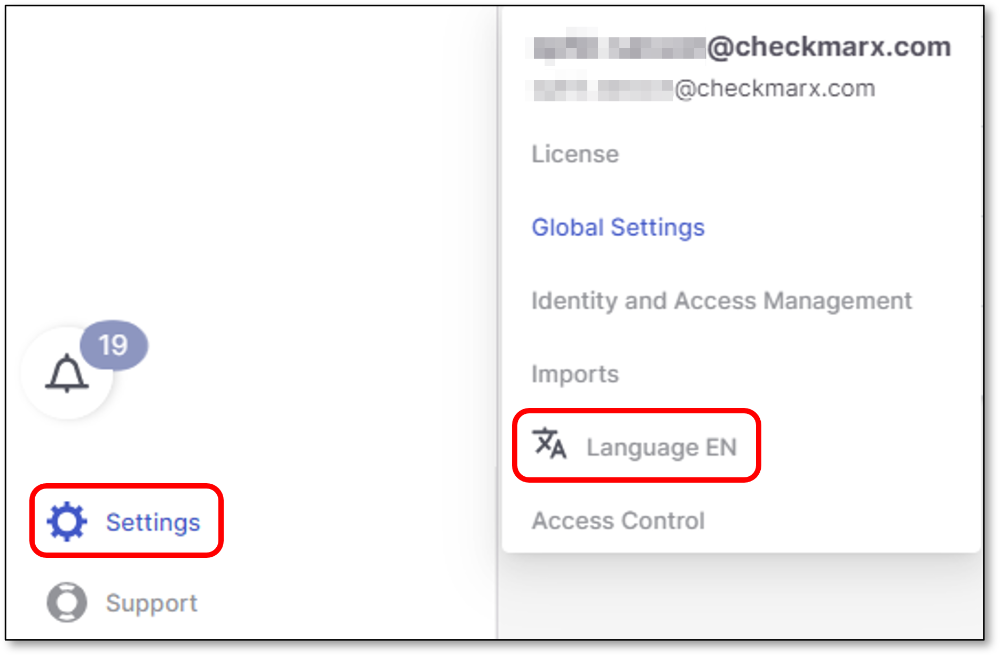
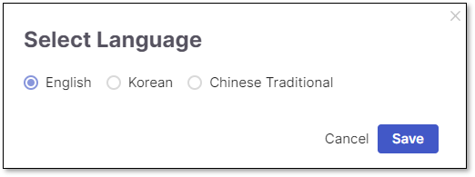

# Introduction

Checkmarx One is the industry's most comprehensive Application Security (AppSec) platform, , allowing you to easily integrate one-click AppSec testing using our industry-leading technology..

The platform is designed for the cloud development generation and is delivered from the cloud. It seamlessly secures your entire codebase, enabling you to deliver and deploy more secure code.


Checkmarx One is not supported on Linux.


## Supported Browsers

Checkmarx One supports the following browsers:

- **Chrome 103 and higher**.

## Supported Languages

Checkmarx One supports the following languages for the user interface:

- English (default)
- Korean
- Chinese Traditional

### Changing Languages

To change the user interface language perform the following:

1. Click on **Settings > Language**

   A dialog opens with the supported languages.

   <figure><figcaption></figcaption></figure>
2. Select the relevant language and click **Save**

   <figure><figcaption></figcaption></figure>

## In this section

- [System Elements](system-elements.md)
- [Checkmarx One Workflow](checkmarx-one-workflow.md)
