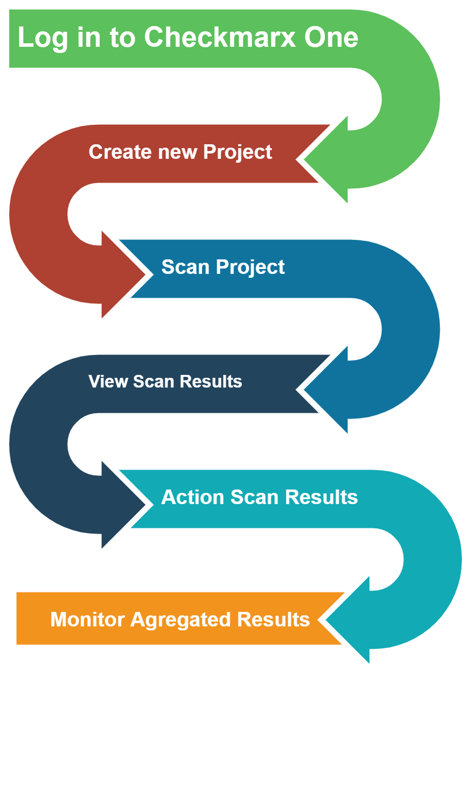

# Checkmarx One Workflow

1. Log in to Checkmarx One.
2. Create at least 1 new project (As scans must run within an existing project).
3. Scan the Project, see [Running a Scan](../scanning-projects/README.md#running-a-scan).
4. Once a scan has been completed, it is possible to view the results. See [Viewing Results](../viewing-scan-results-in-the-results-viewers/README.md).
5. While viewing the scan results, it is possible to take actions that assist tracking the code vulnerabilities.
6. It is also possible to monitor the aggregated results for each system entity.

<figure><figcaption></figcaption></figure>
