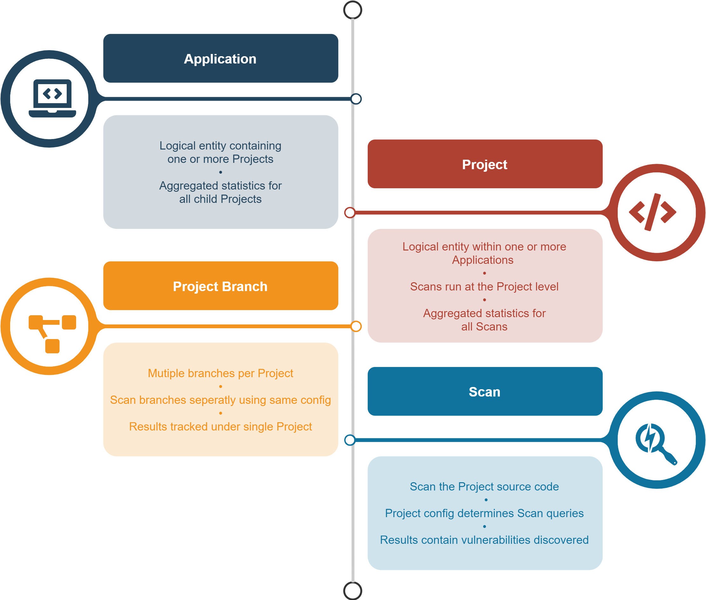

# System Elements

Checkmarx One uses a series of system elements. The following is a description of those system elements:

- **Application**

  - An Application is a logical entity that represents 1 or more Projects. This enables you to view aggregated data for all of the related Projects.
  - The Application configuration includes defining “rules” that determine which Projects are associated with that Application.
  - Aggregated statistics are shown for all Projects within the Application.
- **Project**

  - A Project is a logical entity that represents a source repository, such as a component, microservice, etc. which you intend to scan for vulnerabilities. When you create a Project, you configure the Project settings, including specifying Groups for access control.
  - Projects can be assigned to Applications, together with other related Projects. This enables you to view aggregated data for all of the related Projects.
  - Scans run on the Project level.
  - Aggregated statistics are shown for all scans of the Project.
- **Project Branch**

  - It is possible to create separate “Branches”, meaning different versions of the same fundamental source code, within a Project. This enables the ability to scan each branch separately using the identical scan configuration and tracking the results as a single Project.
- **Scan**

  - A scan runs on the existing Project (or Project Branch), using the Project configuration. The configuration determines which queries to use for the scan.
  - The current version of the source code is uploaded each time that a new scan runs.
  - Results can be viewed showing the vulnerabilities that were discovered for each scan.

<figure><figcaption></figcaption></figure>
