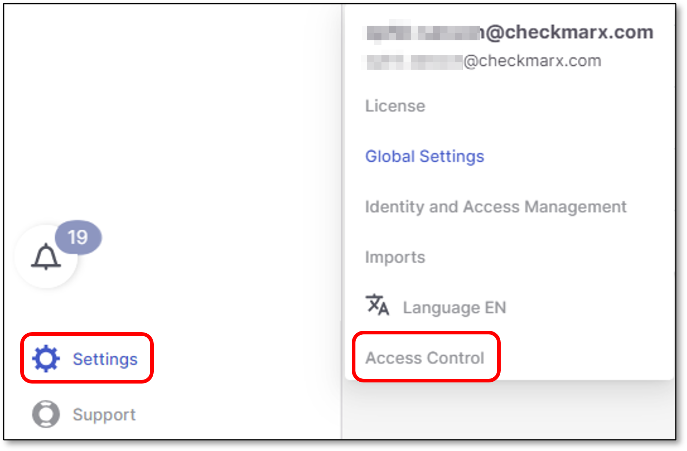
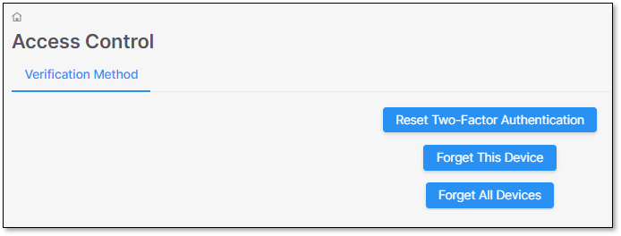

# Access Control

As a precautionary measure in the event of a suspected security incident, Checkmarx One allows the resetting of access control settings. Currently, three reset options are available, each addressing specific security scenarios:

- **Reset Two-Factor Authentication** - This option is useful in the event of a suspected security breach. Upon its activation, the user is automatically logged out. Subsequent login will trigger a reset of the Two-Factor Authentication.
- **Forget this Device** - In situations where a particular device encounters issues or is compromised, this reset option is most suitable. The user is automatically logged out, and upon the next login, the complete login process on the current device is reset, without affecting the Two-Factor Authentication settings.
- **Forget all Devices** - For broader situations such as major policy changes, security incidents, or system-wide updates, use this reset option. During the reset, the all users are automatically logged out, and upon the next login, the complete login process is reset on all the associated devices, without impacting Two-Factor Authentication settings.

To reset access control settings, proceed as follows:

1. Click on **Settings > Access Control**.

   <figure><figcaption></figcaption></figure>
2. Select a suitable reset option.

   <figure><figcaption></figcaption></figure>
