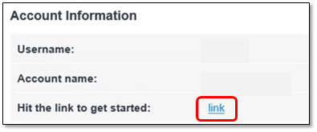
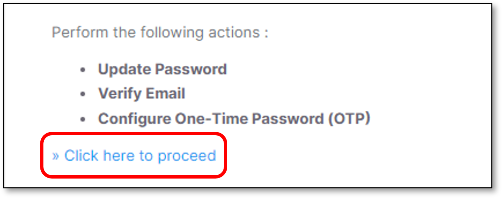
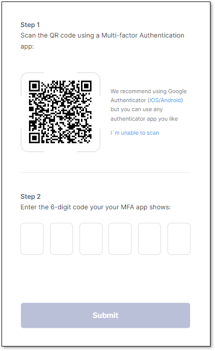
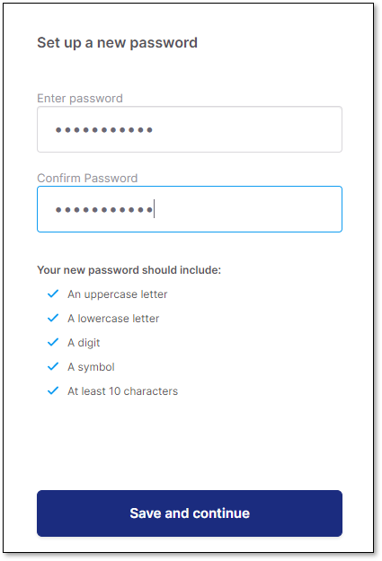
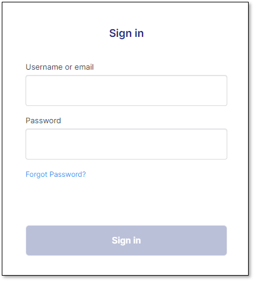
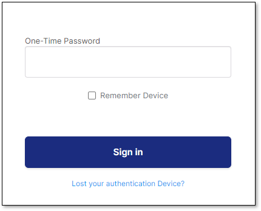
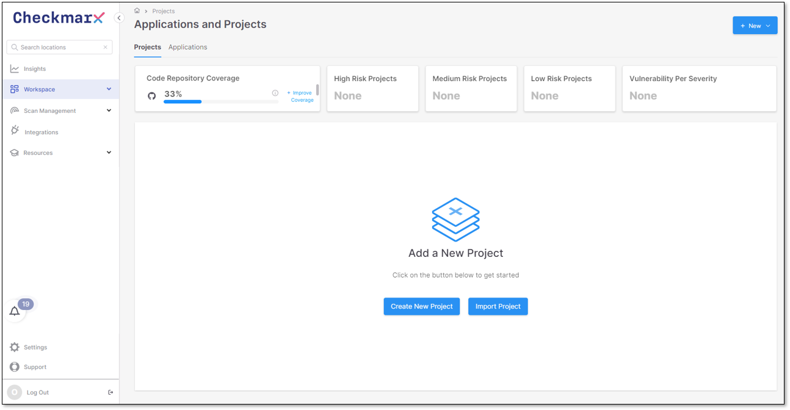

# Initial Log in

## Getting Started


The following procedure relates to the primary Admin for the Tenant account. Other users will receive the required login info from the account Admin once their users have been created in the system.


### Administrator Initial Log in

#### Getting Started

1. Open the **Welcome** email from Checkmarx, which contains the following:

   - **Username**
   - **Account Name**
   - **Link** for the Checkmarx One Application server.
2. Click the **link** to get started

   <figure><figcaption></figcaption></figure>
3. Upon clicking the link the following screen will be presented.

   Click the **Click here to proceed** option

   <figure><figcaption></figcaption></figure>

#### Setting up 2 Factor Authentication

1. Follow the instructions to **set up Mobile Authentication** in order to activate the account.

   It is suggested to use the **Google Authenticator** mobile application.

   <figure><figcaption></figcaption></figure>
2. Perform the following:

   - Type the **6-digit code**
   - Click **Submit**


- After configuring MFA, the system stores your MFA device information.
- In case MFA is configured from a *different* device, the **Device Name** field will appear and it is **mandatory**.


#### Updating the Initial Password


**Password limitations**

The password *must* contain the following:

- Minimum **14 characters** length.
- At least 1 **upper case** character.
- At least 1 **lower case** character.
- At least 1 **digit**.
- At least 1 **special character**.


Perform the following:

1. **Set up** a new password,
2. **Confirm** the password.
3. Click **Save and continue**

   <figure><figcaption></figcaption></figure>

#### Sign in to Checkmarx One

1. In the **Sign in** window perform the following:

   - Type the **Username**
   - Type the **Password**
   - Click **Sign in**

   <figure><figcaption></figcaption></figure>
2. Perform the following

   - Type the **6-digit code** again (The same code as in the Setting up 2 Factor Authentication section)
   - Click **Sign in**

   <figure><figcaption></figcaption></figure>


***Remember device***

- It is optional to check the **Remember device** checkbox. Once checked, the browser data will be saved, so the user will not be asked again to type the **6-digit code** for this browser (For the next log in attempt).
- In case a different browser will be used, this **6-digit code** window will appear again, including the **Remember device** checkbox.
- It is possible to remember up to **2 different devices** (Browsers).


Checkmarx One application home page opens

<figure><figcaption></figcaption></figure>
