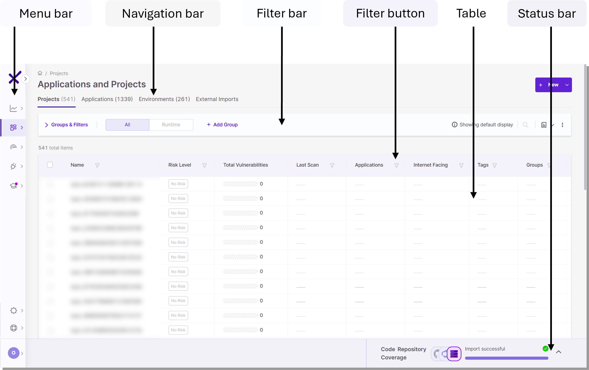
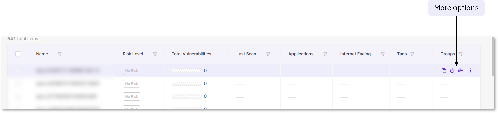

# Workspace Display Elements

Every screen in Checkmarx One has the same basic layout and elements.

For example, below is the **Projects** screen, under **Workspace**.

<figure><figcaption></figcaption></figure>

- **Menu bar** - always present
- **Navigation bar** - unique to each screen
- **Filter & search bar** - unique to each screen
- **Filter buttons** - present in tables
- **Table** - unique to each screen
- **Status bar** - unique to each screen

The **Menu bar** is the only element present in the workspace at all times. Your current location is highlighted in purple. Use it to navigate between screens. If the menu is contracted, as pictured above, then hover over the highlighted area to see or change screens. Expand the menu to see your location at all times.

The **Navigation bar** contains in-page tabs to view different parts of a screen.

The **Filter & search bar** controls grouping and filtering of rows in a table. On most screens, it also has a search.

Click any combination of **Filter buttons** to filter rows.

**Tables** are common to most screens and contain custom columns depending on their data.

The **Status bar** appears on some screens and communicates code repository coverage.

### Hover Elements

Hovering over elements in a table brings up descriptions of them. To see all options for a row, hover over it and click the three dots at the end.

<figure><figcaption></figcaption></figure>
