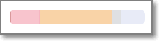

# Managing Applications

A Checkmarx One Application is a logical entity that contains at least one Project.

Each Application can represent a different set of projects, and the projects are grouped in it.

Statistics are aggregated and presented for all the projects that are included in the application.

For every Application that exists in Checkmarx One, the following actions are available:

- [Modifying Application Settings](configuring-applications.md)
- [Deleting Applications](deleting-applications.md)

## Viewing the Applications Tab

The **Workspace** **>** **Applications** page enables you to manage and monitor your Checkmarx One Applications.

The expandable **Filters & Groups** section lets you group the applications list by Risk Level and Business Criticality, and display the applied table filters.

Below that, the Applications pane shows a list of the applications in your account.

The following table describes the information shown for each application and the actions that can be taken.

| **Item** | **Description** | **Possible Values** |
|---|---|---|
| **Selection Box** | Select multiple checkboxes to bulk delete the selected Applications. The **Delete** button appears in the header bar | |
| **Application Name** | The name of the Application. | |
| **Projects** | Lists the number of projects associated with this Application. Click the **Projects** icon to open the side panel and view a quick list of your projects. | |
| **Risk Score** | The risk score of the Application is based on the vulnerabilities that were identified. | 0.1 - 10 |
| **Total Vulnerabilities** | The total number of vulnerabilities identified is shown. Hover over the **severity**  icon to view vulnerabilities broken down by severity level. | |
| **Business Criticality** | The criticality level that the user assigned to the application during creation. | 1 - 5 |
| **Tags** | Tags associated with the Application | |
| **Quick Actions Buttons** - hover over the desired Application to reveal the quick action buttons. | | |
| **All Projects** (shown when relevant) | Hover over the desired Application and click on the **All Projects** link to open the **Application Projects** page. | |
| **Overview** | Hover over the desired Application and click **Overview** to open the **Applications Overview** page. The Applications Overview page presents aggregated information and analytics for an Application. | |
| **Actions Menu**  | | |
| **Application Settings** | Opens the Applications Settings page. | |
| **Delete Application** | Delete the Application. | |

## In this section

- [Creating Applications](creating-applications.md)
- [Configuring Applications](configuring-applications.md)
- [Deleting Applications](deleting-applications.md)
- [Applications Page](applications-page.md)
- [Application Details Page](application-details-page/README.md)
