# Application Details Page

To access the **Application Details** page, hover over the desired application in the **Applications** page and click on 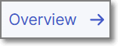.

The **Application Details** page is opened, displaying the following tabs:

- [Overview](#applications-overview) (default)
- [Projects](applications-projects-tab/README.md)
- [Risk Management](risk-management-tab-for-an-application.md)
- [Settings](../configuring-applications.md#general-settings)

## Applications Overview

Applications group multiple projects to a logical entity.

The Applications Overview presents aggregated information and analytics for a group of projects within the framework of an application.

<figure>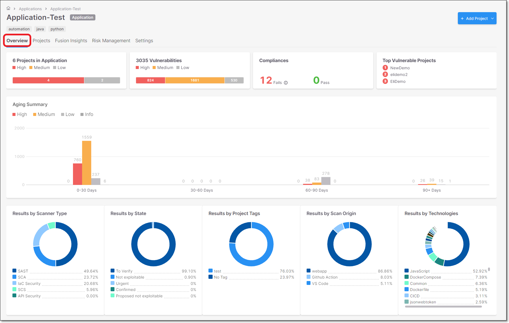<figcaption></figcaption></figure>

### Overview Widgets

#### Projects in Application

The **Projects in Application** widget displays the risk level of each project assigned to the application with a scale of Critical, High, Medium and Low.

The data reflects the last scan in the application for the selected branch.

<figure>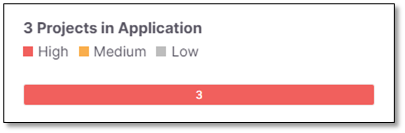<figcaption></figcaption></figure>

#### Vulnerabilities

The **Vulnerabilities** widget display the total number of vulnerabilities from all the Projects' severities (Critical, High, Medium, Low).

This visualization does not include vulnerabilities marked as **Not Exploitable**.

<figure>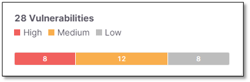<figcaption></figcaption></figure>

#### Compliances

Summarizes the projects compliances.

<figure>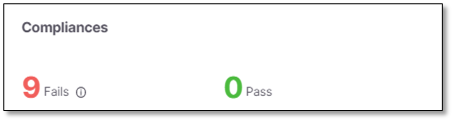<figcaption></figcaption></figure>

Point to  for the list of vulnerability categories in which the vulnerabilities detected in SAST are categorized.

These categories are explained in the table below.

<figure>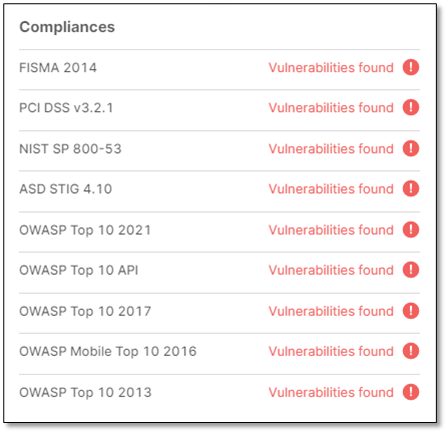<figcaption></figcaption></figure>

| Categories | Description |
|---|---|
| FISMA 2014 | Displays the vulnerabilities associated with categories (2014), as defined by FISMA (Federal Information Security Modernization Act). All vulnerabilities that do not fall into any of the FISMA categories are listed as **Uncategorized**. |
| PCI DSS v3.2.1 | Displays the vulnerabilities associated with categories (DSS v3.2), as defined by PCI (Payment Card Industry). All vulnerabilities that do not fall into any of the PCI categories are listed as **Uncategorized**. |
| NIST SP 800-53 | Displays the vulnerabilities associated with categories (SP 800-53), as defined by NIST (National Institute of Standards and Technology). All vulnerabilities that do not fall into any of the NIST categories are listed as **Uncategorized**. |
| ASD STIG 4.10 | Displays vulnerabilities categorized by the DISA Application and Development STIG once the STIG post-installation script has been run. |
| OWASP Top 10 2021 | Displays the vulnerabilities associated with categories (A1 to A10) that appear in the list of the 10 most serious risks, as defined by OWASP (Open Web Application Security Project). All vulnerabilities that do not fall into any of the OWASP Top 10 2021 categories are listed as **Uncategorized**. |
| **OWASP Top 10 API** | This category specifically addresses API Security and categorizes vulnerabilities that are related to Broken Object Level Authorization, Broken User Authentication, Excessive Data Exposure, Lack of Resources &amp; Rate Limiting, Broken Function Level Authorization, Mass Assignment, Security Misconfiguration, Injection, Improper Assets Management and Insufficient Logging &amp; Monitoring. |
| OWASP Top 10 2017 | Displays the vulnerabilities associated with categories (A1 to A10) that appear in the list of the 10 most serious risks, as defined by OWASP (Open Web Application Security Project). All vulnerabilities that do not fall into any of the OWASP Top 10 2017 categories are listed as **Uncategorized**. |
| OWASP Mobile Top 10 2016 | Displays the vulnerabilities associated with categories (M1 to M10) that appear in the list of the 10 most serious risks, as defined by OWASP (Open Web Application Security Project). All vulnerabilities that do not fall into any of the OWASP Mobile Top 10 2016 categories are listed as **Uncategorized**. |
| OWASP Top 10 2013 | Displays the vulnerabilities associated with categories (A1 to A10) that appear in the list of the 10 most serious risks, as defined by OWASP (Open Web Application Security Project). All vulnerabilities that do not fall into any of the OWASP Top 10 2013 categories are listed as **Uncategorized**. |

#### Top Vulnerable Projects

Presented in word cloud style, where the three top vulnerable Projects are displayed with different risk level colors.

<figure>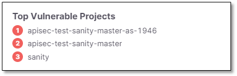<figcaption></figcaption></figure>

#### Aging Summary

The **Aging Report** widget presents the amount of vulnerabilities distributed by severities (Critical, High, Medium, Low) for the first discovery date in a specific time range. The data reflects the last scan in the project for the selected branch.

The widget includes a bar chart presentation with the following parameters.

- **x-axis** - Presents 4 constant time ranges:

  - **0 - 30 days**
  - **30 - 60 days**
  - **60 - 90 days**
  - **90+days**
- **y-axis** - Presents the amount of vulnerabilities.
- **Chart data** - 3 stacked bars per each time range (Critical, High, Medium, Low) with the amount of vulnerabilities per bar type.

  <figure>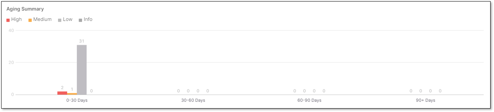<figcaption></figcaption></figure>

#### Results by Scanner Type

The results are displayed as pie charts for all the projects assigned to the application.

They indicate the aggregated number of vulnerabilities found per scan type:

- **SAST**
- **SCA**
- **IaC Security**
- **API Security**

Vulnerabilities flagged with the state of **Not Exploitable** are **not** included.

<figure>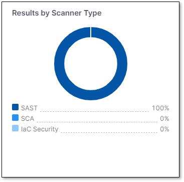<figcaption></figcaption></figure>

#### Results by State

Displays the aggregated number of vulnerabilities per state from all the projects assign to the application.

- **To Verify**
- **Not Exploitable**
- **Proposed Not Exploitable**
- **Confirmed**
- **Urgent**

Vulnerabilities flagged with the **Not Exploitable** state **are** counted, *only for this visualization*.

<figure>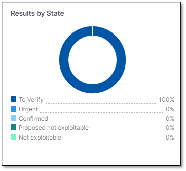<figcaption></figcaption></figure>

#### Results by Projects Tags

Displays the aggregated number of vulnerabilities found per project tag from all the projects assigned to the application.

<figure>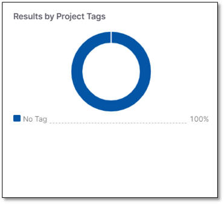<figcaption></figcaption></figure>


Vulnerabilities labeled **Not Exploitable** are not counted.


#### Results by Scan Origin

Displays the aggregated number of vulnerabilities found per scan origin, from all the Projects assigned to the Application.

For example:

- **Jenkins**
- **Github action**
- **Github webhooks**
- **Checkmarx One webscan**
- **CLI**
- **Webapp**

  <figure>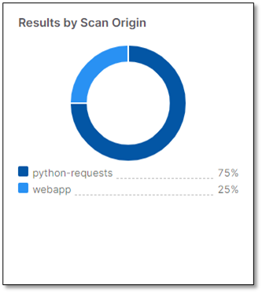<figcaption></figcaption></figure>


Vulnerabilities labeled **Not Exploitable** are not counted.


#### Results by Technologies

Displays the aggregated number of vulnerabilities found per technology from all the Projects assigned to the Application.

The technologies include:

- **Languages**
- **Platforms**
- **Packages**

Multiple versions of the item are aggregated under the same item, but are flagged with the number of versions.

The tooltip lists the versions and any vulnerabilities flagged with the **Not Exploitable** state are **not** counted.

<figure>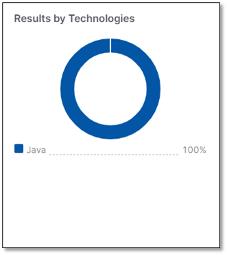<figcaption></figcaption></figure>


Vulnerabilities labeled **Not Exploitable** are not counted.


## In this section

- [Applications Projects Tab](applications-projects-tab/README.md)
- [Risk Management Tab for an Application](risk-management-tab-for-an-application.md)
