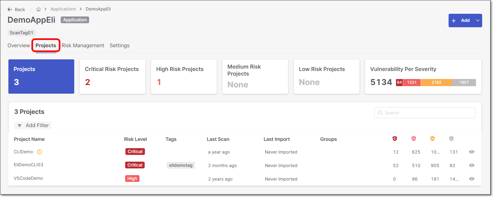

# Applications Projects Tab

The **Projects** tab displays all the projects assigned to the application.

<figure><figcaption></figcaption></figure>

The widgets at the top of the page indicate the total number of items in each of the following categories:

- **Projects** - The total number of Projects in the Application
- **Critical Risk Projects** - The number of Projects with Critical Risk level
- **High Risk Projects** - The number of Projects with High Risk level
- **Medium Risk Projects** - The number of Projects with Medium Risk level
- **Low Risk Projects** - The number of Projects with Low Risk level
- **Vulnerability Per Severity** - The total number of vulnerabilities in the Application, featuring a color-coded bar that visually breaks down of the vulnerabilities based on their severity

## In this section

- [Applications Projects Table](applications-projects-table.md)
