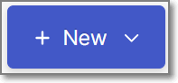
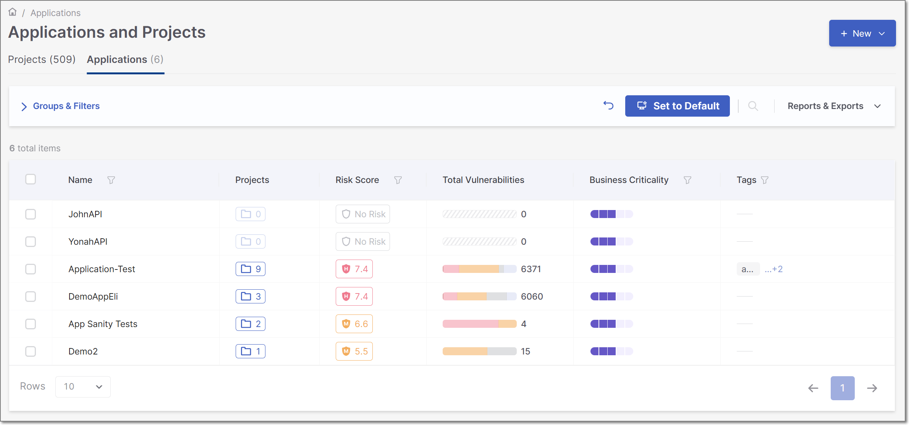
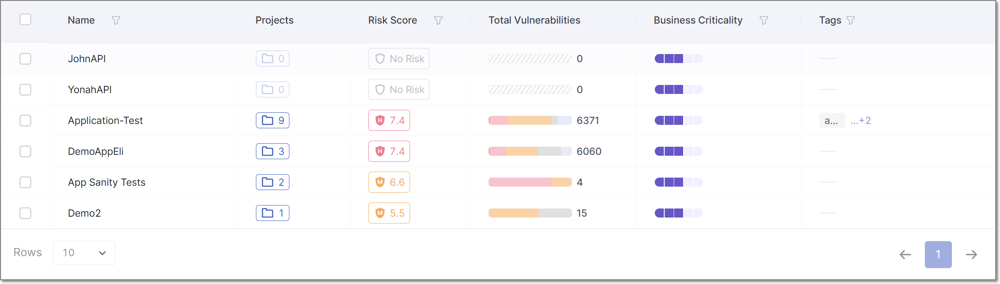
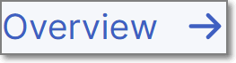
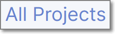
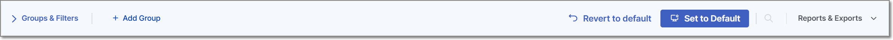

# Applications Page

The **Workspace** **>** **Applications** page enables you to manage and monitor your Checkmarx One Applications.

The **Applications** page contains the following elements:

- The **New**  action button, for creating new applications. For more information, refer to [Creating Applications](creating-applications.md).
- The **Applications Pane**.
- **Application Actions**
- **Application Header Bar** - includes tools for filtering the Applications Pane view, and exporting Application reports.

<figure><figcaption></figcaption></figure>

The following sections describe each component of the Applications page in more detail.

## The Applications Pane

The **Applications Pane** shows a list of the Applications in your account. Each row in the table represents a single application, including a summary of the total number of projects associated with it, as well as the application’s overall risk score and total vulnerability counts. For more details on the application columns, see [here](README.md#viewing-the-applications-tab). The table is customizable and searchable and can be exported as a .csv file for easy sharing or manipulation in an Excel worksheet.

### Customizing the Applications Pane

Hone in on your Applications by customizing the Applications Pane view. By default, the table displays 10 applications per page, as specified in the **Rows** dropdown. You can adjust this setting to display 10, 20, or 50 applications per page. Use **Groups**, **Filters**, and **Sorting** to further refine and organize the table view according to your preferences.

- **Groups**: The table view can be grouped by the applications' **Risk Levels** or **Business Criticality**. To enable grouping, follow these steps:

  1. Click  then
  2. Select the **Risk Level** group, the **Business Criticality** group, or both..
  3. Click **Select**.
- **Filters**: Filtering can be applied to single or multiple columns in the table. To enable filtering for a single column, click the **Filter**  icon next to the desired column header. Set the filter conditions and click **Apply**. The table will then be filtered accordingly, and the applied filters will be added to the filters box above the table.

  To remove filters:

  - **If only one filter is applied:** Click the **Filter**  icon again, clear the filter conditions, and click **Apply**.
  - **If multiple filters are applied:** A **Clear All** option will appear next to the filters displayed in the filters box above the table. Click **Clear All** to remove all active filters at once,
- **Sorting**: For supported columns, clicking the column header cycles through the available sort states: **ascending, descending**, and **no sort**. Columns that do not support sorting will not respond to header clicks.

### Set Default Table Display

When you customize the display of a table by changing the grouping, applying a filter, sorting the results etc., the  button appears at the top of the page. Click on this button to save this view as your default. Each time that you log in to your account your **Default** view will be displayed.

If you then make changes while showing your customized **Default** view, a **Revert** button appears next to the **Set to Default** button . This will return you to the previously set **Default** view.

Alternatively, you can click on  again to set the current view as your Default. This will override and permanently delete the previous **Default** view.


Pagination and branch selection are not included in the **Default** view, as these tend to relate to a specific session.


## Application Actions

All actions available for a single Application appear upon hovering over the Application row in the table. There are two types of actions available:

- **Quick Actions** - Actions automatically displayed upon hovering.
- **Actions Menu** - Actions that are found in the Actions Menu by clicking on the  icon at the end of the row.

### Quick Actions

- The total number of detected vulnerabilities in the application's projects is displayed in the **Total Vulnerabilities** column. Hovering over the vulnerability severity distribution bar displays a split of the vulnerabilities per severity.

  <figure><figcaption></figcaption></figure>
- The total number of projects in the application is diaplayed in the **Projects** column. Clicking on the projects  icon displays the **Application Projects** side panel. The side panel shows a list of all projects in the application. You can hover over any project and click **View Project** to open that project's **Project Overview** page.
-  - Hover over the desired Application and click **Overview** to open the **Applications Overview** page. The Applications Overview page presents aggregated information and analytics for an Application.
-  - Hover over the desired Application and click on the **All Projects** link to open the **Application Projects** page.

### Actions Menu

- **Application Settings** - Opens application settings.
- **Delete Application** - Deletes the application. For more information on deleting applications, see [Deleting Applications](deleting-applications.md).

## Applications Header Bar

The Applications Header bar shows information about grouping and filters applied to the items displayed on the page. It also includes four action buttons: **Set to Default,** **Revert to default,** **Reports & Exports** and **+ Add Group**.

The following table describes the items in the Header Bar

| **Item** | **Description** |
|---|---|
| **Groups & Filters** | A list of the grouping and filters applied to the items displayed. Click on the arrow next to the words **Groups & Filters** to display the selected groups and filters. |
| **+ Add Group** | Groups the Application Pane display by category. See **Groups** in the **Customizing the Applications Pane** section above. |
| **Set to Default** | Saves your current view configuration — including any selected groups and filters — as the new default. From now on, whenever you open this page, these saved groups and filters will automatically be applied. |
| **Revert to default** | Restores the default view to its original configuration, removing any custom default settings you’ve previously saved. |
| **Search** | Clicking on the **Search** icon expands a search bar, allowing you to quickly locate an Application by name or keyword. |
| **Reports & Exports** | Clicking on the **Reports & Exports** menu item displays a drop-down list with the following options: • **Application Report** - Creates a detailed list of all open vulnerabilities in the Application • **Export this table (CSV)** - Exports a CSV file containing the full table data • **SBOM Report** - Exports a Software Bill of Materials (SBOM) report |
