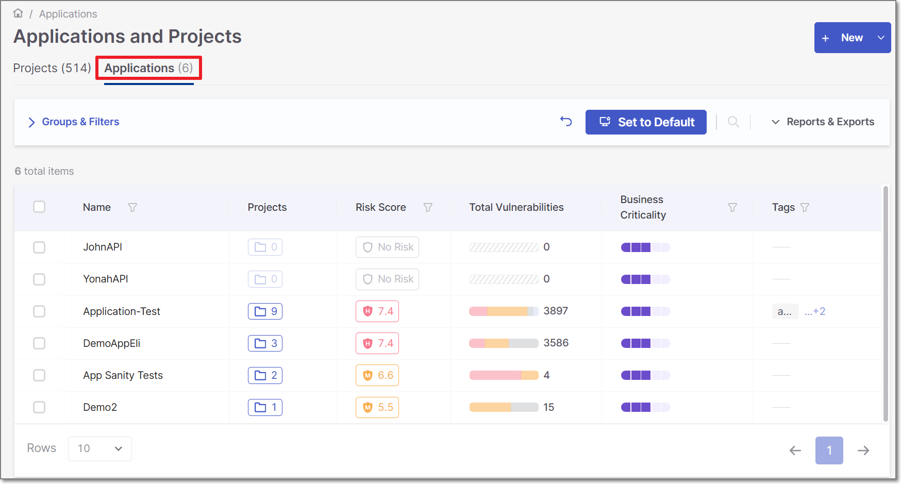
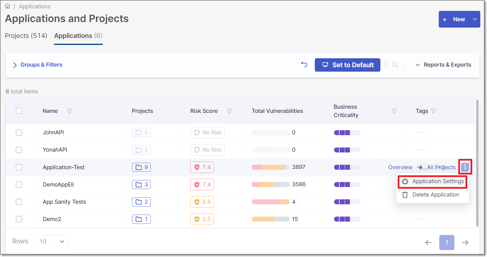
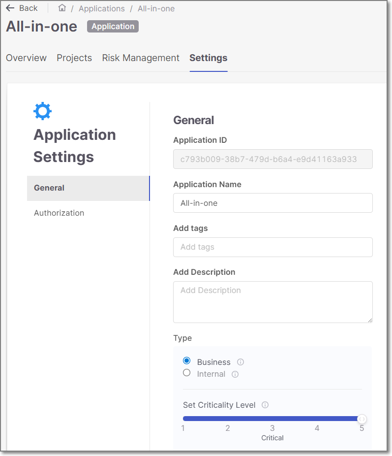

# Configuring Applications

## Open Application Settings

1. In the **Applications and Projects** home page, click on **Applications** tab.

   <figure><figcaption></figcaption></figure>
2. Click on **Actions** icon **→** **Application Settings**.

   <figure><figcaption></figcaption></figure>

## General Settings

<figure><figcaption></figcaption></figure>

The Application Settings **general** tab contains the application's basic settings.

The screen includes the following configuration fields:

- **Application ID** (Read only).
- **Application Name**.
- **Add tags** (Optional) - Assign tags to an application. Tags are very useful for projects filtering purposes.

  Tagging has no dependencies in any other component, and it is possible to configure any required value.
- **Add Description** (Optional).
- **Type** - Classify the application’s purpose by marking it as **Business** or **Internal**.

  - **Business**: Applications that are externally facing or directly support key business functions. Security issues in these apps can lead to customer impact, revenue loss, or reputational damage — and must be prioritized in ASPM.
  - **Internal**: Applications used solely within the organization, with no direct customer exposure or business-critical operations. Security issues may pose operational risks but do not have immediate business impact.

  Marking an application as **Business** increases its priority within the ASPM risk calculation.
- **Set Criticality Level** - Set the Application criticality level. This score is the level your organization assigns to the application, independent of your scan results. This will impact the calculation of the overall risk score of this application under Application Risk Management.

  
  Criticality level for applications marked as **Internal** is automatically set to one and cannot be changed by the user.
  

  There are 5 possible criticality levels:

  - **1** = None
  - **2** = Low
  - **3** = Medium
  - **4** = High
  - **5** = Critical
