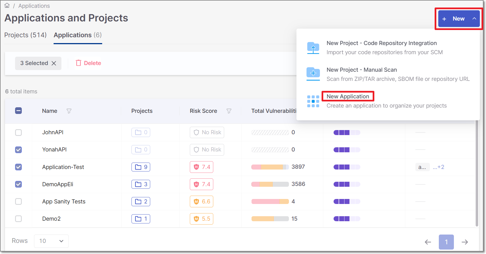
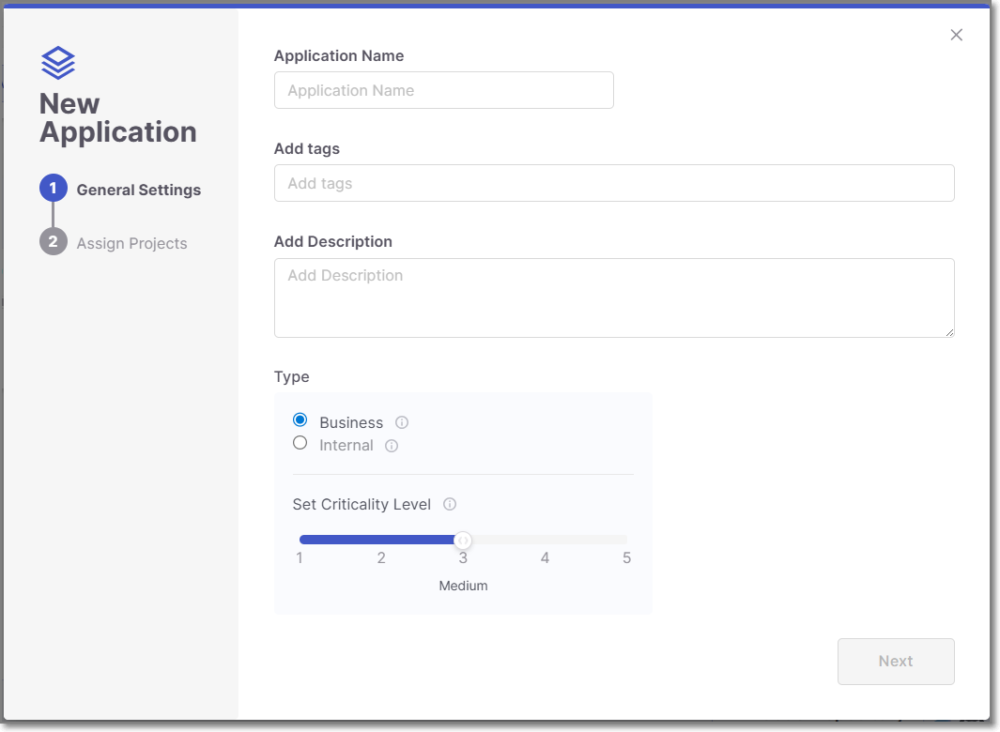
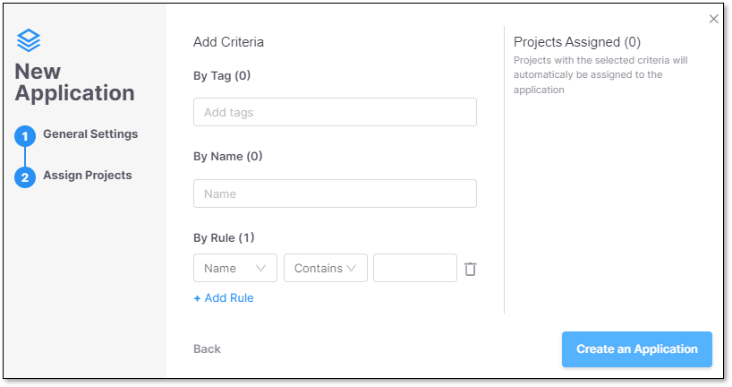
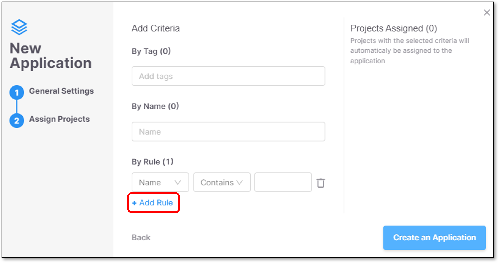
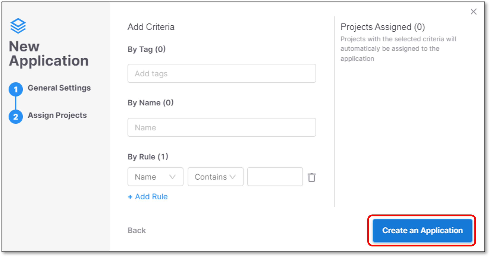
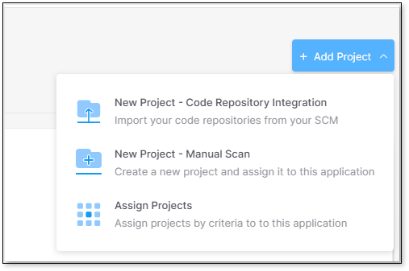
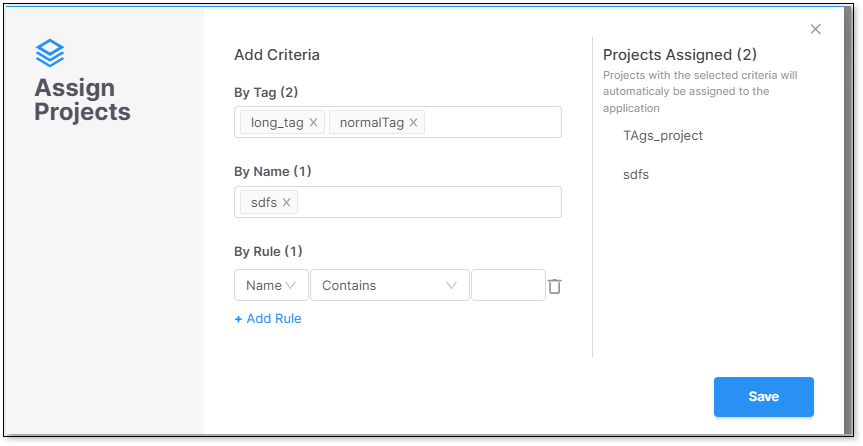

# Creating Applications

Once successfully logged in to Checkmarx One, the **Applications and Projects** screen (home page) will be opened.

To create a new Checkmarx One Application, perform the following:

1. Navigate to the **Applications and Projects** page by selecting **Workspace** **>** **Applications** in the main navigation panel.
2. In the **Applications and Projects** page, click on **New > New Application**.

   <figure><figcaption></figcaption></figure>

   The **New Application** screen opens.

   <figure><figcaption></figcaption></figure>
3. In the **New Application** screen, configure the following:

   - **Name** the Application.
   - **Add tags** (Optional) - Assign tags to an Application. Tags are very useful for filtering purposes.

     Tags are independent of other Checkmarx One components — you can create any tag value you need without restriction.
   - **Add Description** (Optional) - Application description.
   - **Type** - Classify the application’s purpose by marking it as **Business** or **Internal**.

     - **Business**: Applications that are externally facing or directly support key business functions. Security issues in these apps can lead to customer impact, revenue loss, or reputational damage — and must be prioritized in ASPM.
     - **Internal**: Applications used solely within the organization, with no direct customer exposure or business-critical operations. Security issues may pose operational risks but do not have immediate business impact.

     Marking an application as **Business** increases its priority within the ASPM risk calculation.
   - **Set Criticality Level** - Set the Application criticality level. This score is the level your organization assigns to the application, independent of your scan results. This will impact the calculation of the overall risk score of this application under Application Risk Management.

     
     Criticality level for applications marked as **Internal** is automatically set to one and cannot be changed by the user.
     

     There are 5 possible criticality levels:

     - **1** = None
     - **2** = Low
     - **3** = Medium
     - **4** = High
     - **5** = Critical
4. Click on **Next**.

   The **Assign Projects** tab is displayed.
5. In the **Assign Projects** screen it is optional to assign projects to the Application according to the following conditions:

   - Assign Projects **by Project Tags** - Clicking the field will open a drop-down list containing all the projects tags.
   - Assign Projects **by Project Name** - Clicking the field will open a Drop-down list containing all the projects names.
   - Assign Projects **by Project Rule** - The Project name can be one of the following options:

     - **Contains** a specific character.
     - **Starts with** a specific character.
     - **Regex** - Regular Expression.
6. <figure><figcaption></figcaption></figure>

   You can also add more Rules using the **+ Add Rule** option.

   <figure><figcaption></figcaption></figure>
7. Click on **Create an Application**.

   <figure><figcaption></figcaption></figure>

   The Application is successfully created.

## Editing the Assigned Projects Parameters

You can edit the assigned project parameters by doing the following:

1. Navigate to the application you want to edit, click **+Add Project**, then **Assign Projects**.

   <figure><figcaption></figcaption></figure>
2. The **Assign Projects** window opens. Edit or add to the parameters as shown in the example image below and save:

   <figure><figcaption></figcaption></figure>
