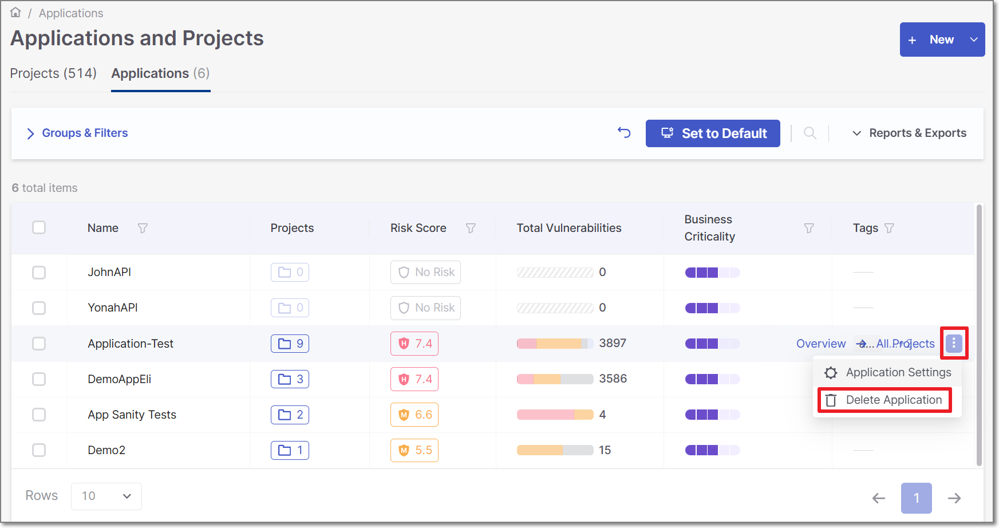
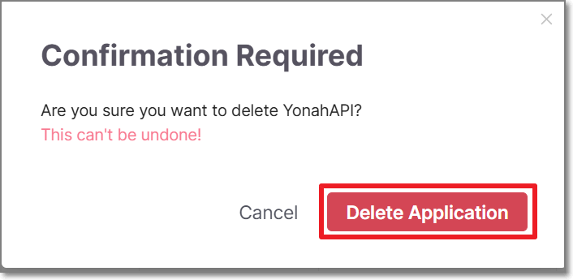
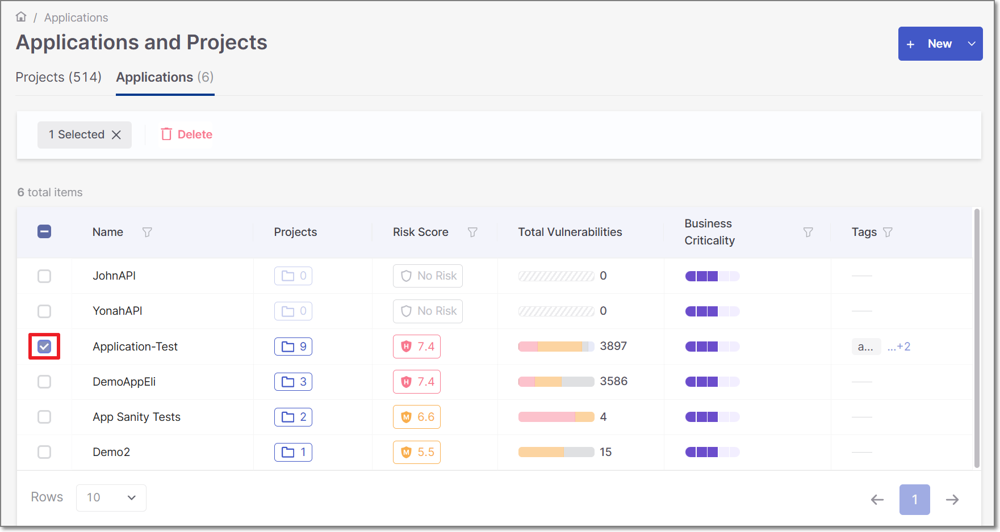
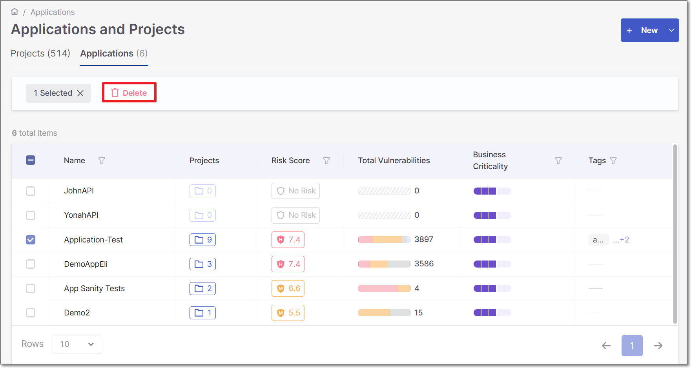
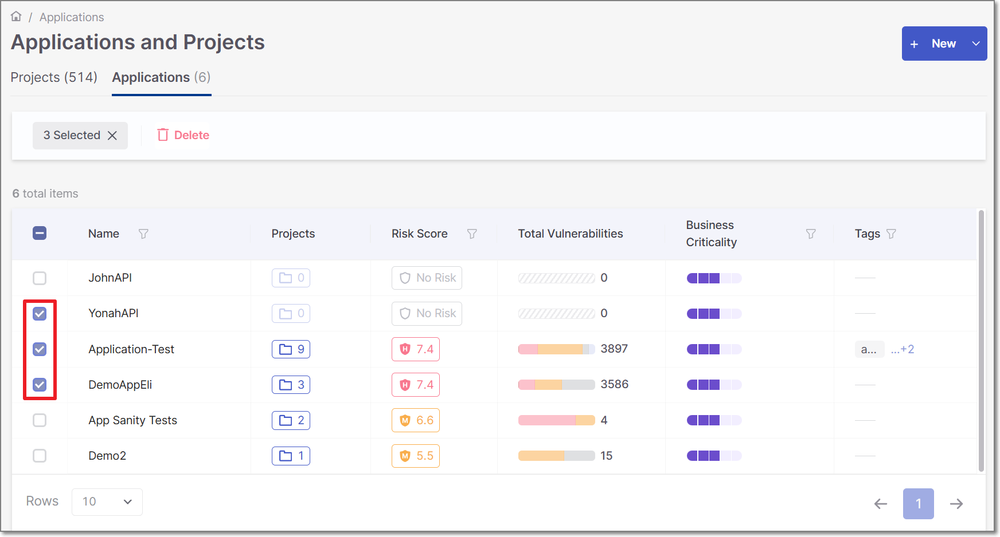
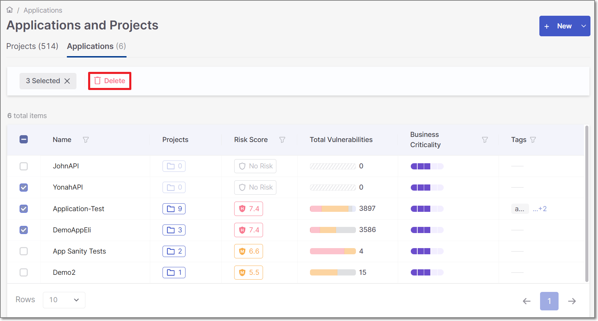

# Deleting Applications


An Application is a logical entity that represents a different set of Projects.

Statistics are aggregated and presented for all the Projects that are included in the Application.

Once an Application is deleted, the below will be deleted *only* from the Application view.

- All the Project that are included in the Application.
- All the Projects scans.
- All the scans results.

The Projects/scans ***will not*** be deleted from the Projects view.


## Deleting a Single Application

To delete an Application in Checkmarx One, perform the following:

### Option 1

1. Click on **Application and Projects → Applications** tab **→ Actions** icon **→** **Delete**

   <figure><figcaption></figcaption></figure>

   A deletion confirmation window will appear
2. In the **Delete Application** window click **Delete**

   <figure><figcaption></figcaption></figure>

### Option 2

1. Select an Application for deletion by marking the Application’s checkbox

   <figure><figcaption></figcaption></figure>

   A **Delete** option will be added to the window
2. Click the **Delete** option

   <figure><figcaption></figcaption></figure>

   A deletion confirmation window will appear
3. In the **Delete Applications** window click **Delete**

   <figure><figcaption></figcaption></figure>

## Deleting Multiple Applications

To delete multiple Applications in Checkmarx One, perform the following:

1. Select multiple Applications for deletion by marking the Application’s checkboxes

   <figure><figcaption></figcaption></figure>
2. Click the **Delete** option

   <figure><figcaption></figcaption></figure>

   A deletion confirmation window will appear
3. In the **Delete Applications** window click **Delete**

   <figure><figcaption></figcaption></figure>
