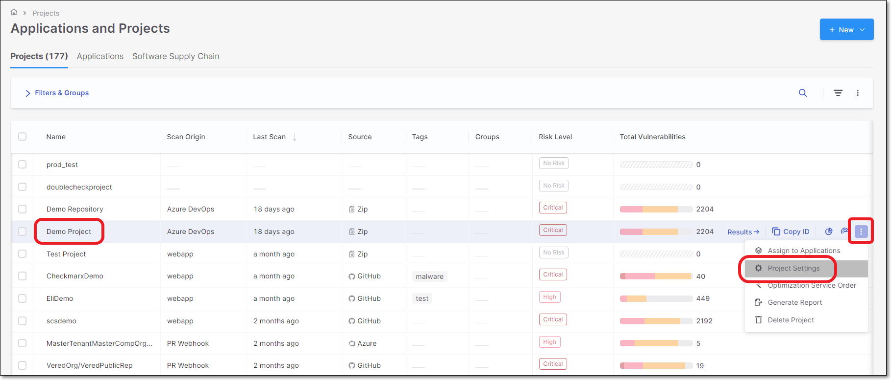
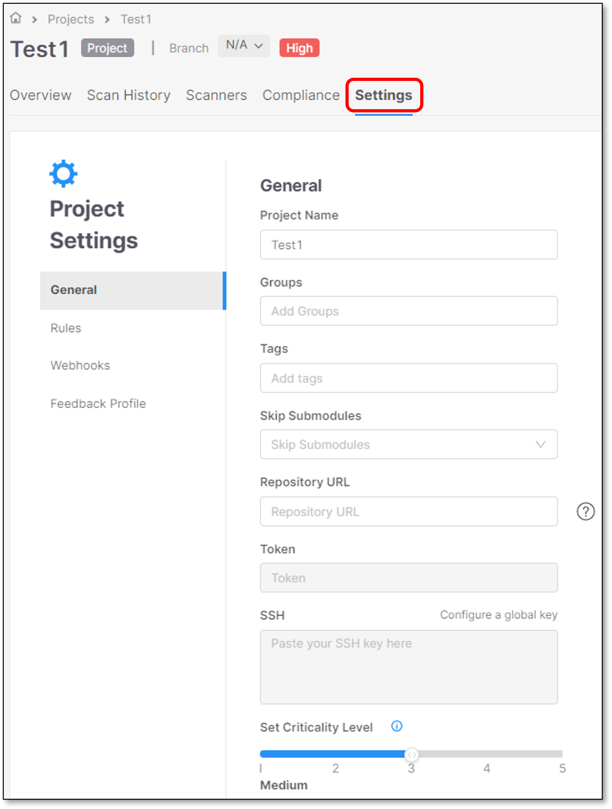
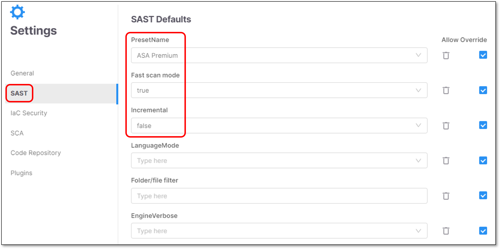
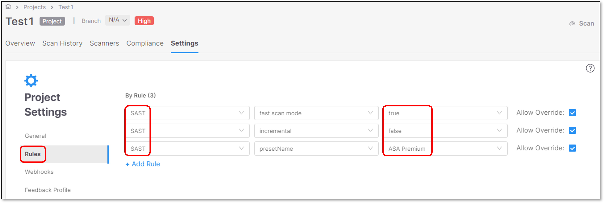
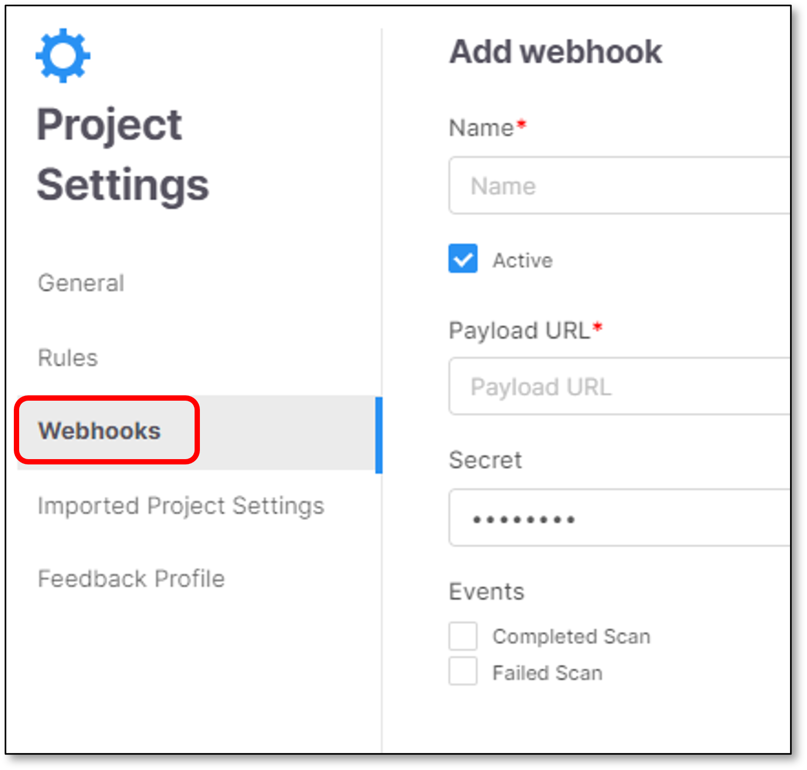
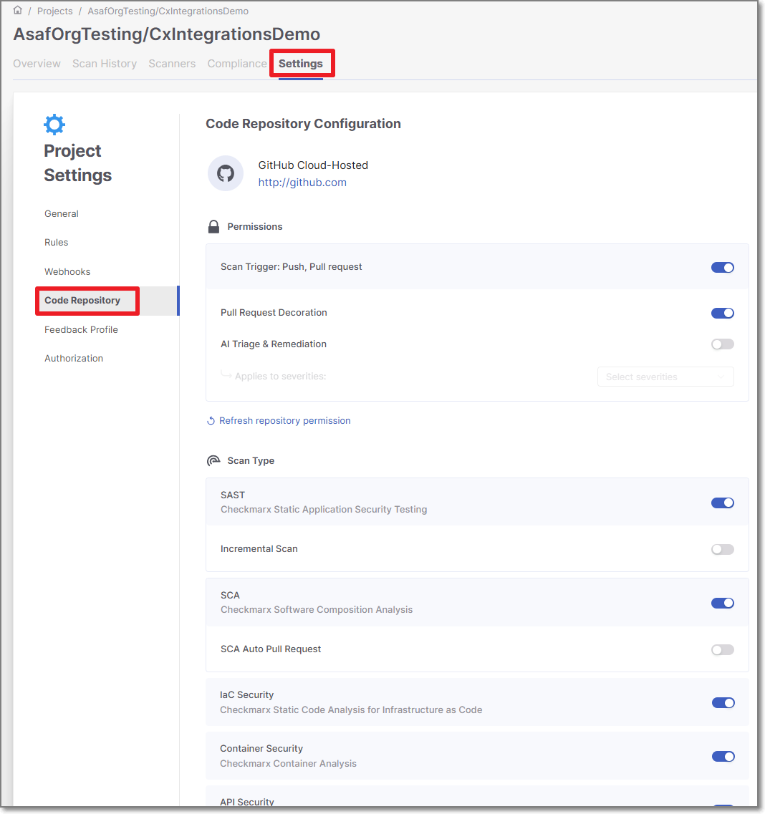
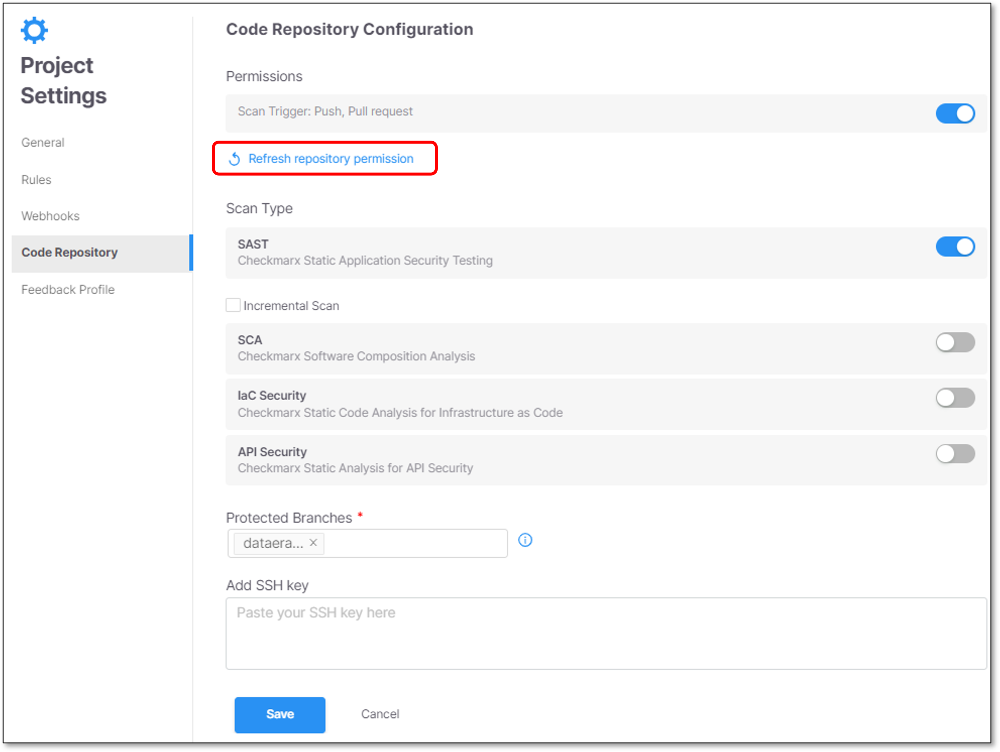
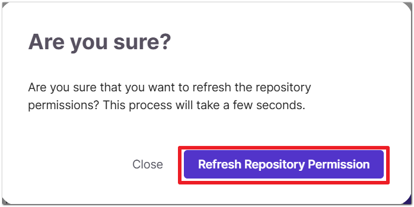
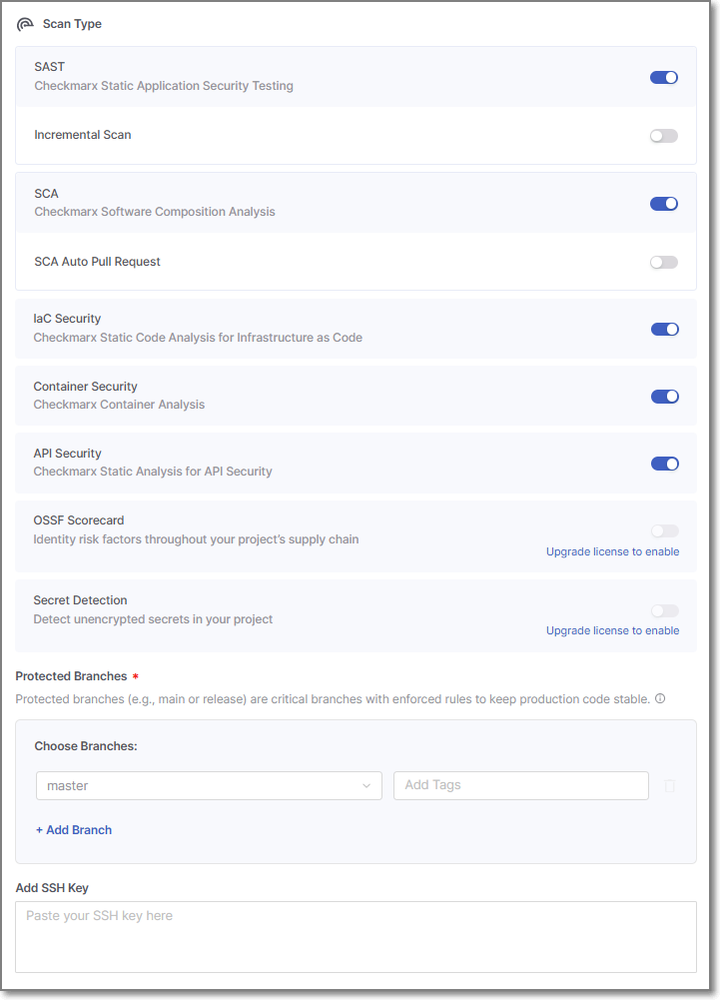
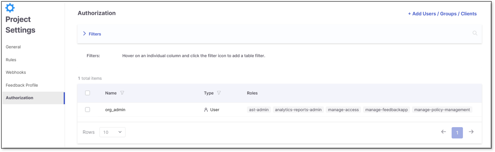

# Configuring Projects

## Open Project Settings

In the **Applications and Projects** home page, click on **Actions** icon **→Project Settings**.

<figure><figcaption></figcaption></figure>

## General Settings

The General section of Project Settings contains the following basic settings for the project:

<figure><figcaption></figcaption></figure>

- **Project Name** - The name of the project that you assigned.
- **Groups** (optional) - This setting allows you to assign groups to a project.

  When a group is assigned to a project, all members of that group are able to perform various actions in the project, including scanning source code and viewing results.
- **Project Tags** (optional)

  Assign tags to a project

  - Tags are useful for filtering projects.
  - Tags have no dependencies in any other component, and it is possible to configure any required value.
  - Tags are not shared across projects.

    **For example:** Projects A and B contain **Test** tag. Upon a change in project A tag, project B will not be affected and will remain with the same **Test** tag.
  - Tags can be used for overriding **Jira feedback app** fields values. For additional information see Fields Override.
  - Tags values can be updated by clicking the tag and updating its value.

  
  **Tag Format and Behavior**

  Tags are stored internally as `key:value` pairs.

  - Supported input formats:

    - `key` → stored as `key:""`
    - `key:value`
  - Tags are unique by **key**, not by full string. Multiple tags with the same key cannot coexist.
  - When multiple tags with the same key are provided, the **last submitted tag overrides previous ones**.

    **Examples**:

    - `TEST123` + `TEST123:sample` → only the last one is kept.
    - `TEST123:sample` + `TEST123` → only the last tag is kept.

  - The max. allowed characters per tag is 250, including the entire string (key or key:value).
  - Commas are not allowed as part of a tag.
  
- **Skip Submodules** (optional) - Enable this option to skip scanning repository submodules during project scans. By default, this option is set to `false`.
- **Enable Source Code Management** - Enable this option to delete the source code of your scans and stop storing the source code of your future scans, either partially or entirely. Once deleted, the source code cannot be restored unless you disable this feature and run a new scan. Also enabling this option will prevent your access to features that rely on the full source code like Incremental Scans, Query Editor, and [AI Triage & Remediation](../managing-triaging-vulnerabilities/ai-triage-remediation.md).
- **Repository URL** - The repository URL from which the source code for this project is scanned by default. This value can be added when creating a Manual Scan project that scans coder from a Repository URL.
- **Token** - The default token for private repository URLs.
- **SSH** - Create and add your SSH key.
- **Set Criticality Level** - This is a user-controlled attribute that reflects how you perceive the importance of the project in your organization. It does not affect any automated risk or vulnerability calculations. The following options are available: None, Low, Medium (the default), High, and Critical.

  The criticality level appears in the [Project Overview](viewing-the-project-details-page.md#project-overview) page.

## Project Rules

**Project Rules** allow the user to set parameters on the Project level.

Project configuration parameters are higher than the same parameter’s configuration via [Configuring Scanner Default Settings](../configuring-account-settings/global-account-settings/README.md) (Global Settings).

This means that the parameters will apply to all the scans in the project, overriding the values configured in the Global Settings.

### Limitations

- API Security does not support project rules at present.
- Parameters that are configured via [Configuring Scanner Default Settings](../configuring-account-settings/global-account-settings/README.md) (Global Settings) will appear as a configurable option in the Project Settings only if the user set them to **Allow Override**.
- In case that **Allow Override** isn’t enabled for a specific parameter in the [Configuring Scanner Default Settings](../configuring-account-settings/global-account-settings/README.md) (Global Settings), it won’t appear as a configurable option on the Project Settings level. Rather, the project will automatically inherit the value of that parameter from the Global configuration.
- **Allow override** is selected by default for all the rules under **Project Settings**. This allows the parameters to be overriden in higher level configurations, such as scan level configuration.
- It isn’t possible to configure the same parameter twice (on the same configuration level).
- Each scanner has a different set of parameters.


- Clicking the icon clears the configuration field.
- Checking  allows overriding the same parameter in a higher level of configuration.

  For more information, refer to [Configuring Projects Using Config as Code Files](configuring-projects-using-config-as-code-files/README.md).


In the following example, three parameters were set in the **Global Settings**: Preset name, Fast scan mode and Incremental. The *allow override* checkbox is selected, allowing further configuration on the Project level.

<figure><figcaption></figcaption></figure>

These same parameters appear as configurable options in the **Project Settings**. The parameters inherit their default values from the Global Settings and can be reconfigured here to override those settings for this specific project:

<figure><figcaption></figcaption></figure>

If a greyed-out **defaultConfig.xml** file appears in the **Project Settings**, it indicates that customized settings for the default configuration were implemented at the tenant level with the intention of improving scan results or to assist in troubleshooting issues. Once these settings are established, they are automatically applied to every project. For additional information, reach out to support or contact your Product Account Manager (PAM) directly.

To add a new rule click **+ Add Rule**.

### Scanners Parameters Configuration Options

#### SAST Scanner Parameters

The table below presents all the optional parameters for the SAST scanner and their optional values.


There is an additional configuration option for filtering, which compliance results to show. This can currently only be configured via REST API. See [API documentation](https://checkmarx.stoplight.io/docs/checkmarx-one-api-reference-guide/branches/main/cs61sszap44td-scan-configuration-service#compliance-filtering).



CLI flags are submitted on the scan level with the [scan create](../../cli-tool/checkmarx-one-cli-commands/scan/scan-create.md) command. API configs can be configured on the account or project level using the [Configuration](https://checkmarx.stoplight.io/docs/checkmarx-one-api-reference-guide/branches/main/cs61sszap44td-scan-configuration-service) API or on the scan level as part of the request body of the [POST /scans](https://checkmarx.stoplight.io/docs/checkmarx-one-api-reference-guide/branches/main/cs61sszap44td-scan-configuration-service) API. When using the POST /scans API the `scan.config.sast` prefix is left out.


| **Parameter** | **Values** | **Notes** | CLI | API | Config as Code |
|---|---|---|---|---|---|
| **PresetName** | All the available SAST Presets that exist in the system | • For the full Presets list (including descriptions) go to the following link:<br>Predefined Presets<br>• The default preset that is used is **ASA Premium** | `--sast-preset-name boolean` | `scan.config.sast.presetName`<br>` {`<br>` "key": "scan.config.sast.presetName",`<br>` "value": "ASA Premium",`<br>` "allowOverride": true`<br>` }` | `presetName` |
| **Fast scan mode** | true / false | By default, the Fast Scan mode is set to **true**.<br>For more information, refer to [Fast Scan Mode](#fast-scan-configuration). | `--sast-fast-scan boolean` | `scan.config.sast.fastScanMode`<br>` {`<br>` "key": "scan.config.sast.fastScanMode",`<br>` "value": "true",`<br>` "allowOverride": true`<br>` }` | `fastScanMode` |
| **Findings Analysis** | true/false | An optional capability that automatically classifies scan results and filters out results identified as unlikely to be relevant. When enabled, the results viewer shows only findings classified as relevant, helping analysts focus on actionable risks.<br>For more information, refer to SAST Findings Analysis. | | `{`<br>` "key": "scan.config.sast.findingsAnalysis",`<br>` "value": "true",`<br>` "allowOverride": true`<br>`}` | `findingsAnalysis` |
| **LLM-based scanning** | true/false | Configure to activate LLM-based scanning on SAST scans. | | `{"key": "scan.config.sast.extendedAnalysis","value": "true","allowOverride": true}` | `extendedAnalysis` |
| **Light queries** | true/false | Determines whether the scan should be performed using light queries or standard queries. Light Queries are simplified versions of standard queries focusing on the most urgent vulnerabilities, helping you spot threats faster.<br>For more information, refer to [Light Queries](#light-queries).<br>• When set to `true`, SAST will scan using light queries, quickly focusing on the most immediate and exploitable weaknesses.<br>• When set to `false`, SAST will not scan using light queries; it will scan using standard queries. | `--sast-light-queries` | `scan.config.sast.lightQueries`<br>` {`<br>` "key": "scan.config.sast.lightQueries",`<br>` "value": "true",`<br>` "allowOverride": true`<br>` }` | `lightQueries` |
| **incremental** | true / false | Determines whether the scan should be performed incrementally or as a full scan.<br>• When set to `true`, SAST will only scan the code changes made since the last scan, significantly reducing the scan time and resource usage.<br>• When set to `false`, SAST will perform a full scan. Full scans are more comprehensive but take longer to complete and use more resources. | `--sast-incremental boolean` | `scan.config.sast.incremental`<br>` {`<br>` "key": "scan.config.sast.incremental",`<br>` "value": "true",`<br>` "allowOverride": true`<br>` }` | `incremental` |
| **Recommended exclusions** | true / false | Determines whether the system should automatically exclude certain files and folders from the scan. Enabled by default.<br>By default, recommended exclusions is set to **true**.<br>• When set to `true`, SAST applies predefined exclusions, allowing developers to scan faster and focus on the most relevant code areas.<br>• SAST will include all files and directories in the scan when set to `false`. | --sast-recommended-exclusions | `scan.config.sast.recommendedExclusions`<br>` {`<br>` "key": "scan.config.sast.recomendedExclusions",`<br>` "value": "true",`<br>` "allowOverride": true`<br>` }` | `recommendedExclusions` |
| **LanguageMode** | primary / multi | For more information, see:<br>Specifying a Code Language for Scanning<br>Supported Code Languages and Frameworks:<br>• Click Engine Pack Versions and Delivery Model.<br>• Select the latest EP (Engine Pack) Supported Code Languages and Frameworks.<br><br>By default, the languageMode is **Multi**.<br> | | `scan.config.sast.languageMode`<br>` {`<br>` "key": "scan.config.sast.languageMode",`<br>` "value": "primary",`<br>` "allowOverride": true`<br>` }` | `languageMode` |
| **Folder/file filter** | Allow users to select specific folders or files to include or exclude from the code scanning process. | • Including a file type - \*.java<br>• Excluding a file type - !\*.java<br>• Use “,” sign to chain file types<br>for example: \**.*java*,*\*.js<br>• The parameter also supports including/excluding folders.<br>• regex is not supported. | `--sast-filter <string>` | `scan.config.sast.filter`<br>` {`<br>` "key": "scan.config.sast.filter",`<br>` "value": "*.java",`<br>` "allowOverride": true`<br>` }` | `filter` |
| **EngineVerbose** | true / false | • true = Enables PRINT_DEBUG mode.<br>• false = Enables PRINT_LOG mode. | | `scan.config.sast.engineVerbose`<br>` {`<br>` "key": "scan.config.sast.engineVerbose",`<br>` "value": "true",`<br>` "allowOverride": true`<br>` }` | `engineVerbose` |
| **Results scope level** | Project / Application | When you triage SAST results (change state, severity, comments), by default the adjustment applies only to identical results within that **Project**. You can adjust this setting to apply changes to all identical results in the entire **Application**. | | | |
| **Threshold for Incremental Scans (%)** | 0.5 - 10 (intervals of .5) | When running an incremental scan, if the changes from the previous scan exceed the threshold, a full scan is run. By default the threshold is 7%. Use this configuration to set a custom threshold. For more information, see [Adjusting the Incremental Scan Threshold](../scanning-projects/README.md#adjusting-the-incremental-scan-threshold). | | `scan.config.sast.incrementalChangeThreshold`<br>` {`<br>` "key": "scan.config.sast.incrementalChangeThreshold",`<br>` "value": "1",`<br>` "allowOverride": true`<br>` }` | `incrementalChangeThreshold` |
| **Incremental in branch (API)** | true / false | When working with branches within Checkmarx GitHub Integration, if you open a pull request to merge into the master branch, you could run a faster incremental scan instead of a longer full scan. This capability is activated by configuring this setting to **true**. By default, it is **false**, so that only scans of the main branch are run as incremental. For more information, see [Incremental Scans of Branches](../scanning-projects/README.md#incremental-scans-of-branches). | | `scan.config.sast.incrementalInBranch`<br>` {`<br>` "key": "scan.config.sast.incrementalInBranch",`<br>` "value": "true",`<br>` "allowOverride": true`<br>` }` | `incrementalInBranch` |
| **Mandatory Comment When Changing State** | true / false | When **true**, you are not able to save a state change until you add a comment explaining the rationale behind the change. | | | |
| **Grouping Similar Results** | Similarity ID / Attack Vector ID | Specify which identifier is used to define specific instance of a SAST result. Attack Vector ID is a more precise, flow-based grouping than Similarity ID. This determines which related results triage changes will be applied to.<br>For more info, see [Account Settings for Grouping Similar Results](../managing-triaging-vulnerabilities/triaging-sast-results/account-settings-for-grouping-similar-results.md)<br><br>When you change this setting, previously run AI Triage is no longer applicable. Therefore, if you subsequently run AI Triage on the same result, AI Triage will run again and consume additional credits.<br> | | | |

##### ASA Premium Preset

ASA Premium Preset is a part of the SAST collection of presets.

This Preset is available only for Checkmarx One. Its usage is described in the table below.

| **Preset** | **Usage** | **Includes vulnerability queries for....** |
|---|---|---|
| ASA Premium | The ASA Premium preset contains a subset of vulnerabilities that Checkmarx AppSec Accelerator team considers to be the starting point of the Checkmarx AppSec program.<br>The preset might change in future versions. The AppSec Accelerator team will remove old/deprecated queries or include new and improved queries in a continuously manner. | Apex, ASP, CPP, CSharp, Go, Groovy, Java, JavaScript, Kotlin (non-mobile only), Perl, PHP, PLSQL, Python, Ruby, Scala, VB6, VbNet, Cobol, RPG and VbScript coding languages. |
| ASA Mobile Premium | The ASA Mobile Premium preset is a dedicated preset designed for mobile apps.<br>The ASA Premium Mobile preset contains a subset of vulnerabilities that Checkmarx AppSec Accelerator team considers to be the starting point of the Checkmarx AppSec program.<br>The preset might change in future versions. The AppSec Accelerator team will remove old/deprecated queries or include new and improved queries in a continuously manner. | Apex, ASP, CPP, CSharp, Go, Groovy, Java, JavaScript, Kotlin (non-mobile only), Perl, PHP, PLSQL, Python, Ruby, Scala, VB6, VbNet, Cobol, RPG and VbScript coding languages. |

##### Fast Scan Configuration

Fast Scan configuration aims to find the perfect balance between thorough security tests and the need for quick and actionable results. There’s no need to choose between speed and security.

Fast Scan mode decreases the scanning time of projects up to 90%, making it faster to identify relevant vulnerabilities and enable continuous deployment while ensuring that security standards are followed. This will help developers tackle the most relevant vulnerabilities.

While the Fast Scan configuration identifies the most significant and relevant vulnerabilities, the In-Depth scan mode offers deeper coverage. For the most critical projects with a zero-vulnerability policy, it is advised also to use our In-Depth scan mode.

Fast Scan mode is activated by default. It can be deactivated manually on the **Tenant** (Account), **Project** or **Scan** level.


To expedite the results retrieval, the scanning process has been optimized to reduce the number of stages and flows involved in the scan. With this enhancement, the queries related to ASPM are not executed and results won’t be generated when utilizing this mode.

You may also notice impact on the API Security scanner results.


###### Fast Scan limitations

- Fast Scan is not advised for CPP, JS and Kotlin.
- Faster scans are achieved at the expense of comprehensive results.
- Differences in scan results are expected due to the methodology used by Fast Scan. It explores fewer flows compared to the "in-depth" mode, which may result in some vulnerabilities being missed or unique findings that differ from the standard scan.
- When fast scan mode is enabled, the language mode always runs as **Primary**, and any SAST rule that sets **languageMode** to multi is ignored until fast scan mode is turned off.

##### Light Queries

Light Queries are simplified versions of existing queries that focus on the most exploitable vulnerabilities. They help you prioritize threats while filtering out uncommon edge cases for clearer analysis. Light Queries are not intended to replace the more robust standard queries but offer an alternative form of analyzing code by focusing on the most immediate threats and readily exploitable weaknesses as quickly as possible. These queries offer a more straightforward way to analyze code, giving you key findings without the complexity. The Light Queries have a more restrictive subset of results regarding inputs and sinks and a broader one regarding sanitizers.


Consider the following when Light Queries are enabled:

- The Similarity ID, source, and sync remain unchanged whether or not Light Queries are enabled.
- When Light Queries are enabled, the scan results are a subset of those from a standard query (i.e., when Light Queries are disabled).
- When scanning with Light Queries enabled, the scan will likely get fewer results.


###### Supported Languages and Detected Vulnerabilities

Light Queries support the following languages:

- Java
- JavaScript

  - Client_DOM_XSS
  - Client_DOM_Stored_XSS
  - Client_DOM_Code_Injection
  - Client_DOM_Stored_Code_Injection
  - Client_DOM_Code_Injection_from_AJAX
  - Client_DOM_XSS_from_Ajax
- C#

The following vulnerabilities are detected in all the above languages when Light Queries are enabled:

- SQL Injection
- Reflected XSS

###### Enabling Light Queries

Enable Light Queries under the Account Settings page by setting its value to true. By default, Light Queries are set to false (disabled), and the **Allow Override** option is enabled.

<figure><figcaption></figcaption></figure>

When creating a new project, on the project settings page, you must enable Light Queries as a rule. To add Light Queries as a rule, perform the following:

1. Click **+ Add Rule**. The scanner, mode, and value dropdown options appear.
2. Select **SAST**, **light queries**, and **true** for the scanner, mode, and value dropdowns.
3. Select **Create Project** when finished.

<figure><figcaption></figcaption></figure>

To delete a rule, click  at the end of the rule's row.

#### IaC Security Scanner Parameters

When configured globally, these parameters will apply to IaC Security scans across all projects. When configured at the project level, they will apply only to IaC Security scans for that project.

The table below presents all the optional parameters and their values.


CLI flags are submitted on the scan level with the [scan create](../../cli-tool/checkmarx-one-cli-commands/scan/scan-create.md) command. API configs can be configured on the account or project level using the [Configuration](https://checkmarx.stoplight.io/docs/checkmarx-one-api-reference-guide/branches/main/cs61sszap44td-scan-configuration-service) API or on the scan level as part of the request body of the [POST /scans](https://checkmarx.stoplight.io/docs/checkmarx-one-api-reference-guide/branches/main/cs61sszap44td-scan-configuration-service) API. When using the POST /scans API the `scan.config.kics` prefix is left out.


| **Parameter** | **Values** | **Notes** | CLI | API | Config as Code |
|---|---|---|---|---|---|
| **Folder/file filter** | Allow users to select specific folders or files to include or exclude from the code-scanning process. | • Including a file type - \*.java; .tf<br>• Excluding a file type - !\*.java; !.yaml<br>• Use “,” sign to chain file types, for example: .tf,.json<br>for example: \**.*java*,*\*.js<br>• The parameter also supports including/excluding folders.<br>• regex is not supported. | `--iac-security-filter <string>` | scan.config.kics.filter<br>`  {`<br>` "key": "scan.config.kics.filter",`<br>` "value": "*.java",`<br>` "allowOverride": true`<br>` }` | `filter` |
| **Platforms** | • Ansible<br>• Azure Blueprints<br>• AzureResourceManager<br>• Buildah<br>• CICD<br>• CloudFormation<br>• CDK<br>• Crossplane<br>• Docker<br>• Docker Compose<br>• Dockerfile<br>• Google Deployment Manager<br>• gRPC<br>• Helm<br>• Knative<br>• Kubernetes<br>• OpenAPI<br>• Pulumi<br>• SAM<br>• ServerlessFW<br>• Terraform | <br>Configure one or more platforms, separated by a comma.<br><br>The parameter means you only want to run scans (queries) for those platforms.<br><br>For example, Ansible, CloudFormation, Dockerfile<br><br><br>Any mistake in the platform characters will cause an error.<br> | `--iac-security-platforms <string>, <string>` | scan.config.kics.platforms<br>` {`<br>` "key": "scan.config.kics.platforms",`<br>` "value": "GRPC",`<br>` "allowOverride": true`<br>` }` | `platforms` |
| **Preset Name** | All the available IaC Security Presets that exist in the system | There are no Checkmarx Default Presets now. For more information on IaC presets, see [here](../resource-management/iac-security-presets-management.md).<br><br>The preset ID for IaC Security must be a valid UUID. Once you create one, you can copy the **PresetID** from the IaC Presets page.<br> | | scan.config.kics.presetId<br>` {`<br>` "key": "scan.config.kics.presetId",`<br>` "value": "047be3a8-c9d6-4c02-90d5-c243418c7d8a",`<br>` "allowOverride": true`<br>` }` | `presetId` |

#### SCA Scanner Parameters

When configured globally, these parameters will apply to SCA scans across all projects. When configured at the project level, they will apply only to SCA scans for that project.

The table below presents all the optional parameters, and their values.


CLI flags are submitted on the scan level with the [scan create](../../cli-tool/checkmarx-one-cli-commands/scan/scan-create.md) command. API configs can be configured on the account or project level using the [Configuration](https://checkmarx.stoplight.io/docs/checkmarx-one-api-reference-guide/branches/main/cs61sszap44td-scan-configuration-service) API or on the scan level as part of the request body of the [POST /scans](https://checkmarx.stoplight.io/docs/checkmarx-one-api-reference-guide/branches/main/cs61sszap44td-scan-configuration-service) API. When using the POST /scans API the `scan.config.sca` prefix is left out.


| **Parameter** | **Values** | **Notes** | CLI | API | Config as Code |
|---|---|---|---|---|---|
| **Folder/file filter** | Allow users to select specific folders or files that they want to include or exclude from the code scanning process. | • Including a file type - \*.java<br>• Excluding a file type - !\*.java<br>• Use “,” sign to chain file types.<br>for example: \**.*java*,*\*.js<br>• The parameter also supports including/excluding folders.<br>• regex is not supported. | `--sca-filter <string>` | `scan.config.sca.filter`<br>` {`<br>` "key": "scan.config.sca.filter",`<br>` "value": "*.java,*.js",`<br>` "allowOverride": true`<br>` }` | `filter` |
| **Exploitable Path** | Toggle On/Off | When Exploitable Path is activated, scans that use the SCA scanner will identify whether or not there is an exploitable path from your source code to the vulnerable 3rd party package.<br>Learn more about Exploitable Path. | `--sca-exploitable-path <string>` | `scan.config.sca.ExploitablePath`<br>` {`<br>` "key": "scan.config.sca.ExploitablePath",`<br>` "value": "true",`<br>` "allowOverride": true`<br>` }` | `ExploitablePath` |
| **New Vulnerability Comparison Mode** | Project-Wide (default) or Branch-Based | Determines what is used as the base-line for determining whether or not a vulnerability is a New finding in the current scan.<br>• Project-wide - compares to the most recent scan of any branch of the project.<br>• Branch-based - compares to the most recent scan of the specific branch that was scanned. | | `scan.config.sca.vulnerabilityComparisonMode`<br>` {`<br>` "key": "scan.config.sca.vulnerabilityComparisonMode",`<br>` "value": "Branch-Based",`<br>` "allowOverride": true`<br>` }` | `vulnerabilityComparisonMode` |
| **Java Language Version** | 8, 11, 17, 21 (default) or 25 | Specify the Java version used for dependency resolution for gradle package manager. This version does not affect Java version used for maven resolution. If not defined, gradle scans will run with Java version 21 by default. | | `scan.config.sca.javaLanguageVersion`<br>` {`<br>` "key": "scan.config.sca.javaLanguageVersion",`<br>` "value": "17",`<br>` "allowOverride": true`<br>` }` | `javaLanguageVersion` |
| **UV Resolution** | true/false | Uses the UV package manager instead of pip for Python dependency resolution. | | `scan.config.sca.useUvResolution`<br>` {`<br>` "key": "scan.config.sca.useUvResolution",`<br>` "value": "true",`<br>` "allowOverride": true`<br>` }` | `useUvResolution` |
| **Python Language Version** | 2.7, 3.11, 3.12, 3.13 (default) or 3.14 | Specify the Python version used for dependency resolution for pip and poetry package managers. Poetry does not support Python prior to version 3, if version 2.7 is supplied, the default version is used instead. If not defined, scans will run with Python version 3.13 by default. | | `scan.config.sca.pythonLanguageVersion`<br>` {`<br>` "key": "scan.config.sca.pythonLanguageVersion",`<br>` "value": "3.12",`<br>` "allowOverride": true`<br>` }` | `pythonLanguageVersion` |

#### Container Security Scanner Parameters

Checkmarx One offers robust filter settings to enhance container security by enabling users to configure their scans for precision and relevance. Below is an overview of the four available filter settings, designed to reduce noise and focus on critical vulnerabilities in your scans.

The following table provides an overview of the functionality of each filter. Additional details about the usage and syntax for these filters is available in [Filter Usage Details](../container-security/container-security-filter-usage.md#filter-usage-details).


CLI flags are submitted on the scan level with the [scan create](../../cli-tool/checkmarx-one-cli-commands/scan/scan-create.md) command. API configs can be configured on the account or project level using the [Scan Configuration](https://checkmarx.stoplight.io/docs/checkmarx-one-api-reference-guide/branches/main/cs61sszap44td-scan-configuration-service) APIs or on the scan level as part of the request body of the [POST /scans](https://checkmarx.stoplight.io/docs/checkmarx-one-api-reference-guide/branches/main/cs61sszap44td-scan-configuration-service) API. When using the POST /scans API the `scan.config.containers` prefix is left out.


| Filter name | Description | Syntax | Examples | CLI | API | Config as Code |
|---|---|---|---|---|---|---|
| Folder/file filter | Specify **files and folders** to be included (allow list) or excluded from (block list) scans. You can create complex filters that combine include and exclude patterns. | `*.abc` - include specific file types<br>`!*.abc` - exclude specific file types<br>`!/folder-name/` - exclude a specific folder<br><br>You can submit multiple items separated by a comma.<br> | `!Dockerfile*` - exclude all Dockerfiles in the root folder<br>`*.yaml,*.yml` - include all yaml and yml files | `--containers-file-folder-filter <string>` | scan.config.containers.filesFilter<br>` {`<br>` "key": "scan.config.containers.filesFilter",`<br>` "value": "*.yaml,*.yml",`<br>` "allowOverride": true`<br>` }` | `filesFilter` |
| Image/tag filter | Include or exclude **images** by image name and/or tag. | `image-name:image-tag` - include by image name and tag<br>`image-name` - include by image name<br>`!:image-tag` - exclude by image tag<br><br>You can use wildcard (\*) at the beginning, end or both.<br> | `!*test-image*` - to exclude all images that contain "test-image" in their name<br>`!:*latest` - to exclude all image tags that end with "latest" | `--containers-image-tag-filter <string>` | scan.config.containers.imagesFilter<br>` {`<br>` "key": "scan.config.containers.imagesFilter",`<br>` "value": "!*test-image*",`<br>` "allowOverride": true`<br>` }` | `imagesFilter` |
| Package regex Filter | Prevent sensitive **packages** from being sent to the cloud for analysis. Exclude packages by package name or file path using regex.<br><br>Excluded packages will nonetheless appear in the scan results. However, no vulnerabilities will be identified in those packages since their info wasn't sent to the cloud for analysis.<br> | Regex | `^internal-.*` - filters out any package names starting with "internal-" | `--containers-package-filter <string>` | scan.config.containers.packagesFilter<br>` {`<br>` "key": "scan.config.containers.packagesFilter",`<br>` "value": "^internal-.*",`<br>` "allowOverride": true`<br>` }` | `packagesFilter` |
| Exclude non-final stages filter | Exclude all images that are not from the final stage of the build process, so that only the final deployable image is scanned.<br><br>Only supported for Dockerfile images.<br> | True - apply filter<br>False - don't apply filter | | `--containers-exclude-non-final-stages` | scan.config.containers.nonFinalStagesFilter<br>` {`<br>` "key": "scan.config.containers.nonFinalStagesFilter",`<br>` "value": "true",`<br>` "allowOverride": true`<br>` }` | `nonFinalStageFilter` |

#### API Security Scanner Parameters

When configured globally, these parameters will apply to API Security scans across all projects. When configured at the project level, they will apply only to API Security scans for that project.

The table below presents the optional parameters, and their optional values.


API configs can be configured on the account or project level using the [Configuration](https://checkmarx.stoplight.io/docs/checkmarx-one-api-reference-guide/branches/main/cs61sszap44td-scan-configuration-service) API or on the scan level as part of the request body of the [POST /scans](https://checkmarx.stoplight.io/docs/checkmarx-one-api-reference-guide/branches/main/cs61sszap44td-scan-configuration-service) API. When using the POST /scans API the `scan.config.apisec` prefix is left out.


| Parameter | Values | Notes | CLI | API | Config as Code |
|---|---|---|---|---|---|
| Swagger folder/file filter | Swagger folder path or any folder/file type.<br>Allow users to select specific folders or files that they want to include or exclude from the code scanning process. | • Including a file type - \*.java<br>• Excluding a file type - !\*.java<br>• Use “,” sign to chain file types.<br>For example: \*.java,\*.js<br>• The parameter also supports including/excluding folders.<br>• regex is not supported. | | `scan.config.apisec.swaggerFilter` | `swaggerFilter` |

#### Secret Detection Parameters

Secret Detection identifies exposed credentials and other sensitive data across your assets, helping prevent leaks that can lead to security incidents.

| Parameter | Values | Notes |
|---|---|---|
| git commit history | true / false | Controls whether Secret Detection scans Git commit history or not.<br>When set to **true**, historical commits are scanned in addition to the source code, providing deeper visibility into past secret exposure.<br>When **false**, only the source code is scanned. |

### Filtering Options

Some scanner parameters, such as file and folder exclusions for SAST and IaC Security, use Glob syntax to define which paths to include or exclude from scanning.

For instance:

- **Exclude all java files:** !\*\*/\*.java
- **Exclude all files inside a folder Test:** !\*\*/Test/\*\*
- **Exclude all files under root folder Test:** !Test/\*\*
- **Exclude just the files inside a folder leaving all subfolders content:** !\*\*/Test/\*
- **Exclude all JavaScript minified files:** !\*\*/\*.min.js


The rules follow the same logic at **tenant** and **project** level.


For more information see [Glob Tool](https://www.digitalocean.com/community/tools/glob).

### Configuration Hierarchy

Scanner parameters use a two-phase hierarchy that works differently depending on whether you are configuring or running a scan:

- **When configuring**: Tenant is the top of the hierarchy. Parameters flow downward: Tenant > Project > Config as Code > Scan. Lower levels inherit from higher ones.
- **When running a scan**: The order reverses. The most specific (lowest-level) setting wins: Scan > Config as Code > Project > Tenant.

This means a parameter set at the Tenant level is the default, but a developer can override it at scan time if **Allow Override** is enabled.

Parameters are inherited from one level to the other, starting from Tenant level.

Removing parameters from a lower configuration level can be performed *only* by deleting the parameter configuration from the higher configuration level. In this case the parameter won't be presented in the lower configuration level.

In case users edit a parameter in a lower configuration level, a icon will appear at the right. Deleting the parameter can't be performed, as the parameter is inherited from the higher configuration level. This behavior is designed to emphasize that the configuration exist at the Tenant level and it is set with "X" value.

In case using the icon, it might appear that the parameter is deleted, but it is not. In case exiting the page and returning, the parameter will be presented again.

## Webhooks

**Webhooks** configuration provides the user the ability to send post scan events to an external notification service.

The notifications include the triggered scans Success / Failed statuses.

To add a new Webhook click 

The screen includes the following configuration fields:


Mandatory fields are marked with 


- **Name** - Webhook service name.
-  - Set the Webhook to be in active state.
- **Payload URL** - Webhook service URL.

  **Expected Response for Webhooks**

  If you have the following webhook configured in our project settings:

  `https://webhook.site/ee1283ca-c114-42d1-b93b-10e783f2ed60`

  The request information is the following:

  **Request:**

  `POST https://webhook.site/ee1283ca-c114-42d1-b93b-10e783f2ed60 HTTP/1.1`

  **Headers:**

  Host: webhook.site

  User-Agent: Go-http-client/1.1

  Content-Length: 582

  Content-Type: application/json

  X-Cx-Webhook-Event: scan_completed_successfully OR scan_failed

  X-Cx-Webhook-Signature: sha256=Jw9m7mG+MMsawW1UcM7gHH1KCGCejWwIxHv0VNDGOfU=

  Accept-Encoding: gzip

  
  The **X-Cx-Webhook-Signature** is the eventData sent by the scan event encrypted using the sha256 and the secret is the webhook secret.
  

  **Body:**

  **Eg. Scan completed successfully with 2 scanners**

  ```
  {
    "scanId": "<SCAN_ID>", // eg "000000-0000-0000-0000-000000000000"
    "projectId": "<PROJECT_ID>", // eg "000000-0000-0000-0000-000000000000
    "statusInfo": [
      {
        "name": "general",
        "status": "Completed",
        "details": ""
      },
      {
        "name": "<SCANNER>", // eg “sast”, “iac”
        "status": "Completed",
        "details":
  "",
        "loc": "<LINES_OF_CODE>" //eg 1503
      },
      {
        "name": "<SCANNER2>", // eg “sast”, “iac”
        "status": "Completed",
        "details": "",
      }
    ],
    "userAgent": "Mozilla/5.0 (Windows NT 10.0; Win64; x64) AppleWebKit/537.36 (KHTML, like Gecko) Chrome/110.0.0.0 Safari/537.36"
    "initiator": "<USER_NAME>",
    "sourceType": "<SOURCE_TYPE>(GIT/ZIP)"
    "sourceOrigin": "<SOURCE_ORIGIN>", // eg webapp
    "branch": "<GIT_BRANCH>", // eg master
    "mainBranch": "",
    "projectName": "<PROJECT_NAME>", // eg test
    "repoURL": "<GIT_REPOSITORY_URL>", // eg "https://github.com/user/repo"
    "correlationId": "<CORRELATION_ID>" // eg "000000-0000-0000-0000-000000000000"
  }
  ```

  **Eg. Scan failed 1 scanner**

  ```
  {
    "scanId": "<SCAN_ID>",
    "projectId": "<PROJECT_ID>",
    "statusInfo": [
      {
        "name": "general",
        "status": "Completed",
        "details": ""
      },
      {
        "name": "<SCANNER>",
        "status": "Failed",
        "details": "<ERROR_MESSAGE>", // eg "Failed:engine failed: Error in queries compilation: (11187,56): error CS1525: Invalid expression term ')' in ",
        "loc": <LINES_OF_CODE>,
        "errorCode": <ERROR_CODE> // eg 1015001
      }
    ],
    "userAgent": "Mozilla/5.0 (Windows NT 10.0; Win64; x64) AppleWebKit/537.36 (KHTML, like Gecko) Chrome/110.0.0.0 Safari/537.36",
    "initiator": "<USER_NAME>",
    "sourceType": "<SOURCE_TYPE>(GIT/ZIP)",
    "sourceOrigin": "<SOURCE_ORIGIN>",
    "branch": "<GIT_BRANCH>",
    "mainBranch": "",
    "projectName": "<PROJECT_NAME>",
    "repoURL": "<GIT_REPOSITORY_URL>",
    "correlationId": "<CORRELATION_ID>"
  }
  ```
- **Secret** (Optional) - Webhook service secret.
- **Events** - Set which scan events will be sent to the Webhook notification service (Completed/Failed scans).

  
  - It is possible to configure one or more events.
  - Mandatory fields are marked with 
  

Click **Add**

<figure><figcaption></figcaption></figure>

## Code Repository Project Settings

The **Code Repository Configuration** screen allows you to update the settings for any Code Repository Integration project.

<figure><figcaption></figcaption></figure>

### Inherited Settings

Some Code Repository project settings are inherited from the configuration defined for the project's SCM **organization**. An organization administrator controls, for each setting, whether it can be overridden at the individual project level.

- If **Allow Override** is enabled for a setting at the organization level, you can modify the setting for this project.
- If **Allow Override** is disabled for a setting, you cannot change that setting here — it displays the value set at the organization level, and the toggle is locked. Hover over the locked setting to see that it is managed at the account level.


Organization-level override restrictions apply only to automatically triggered scans, such as pull request scans. When manually triggering a scan using the UI, CLI, or API, you can override these settings for that individual scan.


For information about configuring organization-level settings and controlling project-level overrides, see [Organization-Level Configuration for Code Repository Integrations](../../upcoming-features/organization-level-configuration-for-code-repository-integrations.md).

### Permissions

Toggle on/off the permissions that you would like to adjust. After activating a new permission, you must click on **Refresh repository permission**. After making changes, click **Save**.


Some permissions are dependent on others being enabled first:

- **Pull Request Decoration** and **AI Triage & Remediation** are only shown once **Scan Trigger: Push, Pull request** is enabled.
- **AI Triage & Remediation** additionally requires **Pull Request Decoration** to be enabled before it becomes available.


- **Scan Trigger: Push, Pull request** - Automatically trigger a scan when a push event or pull request is done in your SCM. (Default: On)
- **Pull Request Decoration** - Automatically send the scan results summary to the SCM. (Default: On)
- **AI Triage & Remediation** - Enables AI Triage and AI Remediation for this Code Repository Integration project. During pull request scans, eligible new vulnerabilities are automatically analyzed, and developers can request AI-generated fixes directly from the pull request.

#### Refresh Repository Permission

To refresh the repository permission, click **Refresh repository permission**.

<figure><figcaption></figcaption></figure>

A confirmation screen appears. To confirm and continue, click **Refresh Repository Permission**.

<figure><figcaption></figcaption></figure>

### Scan Type

Toggle on/off the scanners that will run for this project. After making changes, click **Save**.

<figure><figcaption></figcaption></figure>

In addition, in this section you can configure the following:

- SAST **Incremental Scan** - Configure SAST scans to run as Incremental scans. (Default: Off) For additional info, see [Incremental Scans](../scanning-projects/README.md#incremental-scans).
- **SCA Auto Pull Request** - Automatically send PRs to your SCM with recommended changes in the manifest file, in order to replace the vulnerable package versions. (Default: Off)
- Specify **Protected Branches** - Specify the branches to be designated as "Protected Branches".

  
  Specifying a branch as a **Protected Branch** affects three main areas: scan triggering (for PR and push), policy violation detection, and Feedback App notifications.
  

  You can also use a wildcard symbol "\*" to designate which branches are protected. The wildcard can be used before the string, after the string, or both. All branches that match the wildcard pattern will be treated as protected branches.

  
  **Examples**:

  - `*` → all branches
  - `release*` → branches that begin with "release"
  - `*release` → branches that end with "release"
  - `* release *` → branches that contain "release" anywhere in the name
  

  - **Tags** - For each protected branch, you can optionally assign **Tags**. When a scan is triggered for this branch (e.g., push or pull request), these tags will automatically be applied to the scan.

    Tags can be key:value pairs or simple values. For example, `env:prod` or `security`.
- Add SSH key - You can paste your SSH key here. (optional)

## Feedback Profile

**Feedback Profile** screen allows you to update the settings for any Feedback Profile that is created and assigned to a Checkmarx One Project.

For more information see Update an Assigned Profile

## AI Assist Project Settings

### Configuring AI Triage in Project Settings

Automatic AI Triage can be configured for individual projects. Project settings can be used when AI Triage has not been configured at the account level, or to customize the settings for a specific project when **Allow Override** is enabled.

1. Navigate to the desired project's **Project Settings** > **AI Assist** tab.

   <figure><figcaption></figcaption></figure>
2. Activate the **Auto-triage** toggle.

   The Auto-triage configuration options are shown:
3. Specify values for the following parameters:

   - **Branch** – The branches which trigger automatic AI Triage.
   - **Scanner-type** – The scanners whose results trigger AI Triage.
   - **Risk Status** – The vulnerability status values that trigger AI Triage.
   - **Risk Severity** – The vulnerability severity levels to include.
4. Click **Save**.

## Authorization

The Authorization tab opens a table where you can view the users, groups, and clients associated with the project in addition to their roles. View, edit, add, or remove users, groups, or clients to the project by clicking **+ Add Users/Groups/Clients** at the top right of the table. At the end of a row, click the  > **Delete** to delete a user.


