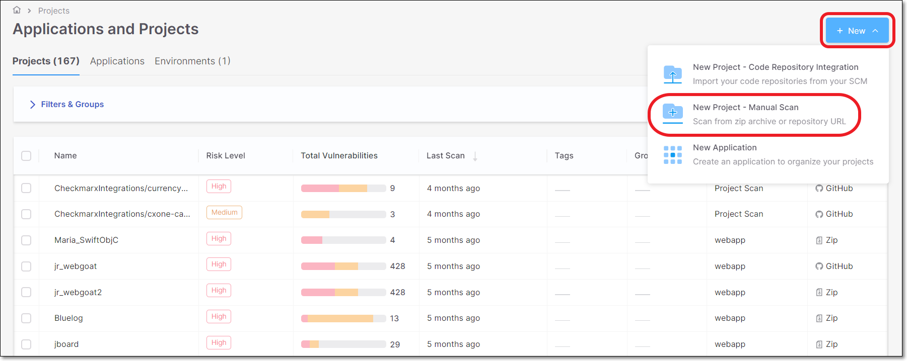
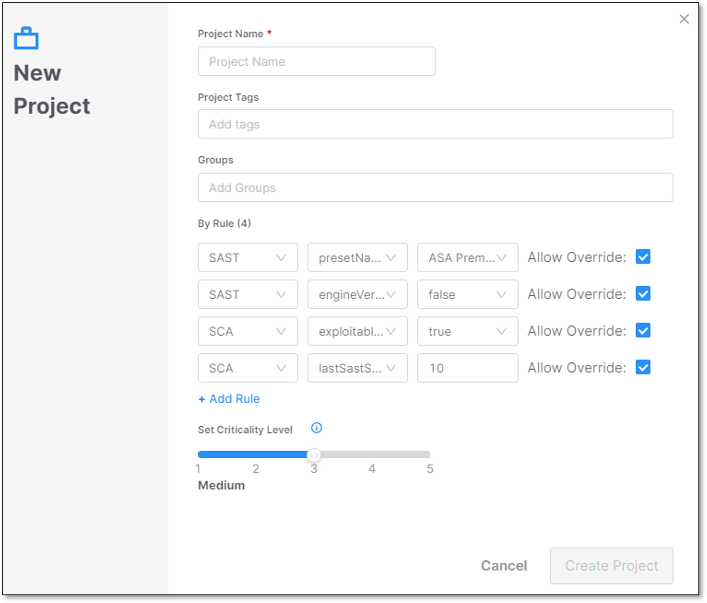
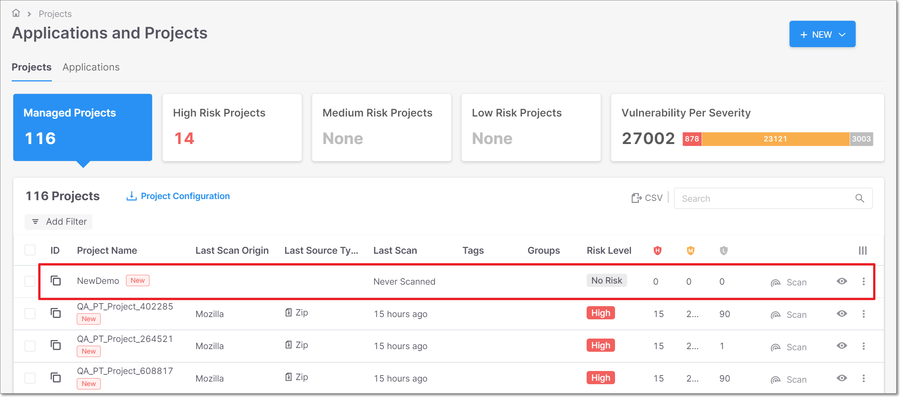

# Creating Projects

## Manual Scan Projects

A **Manual Scan Project** is a project that is manually created on the Application and Project home page.

After successfully logging in to Checkmarx One, the **Applications and Projects** home page opens.

**To create a new Manual Scan project:**

1. In the **Application and Projects** (home) page, click on **New > New Project - Manual Scan**.

   <figure><figcaption></figcaption></figure>
2. In the **New Project** window, configure the following:

   - **Project Name** - Should indicate the source code to be scanned and tracked.
   - **Project Tags** (Optional) - Assign tags to a project. Tags are very useful for projects filtering purposes.

     Tagging has no dependencies in any other component, and it is possible to configure any required value.
   - **Groups** (Optional) - Assign groups to a project. Once a group is assigned to a project, all the group members will be able to perform actions in the project (Scan source codes, view results, etc.).
   - **By Rule** (Optional) - Rules that are configured in the [Scanner Default Settings](../configuring-account-settings/global-account-settings/README.md) are presented in the Project configuration wizard. This option allows the user to perform the following:

     - See which rules were configured for the **Tenant** level.
     - Update/Add rules and apply them to the **Project** level.

       
       - **By Rule** is not supported by API Security at present.

         In case that no rules are configured via [Scanner Default Settings](../configuring-account-settings/global-account-settings/README.md) no values are presented in the wizard.
       - **Project level** is a *higher* configuration level than Tenant level. Setting the **Allow Override** option on the Tenant level allows overriding the parameters on the Project level.
       - Each scanner has a different set of Parameters.
       - Checking **Allow Override** allows overriding the same parameter on a higher level of the configuration.
       - If the **defaultConfig.xml** file appears in the By Rule section, it indicates that customized settings for the default configuration were implemented at the tenant level with the intention of improving scan results or to assist in troubleshooting issues. Once these settings are established, they are automatically applied to every project.

         If you wish to use a different **defaultConfig.xml** file, reach out to support for assistance, or contact your Product Account Manager (PAM) directly.
       
   - **Set Criticality Level:** Manually set the project criticality level.

     <figure><figcaption></figcaption></figure>
3. Click **Create Project**.

   <figure><figcaption></figcaption></figure>

   The new project is successfully added to the list of projects.

## Code Repository Integration Projects

Checkmarx One provides the option to import any project from a **Code Repository**. The projects can be imported from a **Managed Setup** environment or a **Custom Setup** one.

Checkmarx has created a very easy and straightforward import process, with emphasis on the process simplicity.


API Security does not support importing projects at present.


### Organizations and Projects

When you import a project from a Code Repository — whether from a Managed Setup or Custom Setup repository — Checkmarx One creates (or reuses) an entity representing the project's **SCM organization** — e.g., your GitHub organization or Azure DevOps project collection.

Every repo imported from the same SCM organization is associated with this single organization entity in Checkmarx One. This allows an administrator to configure scanner and integration settings once, at the organization level, and have them apply consistently across all repos from that organization — rather than configuring each project individually.

For details on managing these organization-level settings, and how they affect individual projects, see [Organization-Level Configuration for Code Repository Integrations](../../upcoming-features/organization-level-configuration-for-code-repository-integrations.md).

### Managed Setup Code Repositories

Checkmarx One supports the 4 most common Managed Setup code repositories. For more information, see Code Repository Integrations.

### Custom Setup Code Repositories

Checkmarx One supports the 4 most common Custom Setup code repositories. For more information, see Code Repository Integrations.
