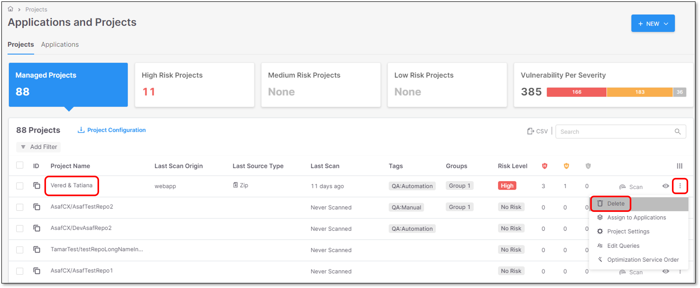
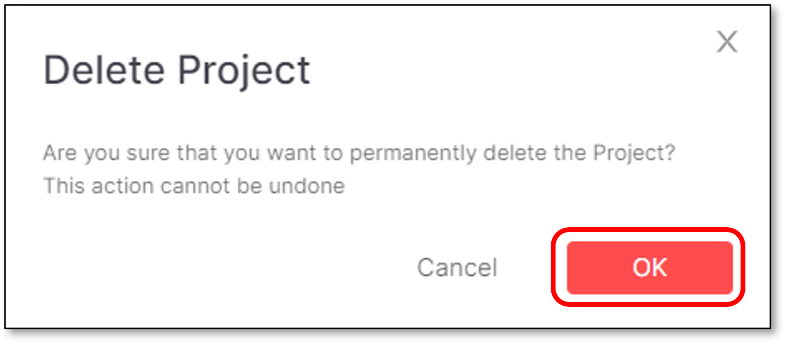
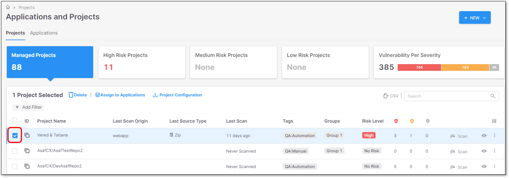
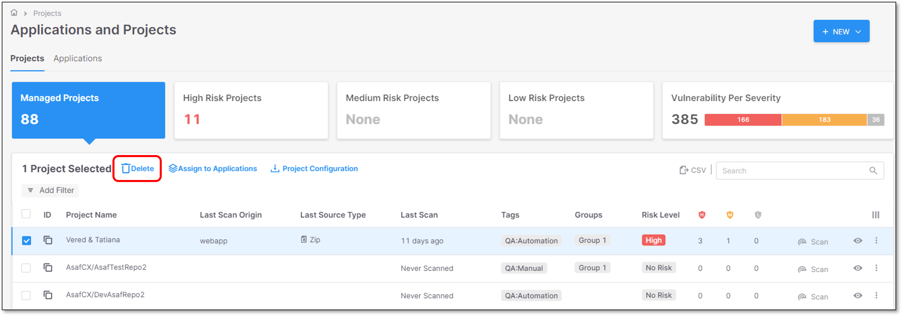
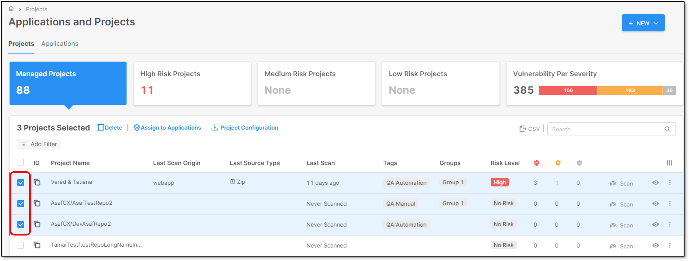
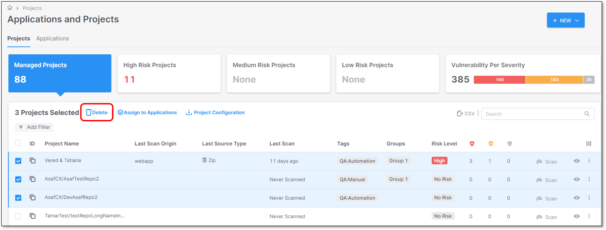
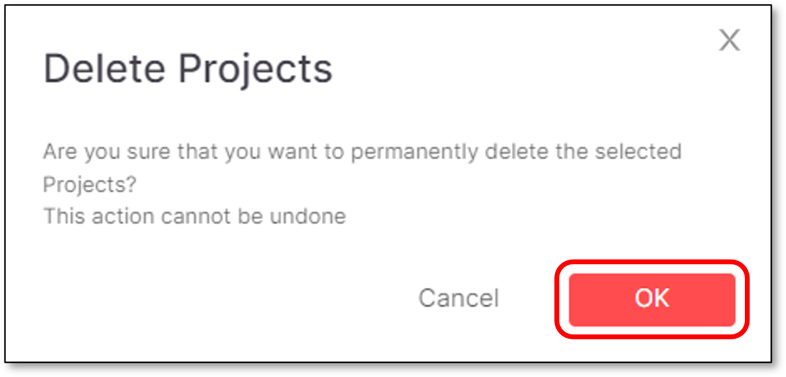

# Deleting Projects


Once a Project is deleted, the following will be deleted as well:

- All the Project scans
- All the scans results
- Code repository Webhook (for Imported Projects)


## Deleting a Single Project

To delete a project in Checkmarx One, perform the following:

### Method 1

1. Click on **Workspace → Projects** tab → **Actions** icon **→Delete**

   <figure><figcaption></figcaption></figure>
2. A deletion confirmation window will appear
3. In the **Delete Project** window click **OK**

   <figure><figcaption></figcaption></figure>

### Method 2

1. Select a project for deletion by marking the project’s checkbox.

   <figure><figcaption></figcaption></figure>

   A **Delete** option will be added to the screen.
2. Click the **Delete** option.

   <figure><figcaption></figcaption></figure>

   A deletion confirmation window will appear.
3. In the **Delete Project** window click **OK**.

   <figure><figcaption></figcaption></figure>

## Deleting Multiple Projects

To delete multiple projects in Checkmarx One, perform the following:

1. Select multiple projects for deletion by marking the project's checkboxes.

   <figure><figcaption></figcaption></figure>
2. Click the **Delete** option.

   <figure><figcaption></figcaption></figure>

   A deletion confirmation window will appear.
3. In the **Delete Project** window click **OK**.

   <figure><figcaption></figcaption></figure>
