# Project Migration

Checkmarx One provides the ability to migrate existing Checkmarx manual projects and convert them to Code Repository projects.

Checkmarx manual projects scan either zip files or code repository paths, with the scans being triggered manually from the Checkmarx One platform.

When migrating a Checkmarx project to a Code Repository based project, the following modifications take place:

- **Webhooks** are created for the organization and repository.
- The scan trigger changes to **push events** and **pull requests**, initiated from the repository itself.
- The entire scanning process is automated.
- The migrated project is associated with an **organization** entity in Checkmarx One, which may govern its scan and permission settings.

The migrated project retains its scan history, and all pre-configured scan rules remain unchanged.

The migration process is supported for both Managed Integration and Custom Integration instances of GitHub, GitLab, Bitbucket, and Azure DevOps.


Migrating projects by creating new import configurations or editing existing configurations requires `update-tenant-params` permission. Migrating new Projects using an existing configuration requires `create-project` permission.

In addition, you need to have the required permissions in the code repository that you are connecting to, as described in [Code Repository Integrations](../../integrations/code-repository-integrations/README.md).


## Single Project Migration

The project migration flow is very similar to the code repository integration flow (Managed Setup / Custom Setup) that is documented in the **Code Repository Integration** documentation.

This document includes a migration process example using GitHub code repository. For all the other code repositories please refer to the Code Repository Integrations documentation.


The configuration screens may look different, but the flow is identical.


To migrate a single Checkmarx project, perform the following:

1. In the main navigation, select **Integrations** > **Project Migration**.
2. Select the project that you would like to migrate and click on **Connect to Code Repository**

   <figure>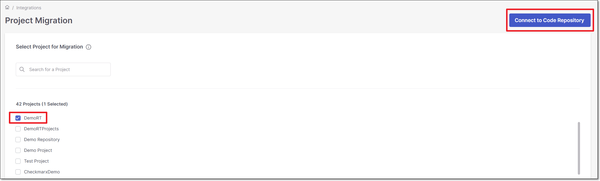<figcaption></figcaption></figure>

Managed Setup Flow

To migrate a manual Checkmarx project to a code repository integration, using Managed Setup, follow these steps:

1. Perform the following:

   - Select **Managed Setup** (default).
   - Select the code repository.

     
     In case this is the first connection to the code repository, **Client ID** and **Client Secret** are needed.
     
   - Click **Next**.

   <figure>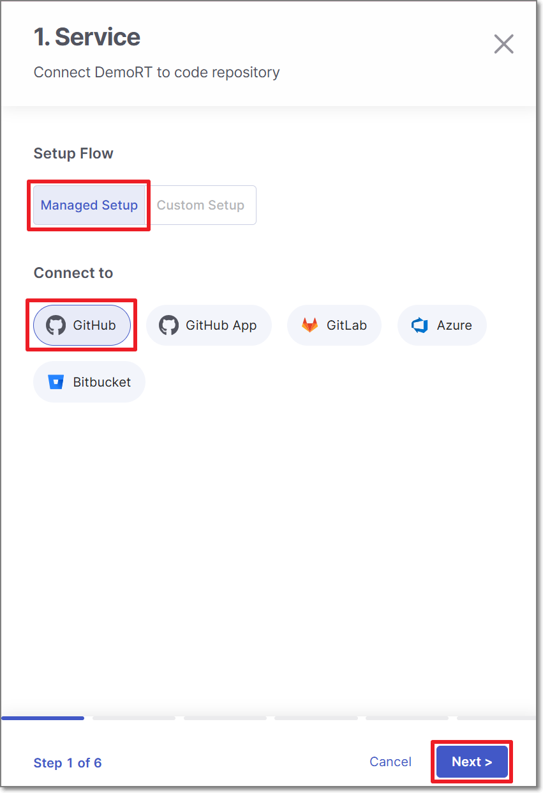<figcaption></figcaption></figure>
2. Perform the following:

   - Select **Organization** or **User** as the organization type.
   - Select the specific **organization**.
   - Click **Next**

     
     To allow other organizations to collaborate and interact with the code repository, use the **+** icon.
     

   <figure>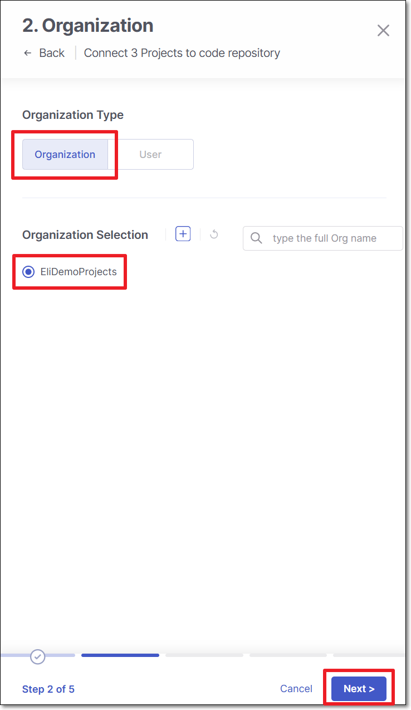<figcaption></figcaption></figure>
3. **Select the repository** for migration and click **Next**

   <figure>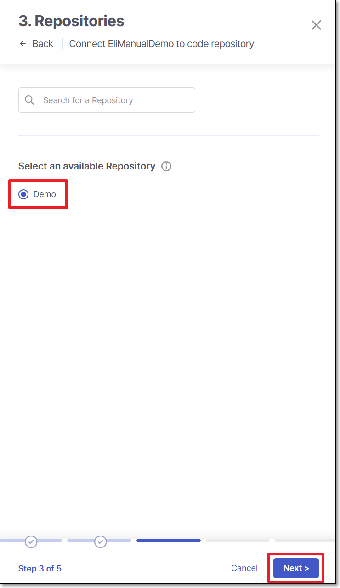<figcaption></figcaption></figure>
4. In **4: Scan Configuration**, perform the following:

   - **Permissions** - Select the toggle for the permissions that you would like to grant.

     - **Scan Trigger: Push, Pull request** - Automatically trigger a scan when a push event or pull request is done in your SCM. (Default: On)
     - **Pull Request Decoration** - Automatically send the scan results summary to the SCM. (Default: On)
   - **Scan Type** - Select the scanners to be used (By default, all the licensed scanners are enabled).

     - For the **SAST** scanner, you can enable **Incremental Scan**.
     - For the **SCA** scanner, you can enable **SCA Auto Pull Request**. This feature automatically sends PRs to your SCM with recommended changes in the manifest file, in order to replace the vulnerable package versions. (Default: Off)
   - Click **Next**

     <figure>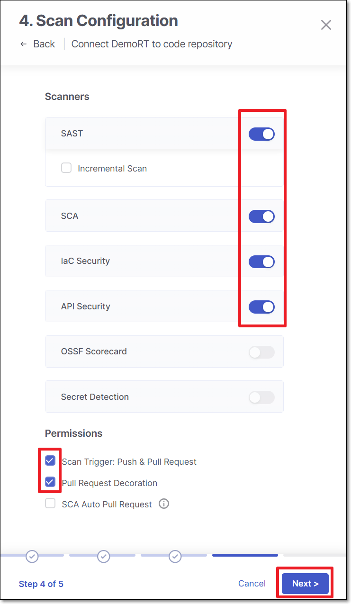<figcaption></figcaption></figure>
5. In the **5: Branches**, specify the branches to be designated as protected branches.

   
   Specifying a branch as a **Protected Branch** affects three main areas: scan triggering (for PR and push), policy violation detection, and Feedback App notifications.
   

   You can also use a wildcard symbol "\*" to designate which branches are protected. The wildcard can be used before the string, after the string, or both. All branches that match the wildcard pattern will be treated as protected branches.

   
   **Examples**:

   - `*` → all branches
   - `release*` → branches that begin with "release"
   - `*release` → branches that end with "release"
   - `* release *` → branches that contain "release" anywhere in the name
   

   - **Tags** - For each protected branch, you can optionally assign **Tags**. When a scan is triggered for this branch (e.g., push or pull request), these tags will automatically be applied to the scan.

     Tags can be key:value pairs or simple values. For example, `env:prod` or `security`.
6. In the **6: Scan Branches Upon Creation**, you can decide whether to enable the **Scan a branch upon creation** feature.

   For each repository, select the protected branches you want to scan during project creation, and then click **Save**.

   
   If you specified a wildcard pattern in the previous step, it will not appear as an option on this list.
   
7. In the **Confirmation Required** window, click **Connect to GitHub**.

   <figure>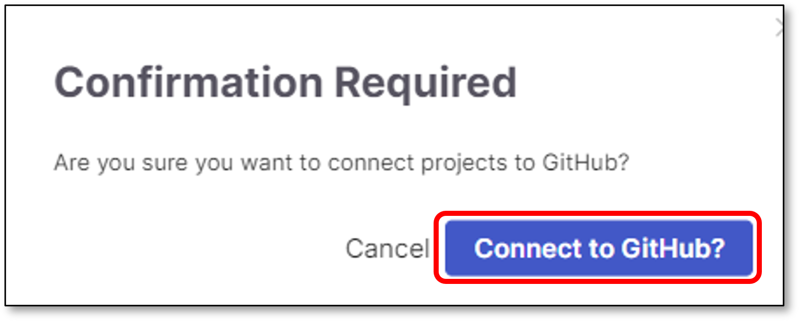<figcaption></figcaption></figure>

   The migrated project is connected to its repository. Checkmarx One creates or reuses an organization entity corresponding to the GitHub organization you selected. The project is associated with that entity.

Custom Setup Flow

To migrate a manual Checkmarx project to a code repository integration, using Custom Setup, follow these steps:

1. Perform the following:

   - Select **Custom Setup**
   - Select the code repository type.

     
     In case this is the first connection to the code repository, **Client ID** and **Client Secret** are needed.
     

   <figure>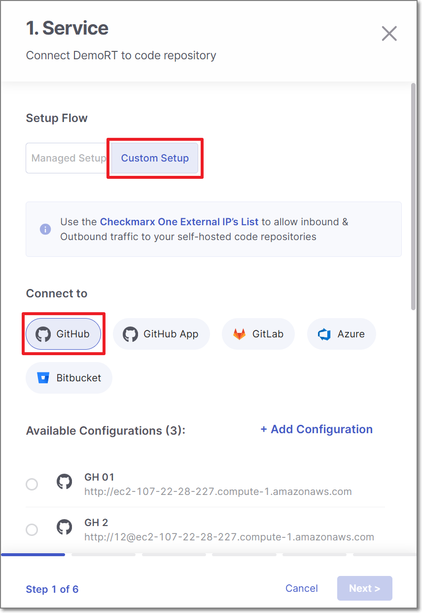<figcaption></figcaption></figure>
2. Configure the connection to your code repository, as follows:

   - If you are setting up an import configuration for the first time, enter data for the following fields and then click **Next**:

     - **Instance Name** - Designate a name for this import configuration.
     - **URL** - Your self-managed domain.

       For example: https://github.example.com
     - **Client ID** - See [GitHub Custom Setup](../../integrations/code-repository-integrations/github-custom-setup.md) for retrieving your Client ID.
     - **Client Secret** - See [GitHub Custom Setup](../../integrations/code-repository-integrations/github-custom-setup.md) for retrieving your Client Secret.
   - If you are importing Projects using an existing configuration, select the radio button next to the configuration that you would like to use, and then click **Next**.

     <figure>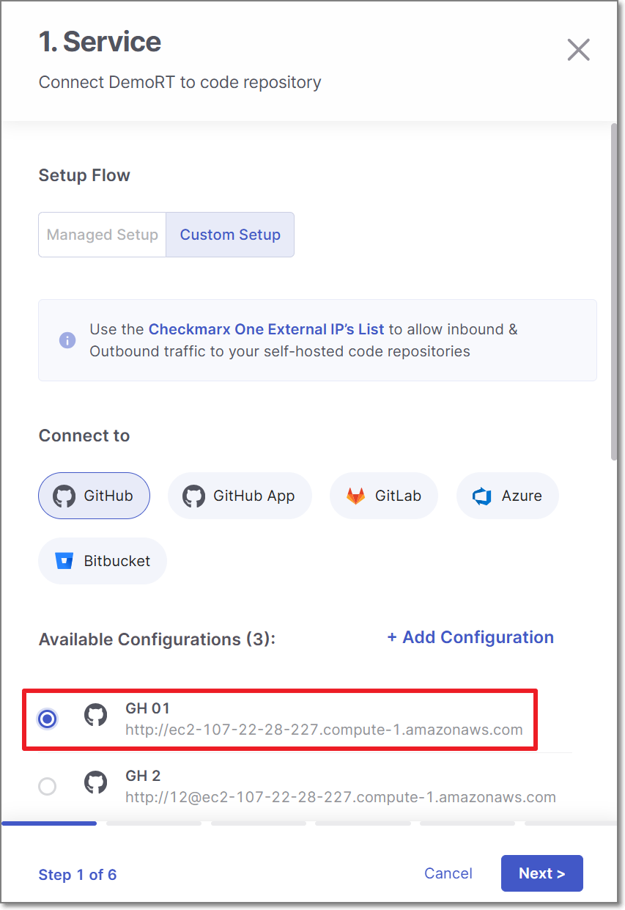<figcaption></figcaption></figure>
   - If you are adding a new configuration in addition to an existing configuration, click **+ Add Configuration**, then fill in the data for this configuration as described above, and then click **Next**.

     <figure>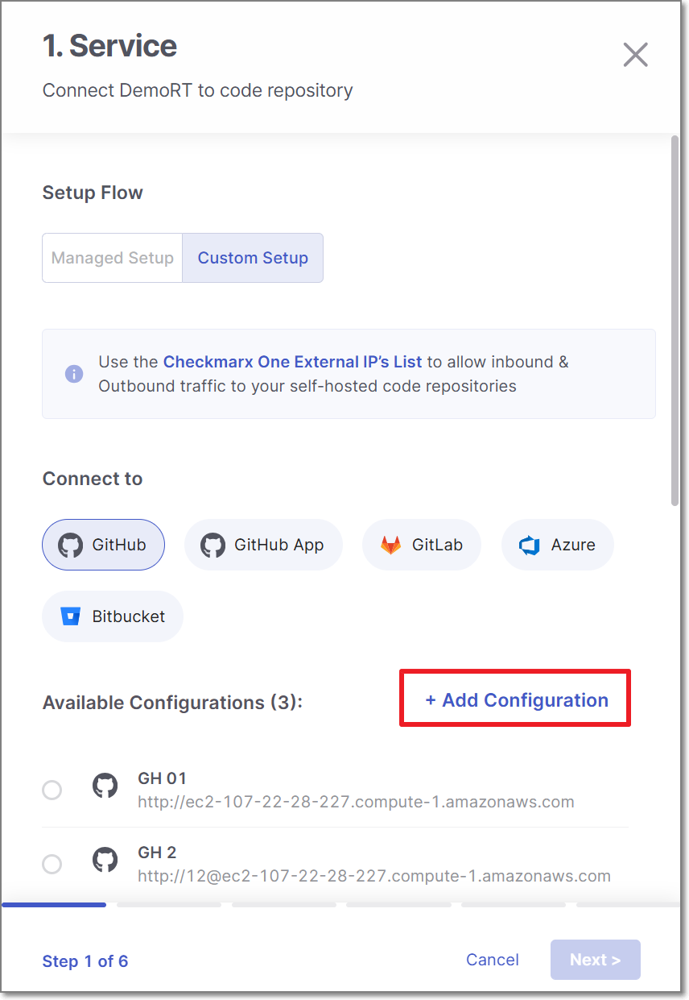<figcaption></figcaption></figure>

     
     If you would like to edit an existing configuration (e.g., change the URL or credentials), go to **Global Settings** > **Code Repository**.
     
3. Perform the following:

   - Select **Organization** or **User organization** as the organization type.
   - Select the specific **organization**.
   - Click **Next**

     
     To allow other organizations to collaborate and interact with the code repository, use the **+** icon.
     

   <figure><figcaption></figcaption></figure>
4. **Select the repository** for migration and click **Next**

   <figure><figcaption></figcaption></figure>
5. Perform the following:

   - **Scanners** - Select the scanners to be used (By default, all the licensed scanners are enabled).
   - **Permissions** - Select the checkbox for the permissions that you would like to grant:

     - Scan Trigger: Push & Pull Request - Automatically trigger scan when a push event or pull request is done in your SCM. (Default: on)
     - Pull Request Decortation: Automatically send the scan results summary to the SCM. (Default: on)
     - SCA Auto Pull Request - Automatically send PR to your SCM with recommend changes in the manifest file, in order to replace the vulnerable version. (Default: off)
   - Click **Next**

     <figure><figcaption></figcaption></figure>
6. Perform the following:

   - Select **Protected Branches** - Specify the branches to be designated as "Protected Branches".

     
     Specifying a branch as a **Protected Branch** affects three main areas: scan triggering (for PR and push), policy violation detection, and Feedback App notifications.
     

     You can also use a wildcard symbol "\*" to designate which branches are protected. The wildcard can be used before the string, after the string, or both. All branches that match the wildcard pattern will be treated as protected branches.

     
     **Examples**:

     - `*` → all branches
     - `release*` → branches that begin with "release"
     - `*release` → branches that end with "release"
     - `* release *` → branches that contain "release" anywhere in the name
     

     - **Tags** - For each protected branch, you can optionally assign **Tags**. When a scan is triggered for this branch (e.g., push or pull request), these tags will automatically be applied to the scan.

       Tags can be key:value pairs or simple values. For example, `env:prod` or `security`.
   - Select whether to enable a **branch scan upon project creation** (By default, this option is disabled).
   - Select the branch for scanning upon project creation.

     
     Only an explicit branch name can be scanned upon project creation. If you specified a wildcard pattern for branch selection, you will not be given the option of scanning it upon project creation.
     
   - Click **Save**

   <figure>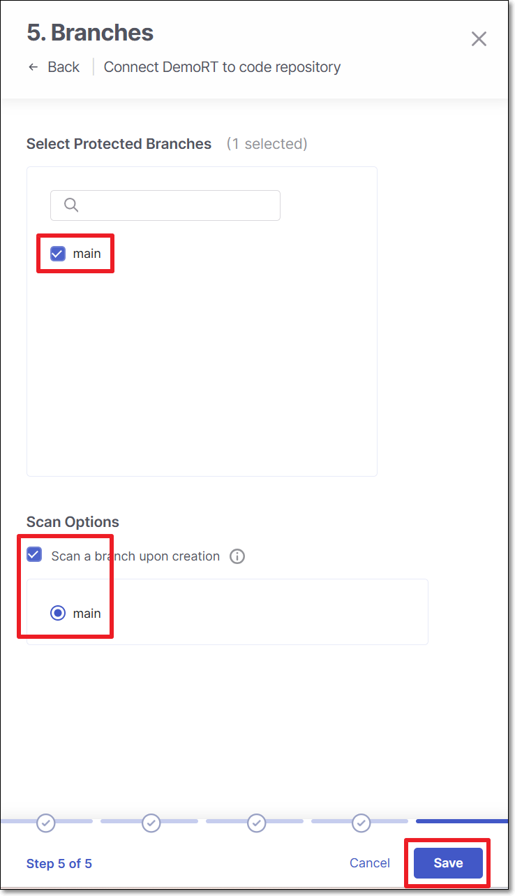<figcaption></figcaption></figure>
7. Click **Connect to GitHub**

   <figure><figcaption></figcaption></figure>

   The migrated project is connected to its repository. Checkmarx One creates or reuses an organization entity corresponding to the GitHub organization you selected. The project is associated with that entity.

## Multiple Projects Migration

Checkmarx One provides the ability to migrate multiple Checkmarx projects to Code Repository ones.

As well as the single project migration, the flow is supported for GitHub, GitLab, Bitbucket and Azure DevOps (Managed Setup / Custom Setup).

To migrate multiple Checkmarx projects, perform the following:

1. In the main navigation, select **Integrations** > **Project Migration**.
2. Select the projects and click on **Connect to Code Repository**

   <figure>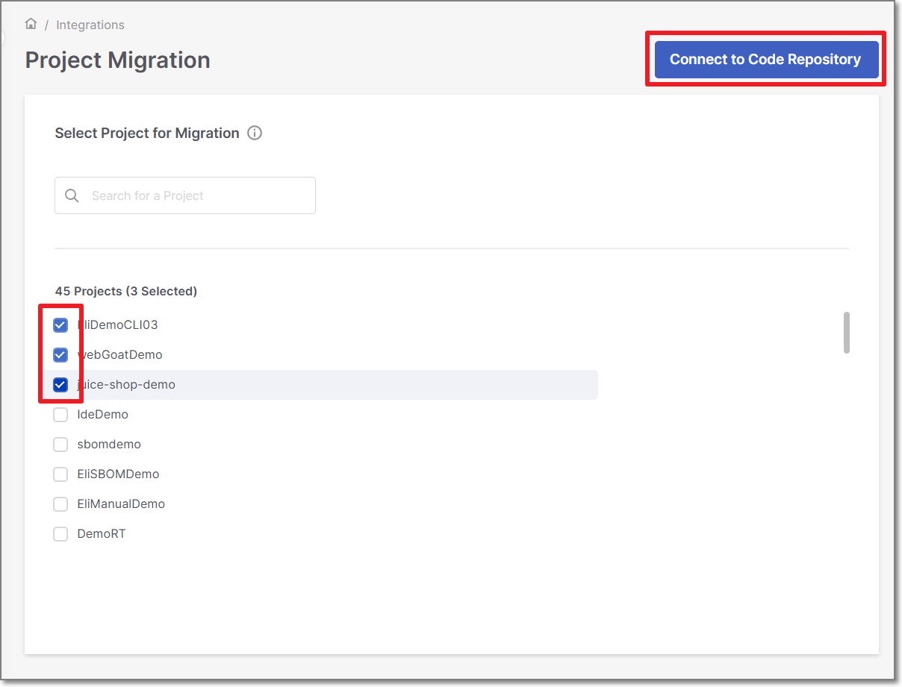<figcaption></figcaption></figure>

Managed Setup Flow

To migrate multiple manual Checkmarx projects to a code repository integration, using Managed Setup, follow these steps:

1. Perform the following:

   - Select **Managed Setup**
   - Select the code repository.

     
     In case this is the first connection to the code repository, **Client ID** and **Client Secret** are needed.
     
   - Click **Next**

   <figure><figcaption></figcaption></figure>
2. Perform the following:

   - Select **Organization** or **User organization** as the organization type.
   - Select the specific **organization**.
   - Click **Next**

     
     To allow other organizations to collaborate and interact with the code repository, use the **+** icon.
     

   <figure><figcaption></figcaption></figure>
3. In the **Repositories** screen, select which project will be connected to which repository.

   
   **Every Checkmarx project can be connected to 1 repository**

   - If the number of Checkmarx project is **smaller** than or **equal** to the number of repositories, select the mapping and click **Next**.
   - If the number of Checkmarx project **exceeds** the number of repositories, select the mapping and click **Continue with "x" projects** link.
   - It is possible to replace any unmapped project with a mapped one.

     For example:

     <figure>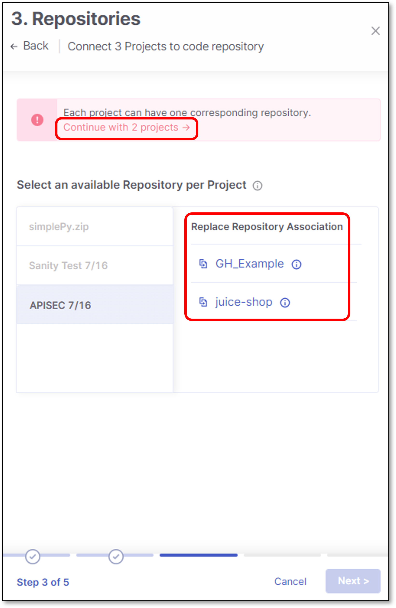<figcaption></figcaption></figure>
   
4. Scan Configuration screen contains 2 configuration sections:

   - **Global Projects Settings**:

     - **Scanners** - Select the scanners to be used for *all* the projects (By default, all the licensed scanners are enabled).
     - **Permissions** - Select whether to enable Webhooks creation for triggering scans for *all* the projects (By default, the scan trigger is enabled).
   - **Override Settings for Individual Projects**:

     - **Scanners** - Select the scanners to be used for *a specific* project (By default, all the licensed scanners are enabled).
     - **Permissions** - Select whether to enable Webhooks creation for triggering scans for *a specific* project (By default, the scan trigger is enabled).
   - Click **Next**

   <figure>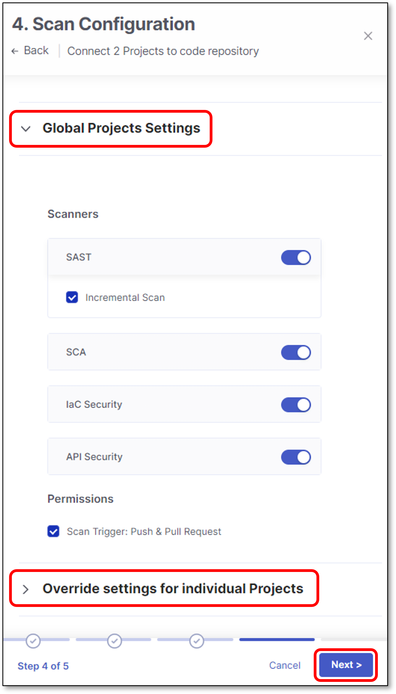<figcaption></figcaption></figure>
5. Perform the following:

   - Select whether to enable a **branch scan upon project creation** (By default, this option is disabled).

     In the next screen there is an option to select which branch to scan upon each project creation.
   - Select **Protected Branches** - Specify the branches to be designated as "Protected Branches".

     
     Specifying a branch as a **Protected Branch** affects three main areas: scan triggering (for PR and push), policy violation detection, and Feedback App notifications.
     

     You can also use a wildcard symbol "\*" to designate which branches are protected. The wildcard can be used before the string, after the string, or both. All branches that match the wildcard pattern will be treated as protected branches.

     
     **Examples**:

     - `*` → all branches
     - `release*` → branches that begin with "release"
     - `*release` → branches that end with "release"
     - `* release *` → branches that contain "release" anywhere in the name
     

     - **Tags** - For each protected branch, you can optionally assign **Tags**. When a scan is triggered for this branch (e.g., push or pull request), these tags will automatically be applied to the scan.

       Tags can be key:value pairs or simple values. For example, `env:prod` or `security`.
   - Click **Next**

   <figure>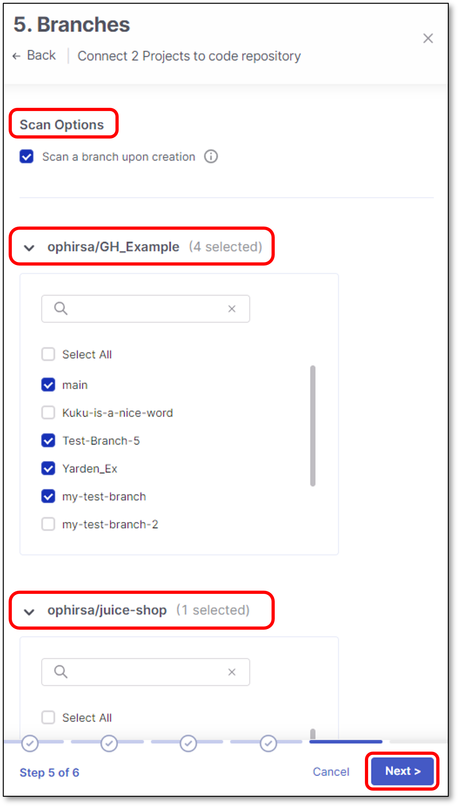<figcaption></figcaption></figure>
6. Select which branch to scan upon project creation and click **Save**

   
   - Only one branch can be scanned upon project creation.
   - The selection is performed individually for each project.
   - Only an explicit branch name can be scanned upon project creation. If you specified a wildcard pattern for branch selection, you will not be given the option of scanning it upon project creation.
   

   <figure>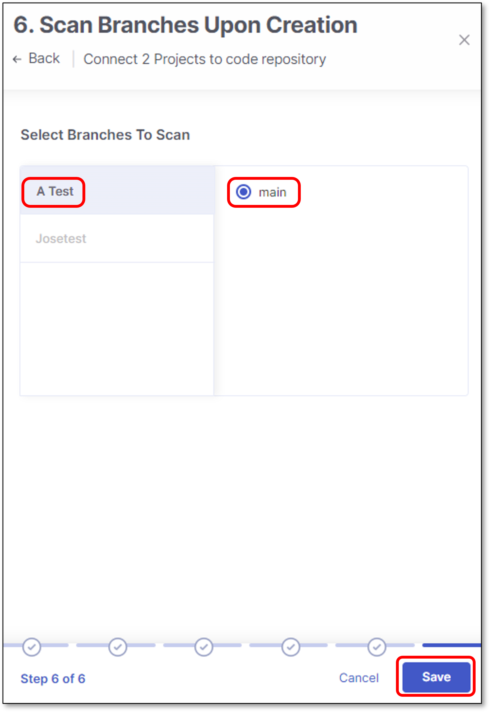<figcaption></figcaption></figure>
7. Click **Connect to GitHub**

   <figure><figcaption></figcaption></figure>

   The migrated projects are connected to their repositories. Checkmarx One creates or reuses an organization entity corresponding to the GitHub organization you selected. The projects are associated with that entity.

Custom Setup Flow

To migrate multiple manual Checkmarx projects to a code repository integration, using Custom Setup, follow these steps:

1. Perform the following:

   - Select **Custom Setup**
   - Select the code repository type.

     
     In case this is the first connection to the code repository, **Client ID** and **Client Secret** are needed.
     

   <figure><figcaption></figcaption></figure>
2. Configure the connection to your code repository, as follows:

   - If you are setting up an import configuration for the first time, enter data for the following fields and then click **Next**:

     - **Instance Name** - Designate a name for this import configuration.
     - **URL** - Your self-managed domain.

       For example: https://github.example.com
     - **Client ID** - See [GitHub Custom Setup](../../integrations/code-repository-integrations/github-custom-setup.md) for retrieving your Client ID.
     - **Client Secret** - See [GitHub Custom Setup](../../integrations/code-repository-integrations/github-custom-setup.md) for retrieving your Client Secret.
   - If you are importing Projects using an existing configuration, select the radio button next to the configuration that you would like to use, and then click **Next**.

     <figure><figcaption></figcaption></figure>
   - If you are adding a new configuration in addition to an existing configuration, click **+ Add Configuration**, then fill in the data for this configuration as described above, and then click **Next**.

     <figure><figcaption></figcaption></figure>

     
     If you would like to edit an existing configuration (e.g., change the URL or credentials), go to **Global Settings** > **Code Repository**.
     
3. Perform the following:

   - Select **Organization** or **User organization** as the organization type.
   - Select the specific **organization**.
   - Click **Next**

     
     To allow other organizations to collaborate and interact with the code repository, use the **+** icon.
     

   <figure><figcaption></figcaption></figure>
4. In the **Repositories** screen, select which project will be connected to which repository.

   
   **Every Checkmarx project can be connected to 1 repository**

   - If the number of Checkmarx project is **smaller** or than **equal** to the number of repositories, select the mapping and click **Next**.
   - If the number of Checkmarx project is **exceeds** the number of repositories, select the mapping and click **Continue with "x" projects** link.
   - It is possible to replace any unmapped project with a mapped one.

     For example:

     <figure><figcaption></figcaption></figure>
   
5. Scan Configuration screen contains 2 configuration sections:

   - **Global Projects Settings**:

     - **Scanners** - Select the scanners to be used for *all* the projects (By default, all the licensed scanners are enabled).
     - **Permissions** - Select the checkbox for the permissions that you would like to grant:

       - Scan Trigger: Push & Pull Request - Automatically trigger scan when a push event or pull request is done in your SCM. (Default: on)
       - Pull Request Decortation: Automatically send the scan results summary to the SCM. (Default: on)
       - SCA Auto Pull Request - Automatically send PR to your SCM with recommend changes in the manifest file, in order to replace the vulnerable version. (Default: off)
   - **Override Settings for Individual Projects**:

     - **Scanners** - Select the scanners to be used for *a specific* project (By default, all the licensed scanners are enabled).
     - **Permissions** - Select the checkbox for the permissions that you would like to grant:

       - Scan Trigger: Push & Pull Request - Automatically trigger scan when a push event or pull request is done in your SCM. (Default: on)
       - Pull Request Decortation: Automatically send the scan results summary to the SCM. (Default: on)
       - SCA Auto Pull Request - Automatically send PR to your SCM with recommend changes in the manifest file, in order to replace the vulnerable version. (Default: off)
   - Click **Next**

   <figure><figcaption></figcaption></figure>
6. Perform the following:

   - Select whether to enable a **branch scan upon project creation** (By default, this option is disabled).

     In the next screen there is an option to select which branch to scan upon each project creation.
   - Select **Protected Branches** - Specify the branches to be designated as "Protected Branches".

     
     Specifying a branch as a **Protected Branch** affects three main areas: scan triggering (for PR and push), policy violation detection, and Feedback App notifications.
     

     You can also use a wildcard symbol "\*" to designate which branches are protected. The wildcard can be used before the string, after the string, or both. All branches that match the wildcard pattern will be treated as protected branches.

     
     **Examples**:

     - `*` → all branches
     - `release*` → branches that begin with "release"
     - `*release` → branches that end with "release"
     - `* release *` → branches that contain "release" anywhere in the name
     

     - **Tags** - For each protected branch, you can optionally assign **Tags**. When a scan is triggered for this branch (e.g., push or pull request), these tags will automatically be applied to the scan.

       Tags can be key:value pairs or simple values. For example, `env:prod` or `security`.
   - Click **Next**

   <figure><figcaption></figcaption></figure>
7. Select which branch to scan upon project creation and click **Save**

   
   - Only one branch can be scanned upon project creation.
   - The selection is performed individually for each project.
   - Only an explicit branch name can be scanned upon project creation. If you specified a wildcard pattern for branch selection, you will not be given the option of scanning it upon project creation.
   

   <figure><figcaption></figcaption></figure>
8. Click **Connect to GitHub**

   <figure><figcaption></figcaption></figure>

   The migrated projects are connected to their repositories. Checkmarx One creates or reuses an organization entity corresponding to the GitHub organization you selected. The projects are associated with that entity.

